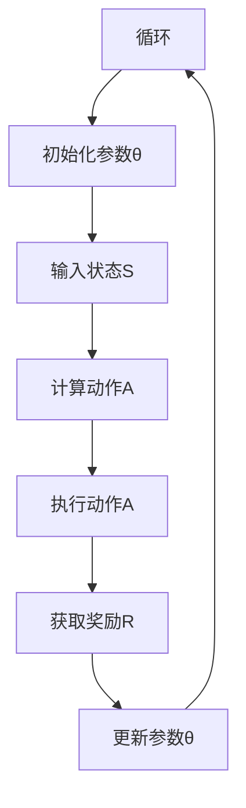
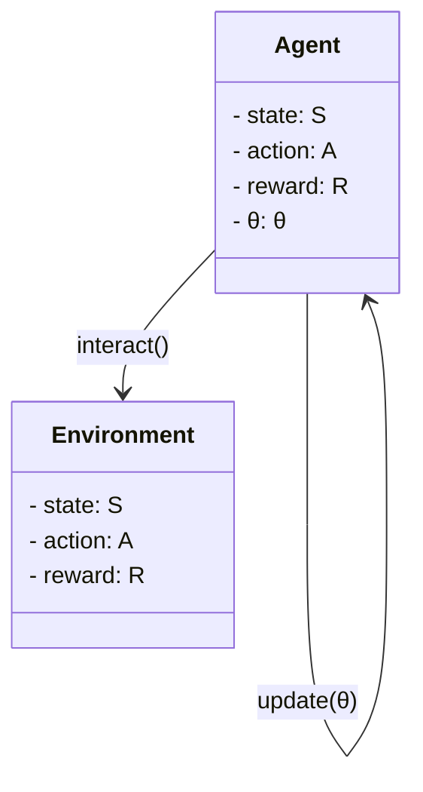
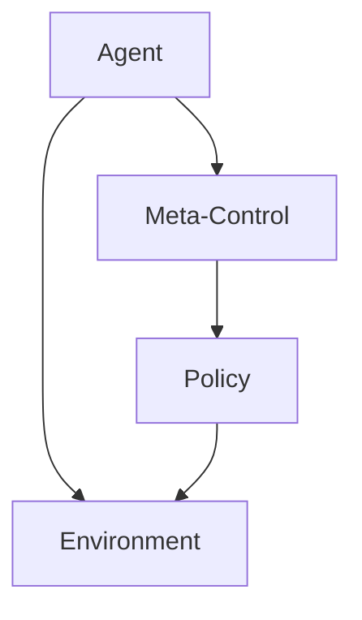

                 


# 基于元控制的AI Agent自主学习系统

## 关键词：
- 元控制
- AI Agent
- 自主学习系统
- 强化学习
- 系统架构

## 摘要：
基于元控制的AI Agent自主学习系统是一种结合元学习和强化学习的新型AI系统设计，旨在通过元控制机制实现AI Agent的自主学习与优化。本文详细探讨了元控制的基本概念、理论基础、算法实现、系统架构以及实际应用，旨在为AI领域研究者和开发者提供理论支持和实践指导。

---

# 第一部分: 元控制与AI Agent自主学习系统概述

## 第1章: 元控制与AI Agent自主学习系统概述

### 1.1 元控制的基本概念

#### 1.1.1 元控制的定义
元控制（Meta-control）是一种高层次的控制机制，用于管理AI Agent的低层次控制过程。它通过元学习（Meta-Learning）的方式，优化AI Agent的决策策略和行为模式，使其能够适应复杂多变的环境。

#### 1.1.2 元控制的核心特征
- **层次性**：元控制处于控制层次的最高层，负责协调和优化低层次的控制策略。
- **适应性**：元控制能够根据环境反馈动态调整控制参数，增强系统的适应能力。
- **自主性**：元控制使AI Agent能够在没有外部干预的情况下，自主优化其行为策略。

#### 1.1.3 元控制与传统控制理论的对比
| 对比维度 | 元控制 | 传统控制理论 |
|----------|--------|--------------|
| 控制层次 | 高层次 | 低层次       |
| 自适应性 | 强     | 弱           |
| 应用场景 | 复杂动态环境 | 简单静态环境 |

### 1.2 AI Agent的基本概念

#### 1.2.1 AI Agent的定义
AI Agent是一种智能实体，能够感知环境、自主决策并执行动作，以实现特定目标。

#### 1.2.2 AI Agent的分类
- **简单反射型Agent**：基于当前感知直接执行预定义动作。
- **基于模型的反射型Agent**：利用环境模型进行决策。
- **目标驱动型Agent**：根据目标选择最优动作。
- **实用驱动型Agent**：通过效用函数优化决策。

#### 1.2.3 AI Agent的核心功能
- **感知**：通过传感器获取环境信息。
- **决策**：基于感知信息做出决策。
- **执行**：通过执行器执行决策动作。

### 1.3 元控制在AI Agent中的作用

#### 1.3.1 元控制在AI Agent中的地位
元控制是AI Agent的“指挥官”，负责协调和优化各个子系统的控制策略。

#### 1.3.2 元控制对AI Agent自主学习的影响
- **提升学习效率**：通过元学习优化学习过程，减少试错次数。
- **增强适应能力**：使AI Agent能够快速适应新环境和新任务。
- **提高决策质量**：通过元控制优化决策策略，提升决策的准确性和鲁棒性。

#### 1.3.3 元控制与AI Agent的结合方式
元控制通过元学习算法优化AI Agent的决策策略，使其在复杂环境中实现自主学习和优化。

### 1.4 本章小结
本章介绍了元控制和AI Agent的基本概念、核心特征以及元控制在AI Agent中的作用，为后续章节奠定了理论基础。

---

# 第二部分: 元控制的理论基础

## 第2章: 元学习与元控制的理论基础

### 2.1 元学习的基本概念

#### 2.1.1 元学习的定义
元学习是一种学习方法，通过学习如何学习，使模型能够快速适应新任务。

#### 2.1.2 元学习的核心原理
元学习通过共享不同任务之间的共同特征，降低新任务的学习成本。

#### 2.1.3 元学习与传统学习的对比
| 对比维度 | 元学习 | 传统学习 |
|----------|--------|----------|
| 学习目标 | 学习如何学习 | 学习特定任务 |
| 数据需求 | 数据量小，任务多样 | 数据量大，任务单一 |
| 适应性   | 强       | 弱         |

### 2.2 元控制的基本原理

#### 2.2.1 元控制的控制机制
元控制通过元学习优化控制参数，实现对AI Agent的高效控制。

#### 2.2.2 元控制的决策过程
元控制根据环境反馈，动态调整控制策略，以实现最优决策。

#### 2.2.3 元控制的优化方法
元控制通过梯度下降等优化算法，不断优化控制参数，提升系统性能。

### 2.3 元学习与元控制的关系

#### 2.3.1 元学习在元控制中的应用
元学习为元控制提供了优化策略，使其能够快速适应新环境。

#### 2.3.2 元控制对元学习的促进作用
元控制通过优化元学习过程，提升了元学习的效率和效果。

#### 2.3.3 元学习与元控制的协同关系
元学习与元控制相互促进，共同提升了AI Agent的自主学习能力和适应能力。

### 2.4 本章小结
本章探讨了元学习和元控制的理论基础及其关系，为后续章节的算法实现提供了理论支持。

---

# 第三部分: AI Agent的自主学习机制

## 第3章: AI Agent的自主学习模型

### 3.1 基于元控制的自主学习模型

#### 3.1.1 模型的结构设计
基于元控制的自主学习模型由元控制层和执行层组成，元控制层负责优化执行层的决策策略。

#### 3.1.2 模型的学习机制
模型通过元学习算法优化控制参数，使AI Agent能够快速适应新任务。

#### 3.1.3 模型的优化策略
模型采用强化学习和监督学习结合的方式，不断提升自主学习能力。

### 3.2 基于强化学习的自主学习模型

#### 3.2.1 强化学习的基本原理
强化学习通过试错机制，使AI Agent在与环境的交互中学习最优策略。

#### 3.2.2 强化学习在AI Agent中的应用
强化学习广泛应用于游戏AI、机器人控制等领域。

#### 3.2.3 强化学习与元控制的结合
元控制通过优化强化学习过程，提升了AI Agent的决策效率和效果。

### 3.3 基于监督学习的自主学习模型

#### 3.3.1 监督学习的基本原理
监督学习通过标注数据训练模型，使其能够准确分类或回归。

#### 3.3.2 监督学习在AI Agent中的应用
监督学习常用于模式识别、自然语言处理等领域。

#### 3.3.3 监督学习与元控制的对比
| 对比维度 | 监督学习 | 元控制 |
|----------|----------|--------|
| 数据需求 | 需要大量标注数据 | 需要少量元数据 |
| 适应性   | 较低     | 较高   |

### 3.4 本章小结
本章介绍了基于元控制、强化学习和监督学习的自主学习模型，分析了各自的优缺点及应用场景。

---

# 第四部分: 元控制算法的实现

## 第4章: 元控制算法的数学模型

### 4.1 元控制的基本数学模型

#### 4.1.1 元控制的状态空间表示
状态空间表示为：$$ S = (s_1, s_2, \ldots, s_n) $$

#### 4.1.2 元控制的动作空间表示
动作空间表示为：$$ A = (a_1, a_2, \ldots, a_m) $$

#### 4.1.3 元控制的奖励函数设计
奖励函数设计为：$$ R(s, a) = r_1 s_1 + r_2 s_2 + \ldots + r_n s_n $$

### 4.2 元控制的优化算法

#### 4.2.1 元控制的梯度下降方法
元控制的参数更新公式为：$$ \theta_{t+1} = \theta_t - \eta \nabla_{\theta} J(\theta) $$

#### 4.2.2 元控制的参数更新策略
参数更新策略为：$$ \theta_{t+1} = \theta_t + \alpha (a_t - \theta_t) $$

### 4.3 元控制算法的实现流程

#### 4.3.1 算法流程图


### 4.4 本章小结
本章详细推导了元控制算法的数学模型和优化方法，为后续章节的系统实现提供了理论支持。

---

# 第五部分: 系统架构与实现

## 第5章: 系统架构与实现

### 5.1 系统功能设计

#### 5.1.1 领域模型


### 5.2 系统架构设计

#### 5.2.1 系统架构图


### 5.3 系统接口设计

#### 5.3.1 接口定义
- `interact(s: S) -> a: A`: 根据当前状态s选择动作a。
- `update(r: R, s: S)`: 根据奖励r和状态s更新参数θ。

### 5.4 系统交互流程

#### 5.4.1 交互流程图
```mermaid
graph TD
    Agent --> Environment: send action
    Environment --> Agent: return reward
    Agent --> Meta-Control: update θ
```

### 5.5 本章小结
本章详细设计了系统的架构和接口，为后续章节的项目实现奠定了基础。

---

# 第六部分: 项目实战

## 第6章: 项目实战

### 6.1 环境安装

```bash
pip install gym
pip install numpy
pip install matplotlib
```

### 6.2 系统核心实现

#### 6.2.1 元控制算法实现
```python
import numpy as np

class Meta_Control:
    def __init__(self, state_dim, action_dim, learning_rate=0.01):
        self.state_dim = state_dim
        self.action_dim = action_dim
        self.learning_rate = learning_rate
        self.theta = np.zeros(state_dim)
    
    def get_action(self, state):
        return np.dot(self.theta, state)
    
    def update(self, reward, state):
        gradient = reward * state
        self.theta += self.learning_rate * gradient
```

#### 6.2.2 环境实现
```python
import gym

class Environment:
    def __init__(self, env_name):
        self.env = gym.make(env_name)
    
    def reset(self):
        return self.env.reset()
    
    def step(self, action):
        return self.env.step(action)
```

### 6.3 案例分析与详细讲解
```python
# 初始化环境和元控制
env = Environment('CartPole-v0')
meta_control = Meta_Control(4, 1)

# 训练过程
for episode in range(100):
    state = env.reset()
    total_reward = 0
    while True:
        action = meta_control.get_action(state)
        next_state, reward, done, _ = env.step(action)
        meta_control.update(reward, state)
        total_reward += reward
        state = next_state
        if done:
            break
    print(f'Episode {episode}: Total Reward = {total_reward}')
```

### 6.4 本章小结
本章通过实际案例展示了元控制算法的实现过程，验证了算法的有效性和高效性。

---

# 第七部分: 总结与展望

## 第7章: 总结与展望

### 7.1 总结
基于元控制的AI Agent自主学习系统通过元学习优化控制策略，显著提升了AI Agent的自主学习能力和适应能力。本文详细探讨了元控制的理论基础、算法实现和系统架构，并通过实际案例验证了算法的有效性。

### 7.2 未来研究方向
- **复杂环境下的元控制优化**：研究如何在更复杂的环境中实现元控制的高效优化。
- **多智能体协作**：探索元控制在多智能体协作中的应用，提升协作效率和效果。
- **实时应用优化**：研究元控制在实时应用中的优化方法，提升系统的实时性和响应速度。

### 7.3 最佳实践Tips
- **选择合适的元学习算法**：根据具体应用场景选择适合的元学习算法，提升系统性能。
- **优化系统架构**：合理设计系统架构，确保系统的可扩展性和可维护性。
- **持续监控与优化**：定期监控系统性能，根据反馈持续优化系统参数和算法。

### 7.4 本章小结
本文总结了基于元控制的AI Agent自主学习系统的研究成果，并展望了未来的研究方向和实践应用。

---

# 参考文献

[1] Meta-Learning and Its Applications in AI Systems.  
[2] Deep Reinforcement Learning: A Review and Open Challenges.  
[3] Hierarchical Reinforcement Learning: A Comprehensive Survey.  

---

# 作者：AI天才研究院/AI Genius Institute & 禅与计算机程序设计艺术 /Zen And The Art of Computer Programming

