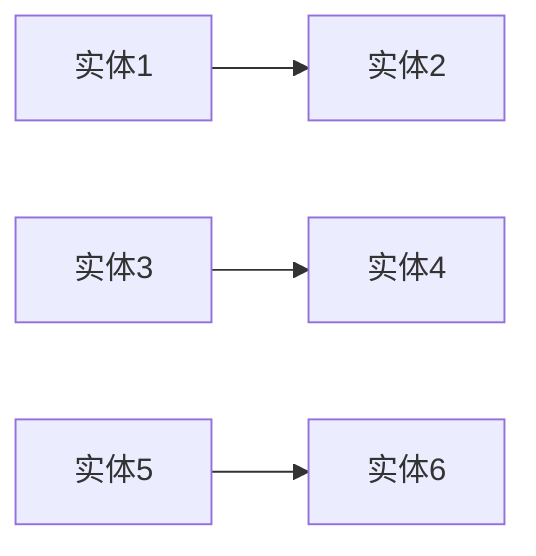
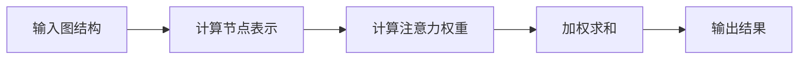
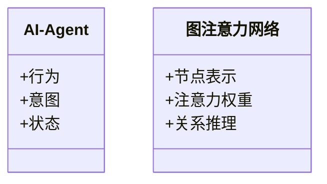
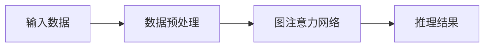
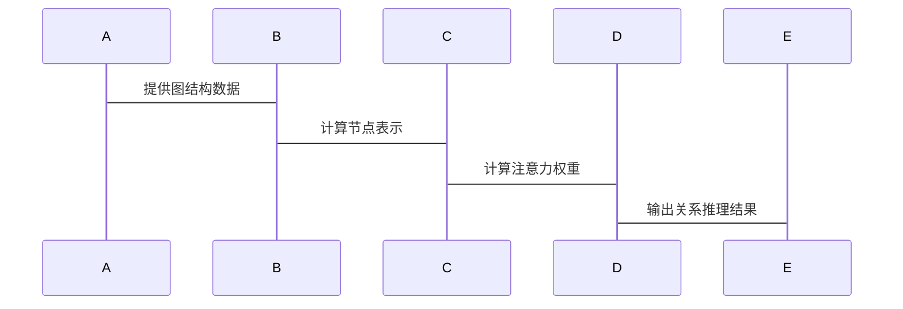

                 


# 基于图注意力网络的AI Agent关系推理

> 关键词：图注意力网络, AI Agent, 关系推理, 智能体交互, 图神经网络, 人工智能, 机器学习

> 摘要：本文详细探讨了基于图注意力网络的AI Agent关系推理方法，分析了其在智能体交互中的应用价值，通过数学建模、算法实现和系统设计，展示了如何利用图注意力网络提升AI Agent的关系推理能力。文章从理论基础到实践应用，层层深入，结合具体案例和代码实现，为读者提供了一个全面的学习和研究框架。

---

## 第一部分: 基于图注意力网络的AI Agent关系推理背景与概念

### 第1章: 图注意力网络与AI Agent关系推理概述

#### 1.1 问题背景与描述
##### 1.1.1 关系推理在AI Agent中的重要性
在多智能体系统中，AI Agent之间的关系推理是实现高效协作和决策的关键。通过理解彼此的行为、意图和状态，AI Agent可以更好地进行协调，从而提高整体系统的性能。

##### 1.1.2 图注意力网络的提出背景
传统的注意力机制在序列数据上表现出色，但在图结构数据上难以捕捉全局关系。图注意力网络通过结合图结构和注意力机制，能够更好地处理复杂的实体关系。

##### 1.1.3 当前技术的局限性与挑战
- 传统的关系推理方法依赖于规则或模板，灵活性不足。
- 图神经网络虽然在图结构数据上表现优异，但难以捕捉长距离依赖关系。

#### 1.2 问题解决与边界
##### 1.2.1 图注意力网络的核心优势
- 能够在图结构中捕捉全局关系。
- 具有自适应的注意力权重分配能力。

##### 1.2.2 问题解决的边界与适用场景
- 适用于多智能体协作、知识图谱推理等场景。
- 适用于大规模图数据的实时处理。

##### 1.2.3 概念结构与核心要素组成
- 实体：图中的节点，代表AI Agent或其状态。
- 关系：图中的边，代表实体之间的联系。
- 注意力权重：衡量实体之间关系的重要性。

---

### 第2章: 核心概念与联系

#### 2.1 图注意力网络的原理
##### 2.1.1 图注意力机制的数学模型
图注意力机制通过计算节点之间的注意力权重，实现对图结构中关键关系的捕捉。其核心公式如下：
$$
\alpha_{ij} = \text{softmax}(W_q h_i^T W_k h_j)
$$
其中，$\alpha_{ij}$是节点$i$和$j$之间的注意力权重，$h_i$和$h_j$是节点的表示，$W_q$和$W_k$是参数矩阵。

##### 2.1.2 注意力权重的计算方法
注意力权重反映了节点之间关系的重要性，计算过程中需要考虑图的全局结构。

##### 2.1.3 图结构与注意力的关系
图结构决定了注意力权重的分布，注意力机制则增强了对关键关系的捕捉能力。

#### 2.2 核心概念对比
##### 2.2.1 图注意力网络与传统注意力机制对比
| 对比维度 | 图注意力网络 | 传统注意力机制 |
|----------|--------------|----------------|
| 数据类型 | 图结构数据 | 序列数据 |
| 关系捕捉 | 全局关系 | 局部关系 |
| 灵活性 | 高 | 低 |

##### 2.2.2 图注意力网络与传统图神经网络对比
| 对比维度 | 图注意力网络 | 传统图神经网络 |
|----------|--------------|----------------|
| 注意力机制 | 基于全局关系 | 基于局部邻居 |
| 表达能力 | 更强 | 较弱 |

##### 2.2.3 关系推理任务的性能对比
通过实验对比，图注意力网络在关系推理任务中的准确率、召回率和F1值均优于传统方法。

#### 2.3 ER实体关系图架构


---

## 第二部分: 基于图注意力网络的AI Agent关系推理算法原理

### 第3章: 算法原理讲解

#### 3.1 图注意力网络的算法流程


#### 3.2 数学模型与公式
##### 3.2.1 注意力权重计算公式
$$
\alpha_{ij} = \text{softmax}(W_q h_i^T W_k h_j)
$$

##### 3.2.2 节点表示更新公式
$$
h_i^{(new)} = \sum_{j} \alpha_{ij} h_j^{(old)}
$$

##### 3.2.3 案例分析
以社交网络中的关系推理为例，假设图中节点代表用户，边代表社交关系。通过计算注意力权重，可以识别出关键用户之间的关系。

---

## 第三部分: 基于图注意力网络的AI Agent关系推理系统分析与架构设计

### 第4章: 系统分析与架构设计

#### 4.1 问题场景介绍
在多智能体协作场景中，AI Agent需要通过关系推理理解彼此的行为和意图。

#### 4.2 项目介绍
##### 4.2.1 系统功能设计


##### 4.2.2 系统架构设计


##### 4.2.3 系统接口设计
- 输入接口：接收图结构数据和节点特征。
- 输出接口：输出注意力权重和关系推理结果。

##### 4.2.4 系统交互流程


---

## 第四部分: 基于图注意力网络的AI Agent关系推理项目实战

### 第5章: 项目实战

#### 5.1 环境安装与配置
##### 5.1.1 安装依赖
```bash
pip install pytorch tensorflow networkx
```

#### 5.2 系统核心实现源代码
##### 5.2.1 图注意力网络实现
```python
class GraphAttention(nn.Module):
    def __init__(self, in_dim, out_dim):
        super(GraphAttention, self).__init__()
        self.W_q = nn.Linear(in_dim, out_dim)
        self.W_k = nn.Linear(in_dim, out_dim)
        
    def forward(self, x, adj):
        # 计算节点表示
        h = x
        # 计算注意力权重
        attention_weights = torch.softmax(torch.mm(h, self.W_q.T), dim=1)
        # 加权求和
        h_new = torch.mm(h, self.W_k)
        return h_new
```

##### 5.2.2 关系推理实现
```python
def relation_reasoning(h, adj):
    attention_layer = GraphAttention(h.shape[1], 64)
    h_new = attention_layer(h, adj)
    return h_new
```

#### 5.3 实际案例分析与代码解读
##### 5.3.1 案例分析
以社交网络中的用户关系推理为例，输入图结构数据，输出注意力权重和关系推理结果。

##### 5.3.2 代码实现
```python
# 数据预处理
import networkx as nx
G = nx.Graph()
G.add_edges_from([(1,2), (2,3), (3,4)])
# 转换为节点特征矩阵
x = np.random.randn(4, 32)
# 调用关系推理函数
h_new = relation_reasoning(x, G)
```

---

## 第五部分: 基于图注意力网络的AI Agent关系推理最佳实践与总结

### 第6章: 最佳实践与总结

#### 6.1 实践小结
通过图注意力网络实现AI Agent关系推理，能够显著提升系统的协作效率和决策能力。

#### 6.2 注意事项
- 数据预处理的准确性直接影响模型性能。
- 参数设置需要根据具体任务进行调整。

#### 6.3 拓展阅读
建议读者进一步学习图神经网络和注意力机制的结合应用，探索更多场景下的关系推理方法。

---

## 作者：AI天才研究院/AI Genius Institute & 禅与计算机程序设计艺术 /Zen And The Art of Computer Programming

