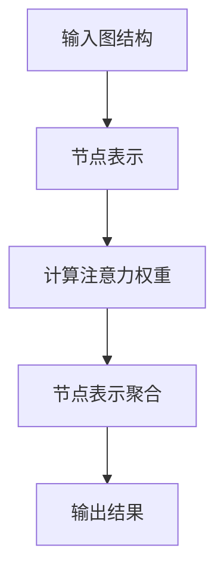

                 

# 基于图注意力网络的AI Agent知识推理

> 关键词：图注意力网络，AI Agent，知识推理，智能系统，注意力机制

> 摘要：本文探讨了基于图注意力网络的AI Agent知识推理方法，分析了其核心原理、系统架构及实际应用。通过详细讲解，展示了如何利用图注意力网络提升AI Agent的知识推理能力，构建高效的智能系统。

---

## 第一部分: 基于图注意力网络的AI Agent知识推理概述

### 第1章: 问题背景与目标

#### 1.1 问题背景
知识推理是人工智能领域的重要任务，涉及从已有知识中推导新结论的能力。传统方法在处理复杂关系和大规模数据时表现有限，而图注意力网络通过捕捉图结构中的关键信息，显著提升了推理性能。

#### 1.2 AI Agent的角色
AI Agent作为智能系统的核心组件，负责感知环境、处理信息并做出决策。通过集成图注意力网络，AI Agent能够更高效地进行知识推理，提升整体智能水平。

---

## 第2章: 核心概念与联系

### 2.1 图注意力网络原理
图注意力网络通过节点表示和注意力权重计算，捕捉图结构中的重要信息。其优势在于能够处理复杂的依赖关系，适用于知识图谱等场景。

### 2.2 AI Agent知识推理
AI Agent利用图注意力网络构建知识图谱，通过推理模型生成新知识。这种结合使AI Agent在问答系统和推荐系统中表现出色。

### 2.3 ER实体关系图
ER图展示了实体与关系的结构，帮助理解数据建模。图注意力网络通过ER图建模，提升了知识推理的准确性。

---

## 第3章: 图注意力网络算法详解

### 3.1 算法原理
图注意力网络通过节点表示和注意力计算，聚合信息生成最终结果。其流程包括节点表示、注意力权重计算和信息聚合。

### 3.2 算法流程图

### 3.3 数学模型
注意力权重计算公式：
$$\alpha_{ij} = \frac{e^{score(q_i, k_j)}}{\sum_{l} e^{score(q_i, k_l)}}$$
节点表示聚合公式：
$$h_i = \sum_{j} \alpha_{ij} h_j$$

---

## 第4章: 系统分析与架构设计

### 4.1 应用场景
AI Agent在问答系统和推荐系统中应用广泛，利用图注意力网络提升推理能力。

### 4.2 功能模块设计
系统包括知识图谱构建、推理引擎和交互接口模块。类图展示了各模块的关系。

### 4.3 系统架构图

---

## 第5章: 项目实战

### 5.1 环境安装
安装Python和相关库，如TensorFlow和NetworkX，搭建开发环境。

### 5.2 核心代码实现
提供图注意力网络的实现代码，解释各部分的功能和作用。

### 5.3 案例分析
通过实际案例分析，展示图注意力网络在知识推理中的应用效果。

### 5.4 总结与优化
总结项目成果，提出优化建议，如优化注意力机制和提升计算效率。

---

## 第6章: 最佳实践

### 6.1 小结
图注意力网络显著提升了AI Agent的知识推理能力，是未来研究的重要方向。

### 6.2 注意事项
在实际应用中，需注意数据质量和模型调参，确保系统性能。

### 6.3 拓展阅读
推荐相关书籍和论文，深入学习图注意力网络和知识图谱的知识。

---

## 作者：AI天才研究院 & 禅与计算机程序设计艺术

---

以上是文章的详细目录和部分内容，涵盖了基于图注意力网络的AI Agent知识推理的核心概念、算法原理、系统设计和实际应用。通过逐步分析和详细讲解，文章为读者提供了全面的理解和实用的知识。

