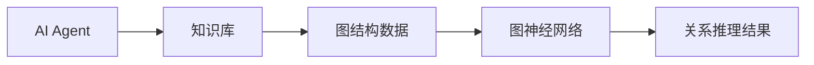
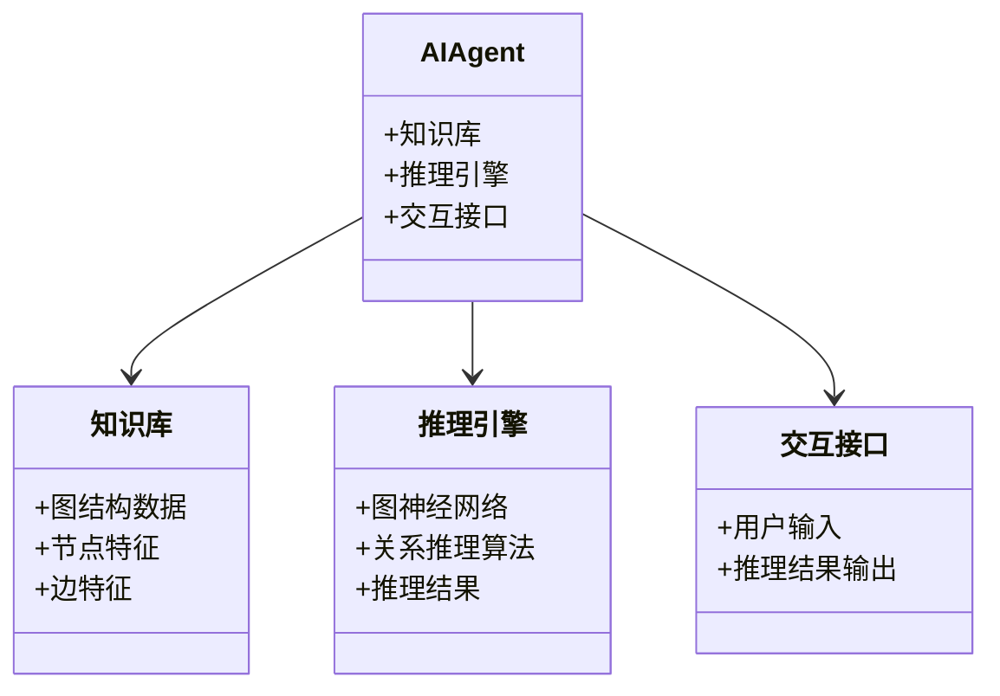
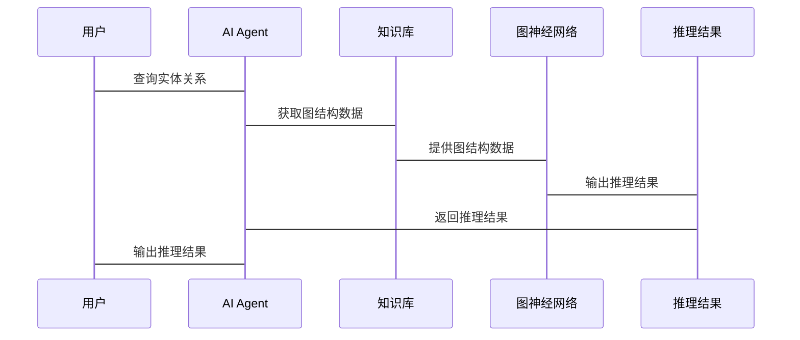

                 


# 基于图神经网络的AI Agent关系推理

> 关键词：图神经网络，AI Agent，关系推理，图结构数据，知识图谱，节点表示，边关系

> 摘要：本文系统地探讨了基于图神经网络的AI Agent关系推理的核心概念、算法原理、系统架构与实际应用。通过详细分析图神经网络在关系推理中的优势，结合实际案例，展示了如何利用图神经网络实现高效、准确的关系推理，为AI Agent的智能化发展提供了理论基础和实践指导。

---

## 第1章: 问题背景与概念解析

### 1.1 问题背景
#### 1.1.1 当前AI Agent的发展现状
- AI Agent的定义与分类
- 当前AI Agent在智能交互、决策支持等领域的应用
- 图神经网络在AI Agent中的重要性

#### 1.1.2 关系推理在AI Agent中的重要性
- 关系推理的核心作用：理解实体间的关系是AI Agent实现智能决策的关键
- 关系推理在自然语言处理、知识图谱构建中的应用
- 图神经网络在关系推理中的独特优势

#### 1.1.3 图神经网络在关系推理中的解决方法
- 图结构数据的特性：节点、边、权重
- 图神经网络的传播机制：通过局部信息聚合实现全局推理
- 图神经网络的可扩展性：处理大规模图结构数据的能力

### 1.2 问题描述
#### 1.2.1 AI Agent关系推理的核心问题
- 实体识别与关系提取：从数据中提取实体及其关系
- 关系推理的目标：基于上下文理解实体间的关系
- 关系推理的挑战：数据稀疏性、复杂性与动态性

#### 1.2.2 图结构数据的特点与挑战
- 图结构数据的表示：节点、边、属性
- 图结构数据的复杂性：多层关系、循环、异构图
- 图结构数据的动态性：实时更新与增量学习

#### 1.2.3 图神经网络在关系推理中的目标
- 建模实体间的关系：通过图神经网络学习节点间的关系
- 实现端到端的关系推理：从原始数据到最终推理结果
- 提高关系推理的准确性和效率

### 1.3 问题解决
#### 1.3.1 图神经网络的基本原理
- 图结构数据的表示：邻接矩阵、边属性、节点特征
- 图神经网络的传播机制：消息传递、聚合、更新
- 图嵌入的计算方法：节点表示、边表示、图表示

#### 1.3.2 关系推理的基本流程
- 数据预处理：清洗、标注、构建图结构
- 图神经网络模型的构建：定义网络结构、训练目标函数
- 关系推理结果的输出与解释

#### 1.3.3 图神经网络在关系推理中的应用
- 实体识别：通过图神经网络提取实体
- 关系抽取：从文本中提取关系
- 关系推理：基于上下文推理实体间的关系

### 1.4 问题的边界与外延
#### 1.4.1 关系推理的边界条件
- 数据规模：大规模图结构数据的处理能力
- 数据质量：噪声数据的鲁棒性
- 任务限制：仅基于图结构数据进行推理

#### 1.4.2 图神经网络的适用范围
- 适合处理图结构数据的任务
- 不适合处理非结构化数据的任务
- 与其他方法的结合应用

#### 1.4.3 与其他推理方法的对比
- 传统统计方法：基于特征工程的关系推理
- 基于深度学习的关系推理：CNN、RNN在关系推理中的应用
- 图神经网络的独特优势：处理复杂关系的能力

### 1.5 概念结构与核心要素
#### 1.5.1 AI Agent的核心要素
- AI Agent的定义：智能主体
- AI Agent的目标：实现智能决策与交互
- AI Agent的核心能力：感知、推理、决策

#### 1.5.2 图结构数据的关键属性
- 节点：实体
- 边：关系
- 权重：关系强度
- 属性：节点和边的特征

#### 1.5.3 关系推理的数学模型
- 图结构数据的表示：邻接矩阵
- 节点表示：向量表示
- 关系表示：边的权重或标签

---

## 第2章: 图神经网络与AI Agent关系推理的核心概念

### 2.1 图神经网络的基本原理
#### 2.1.1 图结构数据的表示
- 邻接矩阵表示：二进制矩阵表示节点间的连接关系
- 边属性表示：边的权重或标签
- 节点特征表示：节点的属性特征向量

#### 2.1.2 图神经网络的传播机制
- 消息传递：节点将信息传递给邻居节点
- 聚合：将邻居节点的信息进行聚合，得到节点的更新特征
- 更新：节点特征的更新与传播

#### 2.1.3 图嵌入的计算方法
- 节点嵌入：将节点表示为低维向量
- 边嵌入：将边表示为低维向量
- 图嵌入：将整个图表示为低维向量

### 2.2 关系推理的基本原理
#### 2.2.1 关系推理的目标函数
- 监督学习：基于标注数据训练模型
- 无监督学习：基于自监督任务学习关系
- 强化学习：通过奖励机制优化推理结果

#### 2.2.2 基于图神经网络的关系推理模型
- 图神经网络的架构：GCN、GAT、GraphSAGE
- 关系推理的损失函数：交叉熵损失、均方误差
- 模型的训练与推理：监督学习框架

#### 2.2.3 关系推理的评估指标
- 准确率：正确推理的关系占总推理关系的比例
- 召回率：正确推理的关系占所有真实关系的比例
- F1分数：准确率和召回率的调和平均

### 2.3 图神经网络与关系推理的联系
#### 2.3.1 图神经网络在关系推理中的作用
- 捕捉复杂关系：通过图结构捕捉实体间多层关系
- 实现端到端推理：从原始数据到推理结果
- 处理大规模数据：高效处理大规模图结构数据

#### 2.3.2 基于图神经网络的关系推理流程
- 数据预处理：构建图结构数据
- 模型训练：基于图神经网络训练关系推理模型
- 模型推理：输入新的图结构数据，输出推理结果

#### 2.3.3 图神经网络与传统关系推理方法的对比
- 传统统计方法：基于特征工程的关系推理
- 基于深度学习的方法：CNN、RNN在关系推理中的应用
- 图神经网络的独特优势：处理复杂关系的能力

---

## 第3章: 图神经网络与关系推理的核心概念对比

### 3.1 图神经网络的核心属性
#### 3.1.1 图结构的表示能力
- 图神经网络能够捕捉复杂的图结构信息
- 图神经网络能够处理异构图和动态图
- 图神经网络能够处理大规模图数据

#### 3.1.2 节点与边的特征表示
- 节点特征：节点的属性特征
- 边特征：边的权重或标签
- 图特征：整个图的全局特征

#### 3.1.3 图神经网络的可扩展性
- 图神经网络可以扩展到大规模数据
- 图神经网络可以处理异构图和动态图
- 图神经网络可以与其他模型结合使用

### 3.2 关系推理的核心属性
#### 3.2.1 关系推理的准确性
- 正确推理出真实存在的关系
- 减少误报和漏报
- 提高推理的置信度

#### 3.2.2 关系推理的实时性
- 实时处理动态更新的数据
- 快速响应用户的查询
- 低延迟的推理过程

#### 3.2.3 关系推理的可解释性
- 推理结果的可解释性
- 推理过程的透明性
- 推理结果的可信度

### 3.3 图神经网络与关系推理的对比分析
#### 3.3.1 从节点表示到关系推理的对比
- 节点表示：将节点表示为低维向量
- 关系推理：基于节点表示推理关系
- 对比：节点表示是关系推理的基础

#### 3.3.2 图神经网络与传统关系推理方法的优劣分析
- 传统统计方法：基于特征工程，计算复杂度高
- 基于深度学习的方法：计算能力强，但需要大量数据
- 图神经网络：能够处理复杂关系，计算效率高

#### 3.3.3 图神经网络在大规模数据中的表现
- 大规模图数据的处理能力
- 复杂关系的捕捉能力
- 高效的计算能力

---

## 第4章: 图神经网络与关系推理的实体关系图



---

## 第5章: 图神经网络与关系推理的算法原理

### 5.1 图神经网络的基本算法
#### 5.1.1 邻接矩阵表示
- 邻接矩阵的定义：$A_{ij} = 1$ 表示节点 $i$ 和节点 $j$ 之间有边，否则为 $0$
- 邻接矩阵的对称性：无向图的邻接矩阵是对称的
- 邻接矩阵的稀疏性：处理稀疏图的能力

#### 5.1.2 节点特征传播
- 节点特征传播的过程：$h_i^{(l+1)} = \sigma(\sum_{j} A_{ij} h_j^{(l)})$
- 激活函数的选择：ReLU、Sigmoid、Tanh
- 节点特征的聚合方式：平均、最大、加权和

#### 5.1.3 图嵌入的计算方法
- 基于邻接矩阵的图嵌入：$Z = A X$
- 基于图神经网络的图嵌入：$Z = \text{GNN}(X, A)$
- 图嵌入的维度选择：低维表示

### 5.2 关系推理的算法流程
#### 5.2.1 数据预处理
- 数据清洗：去除噪声数据
- 数据标注：标注实体及其关系
- 数据构建：构建图结构数据

#### 5.2.2 图神经网络模型构建
- 模型选择：GCN、GAT、GraphSAGE
- 模型训练：基于标注数据训练模型
- 模型优化：调整超参数、防止过拟合

#### 5.2.3 关系推理结果输出
- 推理过程：输入新的图结构数据，输出推理结果
- 结果解释：解释推理结果的含义
- 结果评估：评估推理结果的准确性和效率

### 5.3 图神经网络与关系推理的数学模型
#### 5.3.1 邻接
- 邻接矩阵的定义：$A_{ij} = 1$ 表示节点 $i$ 和节点 $j$ 之间有边，否则为 $0$
- 节点特征的表示：$X$ 是节点特征矩阵，$X \in \mathbb{R}^{n \times d}$
- 节点表示的更新：$h_i^{(l+1)} = \sigma(\sum_{j} A_{ij} h_j^{(l)})$

#### 5.3.2 图神经网络的传播机制
- 消息传递：$h_i^{(l+1)} = \sigma(\sum_{j} A_{ij} h_j^{(l)})$
- 聚合：$h_i^{(l+1)} = \sigma(\sum_{j} A_{ij} h_j^{(l)})$
- 更新：$h_i^{(l+1)} = \sigma(\sum_{j} A_{ij} h_j^{(l)})$

#### 5.3.3 关系推理的损失函数
- 交叉熵损失：$\mathcal{L} = -\sum_{i} y_i \log(p_i) + (1 - y_i) \log(1 - p_i)$
- 均方误差：$\mathcal{L} = \frac{1}{n} \sum_{i=1}^{n} (y_i - p_i)^2$
- 分类损失：$\mathcal{L} = \text{分类损失函数}$

---

## 第6章: 图神经网络与关系推理的系统分析与架构设计

### 6.1 问题场景介绍
- AI Agent需要处理复杂的实体关系
- 图结构数据的特点与挑战
- 图神经网络在系统中的作用

### 6.2 项目介绍
- 项目目标：基于图神经网络实现AI Agent的关系推理
- 项目范围：构建图结构数据，训练图神经网络模型，实现关系推理
- 项目计划：数据预处理、模型训练、模型推理

### 6.3 系统功能设计
#### 6.3.1 领域模型


#### 6.3.2 系统架构设计


#### 6.3.3 系统接口设计
- 输入接口：用户输入实体和关系查询
- 输出接口：推理结果输出
- 接口协议：REST API

#### 6.3.4 系统交互流程


### 6.4 系统实现细节
#### 6.4.1 环境安装
- Python 3.8+
- PyTorch 1.9+
- NetworkX 2.8+
- Scikit-learn 1.0+

#### 6.4.2 系统核心实现源代码
```python
import torch
import torch.nn as nn
import torch.nn.functional as F

class GNNLayer(nn.Module):
    def __init__(self, in_dim, out_dim):
        super(GNNLayer, self).__init__()
        self.W = nn.Parameter(torch.randn(in_dim, out_dim))
        self.A = nn.Parameter(torch.randn(n, n))  # 邻接矩阵

    def forward(self, x):
        x = torch.mm(x, self.W)  # 节点特征矩阵乘以权重矩阵
        x = torch.mm(self.A, x)  # 邻接矩阵乘以节点特征矩阵
        x = F.relu(x)
        return x

class Graph Neural Network:
    def __init__(self, input_dim, hidden_dim, output_dim):
        self.gnn_layer = GNNLayer(input_dim, hidden_dim)
        self.classifier = nn.Linear(hidden_dim, output_dim)

    def forward(self, x):
        x = self.gnn_layer(x)
        x = self.classifier(x)
        return x
```

### 6.5 系统实现细节解读
- 代码实现：定义图神经网络层和整体网络架构
- 代码应用：使用PyTorch框架实现图神经网络
- 代码解释：图神经网络层的前向传播过程

### 6.6 实际案例分析
- 数据集介绍：常用图结构数据集
- 案例分析：基于图神经网络的关系推理过程
- 案例解读：推理结果的分析与解释

### 6.7 项目小结
- 项目实现的步骤总结
- 项目中的关键点总结
- 项目的优缺点总结

---

## 第7章: 图神经网络与关系推理的项目实战

### 7.1 环境安装
- Python 3.8+
- PyTorch 1.9+
- NetworkX 2.8+
- Scikit-learn 1.0+

### 7.2 系统核心实现源代码
```python
import torch
import torch.nn as nn
import torch.nn.functional as F

class GNNLayer(nn.Module):
    def __init__(self, in_dim, out_dim):
        super(GNNLayer, self).__init__()
        self.W = nn.Parameter(torch.randn(in_dim, out_dim))
        self.A = nn.Parameter(torch.randn(n, n))  # 邻接矩阵

    def forward(self, x):
        x = torch.mm(x, self.W)  # 节点特征矩阵乘以权重矩阵
        x = torch.mm(self.A, x)  # 邻接矩阵乘以节点特征矩阵
        x = F.relu(x)
        return x

class GraphNeuralNetwork(nn.Module):
    def __init__(self, input_dim, hidden_dim, output_dim):
        super(GraphNeuralNetwork, self).__init__()
        self.gnn_layer = GNNLayer(input_dim, hidden_dim)
        self.classifier = nn.Linear(hidden_dim, output_dim)

    def forward(self, x):
        x = self.gnn_layer(x)
        x = self.classifier(x)
        return x

# 示例数据
n = 4
input_dim = 2
hidden_dim = 3
output_dim = 2
model = GraphNeuralNetwork(input_dim, hidden_dim, output_dim)
```

### 7.3 代码应用解读与分析
- 代码实现：定义图神经网络层和整体网络架构
- 代码应用：使用PyTorch框架实现图神经网络
- 代码解释：图神经网络层的前向传播过程

### 7.4 实际案例分析
- 数据集介绍：常用图结构数据集
- 案例分析：基于图神经网络的关系推理过程
- 案例解读：推理结果的分析与解释

### 7.5 项目小结
- 项目实现的步骤总结
- 项目中的关键点总结
- 项目的优缺点总结

---

## 第8章: 图神经网络与关系推理的总结与展望

### 8.1 总结
- 本文总结了基于图神经网络的AI Agent关系推理的核心概念、算法原理和系统架构
- 图神经网络在关系推理中的优势：处理复杂关系、高效计算
- 图神经网络在AI Agent中的应用前景

### 8.2 最佳实践 tips
- 数据预处理的关键性：确保数据质量
- 模型选择的重要性：根据任务选择合适的模型
- 超参数调优：提高模型性能

### 8.3 小结
- 本文的核心内容总结
- 图神经网络在关系推理中的未来发展

### 8.4 注意事项
- 数据隐私与安全
- 模型的可解释性
- 实际应用中的鲁棒性

### 8.5 拓展阅读
- 图神经网络的最新研究
- 关系推理的其他方法
- 图神经网络与强化学习的结合

---

## 作者：AI天才研究院/AI Genius Institute & 禅与计算机程序设计艺术/Zen And The Art of Computer Programming

---

