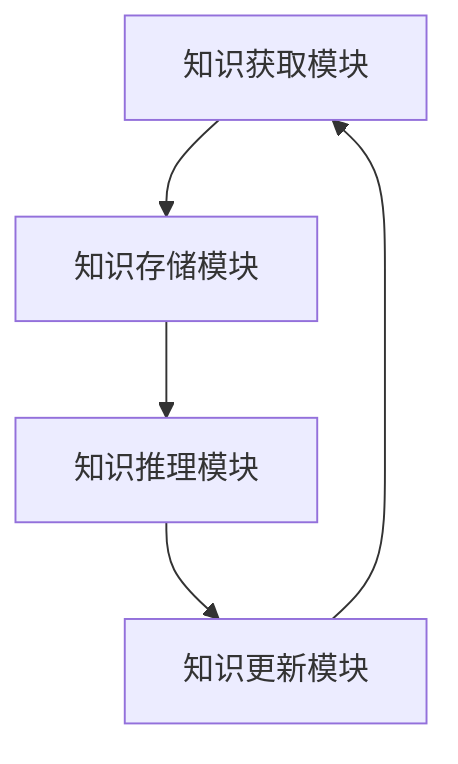
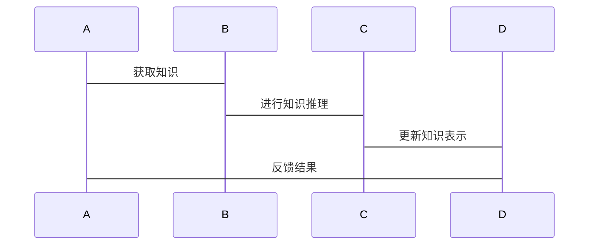

                 


# 基于图神经网络的AI Agent动态知识表示

---

## 关键词：
- 图神经网络
- AI Agent
- 动态知识表示
- 知识图谱
- 图卷积网络
- 知识推理

---

## 摘要：
本文深入探讨了基于图神经网络的AI Agent动态知识表示方法。通过结合图神经网络的强大建模能力和AI Agent的知识表示需求，提出了一种动态、高效的知识表示框架。本文首先介绍了AI Agent和图神经网络的基本概念，然后详细分析了图神经网络在动态知识表示中的核心原理，包括图的表示、节点嵌入和图卷积操作。接着，结合实际应用场景，设计了基于图神经网络的AI Agent系统架构，并通过具体案例展示了如何利用图神经网络进行知识推理和更新。最后，本文总结了当前研究的成果与不足，并展望了未来的研究方向。

---

# 第1章: AI Agent与动态知识表示概述

## 1.1 AI Agent的基本概念
### 1.1.1 AI Agent的定义与分类
AI Agent（人工智能代理）是指能够感知环境、自主决策并执行任务的智能实体。根据功能和应用场景，AI Agent可以分为简单反射型、基于模型型、目标驱动型和效用驱动型等类别。

### 1.1.2 动态知识表示的必要性
在动态环境中，知识表示需要能够实时更新和调整，以适应环境的变化。传统的静态知识表示方法难以满足这一需求，因此动态知识表示成为研究重点。

### 1.1.3 AI Agent的知识表示需求
AI Agent的知识表示需要满足以下需求：
- **动态性**：能够实时更新和调整知识。
- **关联性**：能够表示知识之间的关联关系。
- **可解释性**：知识表示需要具备可解释性，以便人类理解和干预。

## 1.2 图神经网络的基本概念
### 1.2.1 图的基本概念与表示
图是一种由节点（顶点）和边（连接节点的边）组成的结构。图可以表示为$G = (V, E)$，其中$V$是节点集合，$E$是边的集合。

### 1.2.2 神经网络的基本原理
神经网络是一种模拟人脑结构和功能的数学模型，由多个层次组成，包括输入层、隐藏层和输出层。神经网络通过权重和激活函数进行信息处理和特征提取。

### 1.2.3 图神经网络的独特优势
图神经网络（Graph Neural Network, GNN）是一种专门用于处理图结构数据的神经网络。其独特优势包括：
- **全局视角**：能够捕捉图中节点之间的全局关系。
- **局部特征**：能够提取节点的局部特征。
- **动态更新**：能够支持动态图的更新和学习。

## 1.3 基于图神经网络的AI Agent动态知识表示
### 1.3.1 动态知识表示的核心问题
动态知识表示的核心问题是如何在动态变化的环境中，实时更新和调整知识表示，以反映环境的变化。

### 1.3.2 图神经网络在知识表示中的应用
图神经网络可以用于表示知识图谱中的节点和边，通过图卷积操作提取节点的特征表示。

### 1.3.3 基于图神经网络的动态知识表示的优势
- **高效性**：图神经网络能够高效地处理大规模图数据。
- **准确性**：图神经网络能够捕捉图中的复杂关系，提高知识表示的准确性。
- **可扩展性**：图神经网络能够支持大规模图的扩展。

## 1.4 本章小结
本章介绍了AI Agent和图神经网络的基本概念，并分析了图神经网络在动态知识表示中的优势和应用场景。

---

# 第2章: 图神经网络的核心原理

## 2.1 图的表示与建模
### 2.1.1 图的节点与边表示
节点表示为$V = \{v_1, v_2, ..., v_n\}$，边表示为$E = \{e_1, e_2, ..., e_m\}$，其中$e_i$表示节点之间的连接关系。

### 2.1.2 图的邻接矩阵与邻接表
- **邻接矩阵**：$A$是一个$n \times n$的矩阵，其中$A_{i,j} = 1$表示节点$i$和$j$之间有边连接，否则为$0$。
- **邻接表**：将每个节点的邻居节点存储在一个列表中。

### 2.1.3 图的属性与权重
图的边可以具有权重，表示关系的强弱。例如，$w_{i,j}$表示节点$i$和$j$之间的边权重。

## 2.2 图神经网络的基本操作
### 2.2.1 节点嵌入的计算
节点嵌入（Node Embedding）是将节点表示为低维向量的过程。常用的节点嵌入方法包括随机游走、图嵌入算法（如GraphSAGE）等。

### 2.2.2 图卷积操作
图卷积操作（Graph Convolution）是图神经网络的核心操作，用于提取节点的特征表示。图卷积操作可以表示为：
$$
h_i^{(l+1)} = \sigma\left(\sum_{j \in N(i)} w_{i,j} h_j^{(l)} + b_i\right)
$$
其中，$h_i^{(l)}$表示节点$i$在第$l$层的特征向量，$N(i)$表示节点$i$的邻居节点集合，$\sigma$表示激活函数。

### 2.2.3 图池化操作
图池化操作（Graph Pooling）用于将图的特征向量进行降维，常用的方法包括最大池化、平均池化和Top-K池化。

## 2.3 图神经网络的训练与推理
### 2.3.1 图神经网络的前向传播
图神经网络的前向传播过程包括输入层、隐藏层和输出层的特征传递和变换。

### 2.3.2 图神经网络的损失函数
常用的损失函数包括交叉熵损失和均方误差损失，具体选择取决于任务类型。

### 2.3.3 图神经网络的优化算法
常用的优化算法包括随机梯度下降（SGD）和Adam优化器。

## 2.4 本章小结
本章详细介绍了图神经网络的核心原理，包括图的表示与建模、基本操作和训练与推理过程。

---

# 第3章: AI Agent的知识表示与图神经网络的结合

## 3.1 AI Agent的知识表示需求
### 3.1.1 知识表示的动态性
AI Agent需要能够实时更新知识表示，以应对动态环境的变化。

### 3.1.2 知识表示的可扩展性
知识表示需要能够支持大规模知识的扩展和更新。

### 3.1.3 知识表示的语义理解
知识表示需要具备语义理解能力，能够捕捉知识之间的语义关联。

## 3.2 图神经网络在知识表示中的优势
### 3.2.1 图结构对知识关联的自然表达
图结构能够自然地表示知识之间的关联关系，例如实体之间的关系和属性。

### 3.2.2 图神经网络的特征提取能力
图神经网络能够通过图卷积操作提取节点的特征表示，捕捉图中的局部和全局特征。

### 3.2.3 图神经网络的动态更新能力
图神经网络能够支持动态图的更新和学习，适应环境的变化。

## 3.3 基于图神经网络的动态知识表示框架
### 3.3.1 框架的整体设计
动态知识表示框架包括知识获取、知识存储、知识推理和知识更新四个模块。

### 3.3.2 框架的具体实现
- **知识获取**：通过爬虫、API等方式获取动态知识。
- **知识存储**：将知识表示为图结构，存储在图数据库中。
- **知识推理**：通过图神经网络进行知识推理和关联分析。
- **知识更新**：根据环境的变化，实时更新知识表示。

## 3.4 本章小结
本章分析了AI Agent的知识表示需求，并探讨了图神经网络在动态知识表示中的应用和优势。

---

# 第4章: 图神经网络在动态知识表示中的算法实现

## 4.1 动态知识表示的算法需求
### 4.1.1 算法的实时性
算法需要能够实时处理动态知识的变化。

### 4.1.2 算法的可扩展性
算法需要能够支持大规模知识图谱的扩展和处理。

## 4.2 基于图卷积网络的动态知识表示算法
### 4.2.1 算法的整体流程
1. 初始化图结构和节点嵌入。
2. 进行图卷积操作，提取节点特征。
3. 根据环境变化，更新图结构和节点嵌入。
4. 输出更新后的节点特征表示。

### 4.2.2 算法的具体实现
```python
class GraphSAGE:
    def __init__(self, input_dim, hidden_dim, output_dim):
        self.W1 = np.random.randn(input_dim, hidden_dim)
        self.W2 = np.random.randn(hidden_dim, output_dim)
    
    def forward(self, X, A):
        # X: 输入特征矩阵，形状为(n, input_dim)
        # A: 邻接矩阵，形状为(n, n)
        # 计算聚合操作
        Agg = np.zeros_like(X)
        for i in range(X.shape[0]):
            for j in range(X.shape[0]):
                if A[i, j] > 0:
                    Agg[i] += X[j] * A[i, j]
        # 进行变换
        H = np.maximum(0, np.dot(Agg, self.W1))
        # 输出层
        Y = np.dot(H, self.W2)
        return Y
```

### 4.2.3 算法的数学模型
图卷积操作的数学模型可以表示为：
$$
Y = \sigma\left(\sum_{j=1}^{n} A_{i,j} X_j W\right)
$$
其中，$X_j$表示节点$j$的输入特征，$W$表示权重矩阵，$\sigma$表示激活函数。

## 4.3 算法的优化与改进
### 4.3.1 算法的优化策略
- **批量训练**：通过批量训练提高算法的训练效率。
- **模型剪枝**：通过模型剪枝减少计算量。

### 4.3.2 算法的改进方向
- **多层图卷积**：增加图卷积的层数，提高特征提取能力。
- **注意力机制**：引入注意力机制，增强重要节点的特征表示。

## 4.4 本章小结
本章详细介绍了基于图卷积网络的动态知识表示算法，并通过具体代码实现和数学公式对算法进行了详细讲解。

---

# 第5章: 基于图神经网络的AI Agent系统架构设计

## 5.1 系统功能设计
### 5.1.1 知识获取模块
通过爬虫、API等方式获取动态知识。

### 5.1.2 知识存储模块
将知识表示为图结构，存储在图数据库中。

### 5.1.3 知识推理模块
通过图神经网络进行知识推理和关联分析。

### 5.1.4 知识更新模块
根据环境变化，实时更新知识表示。

## 5.2 系统架构设计
### 5.2.1 系统架构图


### 5.2.2 系统接口设计
- **知识获取接口**：用于获取外部知识。
- **知识存储接口**：用于存储知识图谱。
- **知识推理接口**：用于进行知识推理。
- **知识更新接口**：用于实时更新知识表示。

## 5.3 系统交互流程
### 5.3.1 系统交互流程图


## 5.4 本章小结
本章设计了基于图神经网络的AI Agent系统架构，并通过架构图和交互流程图对系统的功能和交互过程进行了详细描述。

---

# 第6章: 项目实战——基于图神经网络的动态知识表示实现

## 6.1 项目环境配置
### 6.1.1 环境需求
- Python 3.6+
- PyTorch 1.9+
- NetworkX 2.6+

### 6.1.2 安装依赖
```bash
pip install torch networkx
```

## 6.2 核心代码实现
### 6.2.1 图神经网络模型
```python
import torch
import torch.nn as nn
import torch.nn.functional as F

class GNNModel(nn.Module):
    def __init__(self, input_dim, hidden_dim, output_dim):
        super(GNNModel, self).__init__()
        self.W = nn.Parameter(torch.randn(input_dim, hidden_dim))
        self.U = nn.Parameter(torch.randn(hidden_dim, output_dim))
    
    def forward(self, X, A):
        # 聚合操作
        Agg = torch.mm(X, self.W)
        # 图卷积操作
        Temp = torch.mm(A, Agg)
        # 激活函数
        H = F.relu(Temp)
        # 输出层
        Y = torch.mm(H, self.U)
        return Y
```

### 6.2.2 知识更新模块
```python
def update_knowledge(X, A, new_info):
    # 更新输入特征
    X = update_X(X, new_info)
    # 更新邻接矩阵
    A = update_A(A, new_info)
    # 重新进行图卷积操作
    Y = GNNModel.forward(X, A)
    return Y
```

## 6.3 项目实现案例分析
### 6.3.1 案例背景
假设我们有一个动态知识表示的场景，例如实时更新的社交网络关系。

### 6.3.2 案例实现
通过代码实现社交网络中用户关系的动态更新和推理。

## 6.4 本章小结
本章通过具体的项目实战，详细展示了基于图神经网络的动态知识表示的实现过程，并通过代码示例对实现细节进行了详细说明。

---

# 第7章: 总结与展望

## 7.1 本章总结
本文深入探讨了基于图神经网络的AI Agent动态知识表示方法，分析了图神经网络的核心原理和算法实现，并设计了基于图神经网络的AI Agent系统架构。通过具体案例分析，展示了动态知识表示的实际应用。

## 7.2 未来展望
未来的研究方向包括：
- **高效算法设计**：进一步优化图神经网络的算法，提高计算效率。
- **多模态知识表示**：结合文本、图像等多种模态信息，丰富知识表示的内容。
- **实时更新机制**：研究更高效的动态知识更新方法，适应快速变化的环境。

## 7.3 最佳实践 tips
- 在实际应用中，建议结合具体场景选择合适的图神经网络模型。
- 定期更新知识库，保持知识表示的准确性。
- 注意保护用户隐私，确保知识表示的安全性。

## 7.4 本章小结
本章总结了全文的主要内容，并对未来的研究方向和实际应用进行了展望。

---

# 作者：AI天才研究院/AI Genius Institute & 禅与计算机程序设计艺术 /Zen And The Art of Computer Programming

