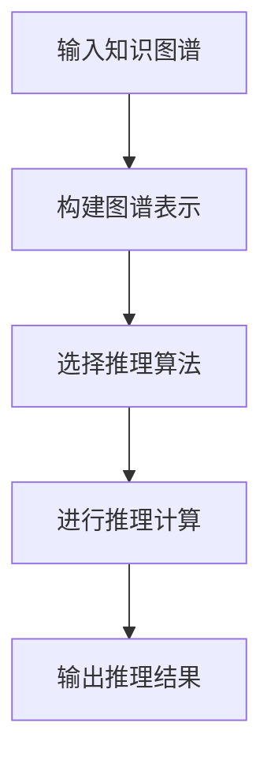
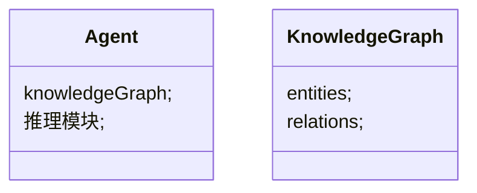
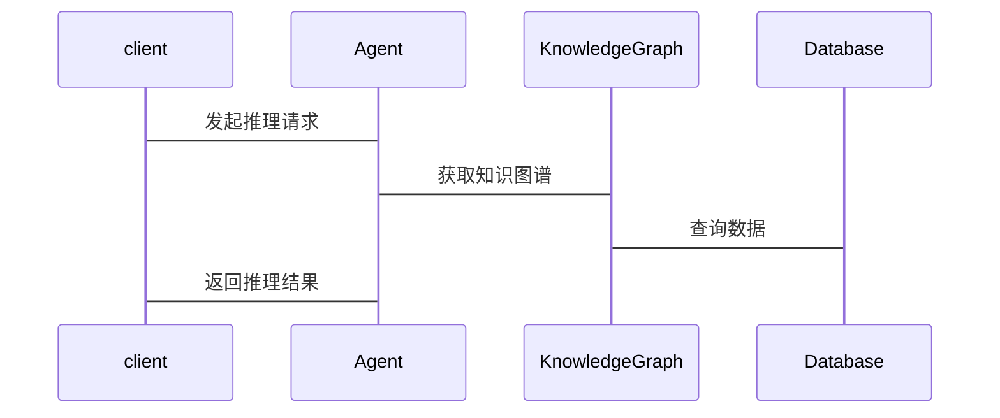

                 


# 基于图谱的AI Agent知识推理与补全

> 关键词：知识图谱，AI Agent，知识推理，图谱补全，智能问答

> 摘要：本文详细探讨了基于图谱的AI Agent知识推理与补全技术，从问题背景到核心概念，从算法原理到系统架构，从项目实战到最佳实践，全面分析了该领域的关键技术与实现方法。文章通过丰富的图表和代码示例，结合理论与实践，为读者提供了系统化的知识框架和技术指导。

---

## 第1章: 问题背景与概念介绍

### 1.1 问题背景

#### 1.1.1 知识图谱的定义与作用
知识图谱是一种以图结构形式表示知识的语义网络，节点表示实体或概念，边表示实体之间的关系。知识图谱通过结构化数据的形式，能够有效地组织和表达海量知识，为AI Agent提供了强大的知识基础。

#### 1.1.2 AI Agent的核心任务与挑战
AI Agent是一种智能主体，能够感知环境、自主决策并执行任务。在知识图谱的支持下，AI Agent能够进行复杂的推理和决策。然而，知识图谱中的信息缺失、实体关系的复杂性以及动态更新的挑战，使得知识推理与补全成为AI Agent的核心任务之一。

#### 1.1.3 知识推理与补全的必要性
知识推理是AI Agent理解知识图谱中隐含关系的关键能力，而知识补全是解决图谱信息不完整问题的重要手段。通过知识推理与补全，AI Agent能够更好地理解和应用知识图谱中的信息，提升其智能水平。

### 1.2 问题描述

#### 1.2.1 知识图谱中的信息缺失问题
知识图谱中的信息可能因为数据采集、标注等原因而存在缺失，这会影响AI Agent的知识推理能力。

#### 1.2.2 AI Agent在复杂场景中的推理需求
在复杂场景中，AI Agent需要处理多实体、多关系的推理任务，这对知识图谱的完整性和推理算法的效率提出了更高的要求。

#### 1.2.3 知识补全与推理的边界与外延
知识补全的边界在于如何有效地补充缺失的知识，而推理的外延则涉及从简单推理到复杂推理的扩展。

### 1.3 问题解决与核心要素

#### 1.3.1 知识图谱构建的关键步骤
知识图谱的构建包括数据采集、数据清洗、实体识别、关系抽取和图谱构建等步骤。

#### 1.3.2 AI Agent的知识推理机制
AI Agent的知识推理机制包括基于规则的推理、基于概率的推理和基于神经网络的推理。

#### 1.3.3 知识补全的技术路径
知识补全的技术路径包括基于规则的补全、基于邻域的补全和基于深度学习的补全。

### 1.4 本章小结
本章从知识图谱和AI Agent的基本概念出发，分析了知识推理与补全的必要性，并总结了相关的核心要素。这些内容为后续章节的深入探讨奠定了基础。

---

## 第2章: 基于图谱的知识推理与补全的核心概念

### 2.1 知识图谱与AI Agent的关系

#### 2.1.1 知识图谱的结构特征
知识图谱具有节点化、关系化和语义化的结构特征。

#### 2.1.2 AI Agent的知识需求
AI Agent需要知识图谱中的实体知识、关系知识和语义知识。

#### 2.1.3 两者结合的必要性
知识图谱为AI Agent提供了丰富的知识表示，而AI Agent则能够通过推理能力增强知识图谱的实用价值。

### 2.2 核心概念对比分析

#### 2.2.1 知识图谱与传统数据库的对比
| 特性 | 知识图谱 | 传统数据库 |
|------|----------|-------------|
| 数据结构 | 图结构 | 行列结构 |
| 数据关系 | 多对多 | 一对一、一对多 |

#### 2.2.2 AI Agent与传统知识推理系统的对比
| 特性 | AI Agent | 传统知识推理系统 |
|------|----------|----------------|
| 自主性 | 高 | 低 |
| 可扩展性 | 高 | 低 |

#### 2.2.3 图谱推理与符号推理的对比
图谱推理基于知识图谱的结构进行，符号推理基于符号逻辑进行。

### 2.3 ER实体关系图架构
```mermaid
er
actor(Agent, 实体, 关系)
```

### 2.4 本章小结
本章通过对知识图谱和AI Agent的核心概念进行对比分析，明确了两者结合的必要性和可行性。

---

## 第3章: 基于图谱的知识推理算法原理

### 3.1 算法原理概述

#### 3.1.1 图谱表示学习的基本原理
图谱表示学习通过将实体和关系映射到低维空间，降低推理的计算复杂度。

#### 3.1.2 知识推理的数学模型
知识推理的数学模型包括矩阵分解模型和神经网络模型。

#### 3.1.3 算法的输入输出关系
输入：知识图谱；输出：推理结果。

### 3.2 图谱表示学习的数学模型

#### 3.2.1 知识图谱的表示方法
使用嵌入向量表示实体和关系，例如Word2Vec。

#### 3.2.2 矩阵分解模型
$$A \times B = C$$

#### 3.2.3 神经网络模型
使用图神经网络进行推理，例如GAT和GCN。

### 3.3 算法实现的流程图


### 3.4 算法实现的Python代码

#### 3.4.1 知识图谱的表示构建
```python
def build_graph():
    graph = {}
    entities = ['Agent', '知识', '推理']
    for e in entities:
        graph[e] = []
    relations = ['属于', '依赖']
    for r in relations:
        graph[r] = []
    return graph
```

---

## 第4章: 系统架构与设计

### 4.1 问题场景介绍
系统场景包括知识图谱的存储、AI Agent的推理和结果的应用。

### 4.2 系统功能设计

#### 4.2.1 领域模型类图


#### 4.2.2 系统架构图


#### 4.2.3 系统接口设计
API接口包括获取知识图谱、执行推理和更新知识图谱。

#### 4.2.4 系统交互序列图


### 4.3 本章小结
本章详细设计了系统的架构与功能，为后续的项目实现提供了理论基础。

---

## 第5章: 项目实战

### 5.1 环境安装
安装必要的库，例如PyTorch和NetworkX。

### 5.2 系统核心实现源代码

#### 5.2.1 知识图谱的构建
```python
import networkx as nx

def build_knowledge_graph():
    G = nx.DiGraph()
    G.add_node('Agent')
    G.add_node('知识')
    G.add_node('推理')
    G.add_edge('Agent', '知识', label='依赖')
    G.add_edge('知识', '推理', label='属于')
    return G
```

#### 5.2.2 推理算法的实现
```python
def knowledge_reasoning(G):
    for edge in G.edges():
        print(f"{edge[0]} -> {edge[1]}: {G.get_edge_data(*edge).get('label', '')}")
```

### 5.3 实际案例分析与详细解读
通过具体案例分析知识推理与补全的应用场景。

### 5.4 项目小结
总结项目的实现过程和关键点。

---

## 第6章: 总结与展望

### 6.1 最佳实践 tips
- 定期更新知识图谱
- 选择合适的推理算法
- 优化系统架构

### 6.2 小结
本文系统地探讨了基于图谱的AI Agent知识推理与补全技术，为相关领域的研究提供了理论和实践参考。

### 6.3 注意事项
- 数据质量和完整性
- 算法的可扩展性
- 系统的安全性和稳定性

### 6.4 拓展阅读
推荐相关领域的书籍和论文。

---

作者：AI天才研究院/AI Genius Institute & 禅与计算机程序设计艺术 /Zen And The Art of Computer Programming

