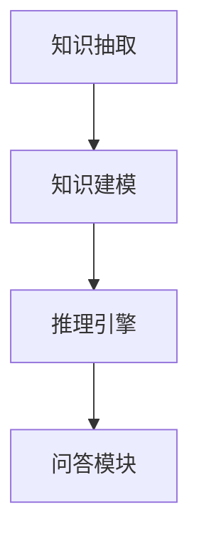
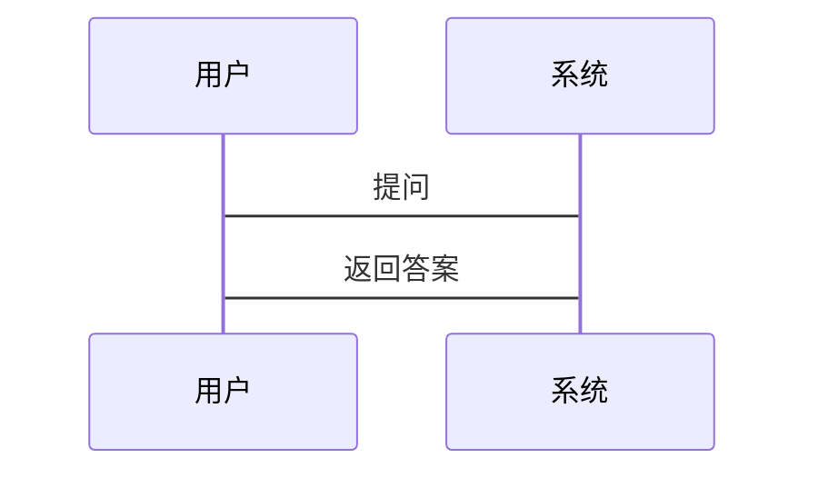

                 


```markdown
# 基于图谱的AI Agent知识推理与问答

> **关键词**: 图谱, AI Agent, 知识推理, 问答系统, 知识图谱, 图嵌入, 推理算法

> **摘要**: 本文系统地探讨了基于图谱的AI Agent在知识推理与问答系统中的应用。从图谱的基本概念到AI Agent的知识推理方法，再到基于图谱的问答系统的设计与实现，文章详细介绍了图谱表示、知识推理算法、系统架构以及实际项目案例。通过数学公式、mermaid图表和Python代码的结合，本文旨在帮助读者深入理解基于图谱的AI Agent的核心技术及其在问答系统中的应用。

---

## 第1章 图谱与AI Agent概述

### 1.1 图谱的基本概念

#### 1.1.1 图谱的定义与特点
图谱是一种基于图结构的数据表示方法，由节点（实体）和边（关系）组成。图谱的特点包括：
- **语义丰富**：能够表示实体之间的复杂关系。
- **结构化**：便于计算机理解和推理。
- **动态性**：支持实时更新和扩展。

#### 1.1.2 图谱在知识表示中的作用
图谱通过构建知识图谱，将分散的知识点连接起来，形成一个完整的知识网络。例如，知识图谱可以表示“人-组织”关系，帮助AI Agent理解实体间的关联。

#### 1.1.3 AI Agent的基本概念与功能
AI Agent是一种智能代理，能够感知环境并执行任务。其功能包括：
- **感知**：通过传感器或数据源获取信息。
- **推理**：基于知识库进行逻辑推理。
- **决策**：根据推理结果做出决策。
- **执行**：通过执行器执行任务。

### 1.2 知识推理与问答系统

#### 1.2.1 知识推理的定义与方法
知识推理是通过现有知识推导新结论的过程。常用方法包括符号逻辑推理和概率推理。

#### 1.2.2 问答系统的分类与应用
问答系统分为基于规则、检索和生成三种类型。例如，基于检索的问答系统通过匹配预存知识回答问题。

#### 1.2.3 图谱在问答系统中的应用
图谱为问答系统提供了丰富的知识库，支持基于图的路径查询和实体识别。

### 1.3 本章小结
本章介绍了图谱和AI Agent的基本概念，以及图谱在知识推理和问答系统中的作用，为后续内容奠定了基础。

---

## 第2章 图谱表示与知识建模

### 2.1 图谱表示方法

#### 2.1.1 图论基础
图由节点和边组成，节点表示实体，边表示关系。

#### 2.1.2 图谱的节点与边表示
节点表示实体，边表示关系。例如，节点表示“人”，边表示“属于”关系。

#### 2.1.3 图谱的嵌入表示
图嵌入将图结构转换为低维向量，便于机器学习处理。

### 2.2 知识图谱构建

#### 2.2.1 知识抽取与实体识别
从文本中抽取实体，如从“张三属于公司A”中抽取“张三”和“公司A”。

#### 2.2.2 关系抽取与属性建模
识别实体间的关系，如“张三属于公司A”。

#### 2.2.3 知识融合与图谱构建
将抽取的知识整合成图结构，构建知识图谱。

### 2.3 图谱表示的数学模型

#### 2.3.1 图的邻接矩阵表示
邻接矩阵表示节点间的直接关系。

#### 2.3.2 图的拉普拉斯矩阵表示
拉普拉斯矩阵用于图的谱分析，计算节点的重要性。

#### 2.3.3 图嵌入的向量空间模型
图嵌入将图节点映射到低维向量空间，便于计算。

### 2.4 本章小结
本章介绍了图谱的表示方法和知识图谱的构建过程，为后续推理和问答系统提供了基础。

---

## 第3章 AI Agent的知识推理

### 3.1 知识推理的基本原理

#### 3.1.1 推理的定义与类型
推理是根据现有知识推导新结论的过程，分为演绎推理和归纳推理。

#### 3.1.2 基于图谱的推理方法
基于图的遍历进行推理，如BFS和DFS。

#### 3.1.3 推理的不确定性与概率模型
概率模型如贝叶斯网络用于处理推理中的不确定性。

### 3.2 基于图谱的推理算法

#### 3.2.1 图遍历算法（BFS、DFS）
BFS和DFS用于图的遍历，帮助发现实体间的关联。

#### 3.2.2 基于规则的推理
通过预定义规则进行推理，如“如果A属于公司B，且公司B在行业C，那么A属于行业C”。

#### 3.2.3 基于机器学习的推理
使用深度学习模型进行推理，如RNN和Transformer。

### 3.3 知识图谱中的路径推理

#### 3.3.1 短路径推理
通过短路径找到直接关联的实体。

#### 3.3.2 长路径推理
通过多步推理找到间接关联的实体。

#### 3.3.3 基于上下文的推理
结合上下文信息进行推理，提高准确性。

### 3.4 本章小结
本章详细讲解了知识推理的基本原理和算法，为问答系统提供了理论基础。

---

## 第4章 基于图谱的问答系统

### 4.1 问答系统的分类

#### 4.1.1 基于规则的问答系统
通过预定义规则匹配问题。

#### 4.1.2 基于检索的问答系统
从知识库中检索答案。

#### 4.1.3 基于生成的问答系统
生成回答而非检索。

### 4.2 基于图谱的问答流程

#### 4.2.1 问题解析与实体识别
将问题分解为实体和关系。

#### 4.2.2 基于图谱的路径查询
通过图查询找到关联实体。

#### 4.2.3 结果生成与排序
生成答案并排序。

### 4.3 基于图谱的问答算法

#### 4.3.1 基于符号逻辑的问答
使用符号逻辑进行推理。

#### 4.3.2 基于向量空间的问答
通过向量相似度匹配答案。

#### 4.3.3 基于概率的问答模型
使用概率模型计算答案概率。

### 4.4 本章小结
本章介绍了基于图谱的问答系统设计与实现，展示了图谱在问答中的应用。

---

## 第5章 基于图谱的AI Agent系统架构

### 5.1 系统架构设计

#### 5.1.1 系统模块划分
系统包括知识抽取、推理引擎和问答模块。

#### 5.1.2 系统功能设计
功能模块包括数据输入、知识建模、推理和问答。

#### 5.1.3 系统架构图（Mermaid）


### 5.2 系统接口设计

#### 5.2.1 系统内部接口
模块间接口定义，如知识建模向推理引擎传递数据。

#### 5.2.2 系统外部接口
API接口供其他系统调用问答功能。

### 5.3 系统交互设计

#### 5.3.1 系统交互流程
用户提问，系统处理并返回答案。

#### 5.3.2 交互序列图（Mermaid）


### 5.4 本章小结
本章详细设计了AI Agent的系统架构，展示了各模块的交互流程。

---

## 项目实战

### 环境配置
安装必要的Python库，如networkx和numpy。

### 代码实现

#### 1. 知识抽取与图构建
```python
import networkx as nx

G = nx.Graph()
G.add_node("张三")
G.add_node("公司A")
G.add_edge("张三", "公司A", relation="属于")
```

#### 2. 推理算法实现
```python
def bfs(start, end, graph):
    queue = deque([(start, [start])])
    while queue:
        node, path = queue.popleft()
        if node == end:
            return path
        for neighbor in graph.neighbors(node):
            if neighbor not in path:
                queue.append((neighbor, path + [neighbor]))
    return None
```

### 案例分析
使用上述代码构建知识图谱，并进行路径查询，展示AI Agent的推理过程。

### 项目小结
通过实战，读者可以理解基于图谱的AI Agent知识推理与问答的实现过程。

---

## 总结与展望

### 6.1 总结
本文系统地介绍了基于图谱的AI Agent知识推理与问答系统，涵盖了图谱表示、知识建模、推理算法和系统架构等内容。

### 6.2 展望
未来研究方向包括动态知识图谱、增量式推理和多模态问答。

### 6.3 注意事项
实现过程中需注意数据规模、推理效率和模型可解释性。

### 6.4 拓展阅读
推荐阅读相关领域的书籍和论文，深入理解图谱和AI Agent的知识。

---

## 作者信息

作者：AI天才研究院/AI Genius Institute & 禅与计算机程序设计艺术 /Zen And The Art of Computer Programming

---

感谢您的阅读！希望本文能为您提供有价值的知识和启发！
```

