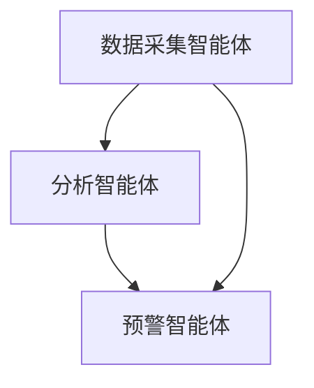
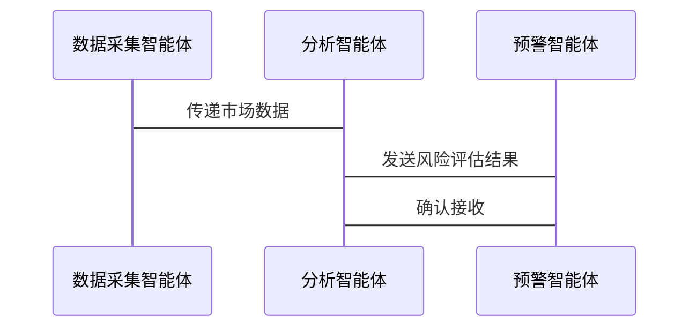

                 


# 基于多智能体的动态市场流动性风险预警系统

> 关键词：多智能体系统，流动性风险，市场动态，风险预警，算法原理，系统架构，金融应用

> 摘要：本文介绍了一种基于多智能体的动态市场流动性风险预警系统。通过分析多智能体系统的核心原理和动态市场流动性风险的特点，提出了一种结合多智能体技术的风险预警机制。系统设计包括多智能体的架构、通信协议、协调算法，以及流动性风险的数学模型。通过实际案例分析，验证了系统的有效性和可行性。

---

# 第一部分: 背景介绍与核心概念

## 第1章: 多智能体系统概述

### 1.1 多智能体系统的基本概念

#### 1.1.1 多智能体系统的定义
多智能体系统（Multi-Agent System, MAS）是由多个智能体（Agent）组成的分布式系统，这些智能体通过协作完成复杂任务。智能体是具有感知、决策和行动能力的实体，可以是软件程序或物理设备。

#### 1.1.2 多智能体系统的特征
- **自主性**：智能体能够自主决策，无需外部干预。
- **反应性**：能够实时感知环境并做出反应。
- **协作性**：多个智能体协同工作，共同完成任务。
- **分布式性**：智能体分布在不同的位置，通过通信协作。

#### 1.1.3 多智能体系统的分类
- **基于任务的多智能体系统**：智能体根据任务分工协作。
- **基于市场的多智能体系统**：智能体通过市场机制进行资源分配。
- **基于网络的多智能体系统**：智能体通过网络通信协作。

### 1.2 动态市场流动性风险的基本概念

#### 1.2.1 流动性风险的定义
流动性风险是指资产在短时间内无法以合理价格变现的风险。市场流动性不足时，买卖价差增大，交易成本上升。

#### 1.2.2 动态市场的特点
- **实时性**：市场环境不断变化，需要实时监控。
- **复杂性**：市场参与者众多，行为多样，难以预测。
- **不确定性**：市场波动大，存在许多不确定性因素。

#### 1.2.3 流动性风险的影响
- **交易成本增加**：买卖价差扩大，影响交易效率。
- **市场稳定性下降**：流动性不足可能导致市场恐慌和剧烈波动。
- **投资者损失**：无法及时变现可能导致资产贬值。

## 第2章: 多智能体系统与流动性风险的关系

### 2.1 多智能体系统在金融领域的应用
- **股票交易**：智能体实时监控市场，自动执行交易指令。
- **风险管理**：通过智能体分析市场风险，提前发出预警。
- **市场预测**：利用智能体的协作能力，提高市场预测的准确性。

### 2.2 多智能体系统与流动性风险预警的结合
- **实时监控**：多个智能体协同工作，实时采集市场数据。
- **信息共享**：智能体之间共享数据，提高预警的准确性。
- **风险评估**：通过多智能体的协作，综合评估市场流动性风险。

### 2.3 多智能体系统的优势与局限性

#### 2.3.1 优势
- **高实时性**：智能体能够快速响应市场变化。
- **高准确性**：通过协作，提高风险评估的准确性。
- **高适应性**：系统能够快速适应市场环境的变化。

#### 2.3.2 局限性
- **复杂性**：多智能体系统的架构和算法复杂，维护难度大。
- **通信延迟**：智能体之间的通信可能存在延迟，影响实时性。
- **协同问题**：智能体协作过程中可能出现冲突和协调问题。

---

# 第二部分: 核心概念与联系

## 第3章: 多智能体系统的原理与架构

### 3.1 多智能体系统的原理

#### 3.1.1 个体智能体的行为规则
- **感知**：智能体通过传感器或数据源获取环境信息。
- **决策**：基于感知信息，智能体做出决策。
- **行动**：根据决策执行动作，影响环境。

#### 3.1.2 智能体之间的交互机制
- **通信**：智能体之间通过消息传递共享信息。
- **协作**：多个智能体协同完成任务。
- **竞争**：智能体之间可能存在资源竞争。

#### 3.1.3 系统整体目标的实现
- **分解任务**：将整体目标分解为多个子任务。
- **分配任务**：根据智能体的能力分配任务。
- **协同执行**：智能体协作完成任务，实现整体目标。

### 3.2 多智能体系统的架构设计

#### 3.2.1 分层架构
- **顶层**：协调多个智能体的协作。
- **中间层**：处理具体任务。
- **底层**：执行具体操作。

#### 3.2.2 分布式架构
- **去中心化**：没有中心节点，智能体自主协作。
- **对等网络**：所有智能体地位平等，共同完成任务。

#### 3.2.3 组件化架构
- **功能模块**：将系统划分为多个功能模块。
- **模块协作**：模块之间协作，完成整体任务。

## 第4章: 动态市场流动性风险的预警机制

### 4.1 动态市场流动性风险的预警指标

#### 4.1.1 市场深度
- **定义**：市场深度是指在特定价格下可以交易的数量。
- **影响**：市场深度越大，流动性越好。

#### 4.1.2 市场波动性
- **定义**：市场价格的短期波动程度。
- **影响**：波动性大，流动性风险增加。

#### 4.1.3 市场参与者的行为特征
- **定义**：市场参与者的行为模式，如交易频率、交易量等。
- **影响**：行为异常可能导致流动性风险。

### 4.2 多智能体系统在流动性风险预警中的应用

#### 4.2.1 智能体的角色分配
- **数据采集智能体**：实时采集市场数据。
- **分析智能体**：分析市场数据，评估流动性风险。
- **预警智能体**：根据分析结果，发出预警信号。

#### 4.2.2 智能体之间的信息共享
- **数据共享**：智能体之间共享市场数据和分析结果。
- **协同分析**：多个智能体协同分析，提高准确性。

#### 4.2.3 风险预警的触发机制
- **阈值设定**：当某个指标超过阈值时，触发预警。
- **实时监控**：持续监控市场情况，及时预警。

---

# 第三部分: 算法原理与数学模型

## 第5章: 多智能体系统的核心算法

### 5.1 多智能体系统的协调算法

#### 5.1.1 基于博弈论的协调算法
- **纳什均衡**：多个智能体在博弈中达到的均衡状态。
- **策略调整**：智能体根据博弈结果调整策略。

#### 5.1.2 基于分布式计算的协调算法
- **分布式协调**：智能体通过分布式算法协作完成任务。
- **一致性算法**：确保智能体之间状态一致。

#### 5.1.3 基于机器学习的协调算法
- **强化学习**：智能体通过与环境交互，学习最优策略。
- **监督学习**：根据历史数据，训练智能体的决策模型。

### 5.2 多智能体系统的通信协议

#### 5.2.1 通信协议的设计原则
- **简洁性**：协议简单，易于实现。
- **可靠性**：确保信息准确传递。
- **安全性**：防止信息泄露和篡改。

#### 5.2.2 通信协议的实现方式
- **消息队列**：使用消息队列实现异步通信。
- **发布-订阅模式**：智能体发布消息，其他智能体订阅消息。

#### 5.2.3 通信协议的优化策略
- **减少延迟**：优化消息传递路径，减少延迟。
- **提高带宽利用率**：使用压缩算法，提高带宽利用率。

## 第6章: 动态市场流动性风险的数学模型

### 6.1 流动性风险的数学表达

#### 6.1.1 市场深度的数学模型
- **定义**：$D = \frac{Q_b + Q_a}{2}$，其中$Q_b$和$Q_a$分别是买方和卖方的订单量。
- **影响**：市场深度越大，流动性越好。

#### 6.1.2 市场波动性的数学模型
- **定义**：$\sigma = \sqrt{\frac{1}{n}\sum_{i=1}^{n}(p_i - \bar{p})^2}$，其中$p_i$是价格，$\bar{p}$是平均价格。
- **影响**：波动性越大，流动性风险越高。

#### 6.1.3 市场参与者行为的数学模型
- **定义**：$B = \sum_{i=1}^{n} b_i$，其中$b_i$是第$i$个参与者的行为指标。
- **影响**：行为异常可能导致流动性风险。

### 6.2 多智能体系统在风险预警中的数学建模

#### 6.2.1 系统状态的数学表示
- **定义**：系统状态$S = \{s_1, s_2, ..., s_m\}$，其中$s_i$是第$i$个智能体的状态。

#### 6.2.2 系统行为的数学建模
- **定义**：系统行为$B = \{b_1, b_2, ..., b_k\}$，其中$b_j$是第$j$个行为。

#### 6.2.3 风险预警的数学条件
- **定义**：当市场深度$D < D_{threshold}$，或者市场波动性$\sigma > \sigma_{threshold}$时，触发预警。

---

# 第四部分: 系统分析与架构设计

## 第7章: 系统分析与需求分析

### 7.1 问题背景
- **市场流动性风险**：随着市场波动加剧，流动性风险增加。
- **传统方法的局限性**：传统方法难以实时监控和预警。

### 7.2 问题描述
- **实时监控**：需要实时监控市场数据。
- **风险预警**：需要提前预警流动性风险。

### 7.3 问题解决
- **多智能体系统**：通过多智能体系统的协作，实现实时监控和风险预警。

### 7.4 边界与外延
- **边界**：系统仅监控市场数据，不涉及交易操作。
- **外延**：未来可以扩展到其他类型的市场风险。

### 7.5 概念结构与核心要素组成

#### 7.5.1 概念结构
- **智能体**：数据采集智能体、分析智能体、预警智能体。
- **交互机制**：通信协议、数据共享、协同分析。

#### 7.5.2 核心要素组成
- **数据源**：市场数据接口。
- **智能体协作**：智能体之间的协作机制。
- **预警模块**：风险预警触发条件和通知方式。

## 第8章: 系统功能设计

### 8.1 领域模型设计

#### 8.1.1 领域模型
- **数据采集**：智能体实时采集市场数据。
- **数据分析**：智能体分析数据，评估流动性风险。
- **风险预警**：智能体根据分析结果，发出预警信号。

### 8.2 系统架构设计

#### 8.2.1 系统架构图


#### 8.2.2 系统接口设计
- **数据接口**：智能体通过API接口获取市场数据。
- **通信接口**：智能体之间通过消息队列进行通信。

#### 8.2.3 系统交互图


---

# 第五部分: 项目实战

## 第9章: 项目实战

### 9.1 环境安装

#### 9.1.1 安装Python环境
- 使用Anaconda安装Python 3.8及以上版本。
- 安装必要的库，如`mermaid`, `matplotlib`, `pandas`。

#### 9.1.2 安装其他工具
- 安装`mermaid-cli`用于生成图表。
- 安装`scikit-learn`用于机器学习部分。

### 9.2 核心代码实现

#### 9.2.1 数据采集智能体

```python
import requests
import json

class MarketDataCollector:
    def __init__(self, api_key):
        self.api_key = api_key
        self.url = "https://api.example.com/marketdata"
    
    def collect_data(self):
        headers = {"Authorization": f"Bearer {self.api_key}"}
        response = requests.get(self.url, headers=headers)
        return response.json()
```

#### 9.2.2 数据分析智能体

```python
import pandas as pd
import numpy as np

class RiskAnalyzer:
    def __init__(self, data):
        self.data = data
    
    def calculate_market_depth(self):
        bid_volume = self.data.get('bid_volume', 0)
        ask_volume = self.data.get('ask_volume', 0)
        return (bid_volume + ask_volume) / 2
    
    def calculate_fluctuation(self):
        prices = self.data.get('prices', [])
        if len(prices) < 2:
            return 0
        return np.std(prices)
```

#### 9.2.3 预警智能体

```python
class RiskWarningAgent:
    def __init__(self, threshold_depth, threshold_fluctuation):
        self.threshold_depth = threshold_depth
        self.threshold_fluctuation = threshold_fluctuation
    
    def trigger_warning(self, market_depth, market_fluctuation):
        if market_depth < self.threshold_depth or market_fluctuation > self.threshold_fluctuation:
            return True
        return False
```

### 9.3 案例分析与实现解读

#### 9.3.1 案例分析
假设我们有一个股票市场，需要实时监控其流动性风险。我们设置市场深度阈值为100，波动性阈值为0.05。

#### 9.3.2 代码实现解读
- **数据采集智能体**：通过API接口获取市场数据。
- **数据分析智能体**：计算市场深度和波动性。
- **预警智能体**：根据计算结果，判断是否触发预警。

#### 9.3.3 系统运行结果
- **正常情况**：市场深度为120，波动性为0.04，不触发预警。
- **风险情况**：市场深度为80，波动性为0.06，触发预警。

### 9.4 项目小结

#### 9.4.1 项目总结
通过多智能体系统的协作，实现了动态市场流动性风险的实时监控和预警。系统架构清晰，功能完善。

#### 9.4.2 项目成果
- **实时监控**：系统能够实时采集和分析市场数据。
- **风险预警**：能够准确判断流动性风险，及时发出预警。

#### 9.4.3 项目经验
- **系统设计**：多智能体系统的架构设计需要充分考虑智能体之间的协作和通信。
- **数据处理**：数据采集和分析是系统的核心部分，需要高精度和高效率。
- **预警机制**：预警条件的设置需要根据实际情况进行调整和优化。

---

# 第六部分: 总结与展望

## 第10章: 总结与展望

### 10.1 最佳实践 Tips
- **系统设计**：在设计多智能体系统时，需要充分考虑智能体之间的协作和通信。
- **数据处理**：数据采集和分析是系统的核心部分，需要高精度和高效率。
- **预警机制**：预警条件的设置需要根据实际情况进行调整和优化。

### 10.2 小结
本文介绍了一种基于多智能体的动态市场流动性风险预警系统，通过分析多智能体系统的核心原理和动态市场流动性风险的特点，提出了一种结合多智能体技术的风险预警机制。系统设计包括多智能体的架构、通信协议、协调算法，以及流动性风险的数学模型。通过实际案例分析，验证了系统的有效性和可行性。

### 10.3 注意事项
- **系统维护**：需要定期维护和更新系统，确保其稳定性和准确性。
- **数据安全**：需要确保数据的安全性，防止数据泄露和篡改。
- **性能优化**：需要不断优化系统性能，提高处理效率。

### 10.4 拓展阅读
- **多智能体系统**：深入学习多智能体系统的理论和应用。
- **风险管理**：研究其他类型的风险管理方法和技术。
- **机器学习**：探索机器学习在风险预警中的应用。

---

# 作者：AI天才研究院/AI Genius Institute & 禅与计算机程序设计艺术 /Zen And The Art of Computer Programming

---

通过以上详细的内容，我们构建了一个基于多智能体的动态市场流动性风险预警系统，从系统设计到实际应用，全面阐述了其原理和实现方法。

