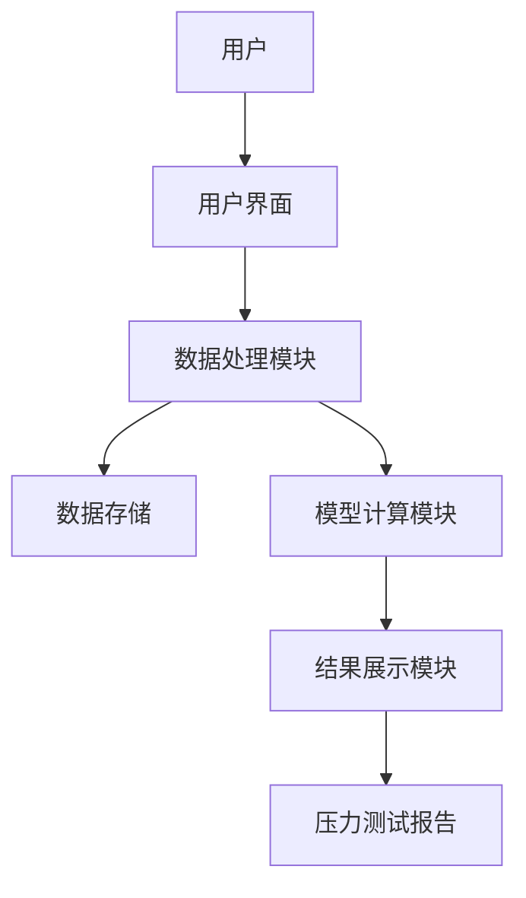
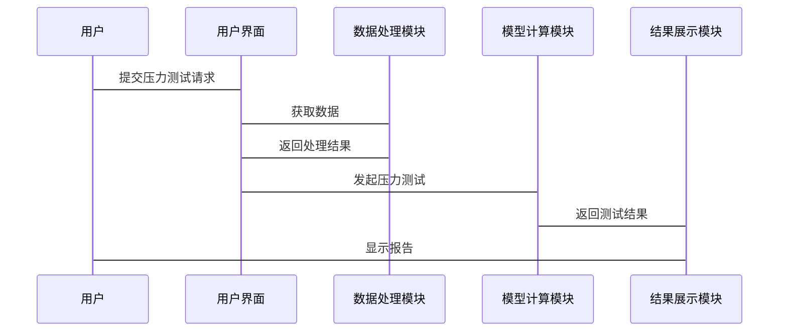

                 


# 基于多智能体的自动化公司财务压力测试系统

> 关键词：多智能体系统、财务压力测试、自动化、分布式计算、博弈论模型、系统架构设计

> 摘要：本文详细探讨了基于多智能体的自动化公司财务压力测试系统的构建与实现。从多智能体系统的定义与核心概念出发，分析了其在财务压力测试中的应用价值，重点阐述了多智能体系统的通信机制、协作算法及压力测试模型的设计与优化。通过实际案例分析，展示了如何利用多智能体系统实现高效的财务压力测试，并总结了系统设计与实现中的关键点和最佳实践。

---

# 第1章: 财务压力测试与多智能体系统概述

## 1.1 财务压力测试的背景与意义

### 1.1.1 什么是财务压力测试
财务压力测试是一种评估公司或机构在极端市场条件下财务健康状况的方法。它通过模拟不同假设情景（如经济衰退、市场波动等），分析公司财务状况的变化，从而评估其在压力环境下的抗风险能力。

### 1.1.2 财务压力测试的目的与作用
- **目的**：评估公司在极端市场条件下的财务稳定性，发现潜在风险点，制定应对策略。
- **作用**：帮助公司优化资本结构、制定风险管理策略、提高财务抗风险能力。

### 1.1.3 多智能体系统在财务压力测试中的应用价值
- **多智能体系统的优势**：
  - 能够模拟复杂的市场环境和多主体之间的交互。
  - 通过分布式计算提高测试效率，降低单点故障风险。
  - 可以实时动态调整测试参数，提高测试的灵活性和准确性。

## 1.2 多智能体系统的定义与特点

### 1.2.1 多智能体系统的定义
多智能体系统（Multi-Agent System, MAS）是由多个智能体（Agent）组成的分布式系统，每个智能体都是能够感知环境、自主决策、并与其他智能体或用户交互的实体。

### 1.2.2 多智能体系统的特征
- **自主性**：每个智能体都能够自主决策。
- **反应性**：能够实时感知环境变化并做出反应。
- **协作性**：智能体之间能够协同合作，共同完成任务。
- **分布式性**：系统由多个分布在不同位置的智能体组成。

### 1.2.3 多智能体系统与传统单智能体系统的区别
| 特性         | 多智能体系统                | 单智能体系统                |
|--------------|----------------------------|-----------------------------|
| 结构         | 分布式，多个智能体协作      | 集中式，单个主体决策        |
| 决策机制     | 分布式决策，智能体间协商    | 中央决策，单一决策主体      |
| 效率         | 高，任务分解能力强          | 较低，依赖单点决策           |
| 稳定性       | 较高，单个智能体故障不影响整体| 较低，单点故障可能导致系统崩溃|

## 1.3 本章小结
本章介绍了财务压力测试的重要性和多智能体系统的基本概念，强调了多智能体系统在财务压力测试中的应用价值。多智能体系统通过其分布式、协作式的特性，能够更高效、更准确地模拟复杂的市场环境，为财务压力测试提供了新的解决方案。

---

# 第2章: 多智能体系统的结构与通信机制

## 2.1 多智能体系统的组成结构

### 2.1.1 智能体的基本结构
每个智能体都包含以下基本组件：
- **感知器**：感知环境信息。
- **推理器**：对感知信息进行分析和推理。
- **决策器**：基于推理结果做出决策。
- **执行器**：将决策转化为具体行动。

### 2.1.2 多智能体系统的层次结构
- **物理层**：智能体与物理环境的交互接口。
- **智能体层**：多个智能体协作完成任务。
- **协调层**：负责智能体之间的协调与通信。
- **应用层**：提供用户界面和应用功能。

### 2.1.3 智能体之间的关系与交互
智能体之间的关系可以是竞争、协作或混合型。在财务压力测试中，通常需要智能体之间进行协作，共同模拟市场环境和公司财务行为。

## 2.2 多智能体系统的通信机制

### 2.2.1 通信协议的定义与作用
通信协议定义了智能体之间信息交换的格式、规则和流程。其作用包括：
- 确保信息传递的准确性和可靠性。
- 提供智能体之间的互操作性。
- 支持分布式计算和协作任务。

### 2.2.2 常见的通信方式
- **直接通信**：智能体之间直接交换信息。
- **间接通信**：通过中间代理或消息队列进行通信。
- **发布-订阅模式**：智能体发布信息，其他智能体订阅感兴趣的信息。

### 2.2.3 通信中的数据格式与处理
- **数据格式**：通常采用JSON或XML格式进行数据交换。
- **数据处理**：需要对数据进行解析、验证和转换，确保数据的准确性和一致性。

---

# 第3章: 多智能体系统的协作与决策机制

## 3.1 协作式决策的基本原理

### 3.1.1 协作式决策的定义
协作式决策是指多个智能体通过协作和协商，共同制定决策的过程。

### 3.1.2 协作式决策的关键要素
- **信息共享**：智能体之间需要共享必要的信息。
- **协商机制**：通过协商确定最终决策。
- **冲突解决**：处理智能体之间的冲突和矛盾。

### 3.1.3 协作式决策的实现方式
- **基于博弈论的决策**：通过模拟博弈过程，找到最优解。
- **基于分布式计算的决策**：利用分布式计算技术，实现协作式决策。

## 3.2 分布式计算与多智能体系统的结合

### 3.2.1 分布式计算的基本概念
分布式计算是指将计算任务分发到多个计算节点上，通过协作完成任务。

### 3.2.2 多智能体系统中的分布式计算
在多智能体系统中，分布式计算用于实现智能体之间的协作和任务分配。

### 3.2.3 分布式计算对多智能体系统性能的影响
- **优点**：提高系统的并行计算能力，降低单点故障风险。
- **缺点**：增加了系统的复杂性，需要更高的通信和协调成本。

---

# 第4章: 自动化财务压力测试系统的需求分析

## 4.1 系统的功能需求

### 4.1.1 数据采集与处理
- 数据来源：公司财务数据、市场数据、宏观经济指标等。
- 数据处理：数据清洗、特征提取、数据标准化。

### 4.1.2 模型构建与模拟
- 模型选择：基于历史数据建立压力测试模型。
- 模型模拟：模拟不同市场情景下的公司财务状况。

### 4.1.3 结果分析与报告生成
- 结果分析：评估公司在不同情景下的财务健康状况。
- 报告生成：生成压力测试报告，提出风险管理建议。

## 4.2 系统的性能需求

### 4.2.1 处理速度与效率
- 高效的数据处理能力。
- 快速的模型计算能力。

### 4.2.2 系统的可扩展性
- 支持扩展智能体数量。
- 支持新增压力测试情景。

### 4.2.3 系统的稳定性和可靠性
- 高可用性设计。
- 容错机制。

---

# 第5章: 系统的算法设计与实现

## 5.1 多智能体协同算法

### 5.1.1 多智能体协同的基本算法
- **分布式协同算法**：基于分布式计算的协同算法。
- **基于博弈论的协同算法**：通过模拟博弈过程实现协同。

### 5.1.2 基于博弈论的多智能体协作算法
- **博弈模型构建**：定义智能体的策略空间和收益函数。
- **博弈求解**：通过纳什均衡等方法求解最优策略。

### 5.1.3 分布式计算在多智能体协作中的应用
- **任务分配**：将任务分解为多个子任务，分发给不同的智能体执行。
- **结果汇总**：将子任务结果汇总，得到最终结果。

## 5.2 压力测试模型的构建与优化

### 5.2.1 数据预处理与特征提取
- 数据清洗：去除异常值和缺失值。
- 特征提取：提取对公司财务状况影响的关键特征。

### 5.2.2 模型的选择与训练
- 模型选择：选择适合压力测试的模型（如回归模型、时间序列模型等）。
- 模型训练：利用历史数据训练模型。

### 5.2.3 模型的优化与调参
- 参数调整：通过交叉验证等方法优化模型参数。
- 模型评估：评估模型的准确性和稳定性。

---

# 第6章: 系统架构与项目实战

## 6.1 系统架构设计

### 6.1.1 系统功能设计
- **用户界面**：提供友好的用户界面，方便用户操作。
- **数据处理模块**：负责数据的采集、处理和存储。
- **模型计算模块**：负责压力测试模型的构建和计算。
- **结果展示模块**：展示压力测试结果和报告。

### 6.1.2 系统架构图


### 6.1.3 系统接口设计
- **输入接口**：接收用户输入的压力测试情景参数。
- **输出接口**：输出压力测试结果和报告。

### 6.1.4 系统交互流程


## 6.2 项目实战

### 6.2.1 环境安装
- **Python 3.8+**
- **Jupyter Notebook**
- **NumPy, Pandas, Scikit-learn**

### 6.2.2 核心代码实现
```python
import numpy as np
import pandas as pd
from sklearn.model_selection import train_test_split
from sklearn.linear_model import LinearRegression

# 数据加载与处理
data = pd.read_csv('financial_data.csv')
X = data[['revenue', 'profit', 'debt']]
y = data['score']

# 数据分割
X_train, X_test, y_train, y_test = train_test_split(X, y, test_size=0.2, random_state=42)

# 模型训练
model = LinearRegression()
model.fit(X_train, y_train)

# 模型预测
y_pred = model.predict(X_test)
print('Predictions:', y_pred)
```

### 6.2.3 案例分析
假设我们有一个公司，其财务数据如下：
- 收入：1000万元
- 利润：200万元
- 债务：500万元

通过压力测试模型，模拟在经济衰退情景下，公司收入下降20%，利润下降30%，债务增加10%。预测公司的财务评分将从原来的7分下降到4分，提示公司需要采取措施应对潜在的财务风险。

---

# 第7章: 系统优化与最佳实践

## 7.1 系统优化
- **性能优化**：通过并行计算和优化算法提高系统效率。
- **可扩展性优化**：设计模块化架构，支持系统的扩展。

## 7.2 最佳实践
- **数据质量管理**：确保数据的准确性和完整性。
- **模型选择与优化**：选择适合的模型，并进行充分的验证和调优。
- **系统安全性**：确保系统的安全性和数据的保密性。

## 7.3 注意事项
- **数据隐私**：注意保护公司的财务数据隐私。
- **模型局限性**：认识到模型的局限性，避免过度依赖模型结果。

## 7.4 拓展阅读
- 推荐阅读《Multi-Agent Systems: Algorithmic, Complexity Theoretic, and Game Theoretic Foundations》和《Financial Risk Management: From Theory to Practice》。

---

# 第8章: 结论

## 8.1 本章总结
本文详细探讨了基于多智能体的自动化公司财务压力测试系统的构建与实现。通过分析多智能体系统的结构和通信机制，设计了高效的财务压力测试算法，并通过实际案例展示了系统的应用。

## 8.2 未来展望
未来，随着人工智能和分布式计算技术的不断发展，多智能体系统在财务压力测试中的应用将更加广泛和深入。可以通过引入更复杂的博弈模型和强化学习算法，进一步提高系统的智能化水平和预测准确性。

---

# 作者

**作者：AI天才研究院/AI Genius Institute & 禅与计算机程序设计艺术 /Zen And The Art of Computer Programming**

---

以上是基于多智能体的自动化公司财务压力测试系统的技术博客文章的完整大纲和内容。

