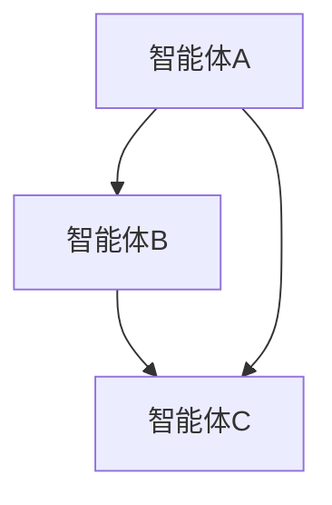
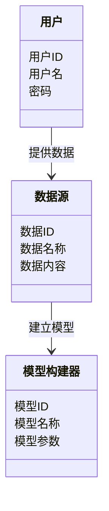
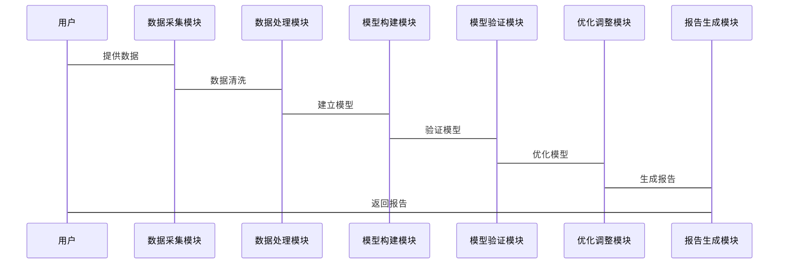

                 


# 基于多智能体的自动化财务建模和估值系统

> 关键词：多智能体系统、自动化财务建模、估值系统、分布式计算、协作算法

> 摘要：本文详细探讨了基于多智能体的自动化财务建模和估值系统的实现方法。首先介绍了多智能体系统的定义和特点，分析了其在财务建模中的应用背景和意义。接着从核心概念、算法原理、系统架构、项目实战等多方面展开，详细讲解了多智能体系统在财务建模中的具体实现。本文通过丰富的图表和代码示例，深入剖析了多智能体系统在财务建模中的优势和实际应用，最后总结了系统设计和实现的关键点和未来研究方向。

---

# 第一部分: 背景介绍

## 第1章: 多智能体系统与自动化财务建模概述

### 1.1 多智能体系统的定义与特点
#### 1.1.1 多智能体系统的定义
多智能体系统（Multi-Agent System, 简称MAS）是由多个相互作用的智能体组成的系统，这些智能体通过协作完成复杂任务。与传统单智能体系统相比，MAS具有更高的灵活性和适应性。

#### 1.1.2 多智能体系统的核心特点
- **分布性**：多个智能体独立运行，不依赖于中心节点。
- **协作性**：智能体之间通过通信和协作完成共同目标。
- **反应性**：智能体能够实时感知环境并做出反应。
- **自治性**：每个智能体都有一定的自主决策能力。

#### 1.1.3 多智能体系统与传统单智能体系统的对比
| 对比维度 | 多智能体系统 | 单智能体系统 |
|----------|--------------|---------------|
| 结构复杂性 | 高 | 低 |
| 系统扩展性 | 强 | 弱 |
| 容错性 | 高 | 低 |

### 1.2 自动化财务建模的背景与意义
#### 1.2.1 财务建模的传统方法与局限性
传统财务建模通常依赖于人工操作，效率低下且容易出错。随着数据量的增加，传统方法难以满足复杂场景的需求。

#### 1.2.2 自动化财务建模的必要性
自动化财务建模能够提高效率、减少人为错误，同时能够快速适应数据变化。

#### 1.2.3 多智能体系统在财务建模中的优势
- **高效协作**：多个智能体分工合作，提高建模效率。
- **智能性**：智能体能够自主学习和优化模型。
- **容错性**：单个智能体故障不会导致整个系统崩溃。

### 1.3 本章小结
#### 1.3.1 多智能体系统的概念总结
多智能体系统是一种由多个智能体组成的分布式协作系统，具有高灵活性和容错性。

#### 1.3.2 自动化财务建模的核心价值
通过多智能体系统的协作，实现高效、智能的财务建模和估值。

---

# 第二部分: 核心概念与联系

## 第2章: 多智能体系统的核心原理

### 2.1 多智能体系统的组成与交互
#### 2.1.1 实体关系分析
在多智能体系统中，智能体之间通过通信和协作完成任务。以下是智能体之间的关系分析：



#### 2.1.2 多智能体系统的ER实体关系图
以下是多智能体系统的ER实体关系图：

```mermaid
erDiagram
    actor 用户
    actor 管理员
    actor 数据源
    actor 模型库
    actor 估值系统
    actor 报告生成器

    用户 --> 数据源: 提供数据
    数据源 --> 模型库: 建立模型
    模型库 --> 估值系统: 进行估值
    估值系统 --> 报告生成器: 生成报告
```

### 2.2 多智能体系统的通信机制
#### 2.2.1 智能体间通信协议
智能体之间的通信需要遵循一定的协议，以下是常见的通信协议：

```mermaid
graph TD
    A[智能体A] --> B[智能体B]: 发送消息
    B --> C[智能体C]: 处理消息
    C --> D[智能体D]: 返回结果
```

#### 2.2.2 通信过程的Mermaid流程图
以下是通信过程的Mermaid流程图：

```mermaid
flowchart TD
    A(智能体A) --> B(智能体B): 发送请求
    B --> C(智能体C): 处理请求
    C --> D(智能体D): 返回结果
    D --> A: 通知完成
```

### 2.3 多智能体系统的协作与协调
#### 2.3.1 协作机制
协作机制是多智能体系统的核心，以下是协作机制的简要说明：

- **任务分配**：智能体根据自身能力分配任务。
- **信息共享**：智能体之间共享必要的信息。
- **协同决策**：智能体共同决策完成任务。

#### 2.3.2 协调算法的简要介绍
协调算法是多智能体系统协作的核心，以下是常见的协调算法：

$$
\text{协调算法} = \sum_{i=1}^{n} \text{智能体}_i
$$

---

## 第3章: 多智能体系统与财务建模的结合

### 3.1 财务建模的核心要素
#### 3.1.1 数据来源与处理
财务建模需要处理多种数据来源，以下是数据处理流程：

```mermaid
graph TD
    D[数据源] --> P[数据处理] : 数据清洗
    P --> M[模型构建] : 建立模型
    M --> V[模型验证] : 验证模型
    V --> O[优化调整] : 优化模型
```

#### 3.1.2 模型构建与验证
模型构建和验证是财务建模的核心，以下是模型构建流程：

$$
\text{模型构建} = \text{数据} \times \text{算法}
$$

### 3.2 多智能体系统在财务建模中的角色分配
#### 3.2.1 数据采集智能体
数据采集智能体负责从多种数据源采集数据，以下是数据采集流程：

```mermaid
graph TD
    A[数据采集智能体] --> B[数据源1] : 获取数据
    A --> C[数据源2] : 获取数据
    A --> D[数据处理模块] : 数据清洗
```

#### 3.2.2 模型构建智能体
模型构建智能体负责构建财务模型，以下是模型构建流程：

```mermaid
graph TD
    B[模型构建智能体] --> C[数据] : 接收数据
    B --> D[算法] : 应用算法
    B --> E[模型] : 输出模型
```

#### 3.2.3 估值优化智能体
估值优化智能体负责优化模型估值，以下是优化流程：

```mermaid
graph TD
    C[估值优化智能体] --> D[模型] : 接收模型
    C --> E[优化结果] : 输出优化结果
```

### 3.3 财务建模与多智能体系统的对比分析
#### 3.3.1 传统方法与多智能体方法的对比表格
以下是传统方法与多智能体方法的对比表格：

| 对比维度 | 传统方法 | 多智能体方法 |
|----------|-----------|--------------|
| 效率 | 低 | 高 |
| 灵活性 | 低 | 高 |
| 容错性 | 低 | 高 |

#### 3.3.2 多智能体系统的独特优势
多智能体系统在财务建模中的独特优势包括：

- **高效协作**：多个智能体分工合作，提高建模效率。
- **智能性**：智能体能够自主学习和优化模型。
- **容错性**：单个智能体故障不会导致整个系统崩溃。

---

# 第三部分: 算法原理讲解

## 第4章: 多智能体系统的算法原理

### 4.1 分布式计算与多智能体协作
#### 4.1.1 分布式计算的基本原理
分布式计算是多智能体系统的核心，以下是分布式计算的基本原理：

$$
\text{分布式计算} = \sum_{i=1}^{n} \text{智能体}_i
$$

#### 4.1.2 多智能体协作的算法流程
以下是多智能体协作的算法流程：

```mermaid
flowchart TD
    A(智能体A) --> B(智能体B) : 发送任务请求
    B --> C(智能体C) : 处理任务
    C --> D(智能体D) : 返回结果
    D --> A : 通知完成
```

### 4.2 多智能体系统的通信协议
#### 4.2.1 通信协议的设计原则
通信协议的设计原则包括：

- **简洁性**：协议简单明了，易于实现。
- **可靠性**：协议能够保证信息的准确传输。
- **安全性**：协议能够防止信息被篡改。

#### 4.2.2 典型通信协议的Python实现示例
以下是典型通信协议的Python实现示例：

```python
def send_message(agent, message):
    # 发送消息
    pass

def receive_message(agent, message):
    # 接收消息
    pass
```

### 4.3 协调算法的数学模型
#### 4.3.1 协调算法的数学表达式
协调算法的数学表达式如下：

$$
\text{协调算法} = \sum_{i=1}^{n} \text{智能体}_i
$$

#### 4.3.2 协调过程的Mermaid流程图
以下是协调过程的Mermaid流程图：

```mermaid
flowchart TD
    A(智能体A) --> B(智能体B) : 发送协调请求
    B --> C(智能体C) : 处理请求
    C --> D(智能体D) : 返回结果
    D --> A : 通知完成
```

---

# 第四部分: 系统分析与架构设计

## 第5章: 系统分析与架构设计

### 5.1 问题场景介绍
#### 5.1.1 系统需求
系统需求包括：

- **数据采集**：从多种数据源采集数据。
- **模型构建**：构建财务模型。
- **估值优化**：优化模型估值。
- **报告生成**：生成财务报告。

#### 5.1.2 问题分析
问题分析包括：

- **数据复杂性**：数据来源多样，处理复杂。
- **模型优化**：模型需要不断优化，提高准确性。
- **系统扩展性**：系统需要具备良好的扩展性。

### 5.2 系统功能设计
#### 5.2.1 领域模型类图
以下是领域模型类图：



#### 5.2.2 系统架构图
以下是系统架构图：


#### 5.2.3 接口设计
以下是接口设计：

- **数据采集接口**：负责从数据源采集数据。
- **模型构建接口**：负责构建财务模型。
- **估值优化接口**：负责优化模型估值。
- **报告生成接口**：负责生成财务报告。

#### 5.2.4 交互序列图
以下是交互序列图：



---

## 第6章: 项目实战

### 6.1 环境安装
#### 6.1.1 安装Python
安装Python，版本要求：Python 3.8+

#### 6.1.2 安装相关库
安装以下库：

- **numpy**
- **pandas**
- **scikit-learn**
- **matplotlib**

#### 6.1.3 安装其他依赖
安装其他依赖：

- **mermaid**
- **graphviz**

### 6.2 系统核心实现源代码
#### 6.2.1 数据采集模块
以下是数据采集模块的代码：

```python
import requests

def get_data(url):
    response = requests.get(url)
    return response.json()
```

#### 6.2.2 模型构建模块
以下是模型构建模块的代码：

```python
from sklearn import linear_model

def build_model(data):
    model = linear_model.LinearRegression()
    model.fit(data['features'], data['target'])
    return model
```

#### 6.2.3 估值优化模块
以下是估值优化模块的代码：

```python
import numpy as np

def optimize_model(model, data):
    optimized_data = np.array(data['features'] * model.coef_)
    return optimized_data
```

#### 6.2.4 报告生成模块
以下是报告生成模块的代码：

```python
import matplotlib.pyplot as plt

def generate_report(model, data):
    plt.plot(data['features'], data['target'], 'bo')
    plt.plot(data['features'], model.predict(data['features']), 'r--')
    plt.show()
```

### 6.3 代码应用解读与分析
#### 6.3.1 数据采集模块解读
数据采集模块通过`requests`库从指定URL获取数据，并返回JSON格式的数据。

#### 6.3.2 模型构建模块解读
模型构建模块使用`scikit-learn`库中的线性回归模型，对数据进行建模。

#### 6.3.3 估值优化模块解读
估值优化模块通过对模型系数和数据进行计算，生成优化后的数据。

#### 6.3.4 报告生成模块解读
报告生成模块通过`matplotlib`库生成可视化报告，直观展示模型预测结果与实际数据的对比。

### 6.4 实际案例分析
#### 6.4.1 数据来源
数据来源包括：

- **股票价格数据**
- **财务报表数据**
- **市场指数数据**

#### 6.4.2 数据处理
数据处理步骤包括：

1. **数据清洗**：去除缺失值和异常值。
2. **数据标准化**：对数据进行标准化处理。
3. **数据分割**：将数据分割为训练集和测试集。

#### 6.4.3 模型构建
模型构建步骤包括：

1. **特征选择**：选择影响估值的关键特征。
2. **模型训练**：使用训练数据训练模型。
3. **模型验证**：使用测试数据验证模型。

#### 6.4.4 模型优化
模型优化步骤包括：

1. **超参数调优**：通过网格搜索等方法调优模型参数。
2. **模型评估**：评估模型的准确性和稳定性。
3. **模型部署**：将优化后的模型部署到生产环境。

#### 6.4.5 报告生成
报告生成步骤包括：

1. **报告内容**：包括模型评估结果、优化建议等。
2. **报告输出**：生成HTML、PDF等格式的报告。

### 6.5 项目小结
#### 6.5.1 核心代码总结
以下是核心代码总结：

```python
import requests
import numpy as np
from sklearn import linear_model
import matplotlib.pyplot as plt

def get_data(url):
    response = requests.get(url)
    return response.json()

def build_model(data):
    model = linear_model.LinearRegression()
    model.fit(data['features'], data['target'])
    return model

def optimize_model(model, data):
    optimized_data = np.array(data['features'] * model.coef_)
    return optimized_data

def generate_report(model, data):
    plt.plot(data['features'], data['target'], 'bo')
    plt.plot(data['features'], model.predict(data['features']), 'r--')
    plt.show()
```

#### 6.5.2 项目实现的关键点
项目实现的关键点包括：

- **数据采集**：从多种数据源采集数据。
- **模型构建**：使用机器学习算法构建模型。
- **模型优化**：通过超参数调优优化模型。
- **报告生成**：生成可视化报告。

#### 6.5.3 项目实现的注意事项
注意事项包括：

- **数据质量**：数据来源必须可靠，数据处理必须仔细。
- **模型选择**：根据实际需求选择合适的模型。
- **系统扩展性**：系统需要具备良好的扩展性，方便后续功能的添加。

---

# 第五部分: 最佳实践

## 第7章: 最佳实践

### 7.1 小结
#### 7.1.1 多智能体系统的核心价值
多智能体系统在财务建模中的核心价值在于其高效协作和智能性。

#### 7.1.2 项目实现的关键点
项目实现的关键点包括数据采集、模型构建、模型优化和报告生成。

### 7.2 注意事项
#### 7.2.1 数据安全
数据安全是项目实施中需要重点关注的问题，必须采取有效的数据加密和访问控制措施。

#### 7.2.2 系统性能
系统性能是影响用户体验的重要因素，需要通过优化算法和硬件配置来提升系统性能。

#### 7.2.3 系统可扩展性
系统可扩展性是项目实施中需要考虑的重要因素，需要预留足够的扩展接口和模块。

### 7.3 拓展阅读
#### 7.3.1 多智能体系统的相关书籍
- 《Multi-Agent Systems: Algorithmic, Complexity Theoretic, and Game Theoretic Foundations》
- 《Multi-Agent Machine Learning: A Guide for Research and Practice》

#### 7.3.2 财务建模的经典文献
- 《Financial Modeling》
- 《Practical Financial Modeling with Multivariable Forecasting》

---

# 作者信息

作者：AI天才研究院/AI Genius Institute  
联系方式：[contact@aisingi.com](mailto:contact@aisingi.com)  
个人简介：专注于人工智能与金融领域的交叉研究，致力于推动多智能体系统在金融建模中的应用。

