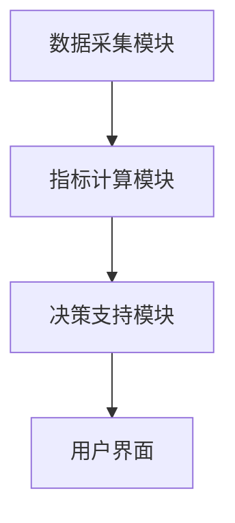
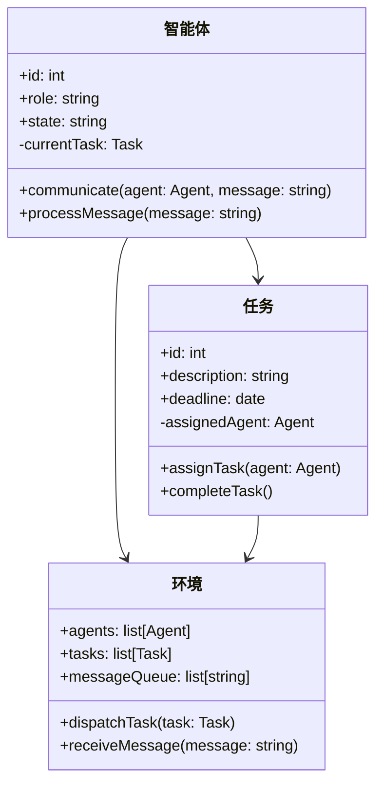
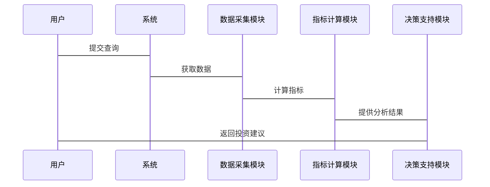

                 


# 基于多智能体的自适应经济周期指标在价值投资中的应用

关键词：多智能体系统，经济周期指标，价值投资，自适应分析，协同算法

摘要：本文探讨了多智能体系统在经济周期指标分析中的应用，重点介绍了自适应经济周期指标的定义、特点及其在价值投资中的具体应用场景。文章通过详细分析多智能体系统的协同机制，结合实际案例，展示了如何利用多智能体系统动态调整经济周期指标，从而优化投资决策。此外，文章还提供了系统架构设计、算法实现及代码示例，为读者提供了全面的技术指导。

---

## 第1章: 多智能体系统基础

### 1.1 多智能体系统的基本概念

#### 1.1.1 多智能体系统的定义
多智能体系统（Multi-Agent System, MAS）是由多个独立但协作的智能体组成的系统。这些智能体通过交互和协同完成复杂任务，通常用于模拟现实世界中的分布式问题。

#### 1.1.2 多智能体系统的结构与特点
- **结构**：由多个智能体、环境、通信机制和任务目标组成。
- **特点**：
  - 分布式计算
  - 异步性
  - 自适应性
  - 协作性

#### 1.1.3 多智能体系统与传统单智能体的区别
- **计算方式**：单智能体集中处理，多智能体分布式处理。
- **协作性**：单智能体独立，多智能体需要协作。
- **动态性**：多智能体系统更具动态性和适应性。

### 1.2 经济周期指标的基本概念

#### 1.2.1 经济周期的定义与特征
经济周期是指经济活动的波动，通常包括复苏、繁荣、衰退和萧条四个阶段。

#### 1.2.2 常见经济周期指标
- **GDP**：国内生产总值。
- **失业率**：劳动力市场的指标。
- **通胀率**：物价水平的指标。
- **PMI**：采购经理指数。

#### 1.2.3 经济周期指标的动态变化特征
经济指标会随着经济周期的变化而波动，具有动态性和复杂性。

---

## 第2章: 自适应经济周期指标的定义与特点

### 2.1 自适应经济周期指标的定义
自适应经济周期指标是指能够根据经济环境的变化动态调整的指标。

### 2.2 自适应经济周期指标的核心属性
- **动态性**：实时更新。
- **自适应性**：根据环境变化调整。
- **协作性**：多个指标协同分析。

### 2.3 自适应经济周期指标与传统经济周期指标的区别
- **传统指标**：静态、固定。
- **自适应指标**：动态、灵活。

---

## 第3章: 多智能体系统在经济周期指标分析中的应用

### 3.1 多智能体系统在经济周期指标分析中的优势
- **分布式计算**：提高计算效率。
- **协作性**：多个智能体协同分析。
- **动态调整**：实时更新指标。

### 3.2 多智能体系统如何协同分析经济周期指标
- **任务分配**：智能体分工协作。
- **通信机制**：智能体之间实时通信。
- **协同算法**：实现指标的动态调整。

### 3.3 多智能体系统在经济周期指标分析中的应用场景
- **经济预测**：预测经济走势。
- **投资决策**：优化投资策略。
- **风险管理**：降低投资风险。

---

## 第4章: 多智能体系统的协同机制

### 4.1 多智能体系统的协作原理
智能体通过通信和协作完成任务，通常采用分布式计算和事件驱动的方式。

### 4.2 多智能体系统的通信机制
- **直接通信**：智能体之间直接交换信息。
- **间接通信**：通过中间媒介传递信息。

### 4.3 多智能体系统的任务分配与协同策略
- **任务分配**：基于智能体的能力分配任务。
- **协同策略**：智能体之间协调完成任务。

---

## 第5章: 经济周期指标的自适应分析方法

### 5.1 经济周期指标的动态调整方法
- **实时更新**：根据最新数据调整指标。
- **权重调整**：根据经济环境变化调整指标权重。

### 5.2 经济周期指标的多维度分析
- **多指标分析**：综合多个指标进行分析。
- **层次分析**：从宏观到微观进行分析。

### 5.3 经济周期指标的实时更新与反馈机制
- **实时数据采集**：获取最新经济数据。
- **反馈机制**：根据结果调整分析策略。

---

## 第6章: 多智能体系统与经济周期指标的协同算法

### 6.1 协同算法的基本原理
协同算法通过智能体之间的协作完成经济指标的分析和调整。

### 6.2 协同算法的实现步骤
1. 数据采集：获取经济指标数据。
2. 数据预处理：清洗和标准化数据。
3. 指标分析：计算经济指标。
4. 动态调整：根据环境变化调整指标。

### 6.3 协同算法的优化与改进
- **算法优化**：提高计算效率。
- **模型改进**：增强自适应能力。

---

## 第7章: 价值投资的基本原理

### 7.1 价值投资的定义与核心理念
价值投资是通过分析企业的内在价值，寻找被市场低估的投资机会。

### 7.2 价值投资的关键要素
- **内在价值**：企业的实际价值。
- **市场价格**：市场的交易价格。
- **安全边际**：价格与价值的差异。

### 7.3 价值投资的策略与方法
- **基本面分析**：分析企业的财务状况。
- **估值方法**：计算企业的内在价值。

---

## 第8章: 多智能体系统在价值投资中的应用

### 8.1 多智能体系统在价值投资中的优势
- **分布式计算**：提高分析效率。
- **协作性**：多个智能体协同分析。
- **动态调整**：实时更新分析结果。

### 8.2 多智能体系统如何支持价值投资决策
- **数据采集**：获取企业的财务数据。
- **指标分析**：计算企业的内在价值。
- **决策支持**：提供投资建议。

### 8.3 多智能体系统在价值投资中的具体应用场景
- **企业估值**：计算企业的内在价值。
- **投资决策**：优化投资策略。
- **风险管理**：降低投资风险。

---

## 第9章: 自适应经济周期指标在价值投资中的具体应用

### 9.1 自适应经济周期指标在投资决策中的作用
- **经济预测**：预测经济走势，指导投资决策。
- **行业分析**：分析行业发展趋势。
- **企业估值**：动态调整企业的内在价值。

### 9.2 自适应经济周期指标如何影响投资策略
- **经济周期变化**：根据经济周期调整投资策略。
- **行业波动**：根据行业趋势调整投资组合。
- **企业风险**：根据经济环境变化评估企业风险。

### 9.3 自适应经济周期指标在投资组合管理中的应用
- **资产配置**：根据经济周期调整资产配置。
- **风险控制**：根据经济环境变化控制投资风险。

---

## 第10章: 系统架构设计

### 10.1 系统应用场景介绍
- **经济预测**：预测经济走势。
- **投资决策**：优化投资策略。
- **风险管理**：降低投资风险。

### 10.2 系统功能模块设计
- **数据采集模块**：采集经济指标数据。
- **指标计算模块**：计算经济指标。
- **决策支持模块**：提供投资建议。

### 10.3 系统架构设计图



---

## 第11章: 系统功能设计

### 11.1 领域模型设计



---

## 第12章: 系统架构设计

### 12.1 系统架构设计


---

## 第13章: 系统接口设计

### 13.1 系统接口设计
- **数据接口**：与数据源对接。
- **计算接口**：与指标计算模块对接。
- **用户接口**：与用户界面对接。

### 13.2 系统交互设计



---

## 第14章: 项目实战

### 14.1 环境安装
- 安装Python和必要的库（numpy、pandas、scikit-learn）。
- 配置开发环境。

### 14.2 核心代码实现

```python
import numpy as np
import pandas as pd
from sklearn.metrics import pairwise_distances

def adaptive_economic_indicator(data, window_size=10):
    # 计算移动平均值
    moving_avg = data.rolling(window_size).mean()
    # 计算动态时间 warping
    dtw = pairwise_distances(moving_avg.values, moving_avg.values)
    return dtw

# 示例数据
data = pd.DataFrame({
    'GDP': [2, 3, 5, 4, 6, 7, 8, 9, 10, 11],
    '失业率': [5, 4, 3, 2, 1, 2, 3, 4, 5, 6]
})

# 调用函数
result = adaptive_economic_indicator(data)
print(result)
```

### 14.3 代码应用解读与分析
- **数据处理**：使用pandas进行数据处理。
- **算法实现**：使用scikit-learn中的动态时间 warping 算法。
- **结果分析**：根据结果调整经济指标。

### 14.4 实际案例分析
- **案例背景**：假设当前经济处于衰退期。
- **案例分析**：使用自适应经济周期指标分析企业价值。
- **案例结果**：根据分析结果调整投资策略。

### 14.5 项目小结
- **成果**：成功实现自适应经济周期指标分析系统。
- **经验**：多智能体系统的协作性和动态调整能力是关键。
- **改进方向**：进一步优化算法和系统架构。

---

## 第15章: 最佳实践 tips

### 15.1 tips
- **数据质量**：确保数据准确性和完整性。
- **模型调优**：定期调整模型参数。
- **系统维护**：及时更新数据和算法。

### 15.2 小结
- **系统优势**：多智能体系统的协作性和动态调整能力。
- **应用前景**：自适应经济周期指标在价值投资中的广泛应用。

### 15.3 注意事项
- **数据隐私**：注意数据安全和隐私保护。
- **系统稳定性**：确保系统的稳定性和可靠性。

### 15.4 拓展阅读
- 推荐阅读《多智能体系统与分布式计算》和《价值投资的奥秘》。

---

## 作者：AI天才研究院/AI Genius Institute & 禅与计算机程序设计艺术/Zen And The Art of Computer Programming

