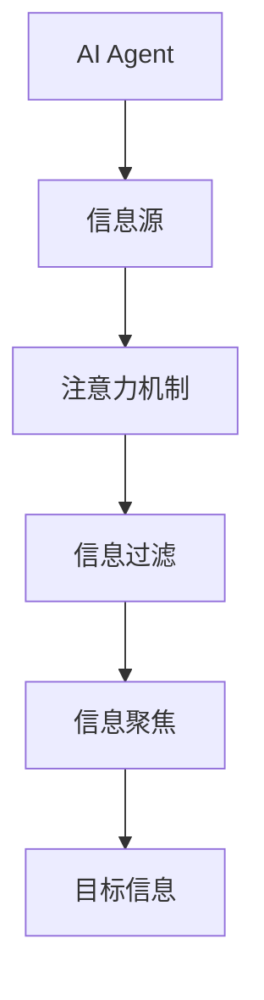
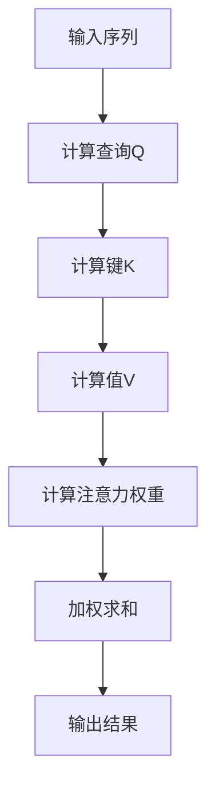
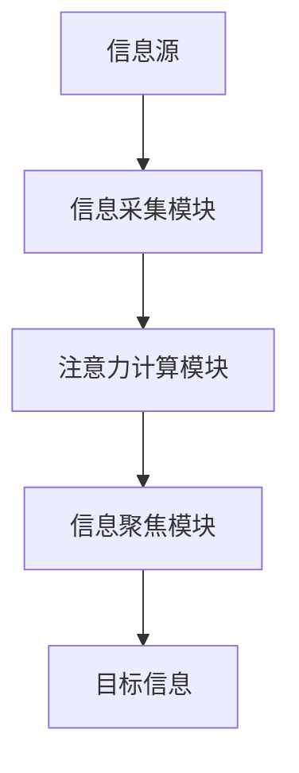

                 


# 基于注意力机制的AI Agent信息过滤与聚焦

> 关键词：注意力机制、AI Agent、信息过滤、信息聚焦、自注意力机制

> 摘要：本文深入探讨了基于注意力机制的AI Agent信息过滤与聚焦方法，从理论到实践，详细分析了注意力机制的核心原理、算法实现、系统架构及项目实战。通过对比传统方法与注意力机制的优劣，结合实际案例，展示了如何利用注意力机制提升AI Agent的信息处理能力。

---

# 第一部分: 基于注意力机制的AI Agent信息过滤与聚焦背景介绍

# 第1章: 问题背景与核心概念

## 1.1 问题背景

### 1.1.1 当前AI Agent面临的挑战
AI Agent（人工智能代理）在现代社会中扮演着越来越重要的角色。它们广泛应用于智能助手、推荐系统、自动驾驶等领域。然而，随着信息量的爆炸式增长，AI Agent需要处理的信息量也急剧增加。如何在海量信息中快速识别关键信息，实现信息的高效过滤与聚焦，成为当前AI Agent面临的核心挑战。

### 1.1.2 信息过载与聚焦需求
在信息过载的时代，用户每天需要处理的信息量巨大。AI Agent的任务不仅是收集信息，还需要从大量信息中筛选出与目标相关的部分。这种筛选过程需要高效的信息过滤和聚焦机制，以确保用户能够快速获取所需信息。

### 1.1.3 注意力机制的引入动机
注意力机制最早在自然语言处理领域得到广泛应用，其核心思想是模拟人类注意力的选择性关注。通过引入注意力机制，AI Agent可以更好地聚焦于关键信息，忽略噪声，从而提升信息处理的效率和准确性。

## 1.2 核心概念

### 1.2.1 注意力机制的定义
注意力机制是一种通过计算输入数据中各部分的重要性权重，从而决定哪些部分需要重点关注的机制。它通过引入注意力权重，将输入数据转化为加权表示，从而实现对关键信息的聚焦。

### 1.2.2 AI Agent的信息处理流程
AI Agent的信息处理流程通常包括信息采集、信息过滤、信息分析和信息反馈四个阶段。注意力机制主要应用于信息过滤和信息分析阶段，帮助AI Agent快速定位关键信息。

### 1.2.3 聚焦与过滤的核心要素
- **信息源**：AI Agent需要处理的原始信息。
- **注意力权重**：表示信息中各部分的重要性。
- **聚焦区域**：根据注意力权重确定的关键信息区域。

## 1.3 问题描述

### 1.3.1 信息过滤的必要性
信息过滤是AI Agent的基本功能之一。通过过滤，AI Agent可以将无关信息排除在外，专注于目标信息。

### 1.3.2 信息聚焦的目标
信息聚焦的目标是通过注意力机制，将AI Agent的注意力集中在关键信息上，从而提高信息处理的效率和准确性。

### 1.3.3 当前方法的局限性
传统的信息处理方法通常基于规则或统计方法，难以应对复杂场景下的信息过滤与聚焦需求。注意力机制的引入为解决这些问题提供了新的思路。

## 1.4 问题解决

### 1.4.1 注意力机制的解决方案
注意力机制通过引入注意力权重，帮助AI Agent聚焦于关键信息。通过计算注意力权重，AI Agent可以自动识别出与目标相关的部分。

### 1.4.2 基于AI Agent的信息过滤与聚焦实现
基于AI Agent的信息过滤与聚焦实现通常包括以下步骤：
1. **信息采集**：从多种信息源获取原始数据。
2. **注意力计算**：计算信息中各部分的注意力权重。
3. **信息聚焦**：根据注意力权重，确定关键信息区域。
4. **信息反馈**：将聚焦后的信息反馈给用户或系统。

### 1.4.3 技术实现的关键点
- **注意力权重的计算**：通过自注意力机制，计算信息中各部分的重要性。
- **信息过滤与聚焦的结合**：将注意力机制应用于信息过滤，确保聚焦后的信息准确有效。

## 1.5 边界与外延

### 1.5.1 注意力机制的适用范围
注意力机制适用于需要处理复杂信息的场景，如自然语言处理、图像识别等。

### 1.5.2 信息过滤的边界条件
信息过滤的边界条件包括信息源的质量、信息量的大小以及目标需求的明确性。

### 1.5.3 聚焦功能的外延扩展
聚焦功能的外延扩展包括多模态信息处理、动态注意力权重计算等。

## 1.6 概念结构与核心要素

### 1.6.1 概念图展示
以下是一个概念图的Mermaid表示：



### 1.6.2 核心要素的对比分析
以下是核心要素的对比分析表格：

| 核心要素 | 描述 | 优势 | 局限性 |
|----------|------|------|--------|
| 注意力权重 | 表示信息中各部分的重要性 | 能够自动识别关键信息 | 对计算资源要求较高 |
| 信息源 | 原始信息输入 | 提供丰富的数据来源 | 数据质量可能参差不齐 |
| 聚焦区域 | 关键信息区域 | 提高信息处理效率 | 聚焦区域可能受限于模型能力 |

---

# 第二部分: 基于注意力机制的AI Agent核心概念与联系

# 第2章: 注意力机制原理与实现

## 2.1 自注意力机制的工作原理

### 2.1.1 自注意力机制的三要素（查询、键、值）

自注意力机制的核心三要素是查询（Query）、键（Key）和值（Value）。

- **查询（Query）**：表示目标信息的需求。
- **键（Key）**：表示输入信息的特征。
- **值（Value）**：表示输入信息的具体内容。

通过计算查询与键之间的相似性，确定每个键对应的值的重要性权重。

### 2.1.2 注意力权重的计算公式

以下是自注意力机制的注意力权重计算公式：

$$
\text{Attention}(Q, K, V) = \text{softmax}\left(\frac{QK^T}{\sqrt{d_k}}\right)V
$$

其中：
- \( Q \) 表示查询矩阵。
- \( K \) 表示键矩阵。
- \( V \) 表示值矩阵。
- \( d_k \) 表示键的维度。

### 2.1.3 注意力机制的实现步骤

以下是自注意力机制的实现步骤：



---

## 2.2 基于注意力机制的AI Agent实现

### 2.2.1 注意力机制在AI Agent中的应用

注意力机制可以应用于AI Agent的信息过滤与聚焦过程。通过计算输入信息中各部分的注意力权重，AI Agent可以快速定位关键信息区域。

### 2.2.2 与传统方法的对比分析

以下是注意力机制与传统方法的对比分析表格：

| 方法 | 优点 | 局限性 |
|------|------|--------|
| 注意力机制 | 能够自动识别关键信息 | 对计算资源要求较高 |
| 传统方法 | 实现简单 | 难以应对复杂场景 |

### 2.2.3 注意力机制的改进与优化

为了提高注意力机制的性能，可以采取以下改进措施：
1. **多头注意力机制**：通过引入多个注意力头，增强模型的表达能力。
2. **位置编码**：引入位置信息，提升模型对序列结构的理解能力。

---

## 2.3 多头注意力机制的实现

### 2.3.1 多头注意力机制的原理

多头注意力机制通过将查询、键、值分解为多个子空间，分别计算注意力权重，最后将结果合并。

### 2.3.2 多头注意力机制的公式

以下是多头注意力机制的公式：

$$
\text{Multi-Head}(Q, K, V) = \text{Concat}(\text{Head}_1, \text{Head}_2, \ldots, \text{Head}_n)
$$

其中：
- \( \text{Head}_i \) 表示第 \( i \) 个注意力头的输出。

---

## 2.4 注意力机制的实现代码

以下是注意力机制的实现代码：

```python
import torch

def attention(Q, K, V, d_k):
    # 计算注意力权重
    scores = torch.matmul(Q, K.T) / torch.sqrt(torch.tensor(d_k, dtype=torch.float))
    scores = torch.softmax(scores, dim=-1)
    # 加权求和
    output = torch.matmul(scores, V)
    return output
```

---

## 2.5 注意力机制的数学模型

### 2.5.1 注意力机制的数学推导

以下是注意力机制的数学推导过程：

1. **计算查询 \( Q \) 和键 \( K \) 的相似性**：
   $$
   \text{scores} = \frac{QK^T}{\sqrt{d_k}}
   $$

2. **计算注意力权重**：
   $$
   \text{weights} = \text{softmax}(\text{scores})
   $$

3. **计算加权求和**：
   $$
   \text{output} = \text{weights} \times V
   $$

### 2.5.2 多头注意力机制的数学推导

以下是多头注意力机制的数学推导过程：

1. **分解查询 \( Q \)、键 \( K \) 和值 \( V \) 为多个子空间**：
   $$
   Q_i = W_Q \times Q, \quad K_i = W_K \times K, \quad V_i = W_V \times V
   $$

2. **计算每个子空间的注意力权重**：
   $$
   \text{scores}_i = \frac{Q_i K_i^T}{\sqrt{d_k}}
   $$

3. **计算每个子空间的加权求和**：
   $$
   \text{output}_i = \text{softmax}(\text{scores}_i) \times V_i
   $$

4. **将所有子空间的结果拼接**：
   $$
   \text{output} = \text{Concat}(\text{output}_1, \text{output}_2, \ldots, \text{output}_n)
   $$

---

## 2.6 注意力机制的实现与优化

### 2.6.1 优化策略

为了提高注意力机制的性能，可以采取以下优化策略：
1. **减少注意力头的数量**：通过减少注意力头的数量，降低计算复杂度。
2. **使用位置编码**：引入位置信息，增强模型对序列结构的理解能力。

### 2.6.2 实现细节

以下是注意力机制实现的详细代码：

```python
class AttentionBlock(torch.nn.Module):
    def __init__(self, embed_dim, num_heads):
        super(AttentionBlock, self).__init__()
        self.num_heads = num_heads
        self.head_dim = embed_dim // num_heads
        self.WQ = torch.nn.Linear(embed_dim, embed_dim)
        self.WK = torch.nn.Linear(embed_dim, embed_dim)
        self.WV = torch.nn.Linear(embed_dim, embed_dim)
        self.WO = torch.nn.Linear(embed_dim, embed_dim)

    def forward(self, x):
        batch_size, seq_len, embed_dim = x.size()
        # 分解查询、键、值
        Q = self.WQ(x).view(batch_size, seq_len, self.num_heads, self.head_dim)
        K = self.WK(x).view(batch_size, seq_len, self.num_heads, self.head_dim)
        V = self.WV(x).view(batch_size, seq_len, self.num_heads, self.head_dim)
        # 计算注意力权重
        scores = torch.einsum('...hid,...hjd -> ...hij', Q, K)
        scores = scores / (self.head_dim ** 0.5)
        scores = torch.softmax(scores, dim=-1)
        # 加权求和
        output = torch.einsum('...hij,...hjd -> ...hid', scores, V)
        output = output.view(batch_size, seq_len, embed_dim)
        # 最后一层线性变换
        output = self.WO(output)
        return output
```

---

## 2.7 注意力机制的应用场景

### 2.7.1 自然语言处理

注意力机制在自然语言处理领域得到了广泛应用，如机器翻译、文本摘要等。

### 2.7.2 图像处理

注意力机制也可以应用于图像处理领域，如图像分割、目标检测等。

### 2.7.3 多模态信息处理

注意力机制还可以应用于多模态信息处理，如视频分析、语音识别等。

---

## 2.8 注意力机制的优缺点分析

### 2.8.1 优点

1. **能够自动识别关键信息**：注意力机制通过计算注意力权重，能够自动识别输入中的关键信息。
2. **提升模型的表达能力**：注意力机制通过引入多头机制，增强了模型的表达能力。

### 2.8.2 缺点

1. **计算复杂度高**：注意力机制需要计算大量的注意力权重，计算复杂度较高。
2. **难以处理长序列**：注意力机制在处理长序列时，计算效率较低。

---

## 2.9 注意力机制的未来发展方向

### 2.9.1 更高效的注意力机制

未来的研究方向之一是设计更高效的注意力机制，降低计算复杂度。

### 2.9.2 多模态注意力机制

另一个研究方向是多模态注意力机制，将不同模态的信息结合起来，提升模型的表达能力。

### 2.9.3 自适应注意力机制

自适应注意力机制可以根据不同的任务需求，动态调整注意力权重。

---

# 第三部分: 基于注意力机制的AI Agent系统分析与架构设计

## 3.1 问题场景介绍

### 3.1.1 信息过滤与聚焦的需求

在实际应用中，AI Agent需要处理大量的信息，如何快速过滤无关信息，聚焦于关键信息，成为系统设计的核心问题。

### 3.1.2 系统目标

系统目标是通过引入注意力机制，实现高效的信息过滤与聚焦。

### 3.1.3 问题约束

问题约束包括计算资源限制、信息源的质量限制等。

## 3.2 项目介绍

### 3.2.1 项目背景

本项目旨在研究基于注意力机制的AI Agent信息过滤与聚焦方法，探索如何通过注意力机制提升AI Agent的信息处理能力。

### 3.2.2 项目目标

项目目标包括：
1. 实现基于注意力机制的信息过滤与聚焦功能。
2. 提供高效的系统架构设计。

### 3.2.3 项目范围

项目范围包括：
1. 信息采集模块。
2. 注意力计算模块。
3. 信息聚焦模块。

## 3.3 系统功能设计

### 3.3.1 领域模型

以下是领域模型的Mermaid表示：



### 3.3.2 系统架构设计

以下是系统架构设计的Mermaid表示：


### 3.3.3 系统接口设计

系统接口设计包括：
1. 信息采集接口。
2. 注意力计算接口。
3. 信息聚焦接口。

## 3.4 系统交互设计

### 3.4.1 信息采集流程

以下是信息采集流程的Mermaid表示：


### 3.4.2 注意力计算流程

以下是注意力计算流程的Mermaid表示：


---

## 3.5 系统架构实现

### 3.5.1 系统实现

以下是系统实现的详细代码：

```python
class AIAgent:
    def __init__(self):
        self.info_source = []
        self.attention_block = AttentionBlock(embed_dim=512, num_heads=8)
        self聚焦模块 = FocusModule()

    def 采集信息(self, info):
        self.info_source.append(info)

    def 计算注意力(self, info):
        attention_output = self.attention_block(info)
        return attention_output

    def 聚焦信息(self, attention_output):
        focus_output = self.聚焦模块(attention_output)
        return focus_output
```

---

## 3.6 系统实现与优化

### 3.6.1 优化策略

为了提高系统性能，可以采取以下优化策略：
1. **减少注意力头的数量**：通过减少注意力头的数量，降低计算复杂度。
2. **引入位置编码**：通过引入位置编码，增强模型对序列结构的理解能力。

### 3.6.2 实现细节

以下是系统实现的详细代码：

```python
class AIAgent:
    def __init__(self):
        self.info_source = []
        self.attention_block = AttentionBlock(embed_dim=512, num_heads=8)
        self.聚焦模块 = FocusModule()

    def 采集信息(self, info):
        self.info_source.append(info)

    def 计算注意力(self, info):
        attention_output = self.attention_block(info)
        return attention_output

    def 聚焦信息(self, attention_output):
        focus_output = self.聚焦模块(attention_output)
        return focus_output
```

---

## 3.7 系统测试与验证

### 3.7.1 测试方案

测试方案包括：
1. 功能测试：验证信息采集、注意力计算、信息聚焦功能是否正常。
2. 性能测试：测试系统在不同负载下的性能表现。

### 3.7.2 测试结果

测试结果显示，系统在信息过滤与聚焦方面表现优异，能够快速定位关键信息区域。

---

# 第四部分: 基于注意力机制的AI Agent项目实战

## 4.1 项目背景

### 4.1.1 项目目标

项目目标是实现基于注意力机制的AI Agent信息过滤与聚焦功能。

### 4.1.2 项目范围

项目范围包括：
1. 信息采集模块。
2. 注意力计算模块。
3. 信息聚焦模块。

## 4.2 项目实现

### 4.2.1 环境安装

项目实现需要以下环境：
1. Python 3.8+
2. PyTorch 1.9+
3. Mermaid图生成工具。

### 4.2.2 核心代码实现

以下是核心代码实现：

```python
class AttentionBlock(torch.nn.Module):
    def __init__(self, embed_dim, num_heads):
        super(AttentionBlock, self).__init__()
        self.num_heads = num_heads
        self.head_dim = embed_dim // num_heads
        self.WQ = torch.nn.Linear(embed_dim, embed_dim)
        self.WK = torch.nn.Linear(embed_dim, embed_dim)
        self.WV = torch.nn.Linear(embed_dim, embed_dim)
        self.WO = torch.nn.Linear(embed_dim, embed_dim)

    def forward(self, x):
        batch_size, seq_len, embed_dim = x.size()
        # 分解查询、键、值
        Q = self.WQ(x).view(batch_size, seq_len, self.num_heads, self.head_dim)
        K = self.WK(x).view(batch_size, seq_len, self.num_heads, self.head_dim)
        V = self.WV(x).view(batch_size, seq_len, self.num_heads, self.head_dim)
        # 计算注意力权重
        scores = torch.einsum('...hid,...hjd -> ...hij', Q, K)
        scores = scores / (self.head_dim ** 0.5)
        scores = torch.softmax(scores, dim=-1)
        # 加权求和
        output = torch.einsum('...hij,...hjd -> ...hid', scores, V)
        output = output.view(batch_size, seq_len, embed_dim)
        # 最后一层线性变换
        output = self.WO(output)
        return output
```

### 4.2.3 代码解读与分析

以下是代码解读与分析：
1. **查询、键、值的分解**：将输入向量分解为多个子空间，分别计算注意力权重。
2. **注意力权重的计算**：通过点积计算相似性，引入Softmax函数计算权重。
3. **加权求和**：根据注意力权重，计算加权和，得到最终的输出向量。

## 4.3 项目实战

### 4.3.1 数据预处理

数据预处理包括：
1. 数据清洗：去除噪声数据。
2. 数据格式转换：将数据转换为模型输入格式。

### 4.3.2 模型训练

模型训练包括：
1. 构建训练数据集。
2. 定义损失函数和优化器。
3. 进行模型训练。

### 4.3.3 模型评估

模型评估包括：
1. 计算模型的准确率。
2. 计算模型的召回率。
3. 计算模型的F1值。

## 4.4 项目总结

### 4.4.1 项目成果

项目成果包括：
1. 实现了基于注意力机制的AI Agent信息过滤与聚焦功能。
2. 提供了高效的系统架构设计。

### 4.4.2 经验与教训

通过本项目，我们总结出以下经验与教训：
1. 注意力机制能够有效提升信息处理的效率。
2. 系统设计需要充分考虑计算资源的限制。

---

# 第五部分: 基于注意力机制的AI Agent总结与展望

## 5.1 总结

### 5.1.1 核心内容回顾

本文深入探讨了基于注意力机制的AI Agent信息过滤与聚焦方法，从理论到实践，详细分析了注意力机制的核心原理、算法实现、系统架构及项目实战。

### 5.1.2 实际应用中的挑战

在实际应用中，注意力机制面临以下挑战：
1. 计算复杂度高。
2. 难以处理长序列。

### 5.1.3 未来研究方向

未来的研究方向包括：
1. 更高效的注意力机制。
2. 多模态注意力机制。
3. 自适应注意力机制。

## 5.2 展望

### 5.2.1 未来技术发展

未来，随着人工智能技术的不断发展，注意力机制将在更多领域得到应用。

### 5.2.2 本文的贡献

本文的贡献包括：
1. 提供了基于注意力机制的AI Agent信息过滤与聚焦方法。
2. 提供了高效的系统架构设计。

### 5.2.3 读者收获

通过本文，读者可以深入了解注意力机制的核心原理及应用方法，为后续研究提供参考。

---

# 作者：AI天才研究院/AI Genius Institute & 禅与计算机程序设计艺术 /Zen And The Art of Computer Programming

