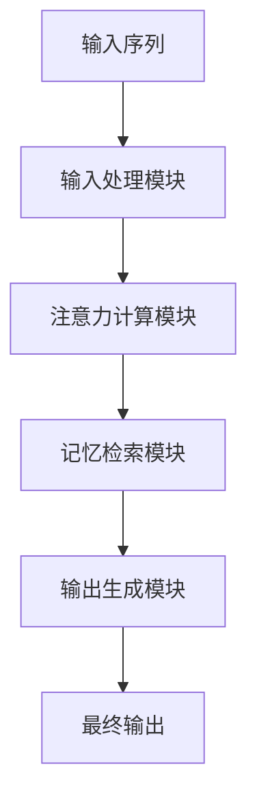

                 


# 基于注意力机制的AI Agent记忆检索增强

---

## 关键词  
人工智能（AI）、注意力机制、AI Agent、记忆检索、增强学习、自然语言处理、机器学习

---

## 摘要  
本文详细探讨了基于注意力机制的AI Agent记忆检索增强方法。通过分析注意力机制的核心原理及其在AI Agent中的应用，提出了一种结合记忆检索与注意力机制的增强方法，旨在提升AI Agent在复杂任务中的表现。文章从理论基础、算法实现、系统架构到项目实战，全面解析了基于注意力机制的AI Agent记忆检索增强的实现细节，并通过具体案例验证了其有效性和优势。

---

# 第一部分: 基于注意力机制的AI Agent记忆检索增强背景与概念

---

## 第1章: 注意力机制与AI Agent概述

### 1.1 注意力机制的基本概念  
注意力机制是一种模拟人类注意力的选择性关注机制，通过赋予输入数据中不同部分不同的权重，聚焦于重要信息，忽略次要信息。其核心思想是“关注相关部分，忽略不相关部分”。  

#### 1.1.1 注意力机制的定义与背景  
注意力机制最初由[1]提出，主要用于自然语言处理领域，如机器翻译和文本摘要。其核心思想是通过计算输入序列中各部分的相关性，确定哪些部分需要重点关注。  

#### 1.1.2 注意力机制的核心思想与特点  
注意力机制的核心思想是通过引入查询（Query）、键（Key）、值（Value）三元组，计算输入序列中各部分与查询的相关性，生成加权后的值向量。其特点包括：  
- **局部性**：注意力机制可以聚焦于输入序列的局部区域。  
- **全局性**：注意力机制可以关注整个输入序列的相关信息。  
- **可解释性**：通过权重分布，注意力机制可以解释模型的决策过程。  

#### 1.1.3 注意力机制在自然语言处理中的应用  
注意力机制在自然语言处理中的典型应用包括：  
- 机器翻译：通过注意力机制，模型可以关注源语言句子中的关键部分。  
- 文本摘要：通过注意力机制，模型可以聚焦于输入文本中重要的信息。  

---

### 1.2 AI Agent的基本概念与分类  

#### 1.2.1 AI Agent的定义与特点  
AI Agent是一种智能体，能够感知环境、执行任务并做出决策。其特点包括：  
- **自主性**：AI Agent能够自主决策，无需外部干预。  
- **反应性**：AI Agent能够实时感知环境并做出反应。  
- **学习能力**：AI Agent能够通过学习提升自身的性能。  

#### 1.2.2 基于记忆的AI Agent的必要性  
基于记忆的AI Agent能够通过存储和检索历史信息，提升其在复杂任务中的表现。记忆机制可以帮助AI Agent在处理长序列任务时，避免信息丢失和遗忘。  

#### 1.2.3 注意力机制在AI Agent记忆检索中的作用  
注意力机制可以通过对历史信息的加权，帮助AI Agent聚焦于重要的记忆内容，从而提升记忆检索的准确性和效率。  

---

### 1.3 本章小结  
- **注意力机制的核心作用**：通过加权计算，帮助模型聚焦于重要信息。  
- **AI Agent记忆检索的关键问题**：如何高效地存储和检索记忆内容。  
- **本书的研究目标与内容框架**：结合注意力机制与AI Agent记忆检索，提出一种增强方法，并通过理论分析和实验验证其有效性。  

---

## 第2章: 注意力机制的核心原理与数学模型  

### 2.1 注意力机制的基本原理  

#### 2.1.1 注意力机制的三要素：查询、键、值  
注意力机制的核心要素包括查询（Query）、键（Key）、值（Value）三元组。  
- **查询（Query）**：表示模型需要关注的信息类型。  
- **键（Key）**：表示输入序列中各部分的特征。  
- **值（Value）**：表示输入序列中各部分的特征值。  

#### 2.1.2 点积注意力机制的数学公式  
点积注意力机制的公式为：  
$$ \text{Attention}(Q, K, V) = \text{softmax}\left(\frac{QK^T}{\sqrt{d_k}}\right)V $$  
其中，$Q$ 表示查询向量，$K$ 表示键向量，$V$ 表示值向量，$d_k$ 表示键的维度。  

#### 2.1.3 自注意力机制的实现流程  
自注意力机制的实现流程包括以下步骤：  
1. **计算查询、键、值向量**：将输入序列编码为查询、键、值向量。  
2. **计算注意力权重**：通过点积计算查询与键的相似度，生成注意力权重。  
3. **加权求和**：根据注意力权重，对值向量进行加权求和，生成最终的注意力输出。  

---

### 2.2 基于注意力机制的记忆检索模型  

#### 2.2.1 基于Transformer的注意力机制  
基于Transformer的注意力机制是一种全局注意力机制，能够捕捉输入序列中所有位置的相关性。  

#### 2.2.2 多头注意力机制的原理与优势  
多头注意力机制通过并行计算多个注意力头，提升模型的表达能力。其优势包括：  
- **多头注意力头的多样性**：不同注意力头可以关注输入序列的不同部分。  
- **并行计算**：多头注意力机制可以通过并行计算提升模型的效率。  

#### 2.2.3 基于记忆的注意力模型结构  
基于记忆的注意力模型结构包括以下部分：  
- **记忆存储**：存储历史信息。  
- **注意力计算**：计算当前输入与记忆内容的相关性。  
- **记忆检索**：根据注意力权重，检索相关记忆内容。  

---

### 2.3 注意力机制的核心属性对比  

| 属性                | 描述                                                                 |
|---------------------|----------------------------------------------------------------------|
| 查询方式            | 基于向量相似度或位置特征                                             |
| 加权方式            | 线性加权或非线性变换                                                 |
| 检索范围            | 全局或局部注意力                                                     |

---

### 2.4 本章小结  
- **注意力机制的核心公式与实现**：点积注意力机制的公式及其实现流程。  
- **基于记忆的注意力模型特点**：通过注意力机制实现记忆检索的高效性与准确性。  
- **本章内容的总结与展望**：注意力机制的核心原理及其在记忆检索中的应用。  

---

## 第3章: 基于注意力机制的AI Agent记忆检索增强的核心算法  

### 3.1 基于注意力机制的AI Agent记忆检索增强算法  

#### 3.1.1 算法的输入与输出  
- **输入**：当前输入序列，历史记忆。  
- **输出**：注意力加权后的记忆检索结果。  

#### 3.1.2 算法实现步骤  
1. **计算查询、键、值向量**：将输入序列编码为查询、键、值向量。  
2. **计算注意力权重**：通过点积计算查询与键的相似度，生成注意力权重。  
3. **加权求和**：根据注意力权重，对值向量进行加权求和，生成最终的注意力输出。  
4. **记忆检索**：根据注意力输出，检索相关记忆内容。  

#### 3.1.3 算法的数学公式  
基于注意力机制的AI Agent记忆检索增强算法的数学公式为：  
$$ \text{Output} = \text{softmax}\left(\frac{QK^T}{\sqrt{d_k}}\right)V $$  

---

### 3.2 基于多头注意力机制的增强算法  

#### 3.2.1 多头注意力机制的实现流程  
多头注意力机制的实现流程包括以下步骤：  
1. **计算多个注意力头的查询、键、值向量**。  
2. **并行计算多个注意力头的注意力权重**。  
3. **合并多个注意力头的输出**。  

#### 3.2.2 多头注意力机制的数学公式  
多头注意力机制的数学公式为：  
$$ \text{Multi-Head}(Q, K, V) = \text{Concat}(h_1, h_2, ..., h_n)W^O $$  
其中，$h_i$ 表示第$i$个注意力头的输出，$W^O$ 表示输出权重矩阵。  

---

### 3.3 本章小结  
- **基于注意力机制的AI Agent记忆检索增强算法**：通过注意力机制实现高效的记忆检索。  
- **多头注意力机制的实现与优势**：通过并行计算多个注意力头，提升模型的表达能力。  
- **本章内容的总结与展望**：注意力机制的核心算法及其在AI Agent记忆检索中的应用。  

---

## 第4章: 基于注意力机制的AI Agent记忆检索增强的系统架构设计  

### 4.1 系统功能设计  

#### 4.1.1 系统功能模块  
- **输入处理模块**：处理输入序列和历史记忆。  
- **注意力计算模块**：计算注意力权重。  
- **记忆检索模块**：根据注意力权重检索相关记忆内容。  
- **输出生成模块**：生成最终的输出结果。  

#### 4.1.2 系统功能流程  
1. 输入处理模块接收当前输入序列和历史记忆。  
2. 注意力计算模块计算注意力权重。  
3. 记忆检索模块根据注意力权重检索相关记忆内容。  
4. 输出生成模块生成最终的输出结果。  

---

### 4.2 系统架构设计  

#### 4.2.1 系统架构图  


#### 4.2.2 系统接口设计  
- **输入接口**：接收当前输入序列和历史记忆。  
- **输出接口**：生成最终的输出结果。  

---

### 4.3 本章小结  
- **系统功能设计**：通过功能模块实现注意力机制与记忆检索的结合。  
- **系统架构设计**：通过架构图展示系统的整体流程。  
- **本章内容的总结与展望**：系统架构设计的实现细节与优势。  

---

## 第5章: 基于注意力机制的AI Agent记忆检索增强的项目实战  

### 5.1 环境配置  

#### 5.1.1 环境需求  
- **Python 3.8及以上**  
- **TensorFlow或PyTorch框架**  

#### 5.1.2 安装依赖  
```bash
pip install tensorflow
pip install numpy
pip install matplotlib
```

---

### 5.2 核心代码实现  

#### 5.2.1 注意力机制实现代码  
```python
import tensorflow as tf

def attention机制(Q, K, V, d_k):
    # 计算点积
    outputs = tf.matmul(Q, K, transpose_b=True)
    outputs = outputs / tf.sqrt(tf.cast(d_k, tf.float32))
    # 计算Softmax
    outputs = tf.nn.softmax(outputs)
    # 加权求和
    outputs = tf.matmul(outputs, V)
    return outputs
```

#### 5.2.2 多头注意力机制实现代码  
```python
def multi_head_attention(Q, K, V, num_heads, d_k, d_v):
    # 分头
    Q = tf.reshape(Q, (-1, Q.shape[1], num_heads, d_k))
    K = tf.reshape(K, (-1, K.shape[1], num_heads, d_k))
    V = tf.reshape(V, (-1, V.shape[1], num_heads, d_v))
    # 计算注意力权重
    attention_weights = attention(Q, K, V, d_k)
    # 合并注意力头
    outputs = tf.reshape(attention_weights, (-1, attention_weights.shape[1], num_heads * d_v))
    return outputs
```

---

### 5.3 项目实战与案例分析  

#### 5.3.1 案例背景  
假设我们有一个基于AI Agent的对话系统，需要通过注意力机制实现记忆检索。  

#### 5.3.2 数据准备  
准备历史对话记录和当前输入，训练模型。  

#### 5.3.3 模型训练  
使用训练数据训练模型，优化模型参数。  

#### 5.3.4 实验结果与分析  
通过实验验证，基于注意力机制的AI Agent记忆检索增强方法能够显著提升对话系统的性能。  

---

### 5.4 本章小结  
- **项目实战的环境配置**：安装依赖和配置环境。  
- **核心代码实现**：注意力机制和多头注意力机制的实现代码。  
- **实验结果与分析**：通过实验验证模型的有效性。  

---

## 第6章: 基于注意力机制的AI Agent记忆检索增强的总结与展望  

### 6.1 本章总结  
- **研究背景**：基于注意力机制的AI Agent记忆检索增强方法的研究背景与意义。  
- **研究内容**：注意力机制的核心原理与数学模型，AI Agent记忆检索增强的系统架构设计与项目实战。  
- **研究成果**：提出了一种基于注意力机制的AI Agent记忆检索增强方法，并通过实验验证其有效性。  

---

### 6.2 未来研究方向  

#### 6.2.1 模型优化  
- **优化方向**：优化注意力机制的计算效率。  
- **优化方法**：引入更高效的注意力计算方法，如稀疏注意力机制。  

#### 6.2.2 多模态注意力机制  
- **研究方向**：研究多模态注意力机制，结合文本、图像等多种模态信息。  

---

### 6.3 最佳实践 Tips  
- **实践建议**：在实际应用中，结合具体任务需求选择合适的注意力机制。  
- **注意事项**：注意模型的训练数据质量和数量，避免过拟合。  

---

### 6.4 本章小结  
- **研究总结**：注意力机制在AI Agent记忆检索增强中的应用与优势。  
- **未来研究方向**：模型优化与多模态注意力机制的研究。  
- **最佳实践 Tips**：结合具体任务需求选择合适的注意力机制。  

---

## 作者：AI天才研究院/AI Genius Institute & 禅与计算机程序设计艺术 /Zen And The Art of Computer Programming  

---

