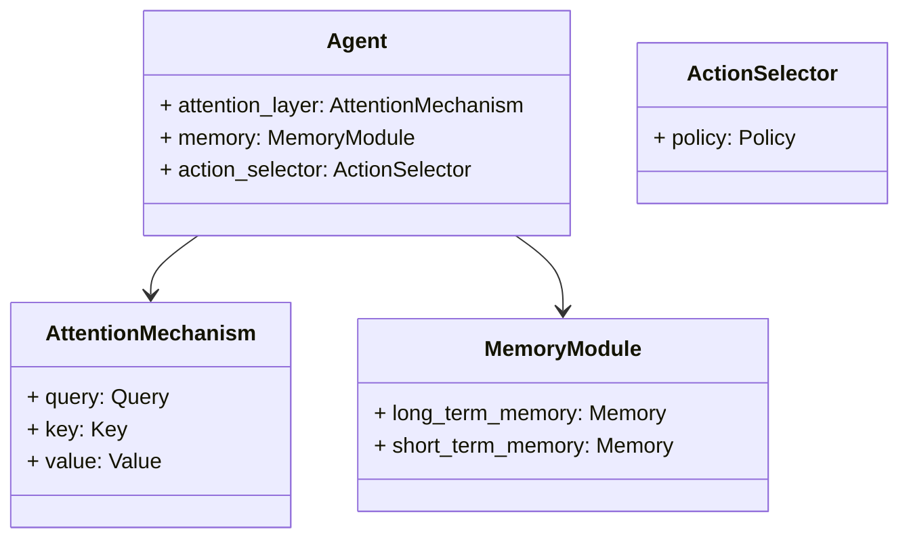
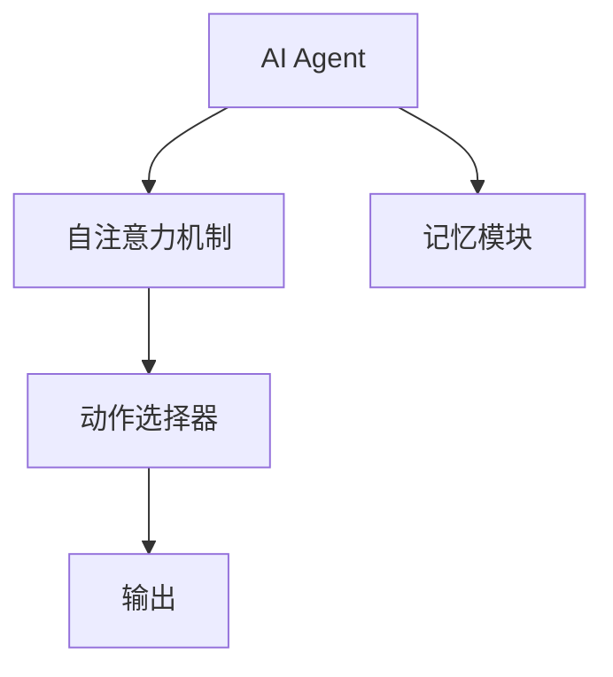
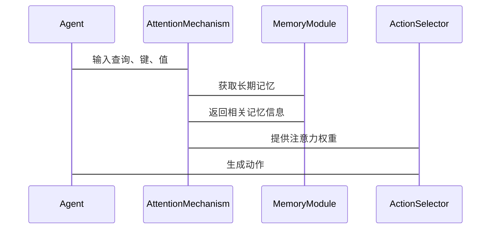

                 


# 基于注意力机制的AI Agent长期依赖建模

> 关键词：注意力机制，AI Agent，长期依赖建模，自注意力，Transformer，深度学习

> 摘要：本文详细探讨了如何利用注意力机制对AI Agent进行长期依赖建模，分析了自注意力机制的核心原理，结合系统设计与实战案例，展示了如何通过数学建模和代码实现来解决复杂问题。

---

## 第一部分: 基于注意力机制的AI Agent长期依赖建模概述

### 第1章: 背景介绍与核心概念

#### 1.1 问题背景与描述

- **AI Agent的基本概念**：AI Agent是指能够感知环境、自主决策并执行任务的智能体，广泛应用于自动驾驶、自然语言处理等领域。
- **注意力机制的引入背景**：传统模型难以捕捉长距离依赖关系，注意力机制通过权重分配解决了这一问题。
- **长期依赖建模的重要性**：在时间序列数据中，远距离依赖对任务决策至关重要，如在对话系统中，长期上下文记忆有助于生成连贯的回复。

#### 1.2 核心概念与联系

- **注意力机制的原理**：通过计算输入序列中每个位置的重要性，集中关注关键信息，提升模型性能。
- **长期依赖建模的定义**：指模型能够记住并利用远距离的输入信息，用于生成更合理的输出。
- **两者结合的必要性**：注意力机制帮助捕捉全局关系，长期依赖建模确保模型在处理复杂任务时具备记忆能力。

### 第2章: 注意力机制的核心原理

#### 2.1 自注意力机制

- **数学公式**：
  $$\text{Attention}(Q, K, V) = \text{softmax}\left(\frac{QK^T}{\sqrt{d_k}}\right)V$$
  其中，$Q$、$K$、$V$分别表示查询、键、值矩阵，$d_k$是键的维度。
- **多头注意力机制**：通过并行计算多个子空间中的注意力，增强模型捕捉不同粒度特征的能力。
- **位置编码与相对位置编码**：为序列引入位置信息，确保模型理解相对位置关系，如在Transformer中使用位置编码。

#### 2.2 基于注意力机制的序列建模

- **Transformer架构**：由编码器和解码器组成，编码器负责将输入序列映射到潜在空间，解码器生成输出序列。
- **编码器-解码器结构**：编码器处理输入，解码器利用自注意力和前一时刻的输出生成当前时刻的输出。
- **位置感知机制**：通过引入位置编码，确保模型理解序列中元素的位置关系，避免混淆。

### 第3章: 长期依赖建模的挑战与解决方案

#### 3.1 长期依赖建模的挑战

- **短时记忆的局限性**：传统模型如RNN在处理长序列时，由于梯度消失问题，难以捕捉长期依赖。
- **序列数据中的远距离依赖**：在自然语言处理中，远距离的语法关系对句意理解至关重要。
- **梯度消失问题**：深度RNN在训练时，梯度在反向传播过程中逐渐消失，影响模型性能。

#### 3.2 基于注意力机制的解决方案

- **使用自注意力捕捉全局依赖**：通过计算每个位置与其他位置的相关性，模型能够关注重要的信息。
- **增强记忆机制**：结合记忆网络或外部存储，帮助模型保存长期信息。
- **分层次的依赖建模**：通过多层注意力机制，分别捕捉不同层次的依赖关系，提升模型表现。

### 第4章: 系统分析与架构设计方案

#### 4.1 问题场景介绍

- **AI Agent的任务目标**：执行复杂任务，如对话生成、决策优化，需要处理长序列数据。
- **长期依赖建模的应用场景**：在对话系统中，模型需要记住之前的对话内容，以生成连贯的回复。

#### 4.2 系统功能设计

- **系统功能模块划分**：
  - 注意力层：负责计算自注意力，捕捉输入中的关键信息。
  - 记忆模块：用于存储长期依赖信息。
  - 动作选择器：基于注意力输出和记忆生成最终动作。
- **领域模型设计（Mermaid类图）**：


#### 4.3 系统架构设计（Mermaid架构图）



#### 4.4 系统接口设计

- **输入接口**：接收原始输入数据，如对话历史、传感器数据等。
- **输出接口**：生成动作或输出结果，供外部系统调用。
- **记忆模块接口**：负责存储和检索长期依赖信息。

#### 4.5 系统交互（Mermaid序列图）



## 第二部分: 项目实战与应用

### 第5章: 项目实战

#### 5.1 环境安装

- **安装Python**：版本3.6及以上。
- **安装相关库**：
  ```bash
  pip install numpy torch transformers
  ```

#### 5.2 核心代码实现

- **自注意力机制实现**：
  ```python
  import torch

  def self_attention(Q, K, V, d_k):
      scores = (Q @ K.T) / torch.sqrt(torch.tensor(d_k, dtype=torch.float))
      attention_weights = torch.softmax(scores, dim=-1)
      output = attention_weights @ V
      return output
  ```

- **记忆模块实现**：
  ```python
  class MemoryModule:
      def __init__(self, memory_size):
          self.memory_size = memory_size
          self.memory = torch.zeros(memory_size)

      def update_memory(self, new_info):
          self.memory = torch.cat((self.memory, new_info))
  ```

- **动作选择器实现**：
  ```python
  class ActionSelector:
      def __init__(self, policy):
          self.policy = policy

      def select_action(self, attention_output):
          return self.policy(attention_output)
  ```

#### 5.3 代码应用解读与分析

- **输入数据预处理**：将输入数据转换为查询、键、值矩阵。
- **注意力计算**：使用自注意力机制计算权重并生成输出。
- **记忆更新**：根据注意力输出更新记忆模块。
- **动作选择**：基于更新后的记忆和注意力输出，选择最终动作。

#### 5.4 实际案例分析

- **案例背景**：一个对话生成任务，模型需要根据之前的对话内容生成回复。
- **具体步骤**：
  1. 将输入对话历史转换为查询、键、值矩阵。
  2. 计算自注意力，获取每个位置的权重。
  3. 更新记忆模块，保存对话历史信息。
  4. 基于注意力权重和记忆信息，选择合适的回复动作。

#### 5.5 项目小结

- **项目总结**：通过注意力机制和记忆模块的结合，模型能够有效捕捉长期依赖，提升任务表现。
- **代码亮点**：简洁高效的实现方式，适用于多种场景。

## 第三部分: 总结与展望

### 第6章: 总结与展望

#### 6.1 核心内容回顾

- **注意力机制**：在AI Agent中的应用及其重要性。
- **长期依赖建模**：如何通过注意力机制实现有效的长期记忆。
- **系统设计**：模块化设计和架构优化的关键作用。

#### 6.2 未来发展方向

- **混合注意力机制**：结合不同类型的注意力机制，提升模型性能。
- **动态记忆网络**：开发能够自适应调整记忆内容的机制。
- **多模态建模**：将注意力机制应用于更多模态的数据，如图像和语音。

### 第7章: 注意事项与拓展阅读

#### 7.1 注意事项

- **模型调参**：注意力机制的参数设置对性能影响较大，需谨慎调整。
- **计算效率**：自注意力机制计算量大，需优化计算效率，如并行计算。
- **数据质量**：输入数据的质量直接影响模型表现，需做好数据预处理。

#### 7.2 拓展阅读

- **经典论文**：《Attention Is All You Need》（Vaswani et al., 2017）
- **相关书籍**：《Deep Learning》（Ian Goodfellow等著）
- **技术博客**：关注各大技术博客平台上的最新研究成果。

---

# 作者：AI天才研究院 & 禅与计算机程序设计艺术

通过本文的详细讲解，读者可以系统地理解基于注意力机制的AI Agent长期依赖建模的核心思想和实现方法，从理论到实践，全面掌握相关技术。

