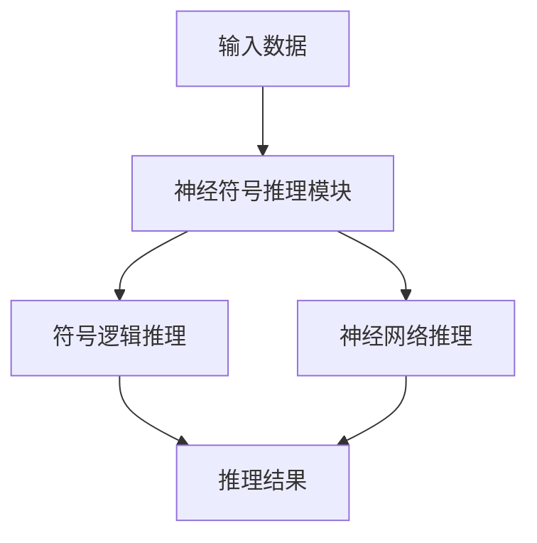
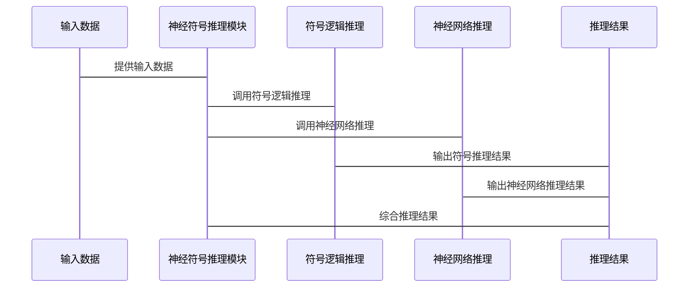

                 


# 基于神经符号AI的AI Agent逻辑推理增强

> **关键词**: 神经符号AI，AI Agent，逻辑推理，增强方法，系统架构

> **摘要**: 本文探讨了基于神经符号AI的AI Agent逻辑推理增强方法，详细介绍了神经符号AI的核心概念、算法原理、系统架构设计以及项目实战。通过结合符号逻辑和神经网络，本文提出了一种有效的推理增强策略，并通过实际案例展示了其在AI Agent中的应用。

---

## 第1章: 神经符号AI与AI Agent概述

### 1.1 神经符号AI的定义与背景

#### 1.1.1 神经符号AI的定义
神经符号AI（Neural-Symbolic AI）是一种结合了符号逻辑和神经网络的人工智能方法。它通过将符号推理与机器学习相结合，能够处理复杂任务中的逻辑推理和知识表示。

#### 1.1.2 神经符号AI的发展背景
随着AI技术的快速发展，传统的符号AI在处理复杂任务时表现出局限性，而神经网络虽然在感知任务中表现优异，但在逻辑推理方面仍有不足。神经符号AI的出现，旨在弥补这两者的不足。

#### 1.1.3 神经符号AI与传统符号AI的区别
| 特性                | 符号AI                   | 神经符号AI             |
|---------------------|--------------------------|------------------------|
| 数据处理能力        | 强调规则和逻辑           | 强调数据驱动和学习       |
| 处理复杂性           | 适用于简单规则           | 适用于复杂规则和任务     |
| 可解释性             | 高                      | 中等                   |
| 学习能力             | 无                      | 强                    |

### 1.2 AI Agent的基本概念

#### 1.2.1 AI Agent的定义
AI Agent（智能体）是指在环境中能够感知并自主行动以实现目标的实体。它可以是一个软件程序或物理设备。

#### 1.2.2 AI Agent的核心特征
- **自主性**: 能够自主决策。
- **反应性**: 能够实时感知环境并做出反应。
- **目标导向**: 以目标为导向进行行动。
- **社会能力**: 能够与其他Agent或人类交互。

#### 1.2.3 AI Agent的应用场景
- **自动驾驶**: 感知环境并做出驾驶决策。
- **智能助手**: 如Siri、Alexa，能够执行复杂任务。
- **机器人**: 在制造业中进行精确操作。

### 1.3 神经符号AI在AI Agent中的作用

#### 1.3.1 神经符号AI的优势
- **结合符号逻辑和神经网络**: 神经符号AI能够同时利用符号逻辑的可解释性和神经网络的感知能力。
- **增强推理能力**: 在复杂环境中，神经符号AI能够进行更精确的逻辑推理。

#### 1.3.2 神经符号AI在AI Agent中的应用
神经符号AI可以用于路径规划、决策推理、知识表示等领域，提升AI Agent的智能水平。

#### 1.3.3 神经符号AI与AI Agent的结合方式
神经符号AI通过将符号逻辑嵌入到神经网络中，增强AI Agent的推理能力。具体方式包括知识表示学习、逻辑推理网络等。

---

## 第2章: 神经符号AI的核心概念与原理

### 2.1 符号逻辑与神经网络的结合

#### 2.1.1 符号逻辑的基本概念
符号逻辑是一种基于符号和规则的推理方法，常用于知识表示和逻辑推理。

#### 2.1.2 神经网络的基本原理
神经网络通过多层结构学习数据特征，能够处理非结构化数据，如图像和文本。

#### 2.1.3 神经符号AI的结合方式
神经符号AI将符号逻辑嵌入到神经网络中，通过神经网络学习符号逻辑的权重。

### 2.2 神经符号AI的数学模型

#### 2.2.1 符号逻辑的数学表达
符号逻辑可以通过命题逻辑和谓词逻辑表示，如：
$$ P \rightarrow Q $$

#### 2.2.2 神经网络的数学模型
神经网络的基本单元是神经元，其激活函数可以表示为：
$$ a = \sigma(wx + b) $$

#### 2.2.3 神经符号AI的联合模型
神经符号AI的数学模型结合了符号逻辑和神经网络，如：
$$ f(x) = \text{Neural}(x) \land \text{Symbolic}(x) $$

### 2.3 神经符号AI的算法流程

#### 2.3.1 神经符号AI的基本流程
1. **知识表示**: 将符号逻辑嵌入到神经网络中。
2. **训练**: 使用带标签的数据训练神经符号模型。
3. **推理**: 在测试阶段，利用训练好的模型进行推理。

#### 2.3.2 神经符号AI的训练过程
1. **输入数据**: 提供符号逻辑和感知数据。
2. **模型训练**: 使用梯度下降优化模型参数。
3. **验证**: 验证模型的准确性和性能。

#### 2.3.3 神经符号AI的推理过程
1. **输入推理请求**: 提供推理问题。
2. **符号逻辑推理**: 基于符号逻辑进行初步推理。
3. **神经网络推理**: 使用神经网络进行感知推理。
4. **结合结果**: 综合符号和神经推理结果，得出最终答案。

---

## 第3章: 神经符号AI的逻辑推理增强方法

### 3.1 符号逻辑增强神经网络的方法

#### 3.1.1 知识表示的学习
通过神经网络学习符号逻辑的知识表示，如概念图。

#### 3.1.2 逻辑推理的神经网络实现
使用神经网络模拟逻辑推理过程，如逻辑门网络。

#### 3.1.3 神经符号AI的知识融合
将符号知识与感知数据融合，提升推理能力。

### 3.2 神经符号AI的推理增强策略

#### 3.2.1 基于符号规则的推理增强
利用符号规则指导神经网络的推理过程。

#### 3.2.2 基于神经网络的推理增强
通过神经网络的强大感知能力，增强符号推理的效果。

#### 3.2.3 神经符号AI的混合推理策略
结合符号和神经网络的推理结果，进行综合推理。

### 3.3 神经符号AI的推理性能评估

#### 3.3.1 推理准确率的评估方法
通过对比实验，评估神经符号AI的推理准确率。

#### 3.3.2 推理效率的评估指标
评估推理过程中的计算效率和响应速度。

#### 3.3.3 神经符号AI的性能优化
通过优化算法和硬件加速，提升推理性能。

---

## 第4章: 神经符号AI的算法实现与推理增强

### 4.1 神经符号AI的实现步骤

#### 4.1.1 知识表示学习
使用神经网络学习符号知识的表示。

#### 4.1.2 逻辑推理网络
构建逻辑推理网络，进行符号推理。

#### 4.1.3 神经符号推理模型
结合神经网络和符号逻辑，构建推理模型。

### 4.2 推理增强的实现方法

#### 4.2.1 知识嵌入
将符号知识嵌入到神经网络中，增强知识表示。

#### 4.2.2 网络训练
通过训练神经符号模型，提升推理能力。

#### 4.2.3 推理优化
优化推理过程，提升推理效率和准确率。

### 4.3 神经符号AI的代码实现

#### 4.3.1 环境安装
安装必要的库，如TensorFlow、Keras。

#### 4.3.2 核心代码实现
```python
import tensorflow as tf
from tensorflow.keras import layers

# 符号逻辑嵌入
def symbolic_logic_embedding(x):
    return layers.Dense(10, activation='relu')(x)

# 神经符号推理模型
def neural_symbolic_model(input_shape):
    input = layers.Input(shape=input_shape)
    embed = symbolic_logic_embedding(input)
    output = layers.Dense(1, activation='sigmoid')(embed)
    return tf.keras.Model(inputs=input, outputs=output)
```

#### 4.3.3 代码解读与分析
上述代码定义了一个简单的神经符号推理模型，包括符号逻辑嵌入和神经网络推理部分。

---

## 第5章: 神经符号AI的系统分析与架构设计

### 5.1 系统架构设计

#### 5.1.1 系统架构图


#### 5.1.2 系统功能设计
系统包括知识表示、逻辑推理和结果输出三个功能模块。

#### 5.1.3 系统交互流程


---

## 第6章: 神经符号AI的项目实战与性能优化

### 6.1 项目实战

#### 6.1.1 环境安装
安装必要的库，如TensorFlow、Keras。

#### 6.1.2 代码实现
```python
import tensorflow as tf
from tensorflow.keras import layers

# 定义神经符号推理模型
def neural_symbolic_reasoning_model():
    input = layers.Input(shape=(input_dim,))
    embed = layers.Dense(10, activation='relu')(input)
    output = layers.Dense(1, activation='sigmoid')(embed)
    return tf.keras.Model(inputs=input, outputs=output)

# 训练模型
model = neural_symbolic_reasoning_model()
model.compile(optimizer='adam', loss='binary_crossentropy', metrics=['accuracy'])
model.fit(x_train, y_train, epochs=10, batch_size=32)
```

#### 6.1.3 案例分析
通过具体案例，展示神经符号AI在逻辑推理中的应用。

### 6.2 性能优化

#### 6.2.1 算法优化
优化神经符号AI的算法，提升推理速度和准确率。

#### 6.2.2 硬件加速
利用GPU或TPU加速模型训练和推理。

#### 6.2.3 知识蒸馏
通过知识蒸馏技术，降低模型复杂度，提升推理效率。

---

## 结语

神经符号AI通过结合符号逻辑和神经网络，显著增强了AI Agent的逻辑推理能力。本文详细探讨了神经符号AI的核心概念、算法实现和系统架构设计，并通过项目实战展示了其在实际应用中的优势。未来，随着技术的进一步发展，神经符号AI将在更多领域展现出强大的潜力。

---

**作者：AI天才研究院/AI Genius Institute & 禅与计算机程序设计艺术 /Zen And The Art of Computer Programming**

