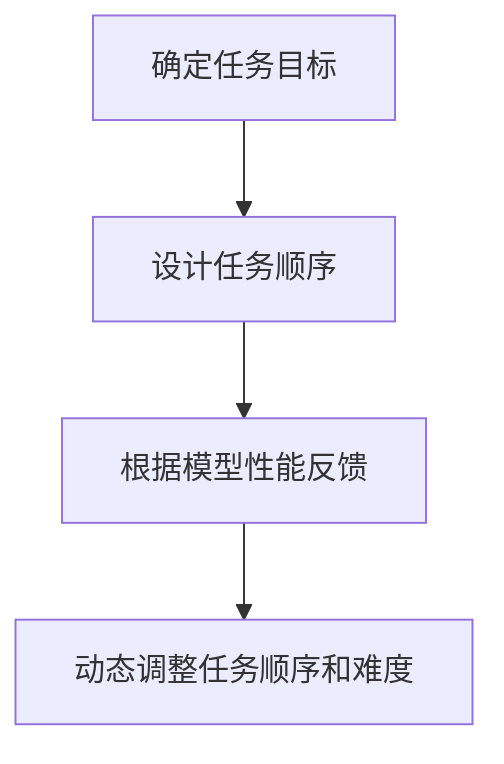
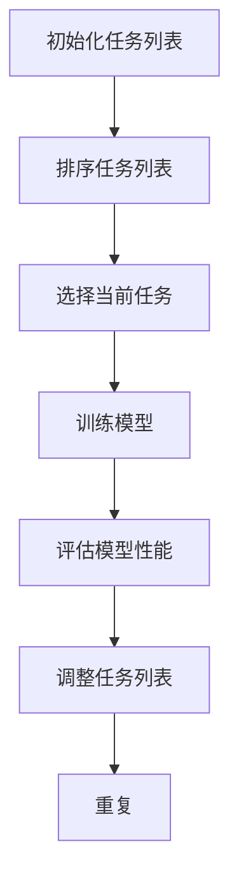
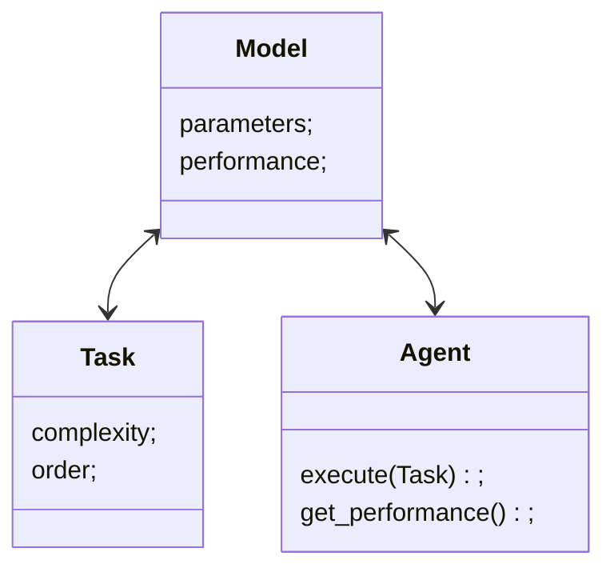
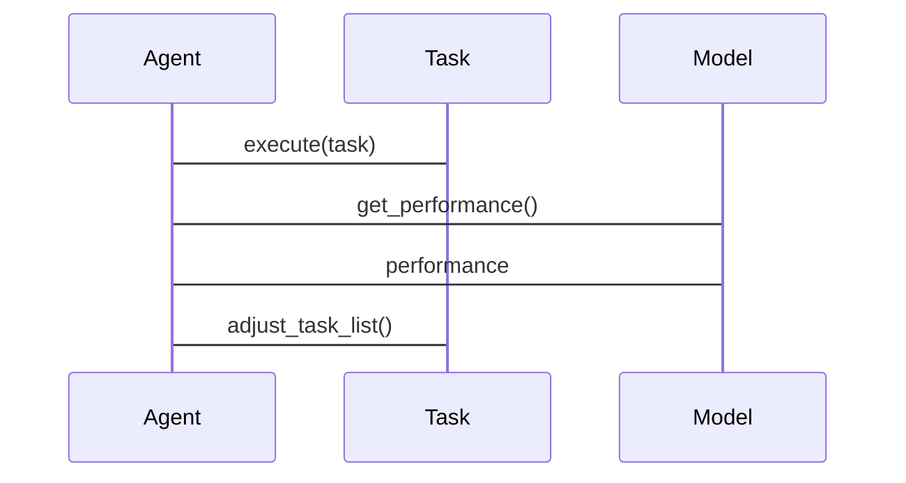

                 


# 基于课程学习的AI Agent能力阶梯式提升

## 文章关键词
课程学习, AI Agent, 能力提升, 算法原理, 系统架构, 项目实战

## 摘要
基于课程学习的AI Agent能力阶梯式提升是一种系统化的方法，通过逐步设计和实施课程，帮助AI代理逐步提升其核心能力。本文从课程学习的基本原理出发，详细分析其在AI Agent能力提升中的应用，涵盖核心概念、算法原理、系统架构设计、项目实战及最佳实践等多个方面。文章通过丰富的案例和详细的代码示例，展示了如何在实际应用中实现AI Agent的阶梯式能力提升，为相关研究和实践提供了有价值的参考。

---

## 第一部分：背景介绍

### 第1章：课程学习与AI Agent能力提升的背景

#### 1.1 问题背景

- **AI Agent的基本概念**
  - AI Agent（智能体）是指能够感知环境、自主决策并执行任务的智能系统。
  - Agent可以分为简单反射型、基于模型型、目标驱动型和效用驱动型等类型。
  - 在复杂的环境中，AI Agent需要具备学习能力，以适应不断变化的任务需求。

- **课程学习的定义与特点**
  - 课程学习（Curriculum Learning）是一种机器学习方法，通过逐步增加任务的难度，帮助模型逐步掌握复杂任务。
  - 与传统随机训练不同，课程学习注重任务的顺序性和层次性，能够有效提升模型的学习效率。

- **课程学习在AI Agent能力提升中的作用**
  - 通过设计合理的课程，AI Agent可以逐步掌握从简单到复杂的能力，提升整体性能。
  - 课程学习能够帮助AI Agent在资源有限的情况下，更高效地学习和适应复杂的任务环境。

#### 1.2 问题描述

- **AI Agent能力提升的挑战**
  - 复杂任务的多样性和不确定性使得AI Agent的学习过程充满挑战。
  - 传统随机训练方法可能导致模型在某些方面学习不足，无法高效完成复杂任务。
  - 任务之间的依赖关系和复杂度差异需要一种系统化的学习策略。

- **课程学习如何解决这些挑战**
  - 通过逐步增加任务难度，课程学习能够帮助AI Agent逐步掌握复杂任务。
  - 课程学习注重任务的顺序性和层次性，能够有效提升模型的学习效率。

- **课程学习与传统AI训练方法的对比**
  - 传统随机训练：随机选择任务进行训练，可能导致模型在某些方面学习不足。
  - 课程学习：通过设计合理的任务顺序，帮助模型逐步掌握复杂任务。

#### 1.3 问题解决

- **课程学习的基本原理**
  - 课程学习通过设计任务难度的递进，帮助模型逐步掌握复杂任务。
  - 任务难度的递进可以是基于任务复杂度、数据分布或模型性能等多种因素。

- **AI Agent能力阶梯式提升的方法**
  - 设计合理的课程，从简单任务开始，逐步增加任务难度。
  - 根据模型的性能反馈，动态调整课程的任务顺序和难度。

- **课程学习如何实现能力提升**
  - 通过逐步增加任务难度，模型能够更好地掌握复杂任务。
  - 课程学习能够帮助模型在资源有限的情况下，更高效地学习和适应复杂的任务环境。

#### 1.4 边界与外延

- **课程学习的适用范围**
  - 适用于需要逐步掌握复杂任务的场景，如自动驾驶、智能客服、机器人控制等。
  - 适用于数据分布不均衡或任务复杂度差异较大的场景。

- **AI Agent能力提升的边界**
  - 课程学习主要关注任务难度的设计和递进，不直接解决任务本身的实现问题。
  - 课程学习的边界在于任务之间的依赖关系和复杂度差异。

- **课程学习与其他AI训练方法的关系**
  - 课程学习可以与其他训练方法结合使用，如强化学习、监督学习等。
  - 课程学习可以作为其他训练方法的补充，帮助模型更高效地学习和适应复杂的任务环境。

#### 1.5 核心概念与要素组成

- **课程学习的核心概念**
  - 任务难度递进：通过设计任务难度的递进，帮助模型逐步掌握复杂任务。
  - 课程设计：根据任务复杂度、数据分布等因素，设计合理的任务顺序。

- **AI Agent能力提升的关键要素**
  - 任务设计：设计合理的任务，确保任务之间的递进性和关联性。
  - 任务执行：根据模型的性能反馈，动态调整任务的顺序和难度。
  - 性能评估：通过性能评估，判断模型是否掌握了当前任务，是否需要进入下一阶段。

- **核心概念之间的关系**
  - 课程学习通过设计任务难度的递进，帮助AI Agent逐步掌握复杂任务。
  - 任务设计和任务执行是课程学习的核心过程，性能评估是判断模型是否掌握当前任务的关键。

---

## 第二部分：核心概念与联系

### 第2章：课程学习与AI Agent能力提升的核心概念

#### 2.1 课程学习的核心原理

- **课程学习的基本原理**
  - 课程学习通过设计任务难度的递进，帮助模型逐步掌握复杂任务。
  - 任务难度的递进可以是基于任务复杂度、数据分布或模型性能等多种因素。

- **课程学习的实现步骤**
  1. 确定任务目标和复杂度。
  2. 设计任务顺序，确保任务难度的递进。
  3. 根据模型的性能反馈，动态调整任务的顺序和难度。

- **课程学习与传统随机训练的对比**
  - 传统随机训练：随机选择任务进行训练，可能导致模型在某些方面学习不足。
  - 课程学习：通过设计任务难度的递进，帮助模型逐步掌握复杂任务。

#### 2.2 AI Agent能力提升的关键要素

- **能力提升的结构化设计**
  - 设计AI Agent的能力结构，确保每个阶段都有明确的目标和任务。
  - 确保能力结构的模块化和可扩展性，方便后续的优化和升级。

- **能力提升的阶梯式结构**
  - 确定每个阶段的任务目标，确保任务之间的递进性和关联性。
  - 根据模型的性能反馈，动态调整任务的顺序和难度。

- **能力提升的动态调整机制**
  - 根据模型的性能反馈，动态调整任务的顺序和难度。
  - 确保模型在每个阶段都能充分掌握当前任务，为后续任务打下坚实基础。

#### 2.3 课程学习与AI Agent能力提升的联系

- **课程学习在AI Agent能力提升中的应用**
  - 设计任务难度的递进，帮助AI Agent逐步掌握复杂任务。
  - 通过动态调整任务顺序和难度，确保模型能够高效地学习和适应复杂的任务环境。

- **课程学习如何实现能力提升**
  - 通过设计合理的任务顺序和难度，帮助模型逐步掌握复杂任务。
  - 根据模型的性能反馈，动态调整任务的顺序和难度，确保模型能够高效地学习和适应复杂的任务环境。

#### 2.4 核心概念的属性特征对比

| 概念 | 特征 |
|------|------|
| 课程学习 | 任务难度递进，动态调整任务顺序和难度 |
| AI Agent能力提升 | 阶梯式能力提升，动态调整任务目标 |

#### 2.5 核心概念的ER实体关系图

```mermaid
er
actor: AI Agent
course_design: 课程设计
task_order: 任务顺序
```

#### 2.6 核心概念的Mermaid流程图



---

## 第三部分：算法原理讲解

### 第3章：基于课程学习的AI Agent能力提升算法

#### 3.1 算法原理

- **课程学习的基本原理**
  - 通过设计任务难度的递进，帮助模型逐步掌握复杂任务。
  - 任务难度的递进可以是基于任务复杂度、数据分布或模型性能等多种因素。

- **课程学习的数学模型**
  - 定义任务复杂度函数：$C(t) = f(t)$，其中$t$表示任务，$f$表示复杂度函数。
  - 定义课程策略：$\pi = \{t_1, t_2, ..., t_n\}$，其中$t_i$表示第$i$个任务，顺序决定了任务的递进。

- **课程学习的算法步骤**
  1. 初始化任务列表，根据任务复杂度排序。
  2. 选择当前任务，训练模型。
  3. 根据模型性能反馈，调整任务列表。
  4. 重复步骤2和3，直到所有任务完成。

#### 3.2 算法的数学模型

$$
L_{\text{total}} = \sum_{i=1}^{n} \lambda_i L_i
$$

其中，$\lambda_i$表示任务$i$的权重，$L_i$表示任务$i$的损失函数。

#### 3.3 算法的实现步骤

```python
def curriculum_learning_algorithm():
    tasks = sorted(tasks_list, key=lambda x: x.complexity)
    for task in tasks:
        train_model(task)
        evaluate_model(task)
        adjust_tasks(tasks, model_performance)
    return model
```

#### 3.4 算法的Mermaid流程图



---

## 第四部分：系统分析与架构设计方案

### 第4章：基于课程学习的AI Agent能力提升系统

#### 4.1 系统设计思路

- **系统目标**
  - 设计一个基于课程学习的AI Agent能力提升系统，帮助AI Agent逐步掌握复杂任务。

- **系统功能模块**
  1. 任务设计模块：设计任务的复杂度和顺序。
  2. 任务执行模块：执行任务并收集性能反馈。
  3. 任务调整模块：根据性能反馈调整任务顺序和难度。

- **系统架构设计**
  - 使用分层架构，分为数据层、业务逻辑层和表现层。
  - 数据层负责存储任务数据和模型参数。
  - 业务逻辑层负责任务的设计、执行和调整。
  - 表现层负责用户界面和结果展示。

#### 4.2 系统架构设计



#### 4.3 系统接口设计

- **任务设计接口**
  - 输入：任务列表
  - 输出：排序后的任务列表

- **任务执行接口**
  - 输入：任务
  - 输出：模型性能反馈

- **任务调整接口**
  - 输入：任务列表和性能反馈
  - 输出：调整后的任务列表

#### 4.4 系统交互设计



---

## 第五部分：项目实战

### 第5章：基于课程学习的AI Agent能力提升项目

#### 5.1 项目环境安装

- **安装Python环境**
  - 使用Anaconda或虚拟环境，确保版本为3.6或更高。

- **安装依赖库**
  - 使用pip安装numpy、tensorflow、scikit-learn等库。

#### 5.2 项目核心实现

```python
class CurriculumLearningAgent:
    def __init__(self, tasks):
        self.tasks = tasks
        self.current_task = None

    def execute_task(self, task):
        # 执行任务并返回性能反馈
        pass

    def adjust_tasks(self, performance):
        # 根据性能反馈调整任务顺序
        pass
```

#### 5.3 项目代码实现

```python
import numpy as np

class Task:
    def __init__(self, name, complexity):
        self.name = name
        self.complexity = complexity

class CurriculumLearningAgent:
    def __init__(self, tasks):
        self.tasks = sorted(tasks, key=lambda x: x.complexity)
        self.current_task_index = 0

    def execute_task(self, task):
        # 模拟任务执行和性能反馈
        performance = np.random.random()
        return performance

    def adjust_tasks(self, performance):
        # 根据性能反馈调整任务顺序
        self.current_task_index += 1
        if self.current_task_index >= len(self.tasks):
            self.current_task_index = 0

    def train(self):
        while True:
            current_task = self.tasks[self.current_task_index]
            performance = self.execute_task(current_task)
            self.adjust_tasks(performance)
```

#### 5.4 项目代码解读

- **Task类**
  - 定义任务类，包含任务名称和复杂度。
  - 用于表示不同的任务及其复杂度。

- **CurriculumLearningAgent类**
  - 初始化时对任务进行排序，确保任务难度递进。
  - 执行任务并返回性能反馈。
  - 根据性能反馈调整任务顺序。

#### 5.5 项目实战总结

- **项目收获**
  - 理解了课程学习的基本原理和实现方法。
  - 掌握了如何设计和实现基于课程学习的AI Agent系统。

- **项目经验**
  - 在实际应用中，课程学习能够有效提升模型的学习效率。
  - 任务设计和动态调整是实现课程学习的关键。

---

## 第六部分：最佳实践与总结

### 第6章：课程学习在AI Agent能力提升中的应用

#### 6.1 最佳实践

- **课程设计的合理性**
  - 确保任务顺序和难度设计合理，能够帮助模型逐步掌握复杂任务。
  - 根据模型的性能反馈，动态调整任务顺序和难度。

- **任务执行的动态调整**
  - 根据模型的性能反馈，动态调整任务的顺序和难度。
  - 确保模型在每个阶段都能充分掌握当前任务。

- **系统的可扩展性**
  - 系统设计应具备良好的可扩展性，方便后续的优化和升级。
  - 确保系统能够适应不同的任务需求和环境变化。

#### 6.2 小结

- 课程学习是一种有效的AI Agent能力提升方法，通过设计任务难度的递进，帮助模型逐步掌握复杂任务。
- 在实际应用中，课程学习能够有效提升模型的学习效率，帮助AI Agent更好地适应复杂的任务环境。

#### 6.3 注意事项

- **任务设计的合理性**
  - 确保任务顺序和难度设计合理，能够帮助模型逐步掌握复杂任务。
  - 避免任务复杂度过高或过低，导致模型无法有效学习。

- **任务执行的动态调整**
  - 根据模型的性能反馈，动态调整任务的顺序和难度。
  - 确保模型在每个阶段都能充分掌握当前任务。

- **系统的可扩展性**
  - 系统设计应具备良好的可扩展性，方便后续的优化和升级。
  - 确保系统能够适应不同的任务需求和环境变化。

#### 6.4 拓展阅读

- **课程学习的最新研究**
  - 关注课程学习的最新研究和应用，了解新的课程设计方法和优化策略。
- **AI Agent的其他学习方法**
  - 探索其他AI Agent学习方法，如强化学习、迁移学习等，结合课程学习提升模型性能。

---

## 作者信息

作者：AI天才研究院/AI Genius Institute & 禅与计算机程序设计艺术 /Zen And The Art of Computer Programming

---

这篇文章详细介绍了基于课程学习的AI Agent能力提升方法，涵盖了背景介绍、核心概念、算法原理、系统架构设计、项目实战及最佳实践等多个方面，为读者提供了全面的理论和实践指导。

