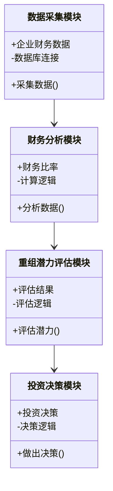
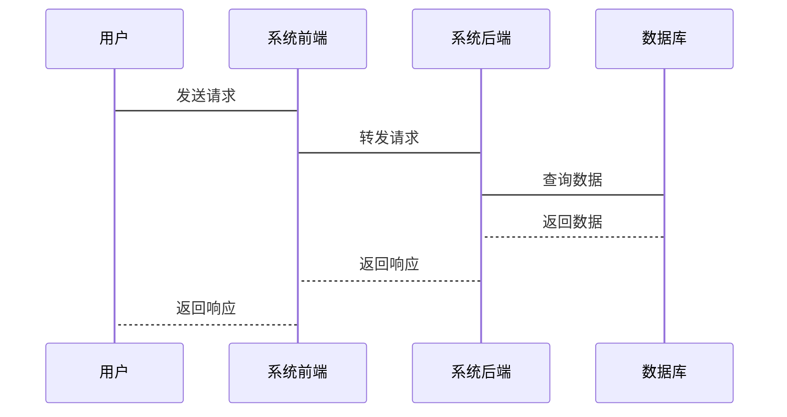

                 


# 塞斯·卡拉曼的破产重组投资策略

> 关键词：破产重组，投资策略，塞斯·卡拉曼，财务分析，投资模型

> 摘要：本文详细介绍了塞斯·卡拉曼的破产重组投资策略，从背景、核心概念到算法原理、系统架构，再到项目实战和最佳实践，全面解析了这一策略的实施过程和关键点。通过案例分析和代码实现，帮助读者理解和应用这一投资策略。

---

## 第1章: 破产重组与投资策略背景

### 1.1 破产重组的基本概念

#### 1.1.1 破产重组的定义
破产重组是指企业在无法偿还债务的情况下，通过法律程序重新组织和调整其资产和负债结构，以恢复财务健康的过程。这一过程旨在为企业提供一个喘息的机会，使其能够重新开始运营。

#### 1.1.2 破产重组的类型
破产重组主要分为两种类型：
1. **自愿重组**：企业主动申请重组，通常在面临财务危机时寻求解决方案。
2. **非自愿重组**：由于债权人提起诉讼，企业被迫进入重组程序。

#### 1.1.3 破产重组的法律框架
不同国家和地区对破产重组的法律框架有所不同，但通常包括以下步骤：
1. 企业申请破产保护。
2. 法院任命管理人。
3. 制定重组计划并提交债权人批准。
4. 执行重组计划。

### 1.2 投资策略的基本原理

#### 1.2.1 投资策略的核心概念
投资策略是指投资者在市场中进行资产配置和投资决策的系统方法。在破产重组的背景下，投资者需要评估企业的潜在恢复价值，寻找重组中的投资机会。

#### 1.2.2 投资策略的分类
投资策略主要分为以下几类：
1. **价值投资**：寻找被市场低估的企业。
2. **成长投资**：投资于具有高增长潜力的企业。
3. **趋势投资**：根据市场趋势进行投资。

#### 1.2.3 投资策略与破产重组的关系
破产重组为投资者提供了潜在的高回报机会，尤其是在企业恢复后，其价值可能大幅上升。投资者需要通过详细的财务分析和市场研究，识别具有重组潜力的企业。

### 1.3 塞斯·卡拉曼的破产重组投资策略

#### 1.3.1 塞斯·卡拉曼的背景介绍
塞斯·卡拉曼是一位著名的企业家和投资者，以其在破产重组领域的成功案例而闻名。他擅长通过分析企业的财务状况，识别其潜在价值，并制定有效的重组计划。

#### 1.3.2 其他成功案例分析
通过分析其他成功案例，我们可以了解塞斯·卡拉曼的策略如何在实际操作中发挥作用。例如，他在某制造企业的重组过程中，通过优化供应链和成本控制，使企业恢复了财务健康。

#### 1.3.3 破产重组投资策略的适用场景
破产重组投资策略适用于以下场景：
1. 企业面临财务危机，但具有潜在恢复价值。
2. 市场环境变化导致企业短期困境。
3. 债权人和股东之间的利益冲突。

---

## 第2章: 破产重组的核心概念与联系

### 2.1 破产重组的原理

#### 2.1.1 破产重组的基本流程
破产重组的基本流程包括：
1. 企业申请破产保护。
2. 法院任命管理人。
3. 制定重组计划。
4. 提交债权人批准。
5. 执行重组计划。

#### 2.1.2 破产重组的关键要素
1. **财务状况评估**：分析企业的资产、负债和现金流。
2. **重组计划制定**：包括债务重组、资产重组等。
3. **债权人协商**：与债权人达成一致，确保重组计划的实施。

#### 2.1.3 破产重组的驱动因素
1. **财务困境**：企业无法偿还债务。
2. **市场变化**：行业变化导致企业竞争力下降。
3. **管理问题**：内部管理不善导致企业亏损。

### 2.2 破产重组与投资策略的关系

#### 2.2.1 破产重组对投资策略的影响
破产重组为投资者提供了潜在的高回报机会，尤其是在企业恢复后，其价值可能大幅上升。投资者需要通过详细的财务分析和市场研究，识别具有重组潜力的企业。

#### 2.2.2 投资策略对破产重组的指导作用
投资策略可以帮助企业在重组过程中制定有效的财务管理和战略规划，从而提高重组成功的可能性。

#### 2.2.3 破产重组与投资策略的协同效应
通过协同效应，破产重组和投资策略可以共同促进企业的恢复和发展。投资者提供资金支持，企业通过重组优化资产结构，实现双赢。

### 2.3 破产重组的ER实体关系图

```mermaid
erDiagram
    actor 投资者
    actor 债权人
    actor 管理人
    actor 企业
    投资者 --> 管理人 : 提供资金
    债权人 --> 管理人 : 要求偿债
    企业 --> 管理人 : 提供财务信息
    管理人 --> 企业 : 制定重组计划
```

---

## 第3章: 破产重组投资策略的算法原理

### 3.1 破产重组评估算法

#### 3.1.1 破产重组评估流程

1. **数据采集**：收集企业的财务数据，包括资产负债表、利润表等。
2. **财务分析**：通过财务指标（如流动比率、速动比率）评估企业的偿债能力。
3. **重组潜力评估**：基于财务分析结果，评估企业的重组潜力。
4. **投资决策**：根据评估结果，决定是否进行投资。

#### 3.1.2 破产重组评估的数学模型

$$
\text{流动比率} = \frac{\text{流动资产}}{\text{流动负债}}
$$

$$
\text{速动比率} = \frac{\text{速动资产}}{\text{流动负债}}
$$

#### 3.1.3 破产重组评估的Python实现

```python
def calculate_financial_ratios(assets, liabilities, current_assets, current_liabilities):
    # 计算流动比率
    current_ratio = current_assets / current_liabilities
    # 计算速动比率
    quick_ratio = (current_assets - inventory) / current_liabilities
    return current_ratio, quick_ratio

# 示例数据
assets = 1000000
liabilities = 800000
current_assets = 500000
current_liabilities = 400000
inventory = 100000

current_ratio, quick_ratio = calculate_financial_ratios(assets, liabilities, current_assets, current_liabilities)
print(f"流动比率: {current_ratio}")
print(f"速动比率: {quick_ratio}")
```

### 3.2 投资策略优化算法

#### 3.2.1 投资组合优化的数学模型

$$
\max \sum_{i=1}^{n} w_i r_i
$$

$$
\text{subject to} \quad \sum_{i=1}^{n} w_i = 1
$$

其中，\( w_i \) 是第 \( i \) 个资产的投资权重，\( r_i \) 是第 \( i \) 个资产的预期收益率。

#### 3.2.2 投资组合优化的Python实现

```python
import numpy as np
from scipy.optimize import minimize

# 示例数据
returns = np.array([0.1, 0.15, 0.08])
weights = np.array([1/3, 1/3, 1/3])

def objective(weights):
    return -np.sum(weights * returns)

# 约束条件
constraints = [
    {'type': 'eq', 'fun': lambda w: np.sum(w) - 1}
]

result = minimize(objective, weights, constraints=constraints)
print(result)
```

---

## 第4章: 系统分析与架构设计

### 4.1 破产重组投资策略的系统分析

#### 4.1.1 系统功能设计

1. **数据采集模块**：收集企业的财务数据。
2. **财务分析模块**：计算财务比率，评估企业的偿债能力。
3. **重组潜力评估模块**：基于财务分析结果，评估企业的重组潜力。
4. **投资决策模块**：根据评估结果，决定是否进行投资。

#### 4.1.2 系统功能设计的类图



### 4.2 系统架构设计

#### 4.2.1 系统架构设计

```mermaid
archiDiagram
    部署节点 系统前端
    部署节点 系统后端
    部署节点 数据库
    系统前端 --> 系统后端 : HTTP请求
    系统后端 --> 数据库 : 数据存储
```

#### 4.2.2 系统接口设计

1. **数据接口**：提供API接口，供其他系统调用。
2. **用户界面**：提供友好的用户界面，供用户进行操作。

#### 4.2.3 系统交互序列图



---

## 第5章: 项目实战

### 5.1 环境安装

#### 5.1.1 安装Python环境

```bash
python --version
pip install numpy
pip install scipy
pip install matplotlib
```

### 5.2 系统核心实现

#### 5.2.1 破产重组评估模块的实现

```python
import numpy as np
from scipy.optimize import minimize

def calculate_financial_ratios(assets, liabilities, current_assets, current_liabilities):
    current_ratio = current_assets / current_liabilities
    quick_assets = current_assets - inventory
    quick_ratio = quick_assets / current_liabilities
    return current_ratio, quick_ratio

# 示例数据
assets = 1000000
liabilities = 800000
current_assets = 500000
current_liabilities = 400000
inventory = 100000

current_ratio, quick_ratio = calculate_financial_ratios(assets, liabilities, current_assets, current_liabilities)
print(f"流动比率: {current_ratio}")
print(f"速动比率: {quick_ratio}")
```

### 5.3 实际案例分析

#### 5.3.1 某制造企业的案例

通过分析某制造企业的财务数据，评估其重组潜力，并制定相应的投资策略。

---

## 第6章: 最佳实践

### 6.1 风险控制

1. **分散投资**：避免将所有资金投入到单一企业。
2. **定期评估**：定期评估投资组合的风险和收益。

### 6.2 数据收集与分析

1. **数据准确性**：确保数据的准确性和完整性。
2. **数据分析**：使用先进的数据分析工具，提高评估的准确性。

### 6.3 团队协作

1. **团队合作**：建立高效的团队协作机制。
2. **知识共享**：鼓励团队成员之间的知识共享。

---

## 第7章: 小结

### 7.1 章节总结

通过本文的介绍，我们了解了塞斯·卡拉曼的破产重组投资策略，从背景、核心概念到算法原理、系统架构，再到项目实战和最佳实践，全面解析了这一策略的实施过程和关键点。

### 7.2 学习要点

1. **理解破产重组的基本概念**：掌握破产重组的定义、类型和法律框架。
2. **掌握投资策略的基本原理**：了解投资策略的核心概念和分类。
3. **学习算法原理**：理解破产重组评估算法和投资组合优化算法。
4. **系统分析与设计**：掌握系统功能设计、架构设计和接口设计。
5. **项目实战**：通过实际案例分析，掌握破产重组投资策略的应用。

### 7.3 重要性

破产重组投资策略在帮助企业恢复财务健康的同时，也为投资者提供了潜在的高回报机会。通过本文的学习，读者可以更好地理解这一策略，并在实际操作中加以应用。

---

## 第8章: 注意事项

### 8.1 风险提示

1. **市场风险**：市场环境的变化可能会影响投资结果。
2. **法律风险**：破产重组涉及复杂的法律程序，需谨慎处理。
3. **操作风险**：操作不当可能导致投资失败。

### 8.2 其他注意事项

1. **数据隐私**：在数据收集和分析过程中，需注意保护数据隐私。
2. **合规性**：确保所有操作符合相关法律法规。

---

## 第9章: 拓展阅读

### 9.1 推荐书籍

1. 《企业破产重组与投资策略》
2. 《投资学基础》
3. 《破产法与投资保护》

### 9.2 推荐资源

1. [破产重组相关论坛](https://www.bakruptcy-restructuring.com)
2. [投资策略学习平台](https://investment-strategy.org)
3. [法律咨询网站](https://legal-advice.com)

---

## 作者信息

作者：AI天才研究院/AI Genius Institute & 禅与计算机程序设计艺术/Zen And The Art of Computer Programming

