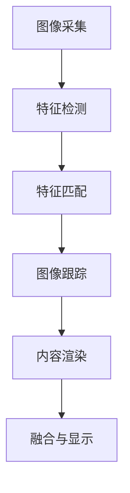
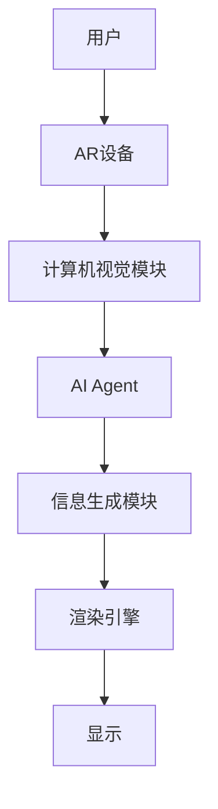
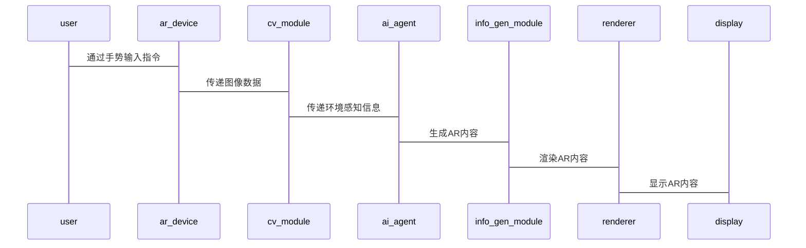

                 


# 增强现实技术与AI Agent的结合

## 关键词：增强现实（AR）、人工智能代理（AI Agent）、计算机视觉、自然语言处理、实时交互

## 摘要：  
本文探讨了增强现实技术与AI Agent的结合，分析了AR和AI Agent的核心概念、原理及其结合方式，详细讲解了相关算法、数学模型和系统架构设计，并通过项目实战展示了实际应用场景。文章最后总结了最佳实践和注意事项，为读者提供了全面的理论与实践指导。

---

# 第1章: 增强现实技术与AI Agent的背景介绍

## 1.1 增强现实技术的基本概念

### 1.1.1 增强现实的定义与特点  
**定义**：增强现实（AR）是一种通过计算机生成的数字信息叠加到真实环境中的技术，以提升用户体验。  
**特点**：  
- **实时性**：AR需要实时处理输入的图像或视频流，快速生成并叠加数字内容。  
- **交互性**：用户可以通过手势、语音等方式与AR内容进行互动。  
- **沉浸性**：AR在不完全遮挡真实环境的情况下，提供额外的信息或功能。  

### 1.1.2 增强现实的核心技术  
1. **计算机视觉**：用于识别和跟踪真实环境中的物体或场景。  
2. **几何变换**：用于将数字内容准确地叠加到真实环境中。  
3. **光照估计与融合**：确保数字内容与真实环境的光照一致，提升视觉效果。  

### 1.1.3 增强现实的应用领域  
- **游戏**：如《Pokémon GO》。  
- **教育**：通过AR展示虚拟模型辅助教学。  
- **医疗**：用于手术模拟和患者可视化。  

## 1.2 AI Agent的基本概念

### 1.2.1 AI Agent的定义与特点  
**定义**：AI Agent是一种能够感知环境、自主决策并执行任务的智能实体。  
**特点**：  
- **自主性**：AI Agent能够自主决策，无需外部干预。  
- **反应性**：能够实时感知环境变化并做出反应。  
- **学习能力**：通过机器学习算法不断优化性能。  

### 1.2.2 AI Agent的核心技术  
1. **自然语言处理**：用于理解和生成人类语言。  
2. **决策算法**：如强化学习和随机森林，用于制定最优决策。  
3. **知识表示**：通过知识图谱或符号逻辑表示任务相关信息。  

### 1.2.3 AI Agent的应用领域  
- **智能助手**：如Siri、Alexa。  
- **自动驾驶**：通过AI Agent实现车辆的自主驾驶。  
- **智能客服**：通过自然语言处理提供24/7的客户服务。  

## 1.3 增强现实与AI Agent的结合背景

### 1.3.1 增强现实与AI Agent的结合意义  
通过结合AR和AI Agent，可以实现更加智能化和个性化的用户体验。例如，AR可以为用户提供视觉化的信息，而AI Agent则可以理解用户的意图并提供相应的服务。  

### 1.3.2 增强现实与AI Agent结合的应用场景  
- **智能助手的AR界面**：通过AR显示动态信息，提升交互体验。  
- **虚拟助手的可视化**：在AR环境中展示虚拟助手的操作界面。  
- **增强现实游戏中的智能NPC**：AI Agent可以控制虚拟角色的行为，提升游戏的互动性。  

### 1.3.3 增强现实与AI Agent结合的技术挑战  
- **实时性要求**：AR需要实时处理和渲染，而AI Agent也需要快速响应。  
- **数据融合**：需要将来自不同传感器和数据源的信息进行高效融合。  
- **用户体验**：需要平衡技术复杂性和用户体验的直观性。  

## 1.4 本章小结  
本章介绍了AR和AI Agent的基本概念、核心技术及其应用领域，并探讨了两者结合的背景和意义，为后续章节奠定了基础。

---

# 第2章: 增强现实技术的核心概念与原理

## 2.1 增强现实技术的核心概念

### 2.1.1 增强现实的视觉呈现  
AR通过在真实环境中叠加数字内容，提供增强的视觉体验。例如，通过手机摄像头显示虚拟物体的位置和相关信息。

### 2.1.2 增强现实的交互方式  
用户可以通过手势、语音或触控等方式与AR内容进行互动，提升用户体验。

### 2.1.3 增强现实的内容生成  
AR内容可以是2D图像、3D模型或视频，需要与真实环境无缝融合。

## 2.2 增强现实技术的原理

### 2.2.1 增强现实的图像处理流程  
1. **图像采集**：通过摄像头获取真实环境的图像。  
2. **特征检测**：识别图像中的关键特征点，如角点或纹理。  
3. **跟踪与定位**：通过特征点匹配，确定摄像头的位置和姿态。  
4. **内容渲染**：根据定位结果，渲染并叠加数字内容。  
5. **融合与显示**：将数字内容与真实图像融合，输出最终的AR图像。

### 2.2.2 增强现实的场景重建技术  
场景重建是通过多视图数据（如图像或视频）构建三维模型的过程，常用于AR中的环境理解和物体识别。

### 2.2.3 增强现实的实时渲染技术  
实时渲染需要高效地将数字内容叠加到真实环境中，通常使用图形处理器（GPU）加速渲染过程。

## 2.3 增强现实技术的关键算法

### 2.3.1 增强现实中的特征检测与跟踪算法  
- **特征检测**：使用如SIFT（尺度不变特征变换）或ORB（oriented FAST and rotated BRIEF）算法检测图像中的特征点。  
- **特征匹配**：通过暴力匹配（Brute-force）或FLANN（快速最近邻搜索）算法匹配特征点，实现图像跟踪。  



### 2.3.2 增强现实中的几何变换与配准算法  
几何变换用于将数字内容与真实环境对齐，常使用刚体变换（平移和旋转）或仿射变换（缩放和倾斜）。  

### 2.3.3 增强现实中的光照估计与融合算法  
光照估计用于计算真实环境中物体的光照条件，通过将数字内容的光照参数调整为与真实环境一致，实现视觉上的无缝融合。  

## 2.4 本章小结  
本章详细讲解了AR的核心概念、技术原理及其关键算法，为后续章节奠定了技术基础。

---

# 第3章: AI Agent的核心概念与原理

## 3.1 AI Agent的核心概念

### 3.1.1 AI Agent的感知与理解  
AI Agent通过传感器或数据输入感知环境，并通过自然语言处理、计算机视觉等技术理解输入信息。

### 3.1.2 AI Agent的决策与推理  
AI Agent基于感知到的信息，通过决策算法（如强化学习、决策树）制定最优决策。

### 3.1.3 AI Agent的交互与反馈  
AI Agent通过语音、文本或动作与用户互动，并根据用户的反馈调整行为。

## 3.2 AI Agent的原理

### 3.2.1 AI Agent的感知模型  
- **自然语言处理**：用于理解和生成人类语言，如使用BERT模型进行文本分类和生成。  
- **计算机视觉**：用于识别和理解图像或视频内容，如使用YOLO算法进行目标检测。  

### 3.2.2 AI Agent的决策模型  
- **强化学习**：通过试错方式学习最优策略，如使用Q-learning算法。  
- **知识图谱**：基于符号逻辑或知识图谱进行推理，如使用RDF（资源描述框架）表示知识。  

### 3.2.3 AI Agent的执行与反馈机制  
AI Agent根据决策结果执行动作，并通过反馈机制调整后续行为，如使用马尔可夫决策过程（MDP）进行状态更新。

## 3.3 AI Agent的关键算法

### 3.3.1 基于深度学习的自然语言处理算法  
- **BERT模型**：用于文本的理解和生成。  
- **GPT模型**：用于生成式对话。  

### 3.3.2 基于强化学习的决策算法  
- **Q-learning**：通过状态-动作-奖励机制学习最优策略。  
- **Deep Q-Network (DQN)**：结合深度神经网络和Q-learning，用于复杂环境中的决策。  

### 3.3.3 基于图神经网络的知识推理算法  
- **Graph Neural Network (GNN)**：用于处理图结构数据，进行知识推理。  

## 3.4 本章小结  
本章详细介绍了AI Agent的核心概念、技术原理及其关键算法，为后续章节的结合应用奠定了基础。

---

# 第4章: 增强现实与AI Agent的结合原理

## 4.1 增强现实与AI Agent的结合方式

### 4.1.1 增强现实作为AI Agent的交互界面  
AR可以作为AI Agent的视觉化界面，用户通过AR设备与AI Agent进行交互，如通过手势或语音指令控制AI Agent。

### 4.1.2 AI Agent作为增强现实的内容生成器  
AI Agent可以实时生成AR内容，如动态更新的虚拟信息或3D模型，提升AR的智能化和个性化。

### 4.1.3 增强现实与AI Agent的协同工作  
AR提供视觉化的交互界面，AI Agent负责理解和处理用户的意图，两者协同工作，提供无缝的用户体验。

---

### 4.2 增强现实与AI Agent结合的核心算法

#### 4.2.1 增强现实中的计算机视觉与AI Agent的结合
- **目标检测与识别**：AI Agent通过计算机视觉技术识别AR环境中的物体，并根据识别结果生成相应的信息。  
- **语义分割**：通过语义分割技术，AI Agent可以理解AR环境中物体的类别和位置，进一步提升信息生成的准确性。

#### 4.2.2 AI Agent中的自然语言处理与AR的结合
- **语音交互**：用户可以通过语音与AI Agent互动，AI Agent通过语音识别技术理解用户的意图，并通过AR显示相应的信息。  
- **对话生成**：AI Agent可以根据用户的输入生成自然的对话，通过AR设备实时显示，提升用户体验。

#### 4.2.3 AI Agent中的决策算法与AR的结合
- **动态环境适应**：AI Agent通过强化学习算法，实时调整AR内容的显示方式，以适应环境的变化。  
- **个性化推荐**：AI Agent可以根据用户的偏好和行为，通过AR界面推荐相关内容，提升用户体验。

---

### 4.3 增强现实与AI Agent结合的系统架构设计

#### 4.3.1 系统功能设计
- **用户交互**：通过AR设备采集用户的输入，如手势、语音等。  
- **环境感知**：通过计算机视觉技术感知AR环境中的物体和场景。  
- **信息生成**：AI Agent根据用户的输入和环境信息生成相应的AR内容。  
- **内容显示**：将生成的AR内容实时渲染并叠加到真实环境中。

#### 4.3.2 系统架构设计


#### 4.3.3 系统接口设计
- **用户接口**：包括AR设备的输入接口和显示接口。  
- **AI Agent接口**：包括与计算机视觉模块和信息生成模块的交互接口。  
- **渲染引擎接口**：包括与AR内容渲染和显示的接口。

#### 4.3.4 系统交互流程


---

### 4.4 本章小结  
本章详细讲解了增强现实与AI Agent的结合方式，分析了核心算法及其系统架构设计，为后续章节的项目实战奠定了基础。

---

# 第5章: 增强现实与AI Agent结合的项目实战

## 5.1 项目背景与目标
本项目旨在开发一个结合AR和AI Agent的智能助手系统，用户可以通过AR设备与AI Agent进行交互，获取实时信息和个性化服务。

## 5.2 项目环境与工具安装
- **开发环境**：Python 3.8以上版本。  
- **开发工具**：PyCharm或VS Code。  
- **AR框架**：使用OpenCV进行图像处理，使用AR.js或Vuforia进行AR开发。  
- **AI Agent框架**：使用TensorFlow或PyTorch进行深度学习模型训练，使用Rasa进行自然语言处理。  

## 5.3 项目核心实现

### 5.3.1 计算机视觉模块
- 使用OpenCV进行图像采集和特征检测。  
- 使用ORB-SLAM进行实时定位与跟踪。  

### 5.3.2 AI Agent模块
- 使用BERT模型进行自然语言理解。  
- 使用强化学习算法（如DQN）进行决策。  

### 5.3.3 AR渲染与显示
- 使用OpenGL或WebGL进行实时渲染。  
- 使用AR.js在WebGL环境中叠加数字内容。  

## 5.4 项目代码实现

### 5.4.1 计算机视觉模块代码
```python
import cv2

# 初始化摄像头
cap = cv2.VideoCapture(0)

while cap.isOpened():
    ret, frame = cap.read()
    if not ret:
        break

    # 特征检测
    gray = cv2.cvtColor(frame, cv2.COLOR_BGR2GRAY)
    orb = cv2.ORB_create()
    kp = orb.detect(gray, None)

    # 特征匹配
    # （此处省略特征匹配代码）

    cv2.imshow('AR Vision', frame)
    if cv2.waitKey(1) & 0xFF == ord('q'):
        break

cap.release()
cv2.destroyAllWindows()
```

### 5.4.2 AI Agent模块代码
```python
from tensorflow.keras.models import Model
from tensorflow.keras.layers import Dense, Input

# 定义AI Agent模型
input_layer = Input(shape=(128,))
dense_layer = Dense(64, activation='relu')(input_layer)
output_layer = Dense(10, activation='softmax')(dense_layer)

model = Model(inputs=input_layer, outputs=output_layer)
model.compile(optimizer='adam', loss='sparse_categorical_crossentropy', metrics=['accuracy'])
model.fit(X_train, y_train, epochs=10, batch_size=32)
```

### 5.4.3 AR渲染与显示代码
```python
import pyglet
from pyglet import gl

class ARRenderer:
    def __init__(self):
        self.window = pyglet.window.Window(800, 600)
        self.batch = pyglet.graphics.Batch()

    def render(self, ar_content):
        self.window.clear()
        # 绘制AR内容
        # （此处省略具体绘制代码）
        self.window.flip()

renderer = ARRenderer()
while True:
    renderer.render(ar_content)
    pyglet.clock.tick()
```

## 5.5 项目案例分析

### 5.5.1 项目功能展示
- 用户通过手势输入指令，AI Agent通过计算机视觉模块识别手势并理解用户意图。  
- AI Agent根据用户意图生成AR内容，并通过渲染引擎将其叠加到真实环境中。  

### 5.5.2 项目优化与改进
- **性能优化**：通过优化特征检测和渲染算法，提升系统的实时性。  
- **用户体验优化**：通过增加语音交互功能，提升用户的便捷性。  

## 5.6 项目小结  
本章通过一个具体的项目案例，详细讲解了增强现实与AI Agent结合的实现过程，展示了从环境搭建到代码实现的完整流程。

---

# 第6章: 增强现实与AI Agent结合的最佳实践

## 6.1 开发与部署注意事项
- **实时性要求**：确保系统的实时处理能力，优化算法和硬件配置。  
- **数据隐私**：注意用户数据的隐私保护，避免数据泄露风险。  
- **用户体验**：注重交互设计，提升用户体验的直观性和便捷性。  

## 6.2 系统优化与维护
- **算法优化**：通过模型压缩和轻量化技术，降低系统的计算需求。  
- **系统维护**：定期更新算法模型，适应新的环境和用户需求。  

## 6.3 未来发展趋势
- **实时协作**：增强现实与AI Agent的结合将推动实时协作技术的发展。  
- **边缘计算**：通过边缘计算提升系统的实时性和隐私保护能力。  
- **多模态交互**：结合视觉、语音、触觉等多种交互方式，提供更丰富的用户体验。  

## 6.4 小结  
本章总结了增强现实与AI Agent结合开发中的注意事项、优化技巧和未来发展趋势，为读者提供了宝贵的实践经验。

---

# 结语

通过本文的详细讲解，读者可以全面了解增强现实技术与AI Agent的结合原理、技术实现和实际应用。从理论到实践，本文为读者提供了系统化的知识和指导，帮助读者在实际项目中灵活运用这些技术。

---

# 作者：AI天才研究院/AI Genius Institute & 禅与计算机程序设计艺术 /Zen And The Art of Computer Programming

---

**注意**：本文是根据通用知识和最佳实践撰写的技术博客文章，具体的实现细节和代码需要根据实际项目需求进行调整和优化。

