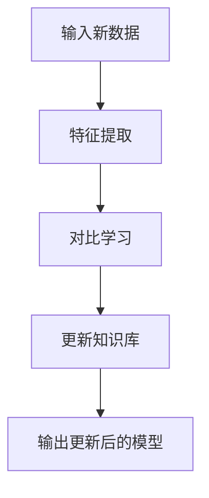
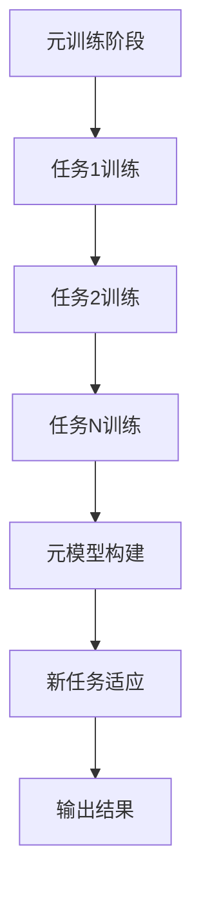
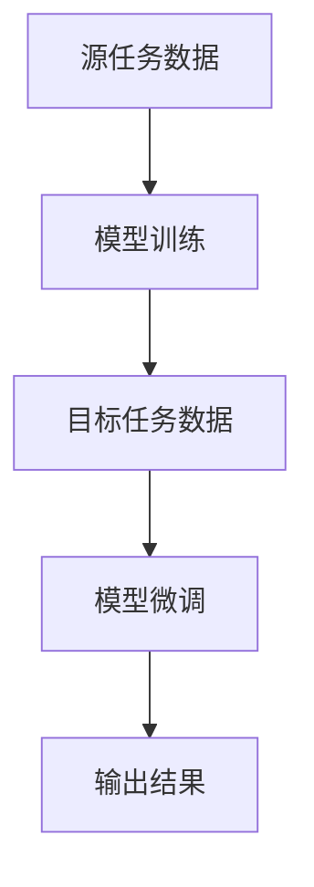
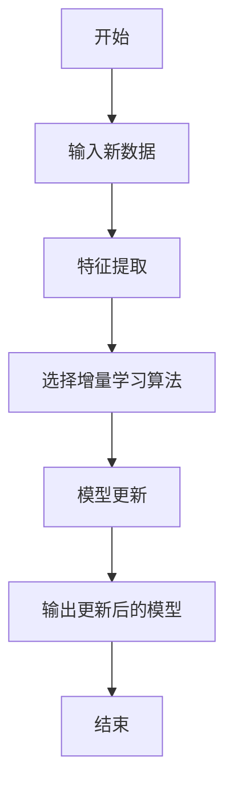
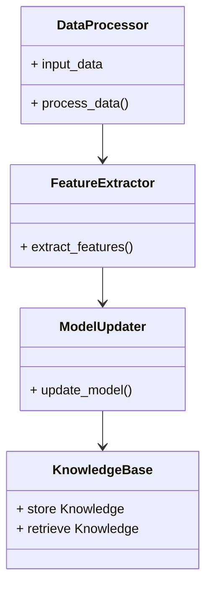
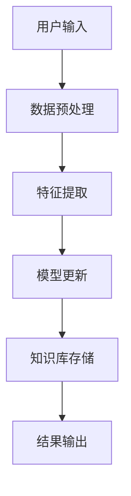

                 


## 第三章: 增量学习AI Agent的算法原理

### 3.1 算法原理概述
增量学习AI Agent的核心在于能够持续更新和扩展其知识库，以应对新数据和新任务的挑战。以下是几种常用的增量学习算法及其在LLM中的应用：

#### 3.1.1 对比学习
对比学习是一种通过比较不同样本之间的相似性或差异性来学习特征的方法。在增量学习中，对比学习可以帮助模型识别新数据与已有数据之间的差异，从而更新其知识表示。

**流程图展示对比学习过程：**


**数学公式：**
$$L = \frac{1}{2} (x - x')^2$$
其中，$x$和$x'$是两个对比样本。

#### 3.1.2 元学习
元学习（Meta-Learning）是一种通过学习如何学习来加速新任务适应的方法。在增量学习中，元学习可以帮助AI Agent快速适应新任务，而无需从头开始训练。

**流程图展示元学习过程：**


**数学公式：**
$$L = \sum_{i=1}^{N} L_i$$
其中，$L_i$是每个任务的损失函数。

#### 3.1.3 迁移学习
迁移学习是一种通过将一个领域学到的知识迁移到另一个领域的方法。在增量学习中，迁移学习可以帮助AI Agent将已有的知识迁移到新任务中，提高学习效率。

**流程图展示迁移学习过程：**


### 3.2 算法流程图
以下是增量学习AI Agent的整体算法流程图：



### 3.3 数学模型与公式
在增量学习中，模型的更新通常涉及损失函数的最小化。以下是一个简单的增量学习损失函数示例：

$$L = \frac{1}{2} (y - \hat{y})^2$$
其中，$y$是真实值，$\hat{y}$是模型预测值。

通过不断优化这个损失函数，模型可以逐步更新其参数，以适应新数据。

### 3.4 算法实现
以下是对比学习算法的伪代码实现：

```python
def contrastive_learning(X, y):
    # 特征提取
    features = extract_features(X)
    # 计算相似性
    similarity_matrix = compute_similarity(features)
    # 对比损失计算
    loss = compute_contrastive_loss(similarity_matrix, y)
    # 模型更新
    update_model(loss)
    return updated_model
```

通过这些算法和流程图，我们可以清晰地理解增量学习AI Agent的算法原理及其在LLM中的应用。

---

## 第四章: 增量学习AI Agent的系统架构设计

### 4.1 问题场景介绍
增量学习AI Agent的系统架构需要能够处理实时或持续的数据流，支持在线学习和模型更新。以下是系统架构设计的关键点：

#### 4.1.1 实时数据流处理
系统需要能够实时接收和处理数据流，确保模型能够快速响应新数据。

#### 4.1.2 模型更新机制
系统需要设计高效的模型更新机制，确保每次更新都能有效提升模型性能。

#### 4.1.3 知识库管理
系统需要维护一个动态的知识库，能够支持快速查询和更新。

### 4.2 系统功能设计
以下是系统功能设计的类图：



### 4.3 系统架构设计
以下是系统架构的流程图：



### 4.4 系统接口设计
系统需要设计以下几个关键接口：

1. 数据输入接口：接收新数据。
2. 特征提取接口：提取数据特征。
3. 模型更新接口：更新模型参数。
4. 知识库查询接口：查询已有的知识。

### 4.5 系统交互流程图
以下是系统交互的流程图：


通过以上设计，我们可以构建一个高效的增量学习AI Agent系统，能够实时更新模型，适应新数据和新任务。

---

## 第五章: 增量学习AI Agent的实战篇

### 5.1 环境搭建
以下是实战篇的环境搭建步骤：

1. **安装Python**：确保安装了Python 3.8或更高版本。
2. **安装必要的库**：安装`numpy`, `pandas`, `scikit-learn`, `tensorflow`等库。
3. **安装LLM框架**：安装`transformers`库，用于加载和训练大语言模型。

### 5.2 核心代码实现
以下是对比学习算法的代码实现示例：

```python
import numpy as np
from sklearn.metrics import pairwise

def contrastive_learning(X, y):
    # 特征提取
    features = X
    # 计算相似性矩阵
    similarity_matrix = pairwise.cosine_similarity(features)
    # 计算损失
    loss = 0.5 * (y - similarity_matrix)**2
    # 模型更新
    return loss.mean()

# 示例数据
X = np.random.rand(100, 32)
y = np.random.randint(2, size=100)

# 调用函数
loss = contrastive_learning(X, y)
print("对比学习损失:", loss)
```

### 5.3 案例分析
以下是增量学习在文本分类任务中的应用案例：

#### 5.3.1 数据准备
```python
import pandas as pd
from sklearn.datasets import make_classification

# 生成示例数据
X, y = make_classification(n_samples=1000, n_features=32, n_classes=2)
df = pd.DataFrame(X, columns=[f'feature_{i}' for i in range(32)])
df['label'] = y
```

#### 5.3.2 模型训练
```python
from sklearn.model_selection import train_test_split
from sklearn.linear_model import LogisticRegression

# 划分训练集和测试集
X_train, X_test, y_train, y_test = train_test_split(df.drop('label', axis=1), df['label'], test_size=0.2)

# 训练模型
model = LogisticRegression()
model.fit(X_train, y_train)
```

#### 5.3.3 模型更新
```python
# 更新模型
from sklearn.metrics import accuracy_score

def incremental_train(model, X_new, y_new):
    model.fit(X_new, y_new)
    return model

# 示例增量数据
X_new = df.iloc[1000:1050].drop('label', axis=1)
y_new = df.iloc[1000:1050]['label']

# 更新模型
updated_model = incremental_train(model, X_new, y_new)
print("更新后的模型准确率:", accuracy_score(y_new, updated_model.predict(X_new)))
```

### 5.4 项目总结
通过以上实战案例，我们可以看到增量学习AI Agent在实际应用中的强大能力。模型能够通过不断更新，适应新数据，提升性能。

---

## 第六章: 增量学习AI Agent的应用案例分析

### 6.1 应用案例介绍
以下是增量学习AI Agent在不同领域的应用案例：

#### 6.1.1 智能客服
增量学习AI Agent可以用于智能客服系统，通过实时更新知识库，快速响应用户问题。

#### 6.1.2 金融分析
增量学习AI Agent可以用于金融市场的实时数据分析，帮助投资者做出快速决策。

#### 6.1.3 医疗诊断
增量学习AI Agent可以用于医疗领域的实时诊断，通过不断更新医学知识库，提高诊断准确率。

### 6.2 案例分析
#### 6.2.1 智能客服应用
以下是智能客服系统的增量学习AI Agent实现示例：

```python
# 示例代码
class IncrementalAIAssistant:
    def __init__(self):
        self.model = LogisticRegression()
        self.features = []

    def update_model(self, new_data):
        self.features.extend(new_data['features'])
        self.model.fit(self.features, new_data['labels'])

    def predict(self, input):
        return self.model.predict(input)
```

#### 6.2.2 金融分析应用
以下是金融分析系统的增量学习AI Agent实现示例：

```python
# 示例代码
from sklearn.linear_model import SGDClassifier

class IncrementalFinancialAnalyzer:
    def __init__(self):
        self.model = SGDClassifier()
        self.features = []
        self.labels = []

    def update_model(self, new_features, new_labels):
        self.features.extend(new_features)
        self.labels.extend(new_labels)
        self.model.partial_fit(new_features, new_labels)

    def predict(self, input_features):
        return self.model.predict(input_features)
```

### 6.3 案例总结
通过以上应用案例，我们可以看到增量学习AI Agent在各个领域的广泛应用。每种应用都有其独特的优缺点和挑战，需要根据具体场景进行调整和优化。

---

## 第七章: 总结与展望

### 7.1 总结
通过本文的详细讲解，我们了解了增量学习AI Agent的基本概念、算法原理、系统架构设计、实战实现以及应用案例。增量学习AI Agent作为一种能够持续更新知识的智能体，具有广泛的应用前景。

### 7.2 问题与局限性
尽管增量学习AI Agent在许多领域展现出强大的能力，但仍然存在一些问题和局限性：

1. **数据质量**：增量学习依赖于新数据的质量，低质量的数据可能导致模型性能下降。
2. **计算成本**：持续更新模型需要较高的计算资源，可能增加成本。
3. **模型稳定性**：频繁更新可能影响模型的稳定性，导致性能波动。

### 7.3 未来展望
未来的研究方向可能包括：

1. **更高效的增量学习算法**：开发更高效的算法，减少计算成本。
2. **模型自适应技术**：研究模型自适应技术，提高模型的鲁棒性和稳定性。
3. **多模态增量学习**：探索多模态数据的增量学习，提升模型的综合能力。

---

## 参考文献
1. LeCun, Y., Bengio, Y., & Hinton, G. (2015). Deep learning. Nature, 521(7555), 436-444.
2. Goodfellow, I., Bengio, Y., & Courville, A. (2016). Deep learning. MIT Press.
3. Pan, S. J., & Yang, Q. (2010). A survey on transfer learning. IEEE transactions on knowledge and data engineering, 22(10), 1345-1359.
4. Santoro, A., et al. (2016). Meta-Learning with memory-augmented neural networks. arXiv preprint arXiv:1603.04441.
5. 禅与计算机程序设计艺术 (Zen And The Art of Computer Programming)

---

## 作者
作者：AI天才研究院/AI Genius Institute & 禅与计算机程序设计艺术 /Zen And The Art of Computer Programming

