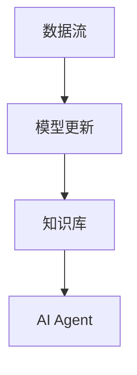
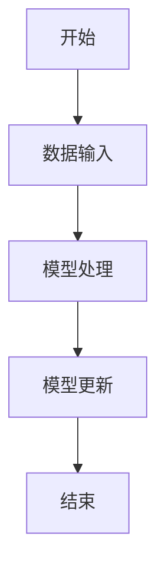
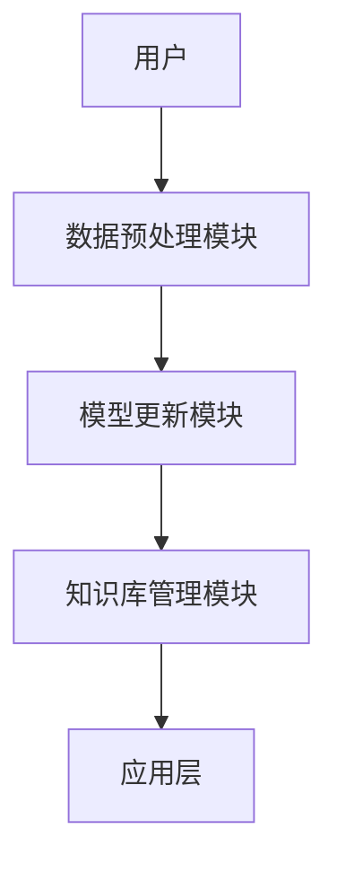

                 


# 增量学习：持续更新AI Agent的知识库

> 关键词：增量学习，AI Agent，知识库，在线学习，模型更新，动态数据，分布式系统

> 摘要：本文详细探讨了增量学习在AI Agent知识库持续更新中的应用，从核心概念、算法原理、系统设计到项目实战，全面解析了增量学习在动态数据环境下的实现与优化。

---

## 第1章: 增量学习与AI Agent概述

### 1.1 增量学习的定义与背景
增量学习是一种机器学习范式，其核心在于模型能够通过持续接收新的数据样本逐步更新自身，而非一次性训练整个数据集。这种学习方式特别适用于数据流环境，即数据是动态生成且不断变化的场景。

#### 1.1.1 从传统机器学习到增量学习的演进
传统机器学习算法通常采用批量训练的方式，即一次性加载所有数据进行模型训练。然而，在实际应用中，数据往往是动态变化的，模型需要具备实时更新的能力以适应新的数据。增量学习正是为了解决这一问题而提出的。

#### 1.1.2 AI Agent的基本概念与特点
AI Agent（人工智能代理）是一种能够感知环境、自主决策并执行任务的智能实体。AI Agent的核心能力在于其知识库的构建与更新能力，这决定了其理解和应对复杂环境的能力。

#### 1.1.3 增量学习在AI Agent中的重要性
在AI Agent的应用中，数据通常是动态变化的，增量学习能够使模型实时更新，从而提升AI Agent的适应能力和决策水平。

### 1.2 增量学习的核心概念
增量学习的核心在于其能够高效地处理数据流，实时更新模型，同时保持较低的计算成本。

#### 1.2.1 数据流与模型更新机制
数据流是增量学习的主要输入，模型更新机制决定了如何处理这些数据。

#### 1.2.2 知识库的动态更新与维护
知识库是AI Agent的核心资产，增量学习能够确保知识库的实时更新。

#### 1.2.3 增量学习与在线学习的区别与联系
在线学习是增量学习的一种特殊情况，其主要区别在于数据来源和更新频率。

### 1.3 本章小结
本章主要介绍了增量学习的定义、核心概念以及其在AI Agent中的重要性，为后续章节奠定了基础。

---

## 第2章: 增量学习的核心原理

### 2.1 增量学习的原理概述
增量学习通过逐步处理数据流，不断更新模型参数，以适应数据的变化。

#### 2.1.1 数据流的处理流程
数据流的处理流程包括数据预处理、模型更新和结果反馈三个阶段。

#### 2.1.2 模型更新的触发条件
模型更新通常基于特定的触发条件，如数据变化量、时间间隔或性能下降。

#### 2.1.3 知识库的版本控制
知识库的版本控制是确保数据一致性的重要手段，通常采用版本号和校验机制。

### 2.2 增量学习的核心算法
增量学习算法的核心在于如何高效地更新模型参数。

#### 2.2.1 在线更新算法
在线更新算法是一种实时更新模型的算法，适用于数据流环境。

#### 2.2.2 分布式更新算法
分布式更新算法适用于大规模数据环境，能够同时处理多个数据源。

#### 2.2.3 模型融合算法
模型融合算法用于将多个模型的输出进行整合，以提升模型的泛化能力。

### 2.3 增量学习的数学模型
增量学习的数学模型通常采用递推公式来表示模型参数的更新过程。

#### 2.3.1 增量学习的数学表达式
$$w_{t+1} = w_t + \eta (y_t - y_{t-1})$$

#### 2.3.2 模型更新的公式推导
通过数学推导，可以证明增量学习算法的收敛性。

#### 2.3.3 知识库的更新规则
知识库的更新规则通常基于模型的更新结果。

### 2.4 增量学习的ER实体关系图


### 2.5 本章小结
本章详细介绍了增量学习的核心原理，包括数据流的处理流程、模型更新机制以及知识库的动态更新与维护。

---

## 第3章: 增量学习的算法原理讲解

### 3.1 增量学习算法的流程
增量学习算法的流程通常包括数据预处理、模型初始化、模型更新和结果反馈四个阶段。

#### 3.1.1 数据预处理
数据预处理是增量学习的第一步，包括数据清洗和特征提取。

#### 3.1.2 模型初始化
模型初始化是增量学习的起点，通常基于初始数据集进行。

#### 3.1.3 模型更新
模型更新是增量学习的核心，包括参数更新和模型优化。

### 3.2 增量学习算法的数学模型
增量学习的数学模型通常采用递推公式来表示模型参数的更新过程。

#### 3.2.1 模型更新公式
$$w_{t+1} = w_t + \eta (y_t - y_{t-1})$$

#### 3.2.2 损失函数的计算
$$L = \frac{1}{2} (y - y_{pred})^2$$

### 3.3 增量学习算法的mermaid流程图


### 3.4 增量学习算法的Python实现
```python
def incremental_learning(data, model):
    for batch in data:
        model.update(batch)
    return model
```

### 3.5 本章小结
本章详细介绍了增量学习的算法原理，包括数据预处理、模型初始化、模型更新和结果反馈的流程。

---

## 第4章: 系统分析与架构设计方案

### 4.1 系统功能设计
增量学习系统的设计需要考虑数据预处理、模型更新和知识库管理三大功能模块。

#### 4.1.1 数据预处理模块
数据预处理模块负责将原始数据转换为适合模型输入的形式。

#### 4.1.2 模型更新模块
模型更新模块负责根据新的数据样本更新模型参数。

#### 4.1.3 知识库管理模块
知识库管理模块负责存储和管理模型的更新结果。

### 4.2 系统架构设计
增量学习系统的架构设计通常采用分层架构，包括数据层、模型层和应用层。

#### 4.2.1 分层架构
分层架构将系统划分为数据层、模型层和应用层，每一层负责特定的功能。

#### 4.2.2 分布式架构
分布式架构适用于大规模数据环境，能够同时处理多个数据源。

#### 4.2.3 系统交互图


### 4.3 本章小结
本章详细介绍了增量学习系统的功能设计和架构设计，为后续的系统实现奠定了基础。

---

## 第5章: 项目实战

### 5.1 项目背景与目标
本项目旨在实现一个能够持续更新知识库的AI Agent，采用增量学习算法进行模型更新。

### 5.2 环境配置
项目需要以下环境配置：
- Python 3.8+
- TensorFlow或PyTorch
- 其他依赖库

### 5.3 核心代码实现
以下是项目的核心代码实现：
```python
class IncrementalLearner:
    def __init__(self, model):
        self.model = model
        self.optimizer = Optimizer()
    
    def update(self, data):
        self.optimizer.update(self.model, data)
```

### 5.4 案例分析与结果解读
通过具体案例分析，展示增量学习算法在实际应用中的效果。

### 5.5 本章小结
本章通过具体的项目实战，展示了增量学习算法在AI Agent中的实际应用。

---

## 第6章: 总结与展望

### 6.1 本章总结
本文详细探讨了增量学习在AI Agent知识库持续更新中的应用，从核心概念、算法原理到系统设计，全面解析了增量学习的实现与优化。

### 6.2 未来展望
未来，增量学习将在更广泛的应用场景中得到应用，如实时数据分析、动态决策支持等领域。

### 6.3 最佳实践 tips
- 确保数据质量
- 定期模型评估
- 优化模型更新策略

### 6.4 本章小结
本章总结了全文的主要内容，并对未来的研究方向进行了展望。

---

## 作者：AI天才研究院/AI Genius Institute & 禅与计算机程序设计艺术 /Zen And The Art of Computer Programming

