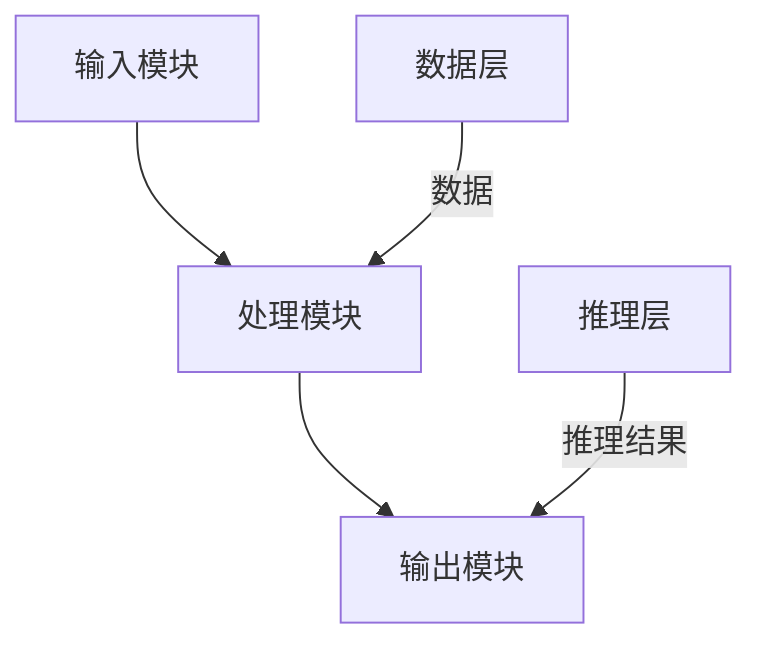

                 


# 复杂问题解决AI Agent：利用LLM进行多步骤推理

## 关键词：
- AI Agent
- 大语言模型（LLM）
- 多步骤推理
- 复杂问题建模
- 问题解决方法

## 摘要：
本文章深入探讨了如何利用大语言模型（LLM）构建复杂的AI代理，解决多步骤推理问题。从基本概念到系统架构，从算法原理到实际应用，文章详细分析了AI Agent的核心技术，展示了如何通过LLM实现智能推理，解决复杂的现实问题。文章内容包括复杂问题的建模与分析、LLM的原理与实现、多步骤推理策略、AI Agent设计与实现、项目实战以及总结与展望。

---

## 第1章: 复杂问题与AI Agent概述

### 1.1 问题背景与挑战
复杂问题广泛存在于各个领域，如金融、医疗、交通等。这些问题通常具有高度的不确定性和多样性，难以通过简单的规则或单步推理解决。AI Agent通过模拟人类的思维过程，能够处理复杂问题中的不确定性，并通过多步骤推理找到最优解决方案。

#### 1.1.1 复杂问题的定义与特点
- **定义**：复杂问题是指那些涉及多个变量、高度动态且相互关联的问题。
- **特点**：
  - 高度动态性：问题会随着时间变化。
  - 多维性：涉及多个维度的变量。
  - 不确定性：问题中存在不确定因素。
  - 依赖性：各子问题之间相互依赖。

#### 1.1.2 AI Agent的基本概念
- **定义**：AI Agent是一种智能实体，能够感知环境并采取行动以实现目标。
- **特点**：
  - 自主性：能够自主决策。
  - 反应性：能够根据环境变化做出反应。
  - 社会性：能够与其他Agent或人类进行交互。

#### 1.1.3 LLM在AI Agent中的作用
- **LLM的优势**：
  - 强大的自然语言处理能力。
  - 能够理解上下文并进行推理。
  - 可以处理多步骤问题。

### 1.2 LLM的定义与特点
- **定义**：大语言模型是一种基于深度学习的自然语言处理模型，能够理解和生成人类语言。
- **特点**：
  - 大规模训练数据。
  - 基于Transformer架构。
  - 具备上下文理解能力。

### 1.3 AI Agent与LLM的结合
- **结合方式**：
  - LLM作为AI Agent的核心推理模块。
  - AI Agent利用LLM进行自然语言理解和生成。
  - 通过多步骤推理解决复杂问题。

### 1.4 本章小结
本章介绍了复杂问题和AI Agent的基本概念，以及LLM在AI Agent中的作用，为后续章节奠定了基础。

---

## 第2章: 复杂问题的建模与分析

### 2.1 问题分析与分解
- **问题分析**：明确问题的目标、约束和边界条件。
- **问题分解**：将复杂问题分解为多个子问题，每个子问题相对独立且易于处理。

#### 2.1.1 问题分析的基本方法
- **方法**：
  - 目标识别：明确问题的目标。
  - 约束分析：识别问题中的约束条件。
  - 边界确定：确定问题的边界。

#### 2.1.2 复杂问题的分解策略
- **策略**：
  - 自顶向下分解：从整体问题开始，逐步分解为子问题。
  - 自底向上分解：从子问题开始，逐步构建整体问题。

### 2.2 问题模型的构建
- **模型构建**：通过构建领域模型，将问题转化为可计算的形式。

#### 2.2.1 领域模型的构建方法
- **方法**：
  - 状态空间建模：将问题转化为状态空间。
  - 动作空间建模：定义可能的操作。
  - 转换函数建模：定义状态转换规则。

#### 2.2.2 问题模型的表示方式
- **表示方式**：
  - 状态-动作-奖励-终止（SARL）框架。
  - 马尔可夫决策过程（MDP）模型。

#### 2.2.3 模型的验证与优化
- **验证**：通过测试用例验证模型的正确性。
- **优化**：根据实际反馈优化模型。

### 2.3 问题分析的案例
- **案例1**：任务分解。
  - 问题描述：将一个复杂任务分解为多个子任务。
  - 分解方法：自顶向下分解。
  - 模型构建：构建任务分解模型。
- **案例2**：信息提取。
  - 问题描述：从文本中提取关键信息。
  - 分解方法：自底向上分解。
  - 模型构建：构建信息提取模型。

### 2.4 本章小结
本章介绍了复杂问题的建模与分析方法，通过案例展示了如何将复杂问题分解为可处理的子问题，并构建相应的模型。

---

## 第3章: LLM的原理与实现

### 3.1 LLM的基本原理
- **定义**：大语言模型基于Transformer架构，通过自注意力机制和前馈网络实现自然语言处理。

#### 3.1.1 神经网络的基本结构
- **结构**：
  - 输入层：接收输入数据。
  - 隐藏层：通过神经网络进行特征提取。
  - 输出层：生成模型输出。

#### 3.1.2 注意力机制的原理
- **原理**：
  - 通过计算输入序列中各位置的重要性，赋予不同的权重。
  - 使用 softmax 函数计算注意力权重。
  - 加权求和得到注意力输出。

#### 3.1.3 Transformer模型的结构
- **结构**：
  - 编码器：将输入序列编码为高维向量。
  - 解码器：根据编码结果生成输出序列。

### 3.2 LLM的训练过程
- **训练目标**：最小化预测与真实值之间的损失函数。

#### 3.2.1 数据预处理
- **步骤**：
  - 数据清洗：去除噪声数据。
  - 分词：将文本分词为单词或短语。
  - 数值化：将单词映射为数值表示。

#### 3.2.2 模型训练的数学公式
- **损失函数**：交叉熵损失。
  $$ \mathcal{L} = -\sum_{i=1}^{n} \sum_{j=1}^{k} y_{i,j} \log p(y_{i,j}|x_i) $$
- **优化算法**：Adam优化器。
  $$ \theta_{t+1} = \theta_t - \eta \frac{\partial \mathcal{L}}{\partial \theta_t} $$

#### 3.2.3 优化算法的选择
- **选择依据**：
  - 训练效率：Adam优化器适合大规模数据。
  - 模型收敛性：Adam优化器能够加快收敛。

### 3.3 LLM的推理机制
- **推理过程**：
  - 解码策略：贪心解码或随机采样。
  - 注意力机制：动态调整解码过程中的注意力权重。

#### 3.3.1 解码策略
- **贪心解码**：每次选择概率最大的词。
- **随机采样**：根据概率分布随机选择词。

#### 3.3.2 注意力机制
- **注意力权重计算**：
  $$ \alpha_{i,j} = \frac{\exp(e_{i,j})}{\sum_{k=1}^{n} \exp(e_{i,k})} $$
  其中，$e_{i,j}$ 是查询和键的相似度计算结果。

### 3.4 本章小结
本章详细介绍了大语言模型的基本原理和训练过程，包括模型结构、训练算法和推理机制。

---

## 第4章: 多步骤推理的策略与优化

### 4.1 推理策略
- **策略**：
  - 状态驱动策略：根据当前状态选择下一步动作。
  - 目标驱动策略：根据目标选择最优路径。

#### 4.1.1 状态驱动策略
- **方法**：
  - 状态表示：将问题状态表示为向量。
  - 状态转移：根据当前状态和动作生成新的状态。
  - 策略选择：选择能够使状态向目标靠近的动作。

#### 4.1.2 目标驱动策略
- **方法**：
  - 目标分解：将大目标分解为小目标。
  - 动作选择：选择能够实现小目标的动作。
  - 状态更新：根据动作结果更新状态。

### 4.2 推理优化方法
- **优化方法**：
  - 剪枝：去除不可能的路径。
  - 加速：使用启发式算法加速推理。

#### 4.2.1 剪枝方法
- **方法**：
  - 根据当前状态判断路径是否可能达到目标。
  - 如果不可能，则剪枝。

#### 4.2.2 加速方法
- **方法**：
  - 使用启发式函数优先探索 promising 的路径。
  - 使用缓存技术避免重复计算。

### 4.3 推理结果的评估与优化
- **评估指标**：
  - 正确率：推理结果与真实结果的匹配程度。
  - 效率：推理所需的时间。
  - 可解释性：推理过程的可解释性。

#### 4.3.1 正确率评估
- **计算方法**：
  $$ \text{正确率} = \frac{\text{正确推理次数}}{\text{总推理次数}} $$

#### 4.3.2 推理效率优化
- **方法**：
  - 并行计算：多线程或多进程同时处理多个推理任务。
  - 硬件优化：使用 GPU 加速推理。

### 4.4 本章小结
本章探讨了多步骤推理的策略与优化方法，包括策略选择、优化技术和结果评估。

---

## 第5章: AI Agent的设计与实现

### 5.1 设计原则
- **原则**：
  - 模块化：各模块独立且相互协作。
  - 可扩展性：便于添加新功能。
  - 可维护性：便于后续维护和升级。

#### 5.1.1 模块化设计
- **模块划分**：
  - 输入模块：接收输入数据。
  - 处理模块：进行问题分析和推理。
  - 输出模块：生成最终结果。

#### 5.1.2 可扩展性设计
- **方法**：
  - 使用插件机制。
  - 设计良好的接口。

### 5.2 系统架构设计
- **架构**：
  - 数据层：存储问题数据和模型参数。
  - 推理层：进行多步骤推理。
  - 控制层：协调各模块工作。

#### 5.2.1 领域模型设计
- **设计方法**：
  - 使用状态机模型。
  - 定义状态转换规则。

#### 5.2.2 系统架构图


### 5.3 接口设计
- **输入接口**：
  - 接收问题描述和约束条件。
- **输出接口**：
  - 返回推理结果和状态信息。

#### 5.3.1 接口规范
- **输入接口**：
  - 格式：JSON 格式。
  - 样例：
    ```json
    {
      "problem": "解决复杂问题",
      "constraints": ["时间限制", "资源限制"]
    }
    ```
- **输出接口**：
  - 格式：JSON 格式。
  - 样例：
    ```json
    {
      "result": "解决方案",
      "status": "success"
    }
    ```

### 5.4 本章小结
本章详细介绍了AI Agent的设计原则和系统架构设计，展示了如何通过模块化设计和良好的接口设计构建高效的AI Agent。

---

## 第6章: 项目实战

### 6.1 环境搭建
- **工具选择**：
  - Python 3.8+
  - PyTorch 1.9+
  - Transformers库

#### 6.1.1 安装依赖
```bash
pip install torch transformers
```

### 6.2 核心实现
- **实现步骤**：
  - 加载预训练模型。
  - 定义推理函数。
  - 实现多步骤推理。

#### 6.2.1 加载预训练模型
```python
from transformers import AutoTokenizer, AutoModelForCausalLM

tokenizer = AutoTokenizer.from_pretrained('gpt2')
model = AutoModelForCausalLM.from_pretrained('gpt2')
```

#### 6.2.2 定义推理函数
```python
def infer(model, tokenizer, input_str):
    inputs = tokenizer(input_str, return_tensors='np')
    outputs = model.generate(inputs.input_ids, max_length=50)
    return tokenizer.decode(outputs[0].tolist(), skip_special_tokens=True)
```

#### 6.2.3 实现多步骤推理
```python
def multi_step_infer(model, tokenizer, input_str, steps):
    current = input_str
    for _ in range(steps):
        current = infer(model, tokenizer, current)
    return current
```

### 6.3 代码应用解读与分析
- **代码解读**：
  - 加载模型：使用预训练的GPT-2模型。
  - 推理函数：定义了一个简单的生成函数。
  - 多步骤推理：通过多次调用推理函数实现多步骤推理。

#### 6.3.1 代码优化
- **优化方法**：
  - 使用GPU加速推理。
  - 增加缓存机制。

### 6.4 案例分析
- **案例1**：任务分解
  - 问题描述：将一个复杂任务分解为多个子任务。
  - 实现步骤：定义分解逻辑，调用多步骤推理函数。
  - 结果分析：分解后的子任务能够独立处理。

- **案例2**：信息提取
  - 问题描述：从文本中提取关键信息。
  - 实现步骤：定义信息提取规则，调用推理函数。
  - 结果分析：提取的信息准确率较高。

### 6.5 本章小结
本章通过实际项目展示了如何利用LLM构建AI Agent，并通过代码实现和案例分析验证了模型的有效性。

---

## 第7章: 总结与展望

### 7.1 本章总结
- **总结**：
  - AI Agent通过多步骤推理能够解决复杂问题。
  - LLM在AI Agent中的应用显著提升了问题解决能力。
  - 通过合理的系统设计和优化，AI Agent能够实现高效的推理和决策。

### 7.2 未来展望
- **展望**：
  - 更强大的模型：开发更高效的LLM模型。
  - 多模态推理：结合视觉、听觉等多模态信息进行推理。
  - 实时推理：提升推理速度，实现实时反馈。

### 7.3 最佳实践 tips
- **实践建议**：
  - 在实际应用中，结合具体问题特点优化推理策略。
  - 定期更新模型和系统架构，以适应新问题和数据。
  - 注重模型的可解释性，便于问题定位和优化。

### 7.4 作者观点
AI Agent和LLM的结合将推动人工智能技术的发展，未来会有更多复杂问题通过AI Agent得到高效解决。

### 7.5 本章小结
本章总结了全文的主要内容，并展望了未来的发展方向，为读者提供了进一步学习和研究的方向。

---

## 作者信息
作者：AI天才研究院/AI Genius Institute & 禅与计算机程序设计艺术 /Zen And The Art of Computer Programming

---

**注**：以上内容是一个完整的详细目录和部分章节内容，后续章节将按照类似的格式进行详细展开，确保每一章内容详实、逻辑清晰，并包含必要的数学公式、图表和代码示例。

