                 


# 多Agent协作系统：复杂任务的分布式解决方案

> 关键词：多Agent协作系统、分布式计算、人工智能、机器人协作、一致性算法、任务分配、系统架构

> 摘要：多Agent协作系统是一种分布式计算模型，通过多个智能体（Agent）协作完成复杂任务。本文从基本概念、理论基础、算法原理、系统架构设计到项目实战，详细阐述了多Agent协作系统的核心内容和解决方案，帮助读者理解其在分布式计算、人工智能和机器人协作中的应用。

---

## 第一部分: 多Agent协作系统概述

### 第1章: 多Agent协作系统概述

#### 1.1 多Agent协作系统的概念与背景
##### 1.1.1 多Agent协作系统的定义
多Agent协作系统（Multi-Agent Collaboration System，MACS）是由多个智能体（Agent）组成的分布式系统，通过协作完成复杂任务。每个Agent具有自主性、反应性和社会性。

##### 1.1.2 多Agent协作系统的背景与应用领域
随着分布式计算和人工智能的发展，多Agent协作系统在分布式计算、机器人协作、分布式任务分配等领域得到了广泛应用。例如，在分布式计算中，多Agent协作可以实现任务分解和负载均衡；在人工智能领域，多Agent协作可以用于群体智能和分布式决策。

##### 1.1.3 多Agent协作系统的研究意义
多Agent协作系统的研究意义在于解决复杂任务的分布式计算问题，提高系统的可扩展性和容错性。通过多个Agent协作，可以实现比单个Agent更复杂的任务。

#### 1.2 多Agent协作系统的核心概念
##### 1.2.1 Agent的定义与特征
Agent是一种能够感知环境并采取行动的实体。其主要特征包括自主性、反应性、社会性和学习能力。

| 特征 | 描述 |
|------|------|
| 自主性 | Agent能够自主决策，无需外部干预。 |
| 反应性 | Agent能够根据环境反馈调整行为。 |
| 社会性 | Agent能够与其他Agent或人类进行交互协作。 |
| 学习能力 | Agent能够通过经验改进自身的行为。 |

##### 1.2.2 多Agent协作系统的组成要素
多Agent协作系统由多个Agent、通信机制、协作协议和任务环境组成。通过通信机制，Agent之间可以交换信息；通过协作协议，Agent可以协调行动。

##### 1.2.3 多Agent协作系统的分类与特点
多Agent协作系统可以分为基于规则的协作系统和基于学习的协作系统。基于规则的协作系统通过预定义规则进行协作，适用于任务明确的场景；基于学习的协作系统通过机器学习算法动态调整协作策略，适用于复杂动态环境。

#### 1.3 多Agent协作系统的应用场景
##### 1.3.1 分布式计算中的应用
在分布式计算中，多Agent协作系统可以实现任务分解、负载均衡和资源分配。例如，在分布式计算中，多个Agent可以协作完成大数据处理任务。

##### 1.3.2 人工智能中的应用
在人工智能领域，多Agent协作系统可以实现群体智能和分布式决策。例如，在智能交通系统中，多个Agent可以协作完成交通流量管理。

##### 1.3.3 机器人协作中的应用
在机器人协作领域，多Agent协作系统可以实现机器人之间的协同工作。例如，在工业自动化中，多个机器人可以协作完成生产线上的任务。

---

## 第2章: 多Agent协作系统的理论基础

### 2.1 多Agent协作系统的通信机制
#### 2.1.1 Agent之间的通信模型
Agent之间的通信可以通过基于消息的通信模型或基于契约的通信模型实现。基于消息的通信模型通过发送消息进行交互，适用于简单的协作任务；基于契约的通信模型通过签订契约进行协作，适用于复杂的协作任务。

#### 2.1.2 通信协议的设计与实现
通信协议的设计需要考虑消息格式、通信频率和错误处理。通过设计合理的通信协议，可以提高协作效率和系统的容错性。

#### 2.1.3 通信中的同步与异步问题
在多Agent协作系统中，同步和异步通信是两个重要的问题。同步通信需要所有Agent同时完成任务，适用于任务严格同步的场景；异步通信允许Agent在不同时间完成任务，适用于任务独立的场景。

### 2.2 多Agent协作系统的协调机制
#### 2.2.1 协调算法的分类
协调算法可以分为基于一致性的协调算法和基于共识的协调算法。一致性算法通过确保所有Agent的状态一致来实现协调，适用于任务严格一致的场景；共识算法通过让所有Agent达成共识来实现协调，适用于任务动态变化的场景。

#### 2.2.2 基于一致性算法的协调机制
一致性算法是多Agent协作系统中的重要组成部分。Paxos算法是一种常用的分布式一致性算法，通过多个轮询实现一致性。

##### Paxos算法的流程图
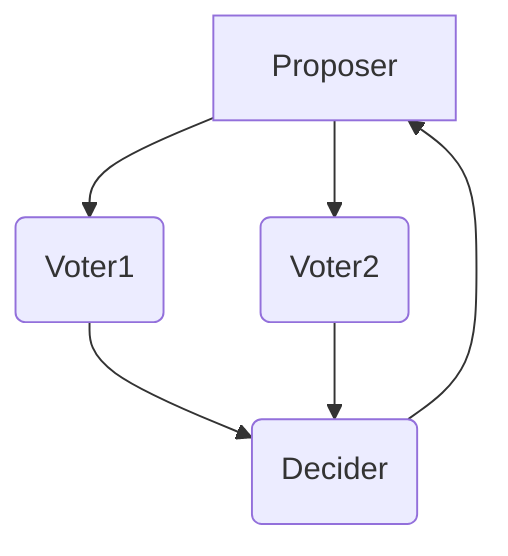

#### 2.2.3 基于分布式共识的协调机制
共识算法是多Agent协作系统中的另一种重要协调机制。通过让所有Agent达成共识，可以实现分布式任务分配和决策。

### 2.3 多Agent协作系统的决策机制
#### 2.3.1 分布式决策的基本原理
分布式决策是指在多Agent协作系统中，通过多个Agent的协作实现决策的过程。分布式决策可以通过基于规则的决策和基于模型的决策实现。

#### 2.3.2 基于博弈论的决策模型
博弈论是多Agent协作系统中常用的决策模型。通过分析Agent之间的博弈关系，可以制定最优决策策略。

#### 2.3.3 基于机器学习的决策方法
机器学习是多Agent协作系统中的另一种决策方法。通过训练模型，可以实现Agent之间的协作决策。

---

## 第3章: 多Agent协作系统的算法原理

### 3.1 分布式一致性算法
#### 3.1.1 Paxos算法的原理与实现
Paxos算法是一种常用的分布式一致性算法，通过多个轮询实现一致性。其核心思想是通过Proposer、Voter和Decider的角色分配，实现一致性。

##### Paxos算法的数学模型
Paxos算法的数学模型可以通过以下公式表示：
$$
\text{Proposer} \rightarrow \text{Voter}: \text{Prepare}(p)
$$
$$
\text{Voter} \rightarrow \text{Decider}: \text{Accept}(v)
$$

#### 3.1.2 Raft算法的原理与实现
Raft算法是一种基于Paxos的分布式一致性算法，通过领导者选举和日志复制实现一致性。

##### Raft算法的流程图
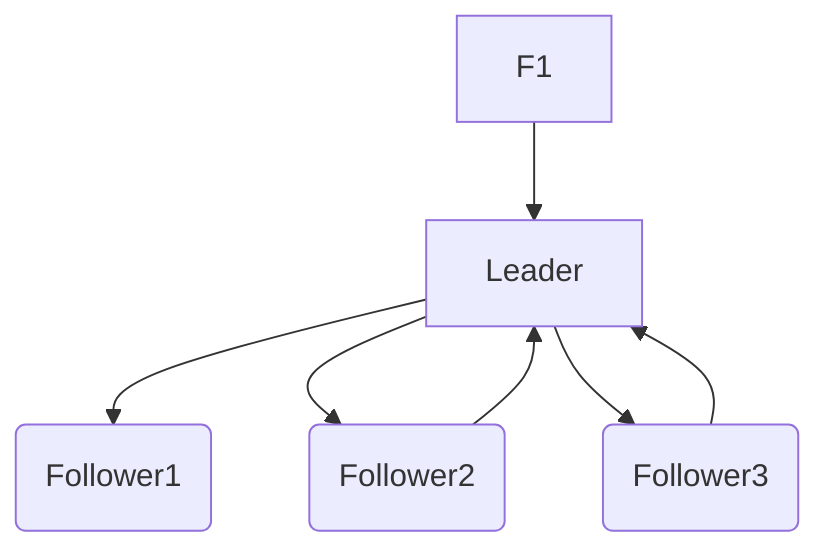

#### 3.1.3 Gossip协议的应用
Gossip协议是一种基于随机化的分布式一致性协议，通过随机选择通信对象实现一致性。

### 3.2 分布式任务分配算法
#### 3.2.1 基于负载均衡的任务分配算法
负载均衡算法通过将任务分配到不同的Agent上，实现负载均衡。

##### 负载均衡算法的流程图
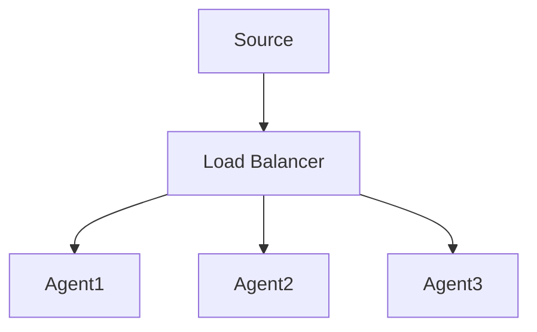

#### 3.2.2 基于资源约束的任务分配算法
资源约束任务分配算法通过考虑Agent的资源限制，实现任务分配。

#### 3.2.3 基于优先级的任务分配算法
优先级任务分配算法通过考虑任务的优先级，实现任务分配。

### 3.3 分布式共识算法
#### 3.3.1 智能合约与分布式共识
智能合约是一种基于分布式共识的自动执行合约。

#### 3.3.2 区块链中的共识机制
区块链是一种基于分布式共识的技术，通过共识机制实现数据一致性。

#### 3.3.3 基于拜占庭容错的共识算法
拜占庭容错共识算法是一种基于容错的共识算法，适用于存在恶意节点的环境。

---

## 第4章: 多Agent协作系统的系统架构设计

### 4.1 系统功能设计
#### 4.1.1 Agent角色分配与任务分配
系统功能设计需要考虑Agent的角色分配和任务分配。

##### 系统功能设计的领域模型类图
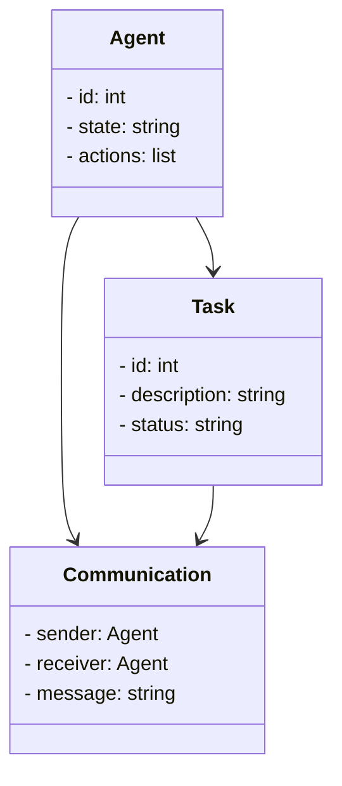

#### 4.1.2 通信与协作机制设计
通信与协作机制设计需要考虑通信协议和协作协议。

##### 通信与协作机制设计的流程图
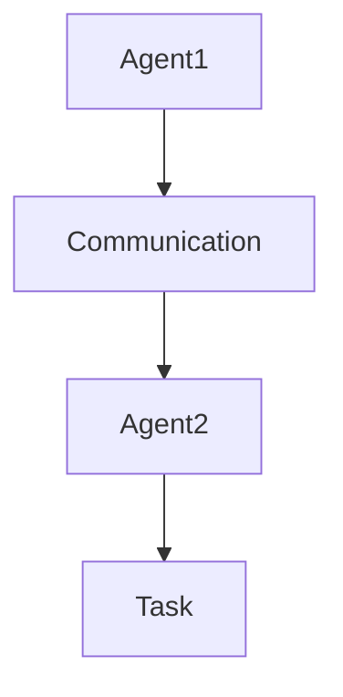

#### 4.1.3 系统状态管理与维护
系统状态管理与维护需要考虑一致性维护和故障恢复。

### 4.2 系统架构设计
#### 4.2.1 分层架构设计
系统架构设计可以采用分层架构，包括数据层、业务层和应用层。

##### 分层架构设计的流程图
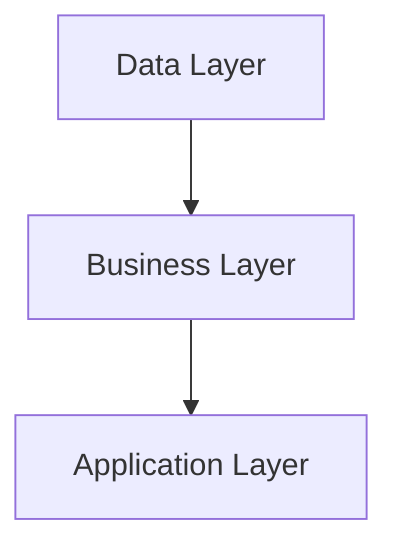

#### 4.2.2 微服务架构设计
微服务架构设计是另一种常用的系统架构设计方法，适用于复杂的多Agent协作系统。

##### 微服务架构设计的流程图
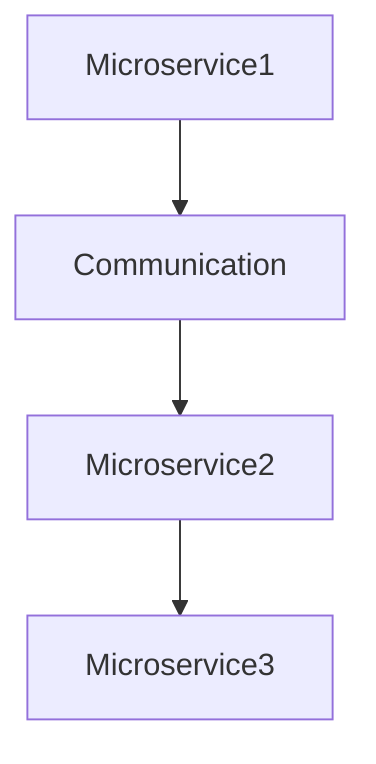

#### 4.2.3 系统扩展性与容错性设计
系统扩展性与容错性设计需要考虑系统的可扩展性和容错性。

### 4.3 系统接口设计
#### 4.3.1 系统接口定义
系统接口设计需要定义接口的输入输出和接口调用方式。

##### 系统接口定义的流程图
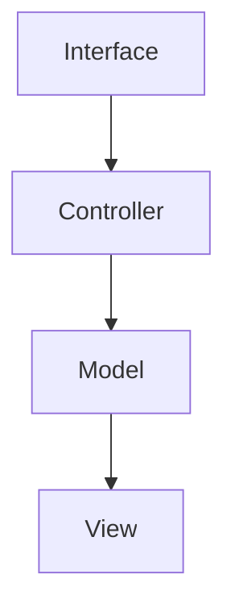

#### 4.3.2 接口交互流程设计
接口交互流程设计需要考虑接口的调用顺序和调用结果。

##### 接口交互流程设计的流程图
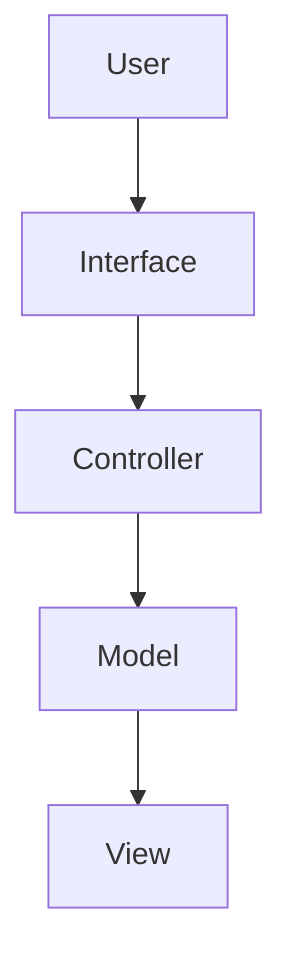

### 4.4 系统交互设计
#### 4.4.1 Agent与任务的交互流程
Agent与任务的交互流程需要考虑任务分配和任务执行。

##### Agent与任务的交互流程的流程图
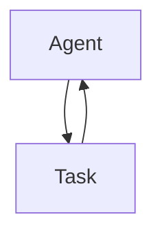

#### 4.4.2 Agent与Agent的交互流程
Agent与Agent的交互流程需要考虑通信和协作。

##### Agent与Agent的交互流程的流程图
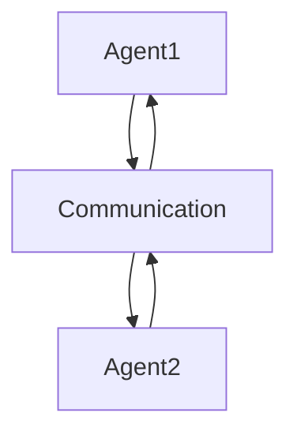

#### 4.4.3 Agent与环境的交互流程
Agent与环境的交互流程需要考虑感知和行动。

##### Agent与环境的交互流程的流程图
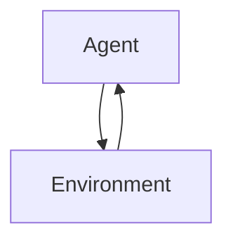

---

## 第5章: 项目实战

### 5.1 项目背景与目标
#### 5.1.1 项目背景
本项目旨在实现一个多Agent协作系统，用于智能交通管理。

#### 5.1.2 项目目标
通过多Agent协作系统实现智能交通管理，包括交通流量监控和路径规划。

### 5.2 项目环境安装
#### 5.2.1 系统要求
- 操作系统：Linux/Windows/MacOS
- 开发工具：Python/Java/Go
- 依赖库：如Paxos/Raft算法实现库

#### 5.2.2 环境搭建
安装Python和相关依赖库，配置开发环境。

### 5.3 系统核心实现
#### 5.3.1 Agent类的实现
```python
class Agent:
    def __init__(self, id):
        self.id = id
        self.state = "idle"
        self.tasks = []
    
    def receive_message(self, message):
        # 处理消息
        pass
    
    def send_message(self, message, agent):
        # 发送消息
        pass
```

#### 5.3.2 通信模块的实现
```python
class Communication:
    def __init__(self):
        self.communication_channel = []
    
    def send(self, message, agent):
        self.communication_channel.append((agent.id, message))
    
    def receive(self, agent):
        messages = []
        for (id, message) in self.communication_channel:
            if id == agent.id:
                messages.append(message)
        return messages
```

#### 5.3.3 一致性算法的实现
```python
class Paxos:
    def __init__(self):
        self.proposer = None
        self.voters = []
    
    def propose(self, value):
        # 提案
        pass
    
    def vote(self, proposal):
        # 投票
        pass
```

### 5.4 代码应用与解读
#### 5.4.1 代码实现
```python
# Agent类实现
class Agent:
    def __init__(self, id):
        self.id = id
        self.state = "idle"
        self.tasks = []
    
    def receive_message(self, message):
        print(f"Agent {self.id} 接收到消息：{message}")
        # 处理消息
        if "task" in message:
            self.tasks.append(message["task"])
    
    def send_message(self, message, agent):
        Communication().send(message, agent)

# 通信模块实现
class Communication:
    def __init__(self):
        self.communication_channel = []
    
    def send(self, message, agent):
        self.communication_channel.append((agent.id, message))
    
    def receive(self, agent):
        messages = []
        for (id, message) in self.communication_channel:
            if id == agent.id:
                messages.append(message)
        return messages

# 一致性算法实现
class Paxos:
    def __init__(self):
        self.proposer = None
        self.voters = []
    
    def propose(self, value):
        print(f"Proposer 提出值：{value}")
        for voter in self.voters:
            voter.vote(value)
    
    def vote(self, proposal):
        print(f"Voter {self.id} 投票：{proposal}")
```

#### 5.4.2 代码解读
上述代码实现了一个简单的多Agent协作系统，包括Agent类、通信模块和一致性算法。Agent类实现了接收和发送消息的功能，通信模块实现了消息的收发，一致性算法实现了Paxos算法的基本功能。

### 5.5 项目小结
通过本项目，我们实现了一个简单的多Agent协作系统，验证了多Agent协作系统的可行性。在实际应用中，需要考虑更多复杂的场景和优化。

---

## 第6章: 总结与展望

### 6.1 多Agent协作系统的核心内容总结
多Agent协作系统是一种分布式计算模型，通过多个智能体的协作完成复杂任务。其核心内容包括通信机制、协调机制和决策机制。

### 6.2 多Agent协作系统的未来展望
多Agent协作系统未来的发展方向包括智能化、自适应性和安全性。通过人工智能和自适应算法的结合，可以实现更智能的协作。

### 6.3 最佳实践 tips
- 在设计多Agent协作系统时，需要考虑系统的可扩展性和容错性。
- 在实现多Agent协作系统时，需要选择合适的通信协议和协作算法。
- 在测试多Agent协作系统时，需要考虑系统的稳定性和性能。

### 6.4 注意事项
- 多Agent协作系统的实现需要考虑系统的复杂性和安全性。
- 在实际应用中，需要根据具体需求选择合适的协作算法和系统架构。

### 6.5 拓展阅读
- 《多Agent系统：理论与应用》
- 《分布式系统：概念与设计》
- 《区块链：分布式应用的落地指南》

---

## 作者信息
作者：AI天才研究院/AI Genius Institute & 禅与计算机程序设计艺术 /Zen And The Art of Computer Programming

