                 

# 多Agent协作系统：复杂任务的分解与协调

> 关键词：多Agent协作系统、复杂任务分解、Agent行为模型、任务协调机制、系统架构设计

> 摘要：多Agent协作系统是一种分布式智能系统，通过多个智能体（Agent）协作完成复杂任务。本文将深入探讨多Agent协作系统的结构、任务分解与协调机制、通信协议设计以及系统架构设计。通过具体案例分析，展示多Agent协作系统在实际应用中的优势和实现方法。

---

# 第1章: 多Agent协作系统概述

## 1.1 多Agent系统的基本概念

### 1.1.1 什么是多Agent系统
多Agent系统（Multi-Agent System, MAS）是由多个智能体（Agent）组成的分布式系统，这些智能体能够自主决策、协作完成任务。Agent是具有感知、推理和行动能力的实体。

**图1-1：多Agent系统的组成结构**

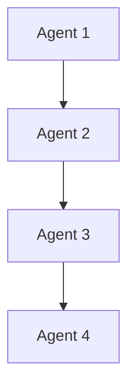

### 1.1.2 多Agent系统的特征
- **自主性**：Agent能够自主决策。
- **反应性**：能够感知环境并实时响应。
- **协作性**：多个Agent协同完成任务。
- **分布性**：Agent分布在不同的空间或时间。

### 1.1.3 多Agent系统的分类
- **基于任务的多Agent系统**：Agent之间协作完成特定任务。
- **基于市场的多Agent系统**：Agent通过市场机制进行资源分配。
- **基于知识的多Agent系统**：Agent之间共享知识以完成复杂任务。

## 1.2 多Agent协作系统的应用背景

### 1.2.1 复杂任务的分解需求
复杂任务通常需要分解为多个子任务，由不同的Agent负责完成。

**图1-2：复杂任务分解的层次结构**

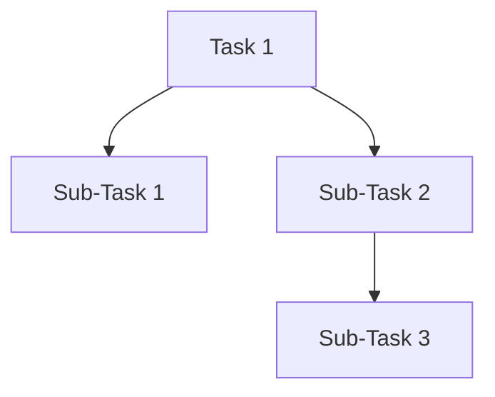

### 1.2.2 多Agent协作的优势
- **提高效率**：通过任务分解和并行执行提高整体效率。
- **增强容错性**：单个Agent故障不影响整体任务完成。
- **适应性**：系统能够动态调整任务分配。

### 1.2.3 多Agent系统的挑战
- **通信开销**：Agent之间的通信可能带来额外的计算开销。
- **协调困难**：任务分解和协调需要复杂的机制。
- **安全性**：多Agent系统需要考虑数据安全和隐私保护。

## 1.3 多Agent协作系统的研究现状

### 1.3.1 国内外研究进展
多Agent系统的研究始于20世纪90年代，近年来在分布式计算、人工智能等领域取得了显著进展。

### 1.3.2 当前研究热点
- **任务分解与协调机制**
- **多Agent通信协议优化**
- **复杂环境下的协作算法**

### 1.3.3 未来研究方向
- **智能化协作算法**
- **多Agent系统安全性研究**
- **大规模多Agent系统的优化**

## 1.4 本章小结
本章介绍了多Agent协作系统的基本概念、特征、分类及应用背景，分析了其优势和面临的挑战，为后续章节的深入讨论奠定了基础。

---

# 第2章: 多Agent协作系统的结构与行为

## 2.1 多Agent系统的结构

### 2.1.1 Agent的基本结构
Agent的基本结构包括感知、推理、决策和行动四个部分。

**图2-1：Agent的基本结构**

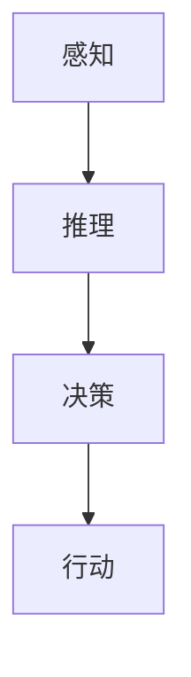

### 2.1.2 多Agent系统的层次结构
多Agent系统通常分为物理层、知识层和协作层。

**表2-1：多Agent系统的层次结构**

| 层次 | 描述 |
|------|------|
| 物理层 | 实体的物理分布和通信 |
| 知识层 | Agent的知识表示和共享 |
| 协作层 | 任务分解和协作机制 |

### 2.1.3 多Agent系统的通信机制
通信机制包括同步通信和异步通信两种方式。

## 2.2 多Agent的行为模型

### 2.2.1 BDI模型
BDI模型基于信念（Belief）、愿望（Desire）、意图（Intention）三元组进行推理。

**图2-2：BDI模型的流程图**

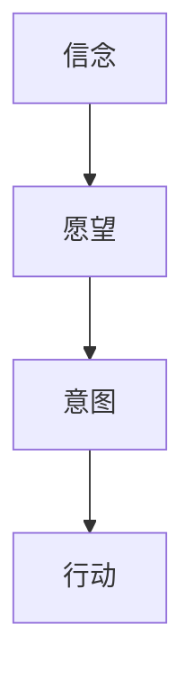

### 2.2.2 情境-反应模型
情境-反应模型基于当前情境触发相应的反应。

**图2-3：情境-反应模型的流程图**

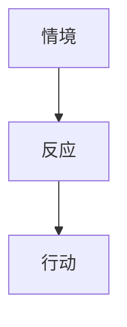

### 2.2.3 计划-执行模型
计划-执行模型基于预先制定的计划执行任务。

**图2-4：计划-执行模型的流程图**

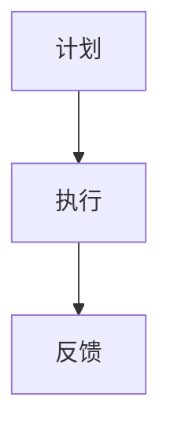

## 2.3 多Agent协作的数学模型

### 2.3.1 Agent的表示模型
Agent可以用状态空间、动作空间和奖励函数来表示。

### 2.3.2 多Agent协作的数学表达
多Agent协作可以用博弈论中的纳什均衡来描述。

**公式2-1：纳什均衡的数学表达**

$$ \text{纳什均衡} = \{a_1^*, a_2^*, ..., a_n^*\} $$

### 2.3.3 协作任务的分解模型
任务分解可以使用马尔可夫决策过程（MDP）模型。

**公式2-2：MDP模型的数学表达**

$$ MDP = \langle S, A, P, R \rangle $$

## 2.4 本章小结
本章详细介绍了多Agent系统的结构和行为模型，包括BDI模型、情境-反应模型和计划-执行模型，并探讨了任务分解的数学模型。

---

# 第3章: 复杂任务的分解与协调

## 3.1 复杂任务的分解方法

### 3.1.1 任务分解的基本原则
任务分解应遵循最大化独立性和最小化依赖性原则。

**表3-1：任务分解的基本原则**

| 原则 | 描述 |
|------|------|
| 最大化独立性 | 子任务之间尽量独立 |
| 最小化依赖性 | 子任务之间的依赖关系最小化 |

### 3.1.2 基于层次结构的任务分解
任务分解可以采用树状结构，将复杂任务分解为多个子任务。

**图3-1：基于层次结构的任务分解**

### 3.1.3 基于目标分解的任务模型
任务分解可以基于目标进行，每个子任务对应一个目标。

**图3-2：基于目标分解的任务模型**

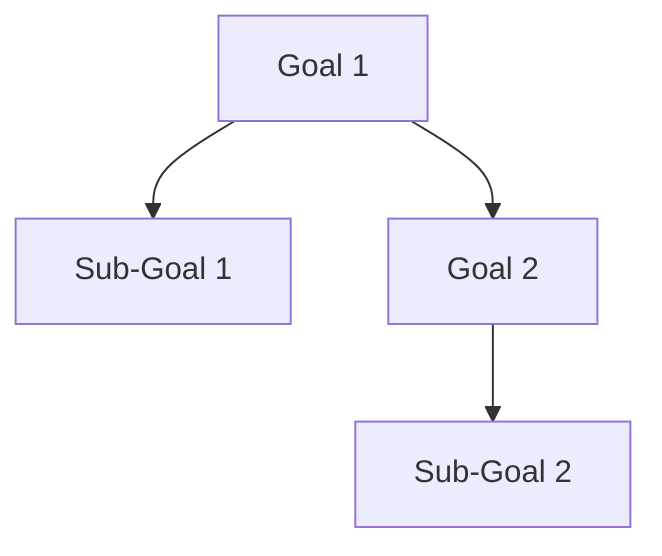

## 3.2 多Agent协作中的协调机制

### 3.2.1 协调的基本概念
协调是指多个Agent之间为了共同目标而进行的合作。

### 3.2.2 协调机制的分类
协调机制可以分为基于规则的协调和基于目标的协调两种。

**表3-2：协调机制的分类**

| 类型 | 描述 |
|------|------|
| 基于规则 | 通过预定义规则进行协调 |
| 基于目标 | 通过目标共享和协作进行协调 |

### 3.2.3 协调机制的设计原则
协调机制设计应遵循简洁性、可扩展性和健壮性原则。

## 3.3 协作任务的动态调整

### 3.3.1 动态任务分解的挑战
动态任务分解需要考虑任务优先级和资源分配。

### 3.3.2 基于反馈的任务调整
任务分解可以根据反馈信息进行动态调整。

### 3.3.3 协作过程中的冲突处理
冲突处理可以通过仲裁机制或协商机制实现。

**图3-3：冲突处理的仲裁机制**

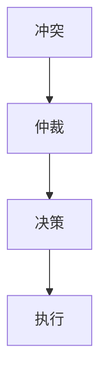

## 3.4 本章小结
本章详细探讨了复杂任务的分解方法和协调机制，分析了动态任务调整的挑战和解决方案。

---

# 第4章: 多Agent协作系统的通信与协议

## 4.1 多Agent系统的通信机制

### 4.1.1 通信的基本概念
通信是指Agent之间交换信息的过程。

### 4.1.2 通信模型的分类
通信模型可以分为同步通信和异步通信两种。

### 4.1.3 通信协议的选择
选择通信协议时需要考虑系统的性能和安全性。

## 4.2 多Agent协作中的协议设计

### 4.2.1 协议设计的基本原则
协议设计应遵循简洁性、可扩展性和安全性原则。

### 4.2.2 基于角色的协议设计
基于角色的协议设计通过角色分配来实现协作。

**图4-1：基于角色的协议设计**

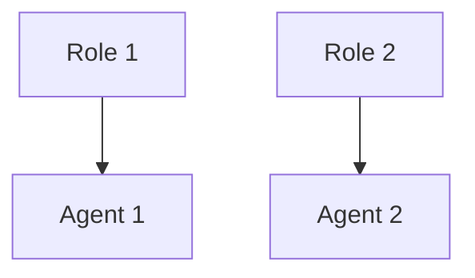

### 4.2.3 基于状态的协议设计
基于状态的协议设计通过状态转移实现协作。

**图4-2：基于状态的协议设计**

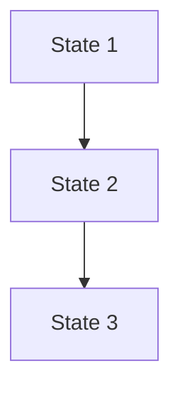

## 4.3 协作任务中的通信优化

### 4.3.1 通信效率的提升方法
通信效率可以通过减少消息数量和优化消息格式来提升。

### 4.3.2 基于优先级的通信调度
通信调度可以通过优先级机制来优化。

### 4.3.3 通信中的错误处理
通信错误可以通过冗余传输和错误重试机制来处理。

## 4.4 本章小结
本章探讨了多Agent系统的通信机制和协议设计，分析了通信优化的方法。

---

# 第5章: 多Agent协作系统的架构设计

## 5.1 系统设计的基本原则

### 5.1.1 可扩展性
系统设计应具有良好的可扩展性。

### 5.1.2 可维护性
系统设计应便于维护和升级。

### 5.1.3 可靠性
系统设计应确保系统的可靠性和容错性。

## 5.2 多Agent系统的架构模型

### 5.2.1 分层架构
分层架构将系统分为多个层次，每个层次负责不同的功能。

**图5-1：分层架构模型**

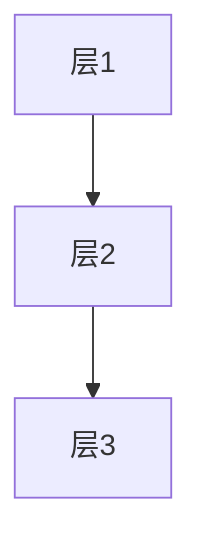

### 5.2.2 分布式架构
分布式架构将系统功能分布在不同的节点上。

**图5-2：分布式架构模型**

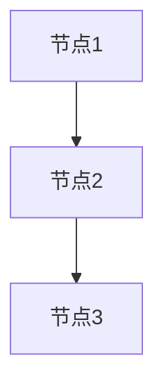

### 5.2.3 混合式架构
混合式架构结合了分层和分布式架构的特点。

## 5.3 系统架构的实现

### 5.3.1 基于中间件的架构设计
基于中间件的架构设计通过中间件实现Agent之间的通信和协调。

### 5.3.2 基于服务导向的架构设计
基于服务导向的架构设计通过服务化接口实现协作。

### 5.3.3 基于事件驱动的架构设计
基于事件驱动的架构设计通过事件触发实现协作。

## 5.4 本章小结
本章详细探讨了多Agent系统的架构设计，分析了不同架构模型的优缺点。

---

# 作者：AI天才研究院/AI Genius Institute & 禅与计算机程序设计艺术 /Zen And The Art of Computer Programming

---

以上是《多Agent协作系统：复杂任务的分解与协调》的技术博客文章的完整目录大纲。每章内容都会详细展开，确保逻辑清晰、结构紧凑，语言专业且易于理解。

