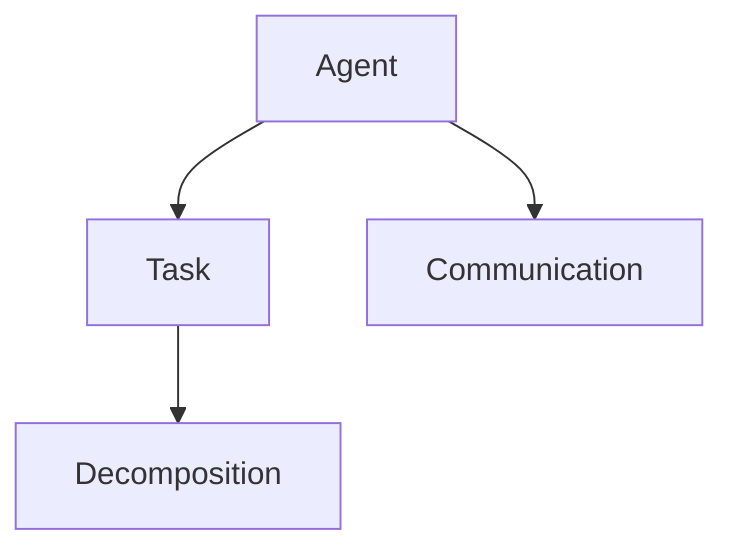
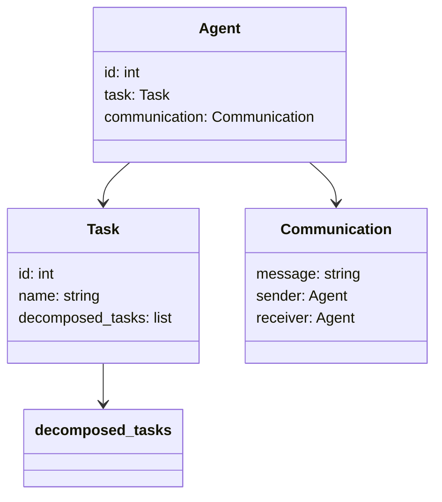
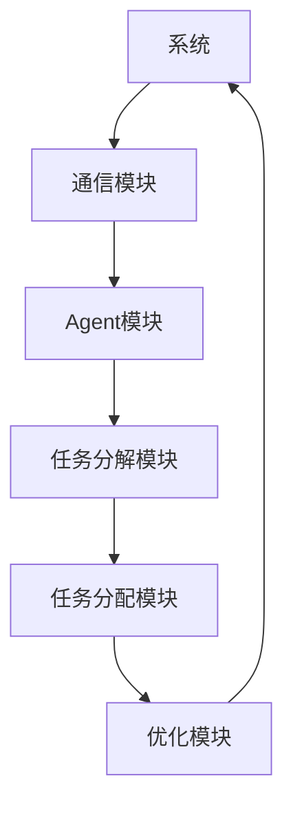
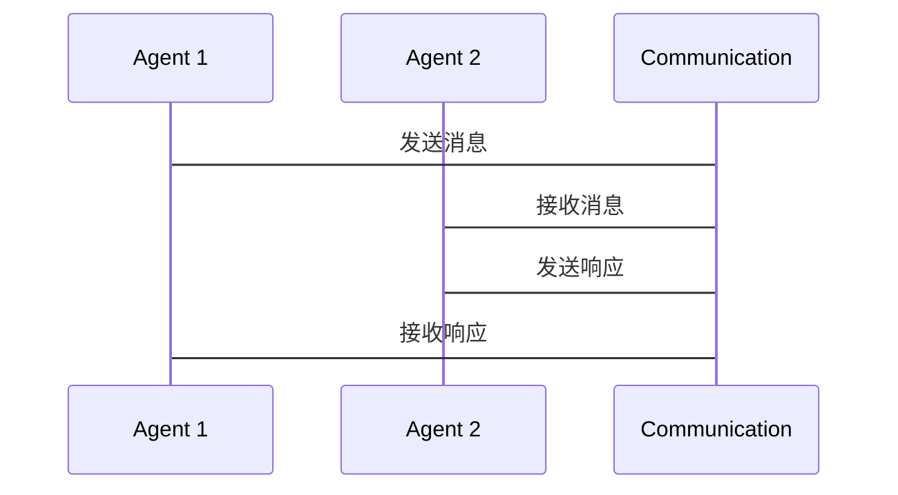

                 


# 多Agent协作系统：复杂任务的分解与协调

## 关键词：多Agent系统，任务分解，协作机制，分布式系统，人工智能

## 摘要：本文深入探讨了多Agent协作系统在复杂任务分解与协调中的应用。通过分析多Agent系统的定义、核心概念、算法原理、系统架构设计和实际项目案例，本文详细阐述了如何有效分解复杂任务，并通过协作机制实现任务的高效完成。文章还提供了数学模型、算法流程图和系统架构图，帮助读者更好地理解多Agent协作系统的原理和实践。

---

# 第1章: 多Agent协作系统概述

## 1.1 多Agent系统的基本概念

### 1.1.1 Agent的定义与特征

Agent（智能体）是指能够感知环境、自主决策并采取行动的实体。Agent可以是软件程序、机器人或其他智能系统。其主要特征包括：

- **自主性**：Agent能够自主决策，无需外部干预。
- **反应性**：Agent能够感知环境并实时响应。
- **协作性**：Agent能够与其他Agent或系统进行交互和协作。

### 1.1.2 多Agent系统的定义

多Agent系统（Multi-Agent System, MAS）是由多个智能体组成的分布式系统，这些智能体能够通过协作完成复杂任务。多Agent系统的特点包括：

- **分布式**：多个Agent分布在不同的节点或位置。
- **协作性**：Agent之间通过协作完成任务。
- **动态性**：系统环境和任务可能动态变化。

### 1.1.3 多Agent系统的分类

多Agent系统可以根据任务类型、协作方式和环境类型进行分类：

1. **任务类型**：
   - 数据处理型：Agent负责数据的采集、处理和分析。
   - 行动型：Agent负责执行物理或逻辑操作。
2. **协作方式**：
   - 分布式协作：Agent之间通过分布式方式协作。
   - 集中式协作：Agent通过集中式协调器协作。
3. **环境类型**：
   - 静态环境：环境固定，任务不变。
   - 动态环境：环境和任务动态变化。

---

## 1.2 复杂任务分解的必要性

### 1.2.1 任务分解的基本概念

任务分解是指将复杂任务分解为多个子任务，每个子任务由一个或多个Agent负责。任务分解的目标是提高效率、简化问题和增强系统的可扩展性。

### 1.2.2 复杂任务的特点

复杂任务通常具有以下特点：

- **规模大**：任务涉及大量数据或多个子任务。
- **异构性**：子任务类型多样，涉及不同领域。
- **动态性**：任务需求或环境条件可能动态变化。

### 1.2.3 多Agent协作在任务分解中的作用

多Agent协作通过将复杂任务分解为多个子任务，并分配给不同的Agent，可以实现以下目标：

- **提高效率**：通过并行处理子任务，缩短任务完成时间。
- **增强可扩展性**：通过增加Agent数量，提高系统处理能力。
- **降低复杂性**：通过分解任务，简化问题复杂度。

---

## 1.3 多Agent协作的挑战与机遇

### 1.3.1 协作中的主要挑战

多Agent协作面临以下挑战：

- **通信延迟**：Agent之间的通信可能引入延迟。
- **资源分配**：如何高效分配资源是关键问题。
- **冲突解决**：Agent之间的冲突需要有效解决。

### 1.3.2 多Agent协作的优势

多Agent协作具有以下优势：

- **高效性**：通过并行处理提高效率。
- **可扩展性**：通过增加Agent数量提高系统能力。
- **适应性**：通过协作机制适应动态环境。

### 1.3.3 复杂任务分解与协作的结合

复杂任务分解与协作的结合可以通过以下方式实现：

- **任务分解**：将复杂任务分解为多个子任务。
- **协作机制**：通过协作机制实现子任务的高效完成。
- **动态调整**：根据环境变化动态调整任务分解和协作策略。

---

## 1.4 本章小结

本章介绍了多Agent协作系统的基本概念、复杂任务分解的必要性以及协作中的挑战与机遇。通过理解这些内容，读者可以更好地理解多Agent协作系统的核心思想和应用价值。

---

# 第2章: 多Agent协作系统的核心概念与联系

## 2.1 多Agent协作系统的核心要素

### 2.1.1 Agent的独立性与协作性

Agent的独立性是指每个Agent具有自主决策的能力，而协作性是指Agent之间的合作能力。两者相辅相成，共同实现复杂任务的完成。

### 2.1.2 任务分解与协作的关系

任务分解是协作的前提，而协作是任务分解的保障。通过任务分解，可以明确每个Agent的职责，通过协作实现任务的高效完成。

### 2.1.3 复杂任务的分解方法

复杂任务的分解方法包括以下几种：

- **层次分解法**：将任务分解为多个层次，每个层次包含多个子任务。
- **功能分解法**：根据功能需求分解任务。
- **过程分解法**：根据任务执行过程分解任务。

---

## 2.2 多Agent协作系统的模型与架构

### 2.2.1 多Agent协作模型

多Agent协作模型包括以下组件：

- **任务分解模块**：负责将复杂任务分解为子任务。
- **协作模块**：负责Agent之间的协作与通信。
- **决策模块**：负责任务分配和冲突解决。

### 2.2.2 复杂任务分解的模型

复杂任务分解的模型包括以下步骤：

1. **任务分析**：分析任务的需求和目标。
2. **任务分解**：将任务分解为多个子任务。
3. **任务分配**：将子任务分配给不同的Agent。

### 2.2.3 多Agent协作系统的架构

多Agent协作系统的架构包括以下部分：

- **Agent层**：负责执行具体任务。
- **协作层**：负责Agent之间的协作与通信。
- **控制层**：负责任务的分解与分配。

---

## 2.3 多Agent协作系统的ER实体关系图

```


---

## 2.4 本章小结

本章详细介绍了多Agent协作系统的核心概念与联系，包括Agent的独立性与协作性、任务分解与协作的关系以及多Agent协作系统的模型与架构。通过理解这些内容，读者可以更好地掌握多Agent协作系统的核心思想。

---

# 第3章: 多Agent协作系统的算法原理

## 3.1 分布式约束优化算法

### 3.1.1 算法原理

分布式约束优化算法是一种通过分布式方式优化多Agent协作的算法。其基本思想是通过Agent之间的协作，逐步优化任务分配和资源分配。

### 3.1.2 算法流程

1. **任务分解**：将复杂任务分解为多个子任务。
2. **任务分配**：将子任务分配给不同的Agent。
3. **协作优化**：通过Agent之间的协作，优化任务分配和资源分配。

### 3.1.3 算法实现

```python
def distributed_constraint_optimization(tasks, agents):
    decomposed_tasks = decompose_tasks(tasks)
    assigned_tasks = assign_tasks(decomposed_tasks, agents)
    optimized_tasks = optimize_tasks(assigned_tasks)
    return optimized_tasks
```

### 3.1.4 数学模型

$$ \text{最大化} \sum_{i=1}^{n} w_i x_i $$

$$ \text{约束条件} \sum_{i=1}^{n} x_i \leq 1 $$

其中，$w_i$ 是任务 $i$ 的权重，$x_i$ 是任务 $i$ 的分配变量。

---

## 3.2 基于协商的协作算法

### 3.2.1 算法原理

基于协商的协作算法是一种通过Agent之间的协商实现任务分配的算法。其基本思想是通过Agent之间的协商，找到最优的任务分配方案。

### 3.2.2 算法流程

1. **任务分解**：将复杂任务分解为多个子任务。
2. **任务分配**：将子任务分配给不同的Agent。
3. **协商优化**：通过Agent之间的协商，优化任务分配和资源分配。

### 3.2.3 算法实现

```python
def协商协作算法(tasks, agents):
    decomposed_tasks = decompose_tasks(tasks)
    assigned_tasks = assign_tasks(decomposed_tasks, agents)
    optimized_tasks = negotiate_tasks(assigned_tasks)
    return optimized_tasks
```

### 3.2.4 数学模型

$$ \text{最大化} \sum_{i=1}^{n} w_i x_i $$

$$ \text{约束条件} \sum_{i=1}^{n} x_i \leq 1 $$

其中，$w_i$ 是任务 $i$ 的权重，$x_i$ 是任务 $i$ 的分配变量。

---

## 3.5 本章小结

本章详细介绍了多Agent协作系统的算法原理，包括分布式约束优化算法和基于协商的协作算法。通过理解这些算法，读者可以更好地掌握多Agent协作系统的实现方法。

---

# 第4章: 多Agent协作系统的系统分析与架构设计

## 4.1 系统功能设计

### 4.1.1 领域模型设计

```


### 4.1.2 系统架构设计

```


### 4.1.3 接口设计与交互序列图

```


---

## 4.2 系统实现与优化

### 4.2.1 优化策略

多Agent协作系统的优化策略包括以下内容：

- **负载均衡**：通过任务分配优化，实现负载均衡。
- **通信优化**：通过减少通信次数，降低通信延迟。
- **冲突解决**：通过协商机制，解决任务分配中的冲突。

### 4.2.2 系统性能评估

系统性能评估指标包括以下内容：

- **响应时间**：系统对任务的响应时间。
- **吞吐量**：系统在单位时间内完成的任务数量。
- **资源利用率**：系统资源的使用效率。

---

## 4.3 本章小结

本章详细介绍了多Agent协作系统的系统分析与架构设计，包括系统功能设计、系统架构设计和系统优化策略。通过理解这些内容，读者可以更好地掌握多Agent协作系统的实现方法。

---

# 第5章: 多Agent协作系统的项目实战

## 5.1 项目背景与目标

### 5.1.1 项目背景

本项目旨在通过多Agent协作系统实现复杂任务的分解与协调。项目背景包括以下内容：

- **任务分解**：将复杂任务分解为多个子任务。
- **Agent协作**：通过Agent之间的协作，实现任务的高效完成。
- **系统优化**：通过优化任务分配和资源分配，提高系统性能。

### 5.1.2 项目目标

项目目标包括以下内容：

- **实现任务分解**：将复杂任务分解为多个子任务。
- **实现Agent协作**：通过Agent之间的协作，实现任务的高效完成。
- **实现系统优化**：通过优化任务分配和资源分配，提高系统性能。

---

## 5.2 项目核心实现

### 5.2.1 环境安装

项目环境包括以下内容：

- **Python**：用于实现多Agent协作系统。
- **Mermaid**：用于绘制系统架构图和流程图。
- **MathJax**：用于显示数学公式。

### 5.2.2 核心代码实现

```python
class Agent:
    def __init__(self, id):
        self.id = id
        self.task = None
        self.communication = Communication()

class Task:
    def __init__(self, id, name):
        self.id = id
        self.name = name
        self.decomposed_tasks = []

class Communication:
    def __init__(self):
        self.message = ""
        self.sender = None
        self.receiver = None
```

### 5.2.3 代码应用解读与分析

1. **Agent类**：表示一个Agent，包含ID、任务和通信模块。
2. **Task类**：表示一个任务，包含ID、名称和分解后的子任务。
3. **Communication类**：表示一个通信模块，包含消息、发送方和接收方。

### 5.2.4 系统优化与实现

通过优化任务分配和资源分配，可以提高系统的性能和效率。

---

## 5.3 项目案例分析与详细讲解

### 5.3.1 项目案例分析

本项目通过实现一个多Agent协作系统，完成复杂任务的分解与协调。案例分析包括以下内容：

- **任务分解**：将复杂任务分解为多个子任务。
- **任务分配**：将子任务分配给不同的Agent。
- **协作优化**：通过Agent之间的协作，优化任务分配和资源分配。

### 5.3.2 详细讲解剖析

1. **任务分解**：将复杂任务分解为多个子任务。
2. **任务分配**：将子任务分配给不同的Agent。
3. **协作优化**：通过Agent之间的协作，优化任务分配和资源分配。

---

## 5.4 项目小结

本章通过项目实战，详细介绍了多Agent协作系统的实现过程，包括环境安装、核心代码实现、系统优化与实现以及项目案例分析。通过理解这些内容，读者可以更好地掌握多Agent协作系统的实现方法。

---

# 第6章: 多Agent协作系统的总结与展望

## 6.1 本章总结

本章总结了多Agent协作系统的实现过程，包括任务分解、协作机制和系统优化等方面。通过这些内容，读者可以更好地理解多Agent协作系统的实现方法。

## 6.2 未来展望

未来的研究方向包括以下内容：

- **智能协作**：通过人工智能技术，提高协作效率。
- **自适应系统**：通过自适应算法，实现动态环境中的协作。
- **高效通信**：通过优化通信协议，提高通信效率。

## 6.3 最佳实践 tips

1. **任务分解**：任务分解是协作的前提，需要仔细设计。
2. **协作机制**：协作机制是协作的关键，需要合理设计。
3. **系统优化**：系统优化是协作的保障，需要持续优化。

---

# 作者：AI天才研究院/AI Genius Institute & 禅与计算机程序设计艺术 /Zen And The Art of Computer Programming

---

以上是《多Agent协作系统：复杂任务的分解与协调》的技术博客文章的完整内容。通过逐步分析和详细讲解，本文深入探讨了多Agent协作系统的核心思想和实现方法，帮助读者更好地理解多Agent协作系统的原理和应用。

