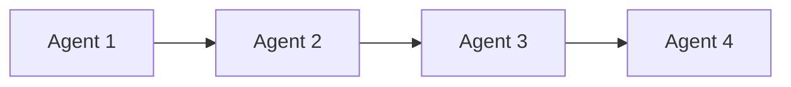
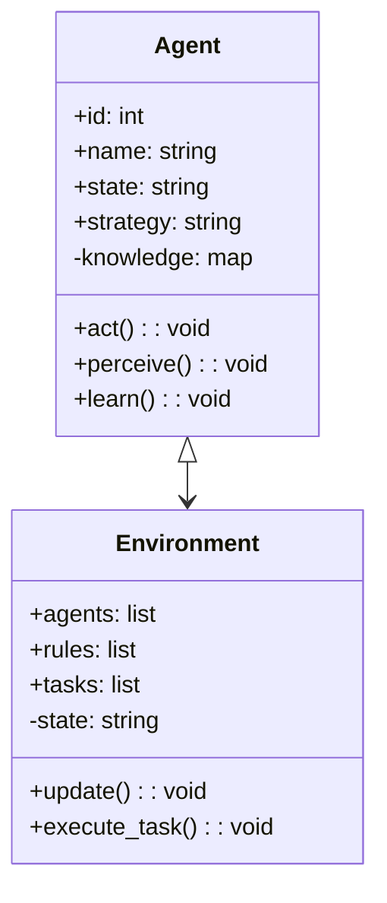
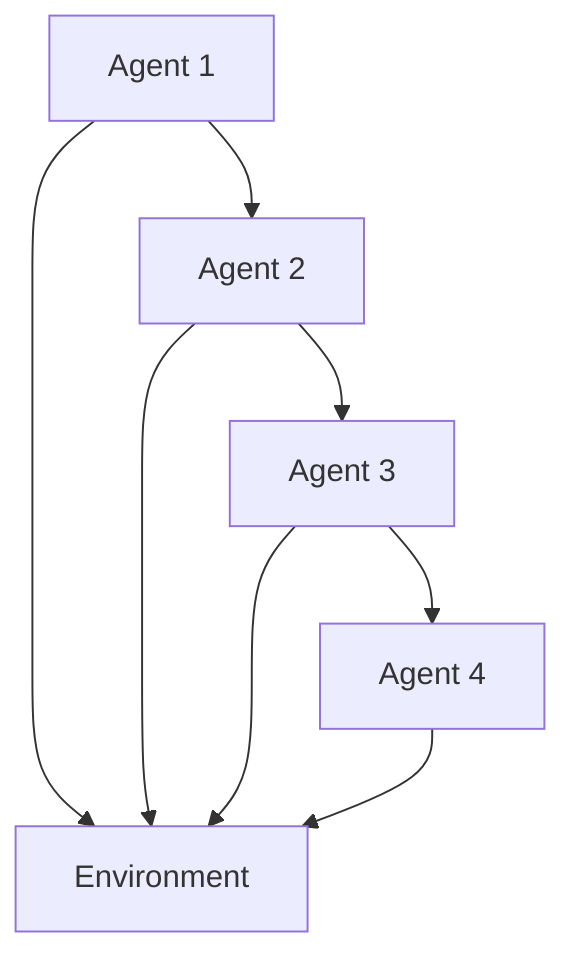

                 


---

# 多Agent博弈系统：策略学习与优化技术

## 关键词：
多Agent系统，博弈论，策略优化，强化学习，分布式计算

## 摘要：
多Agent博弈系统是一种由多个智能体组成的复杂系统，这些智能体能够自主决策、协作或竞争，以实现特定的目标。本文从多Agent系统的背景介绍入手，详细探讨了博弈论在多Agent系统中的应用，分析了多Agent博弈的核心概念与联系，深入讲解了多Agent博弈中的策略学习与优化技术，包括纳什均衡、Q-learning算法、多智能体强化学习等。同时，本文还通过实际案例分析和项目实战，展示了如何将理论应用于实践，并提出了系统设计和优化的建议。通过本文的阐述，读者将能够全面理解多Agent博弈系统的原理、算法和应用，掌握策略学习与优化的关键技术。

---

## 第1章: 多Agent博弈系统背景介绍

### 1.1 多Agent系统的基本概念

#### 1.1.1 多Agent系统的定义
多Agent系统（Multi-Agent System，MAS）是由多个智能体（Agent）组成的系统，这些智能体能够自主决策、协作或竞争，以实现特定的目标。与传统的单Agent系统相比，多Agent系统具有更强的适应性和协作能力，能够处理更为复杂的问题。

#### 1.1.2 多Agent系统的特征
1. **自主性**：每个Agent都能自主决策，无需外部干预。
2. **反应性**：能够实时感知环境变化，并做出相应的反应。
3. **协作性**：多个Agent之间可以协作，共同完成任务。
4. **分布性**：Agent分布在网络的不同节点上，具有分布式计算的特性。
5. **动态性**：环境和任务可能动态变化，Agent需要具备动态适应能力。

#### 1.1.3 多Agent系统与传统单Agent系统的区别
- **单Agent系统**：单个智能体独立完成任务，决策和计算集中在单点。
- **多Agent系统**：多个智能体协作完成任务，具有更高的可靠性和容错能力，能够处理复杂的分布式问题。

### 1.2 博弈论基础

#### 1.2.1 博弈论的基本概念
博弈论是研究理性主体之间策略互动的数学理论。在博弈论中，参与者被称为“玩家”，每个玩家都有自己的策略和收益。

#### 1.2.2 博弈的分类
1. **完全信息博弈**：所有玩家都知道所有可能的策略和结果。
2. **不完全信息博弈**：玩家之间存在信息不对称，某些信息不为所有玩家所知。
3. **合作博弈**：玩家之间可以达成协议，共同追求最大收益。
4. **非合作博弈**：玩家之间无法达成协议，各自独立决策，追求自身利益的最大化。

#### 1.2.3 博弈论在多Agent系统中的应用
博弈论为多Agent系统的策略制定和决策优化提供了理论基础。在多Agent系统中，每个Agent可以被视为一个玩家，通过博弈论的方法，可以设计出有效的策略，使得系统整体收益最大化。

### 1.3 多Agent博弈系统的应用背景

#### 1.3.1 多Agent博弈系统的应用场景
1. **分布式计算**：如分布式系统中的任务分配问题。
2. **游戏AI**：如多人在线游戏中的智能体协作。
3. **机器人协作**：如智能机器人在制造过程中的协作。
4. **经济模型**：如金融市场中的多方博弈。

#### 1.3.2 多Agent博弈系统的挑战
1. **信息不对称**：不同Agent之间的信息可能不一致。
2. **策略冲突**：多个Agent之间的策略可能存在冲突，需要协调。
3. **动态变化**：环境和任务需求可能随时变化，要求系统具有动态适应能力。

#### 1.3.3 多Agent博弈系统的问题建模
多Agent博弈系统的问题建模需要明确问题的边界，包括参与者的数量、信息的完整性、策略空间的大小等。同时，还需要考虑问题的外延，如环境的动态变化、参与者的策略更新等。多Agent博弈系统的概念结构与核心要素组成包括参与者、策略、收益、规则和信息。

---

## 第2章: 多Agent博弈系统的核心概念与联系

### 2.1 多Agent系统的结构与功能

#### 2.1.1 多Agent系统的组成结构
多Agent系统通常由以下部分组成：
1. **智能体（Agent）**：系统的决策单元，能够自主完成特定任务。
2. **通信机制**：智能体之间的信息交换和协作。
3. **协调机制**：解决策略冲突，确保系统整体收益最大化。
4. **环境接口**：智能体与外部环境的交互接口。

#### 2.1.2 多Agent系统的功能模块
1. **感知模块**：智能体感知环境信息。
2. **决策模块**：根据感知信息，制定策略。
3. **执行模块**：将决策结果转化为具体行动。
4. **学习模块**：通过经验不断优化策略。

#### 2.1.3 多Agent系统的通信机制
通信机制是多Agent系统的重要组成部分，通常包括：
1. **消息传递**：智能体之间通过消息传递信息。
2. **协议设计**：统一的通信协议，确保信息的有效传递。
3. **信息共享**：智能体之间的信息共享机制。

### 2.2 多Agent博弈中的策略与决策

#### 2.2.1 多Agent博弈中的策略定义
策略是指智能体在博弈过程中采取的一系列行动方案。在多Agent系统中，每个智能体的策略可能与其他智能体的策略相互影响。

#### 2.2.2 多Agent博弈中的决策过程
1. **信息收集**：智能体感知环境和对手的信息。
2. **策略选择**：基于收集的信息，选择最优策略。
3. **行动执行**：将选择的策略转化为具体行动。
4. **反馈学习**：根据结果反馈，调整策略。

#### 2.2.3 多Agent博弈中的策略优化
策略优化的目标是在博弈过程中，不断调整策略，以达到最优收益。常用的方法包括强化学习、遗传算法等。

### 2.3 多Agent博弈中的核心概念原理

#### 2.3.1 多Agent博弈的核心概念
1. **纳什均衡**：在博弈论中，纳什均衡是指在策略组合下，每个玩家的策略都是最优的，即没有玩家能够通过单方面改变策略而提高自己的收益。
2. **占优策略**：无论其他玩家如何选择，该策略都能使玩家获得最大收益。
3. **合作策略**：玩家之间通过合作，共同追求最大收益。

#### 2.3.2 多Agent博弈中的实体关系图
以下是多Agent博弈系统的实体关系图：



该图展示了四个智能体之间的关系，每个智能体与其他智能体相连，表示它们之间的协作与竞争。

---

## 第3章: 多Agent博弈系统中的算法原理

### 3.1 纳什均衡的计算与应用

纳什均衡是博弈论中的一个核心概念，广泛应用于多Agent系统中。通过计算纳什均衡，可以确定每个智能体的最优策略，从而实现系统的整体优化。

### 3.2 多智能体强化学习（MARL）

#### 3.2.1 MARL的基本原理
多智能体强化学习（Multi-Agent Reinforcement Learning, MARL）是研究多个智能体在博弈环境中进行强化学习的方法。与单智能体强化学习不同，MARL需要考虑多个智能体之间的协作与竞争。

#### 3.2.2 MARL的挑战与解决方案
1. **策略协调**：多个智能体之间需要协调策略，避免冲突。
2. **信息共享**：智能体之间的信息共享机制设计。
3. **目标一致性**：确保所有智能体的目标一致，共同追求系统整体收益的最大化。

### 3.3 基于Q-learning的多Agent博弈策略优化

#### 3.3.1 Q-learning算法在多Agent系统中的应用
Q-learning算法是一种常用的强化学习算法，适用于多Agent博弈系统。通过Q-learning，智能体可以学习到最优策略，从而在博弈中取得更好的收益。

#### 3.3.2 Q-learning算法的改进与优化
为了提高Q-learning在多Agent系统中的性能，可以采取以下优化措施：
1. **分布式Q-learning**：每个智能体独立学习，通过通信共享信息。
2. **集中式Q-learning**：所有智能体集中在一个学习机构中，统一学习策略。
3. **经验回放**：通过存储历史经验，加速学习过程。

### 3.4 其他相关算法

#### 3.4.1 进化算法
进化算法是一种基于自然选择和遗传学的优化方法，适用于多Agent系统中的策略优化。

#### 3.4.2 贪婪算法
贪婪算法是一种贪心策略，适用于某些特定类型的博弈问题。

---

## 第4章: 多Agent博弈系统的系统分析与架构设计

### 4.1 系统分析

#### 4.1.1 问题场景介绍
在多Agent系统中，通常需要解决多个智能体之间的协作与竞争问题。例如，在交通管理系统中，多个自动驾驶车辆需要协作，避免碰撞，同时提高交通效率。

#### 4.1.2 系统功能设计
多Agent系统的功能设计通常包括：
1. **感知模块**：智能体感知环境信息。
2. **决策模块**：根据感知信息，制定策略。
3. **执行模块**：将决策结果转化为具体行动。
4. **学习模块**：通过经验不断优化策略。

### 4.2 系统架构设计

#### 4.2.1 领域模型设计
以下是多Agent系统的领域模型：



#### 4.2.2 系统架构图
以下是多Agent系统的架构图：



---

## 第5章: 项目实战——基于多Agent博弈系统的策略优化

### 5.1 环境安装

#### 5.1.1 开发环境
- 操作系统：Linux/Windows/MacOS
- 编程语言：Python
- 开发工具：PyCharm、VSCode
- 依赖库：numpy、pandas、scikit-learn、matplotlib、pymermaid

#### 5.1.2 安装依赖
```bash
pip install numpy
pip install pandas
pip install scikit-learn
pip install matplotlib
pip install pymermaid
```

### 5.2 系统核心实现源代码

#### 5.2.1 多Agent博弈系统的核心代码
```python
import numpy as np
import matplotlib.pyplot as plt

class Agent:
    def __init__(self, id):
        self.id = id
        self.strategy = None
        self.q_table = {}  # Q-learning的Q表

    def perceive(self, environment):
        # 感知环境状态
        pass

    def act(self, environment):
        # 根据当前状态选择动作
        pass

    def learn(self, reward, next_state):
        # 强化学习更新Q值
        pass

class Environment:
    def __init__(self, agents):
        self.agents = agents
        self.state = None
        self.reward = None

    def update(self):
        # 更新环境状态
        pass

    def execute_task(self):
        # 执行任务
        pass

# 初始化多Agent系统
agents = [Agent(i) for i in range(4)]
environment = Environment(agents)

# 初始化Q-learning参数
alpha = 0.1
gamma = 0.9

# Q-learning更新函数
def update_q(q_table, state, action, reward, next_state):
    if next_state not in q_table:
        q_table[next_state] = {}
    q = q_table[state][action]
    max_q_next = max(q_table[next_state].values()) if q_table[next_state] else 0
    q = q + alpha * (reward + gamma * max_q_next - q)
    q_table[state][action] = q
    return q

# 训练过程
for _ in range(100):
    for agent in agents:
        state = agent.perceive(environment)
        action = agent.act(environment)
        next_state = environment.update()
        reward = environment.reward
        agent.learn(reward, next_state)
        update_q(agent.q_table, state, action, reward, next_state)
```

### 5.3 实际案例分析与代码解读

#### 5.3.1 案例分析
以交通管理系统为例，多个自动驾驶车辆需要协作，避免碰撞，同时提高交通效率。

#### 5.3.2 代码解读
1. **Agent类**：定义了智能体的基本属性和方法，包括感知、行动和学习。
2. **Environment类**：定义了环境的基本属性和方法，包括更新和执行任务。
3. **Q-learning更新函数**：用于更新Q值，实现强化学习。

### 5.4 项目小结
通过该项目，我们实现了一个基于多Agent博弈系统的策略优化模型，验证了Q-learning算法在多Agent系统中的有效性。同时，我们还讨论了系统设计中的关键问题，如信息共享、策略协调等。

---

## 第6章: 最佳实践与小结

### 6.1 最佳实践
1. **信息共享机制设计**：智能体之间的信息共享是多Agent系统成功的关键。
2. **策略协调机制设计**：确保智能体之间的策略协调，避免冲突。
3. **动态适应能力**：系统需要能够适应环境的动态变化。

### 6.2 小结
多Agent博弈系统是一个复杂的系统，涉及多个智能体之间的协作与竞争。通过博弈论和强化学习的方法，可以设计出有效的策略，使得系统整体收益最大化。本文详细介绍了多Agent博弈系统的背景、核心概念、算法原理、系统架构和项目实战，为读者提供了一个全面的视角。

### 6.3 注意事项
1. **信息共享的安全性**：需要考虑智能体之间的信息共享可能带来的安全性问题。
2. **策略的可解释性**：复杂的策略可能难以解释，需要考虑可解释性。
3. **系统的可扩展性**：系统需要具备良好的可扩展性，能够适应更多的智能体和更复杂的问题。

### 6.4 拓展阅读
1. **多智能体强化学习（MARL）**：深入研究MARL的相关算法和应用。
2. **博弈论的高级主题**：学习博弈论的高级主题，如拍卖理论、机制设计等。
3. **分布式系统**：研究分布式系统的相关理论和应用。

---

## 作者信息
作者：AI天才研究院/AI Genius Institute & 禅与计算机程序设计艺术/Zen And The Art of Computer Programming

---

以上是《多Agent博弈系统：策略学习与优化技术》的完整目录和内容概述，涵盖了从理论到实践的各个方面，为读者提供了一个全面而深入的技术视角。

