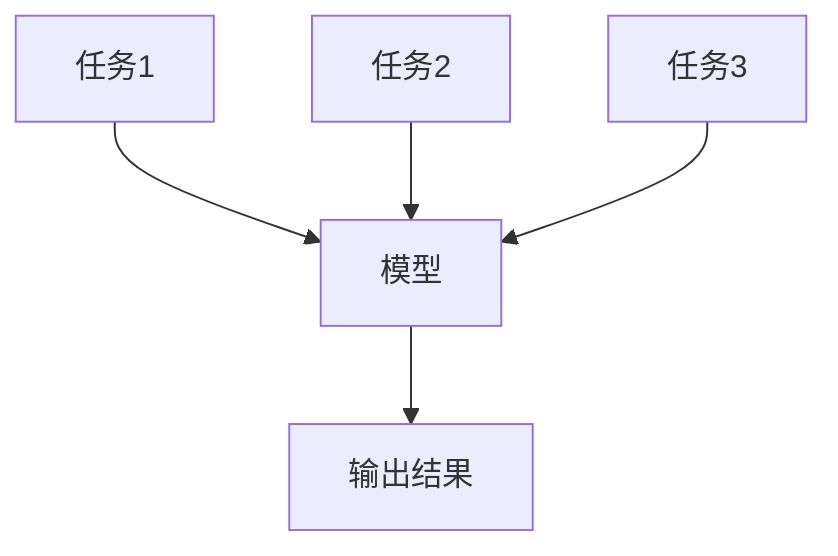
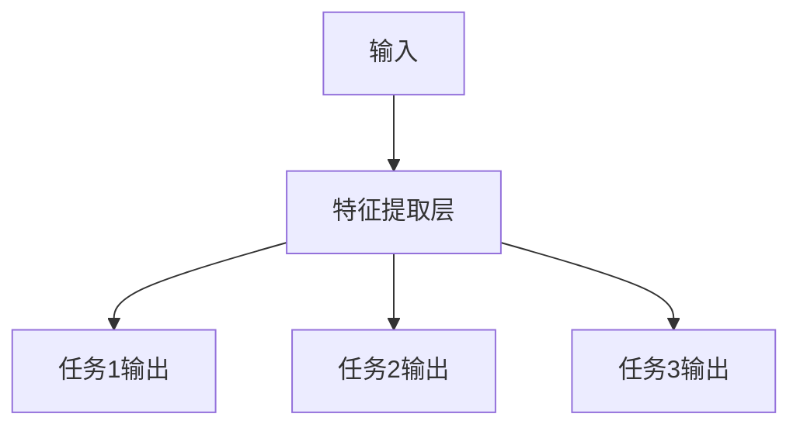
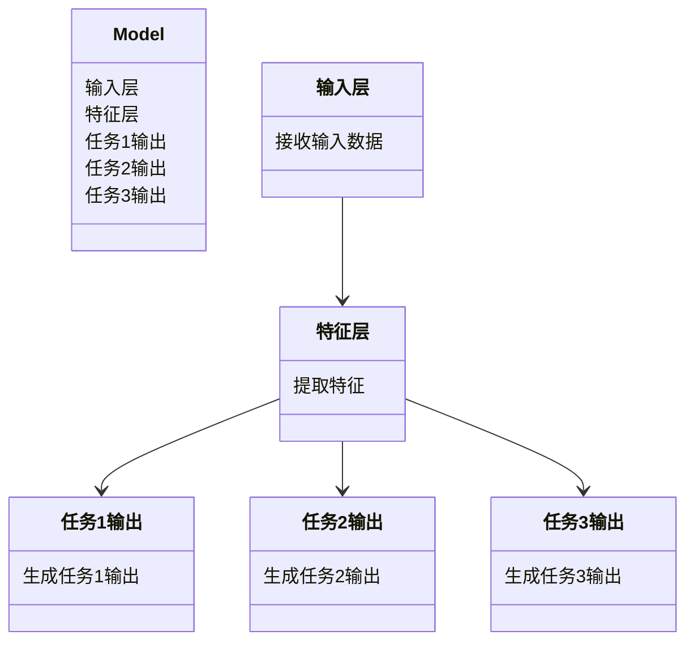
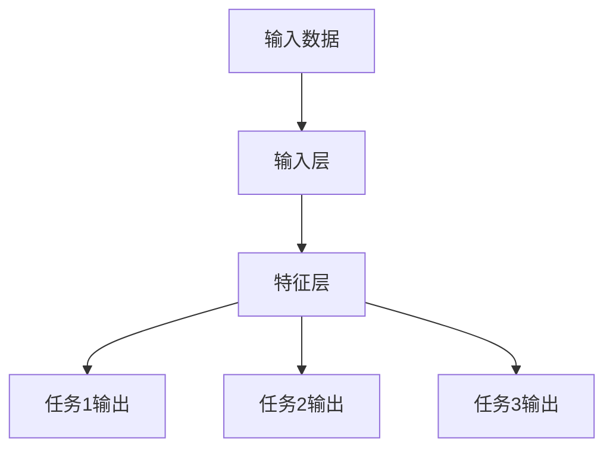
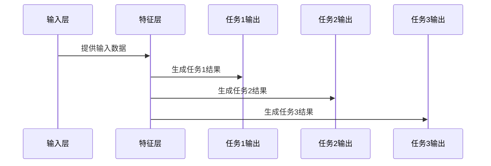

                 


# 多任务学习框架：构建全能型AI Agent

> 关键词：多任务学习，AI Agent，机器学习，深度学习，模型架构，算法优化

> 摘要：本文详细探讨了多任务学习框架在构建全能型AI Agent中的应用。通过分析多任务学习的核心概念、算法原理、系统架构及项目实战，全面解析了如何利用多任务学习提升AI Agent的能力，使其能够高效处理多种复杂任务。

---

# 正文

## 第一部分: 多任务学习框架的背景与概念

### 第1章: 多任务学习框架的背景与定义

#### 1.1 多任务学习的背景与问题背景

随着人工智能技术的快速发展，单一任务处理的AI模型已经难以满足实际应用中的多样化需求。例如，一个AI Agent可能需要同时完成自然语言理解、图像识别、决策推理等多种任务。这种情况下，多任务学习（Multi-Task Learning, MTL）作为一种新兴的机器学习范式，逐渐成为构建全能型AI Agent的核心技术。

MTL的核心思想是让模型同时学习多个相关任务，通过共享模型参数来提高学习效率和泛化能力。与传统的单一任务学习相比，MTL能够有效减少数据需求，提升模型的通用性和适应性。

#### 1.2 多任务学习的定义与特点

多任务学习是指在同一个模型中同时学习多个任务，使得模型能够共享不同任务之间的特征和表示。其主要特点包括：

1. **任务相关性**：多个任务之间存在一定的关联性，可以共享部分模型参数。
2. **参数共享**：通过共享参数，减少模型的参数量，降低计算成本。
3. **联合优化**：多个任务的损失函数同时优化，使得模型在多个任务上表现均衡。

#### 1.3 多任务学习的应用场景

1. **自然语言处理**：例如，同时进行文本分类、命名实体识别和语义理解。
2. **计算机视觉**：例如，同时进行图像分类、目标检测和图像分割。
3. **AI Agent**：例如，同时完成对话理解、任务规划和环境感知。

#### 1.4 多任务学习的优势与挑战

**优势**：
- **减少数据需求**：通过参数共享，降低对每个任务独立数据的需求。
- **提升模型泛化能力**：多个任务的联合优化使模型具有更强的迁移能力。
- **提高计算效率**：通过共享计算资源，减少训练时间。

**挑战**：
- **任务竞争**：不同任务之间可能存在目标冲突，导致模型难以在所有任务上表现优异。
- **任务平衡**：如何平衡不同任务的损失函数权重是一个关键问题。
- **计算复杂度**：多任务学习可能增加模型的计算复杂度。

---

## 第二部分: 多任务学习框架的核心概念与联系

### 第2章: 多任务学习的核心概念与联系

#### 2.1 多任务学习的原理与机制

多任务学习的核心机制是通过共享参数来实现多个任务的联合优化。其基本原理如下：

1. **任务表示**：将每个任务表示为一个损失函数，目标是通过优化这些损失函数来提升模型在所有任务上的性能。
2. **参数共享**：模型的某些参数在所有任务之间共享，而某些参数则为特定任务独有。
3. **权重分配**：通过权重分配机制，平衡不同任务在优化过程中的影响。

#### 2.2 多任务学习的核心概念对比

以下是多任务学习与单任务学习在核心概念上的对比：

| 对比维度 | 单任务学习 | 多任务学习 |
|----------|------------|------------|
| 模型参数 | 任务特有    | 部分共享   |
| 优化目标 | 单一任务    | 多个任务    |
| 数据需求 | 高          | 较低        |
| 泛化能力 | 较低        | 较高        |

#### 2.3 多任务学习的ER实体关系图



---

## 第三部分: 多任务学习框架的算法原理

### 第3章: 多任务学习的算法原理

#### 3.1 多任务学习的主要算法

##### 3.1.1 基于共享参数的多任务学习算法



数学模型如下：

$$
L_{total} = \alpha L_1 + \beta L_2 + \gamma L_3
$$

其中，$\alpha, \beta, \gamma$ 是任务的权重系数。

##### 3.1.2 基于任务分解的多任务学习算法

任务分解算法将多个任务分解为多个子任务，并分别优化。

$$
L_{total} = \sum_{i=1}^{n} L_i
$$

##### 3.1.3 基于门控机制的多任务学习算法

通过门控机制动态分配任务权重。

$$
w_i = \sigma(v_i)
$$

其中，$\sigma$ 是sigmoid函数，$v_i$ 是任务的权重向量。

---

## 第四部分: 多任务学习框架的系统分析与架构设计

### 第4章: 系统分析与架构设计

#### 4.1 系统功能设计



#### 4.2 系统架构设计



#### 4.3 系统交互设计



---

## 第五部分: 项目实战

### 第5章: 项目实战

#### 5.1 环境安装

安装所需的依赖：

```bash
pip install numpy matplotlib
```

#### 5.2 核心代码实现

```python
import numpy as np

class MultiTaskModel:
    def __init__(self, input_dim, task_num):
        self.weights = np.random.randn(input_dim, task_num)
        self.bias = np.zeros(task_num)

    def forward(self, inputs):
        outputs = np.dot(inputs, self.weights) + self.bias
        return outputs

    def backward(self, inputs, labels, learning_rate):
        delta = (outputs - labels) * inputs
        self.weights -= learning_rate * delta.mean(axis=0)
        return self.weights

# 示例数据
input_dim = 10
task_num = 3
model = MultiTaskModel(input_dim, task_num)
inputs = np.random.randn(100, input_dim)
labels = np.random.randn(100, task_num)

# 前向传播
outputs = model.forward(inputs)
print(outputs)

# 反向传播
weights = model.backward(inputs, labels, 0.01)
print(weights)
```

---

## 第六部分: 最佳实践、小结与注意事项

### 第6章: 最佳实践与小结

#### 6.1 最佳实践

1. **任务相关性分析**：在设计多任务学习框架时，需确保任务之间具有一定的相关性，以避免任务之间的干扰。
2. **权重分配**：合理分配任务权重，可以通过经验或实验确定。
3. **模型调优**：多任务学习需要进行多次实验和模型调优，以找到最佳参数组合。

#### 6.2 小结

多任务学习框架通过共享模型参数，显著提升了AI Agent的全能性。本文从背景、核心概念、算法原理、系统架构到项目实战，全面解析了多任务学习框架的构建过程。通过合理设计和优化，多任务学习框架能够在实际应用中表现出色。

#### 6.3 注意事项

1. **任务竞争**：需警惕不同任务之间的目标冲突。
2. **计算复杂度**：多任务学习可能增加计算复杂度，需优化算法设计。
3. **数据质量**：确保数据质量，避免数据偏见影响模型性能。

---

## 作者信息

作者：AI天才研究院/AI Genius Institute & 禅与计算机程序设计艺术 /Zen And The Art of Computer Programming

