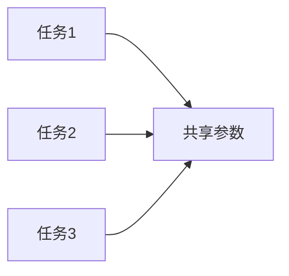
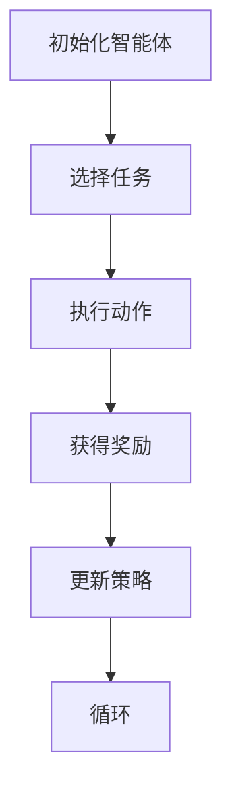
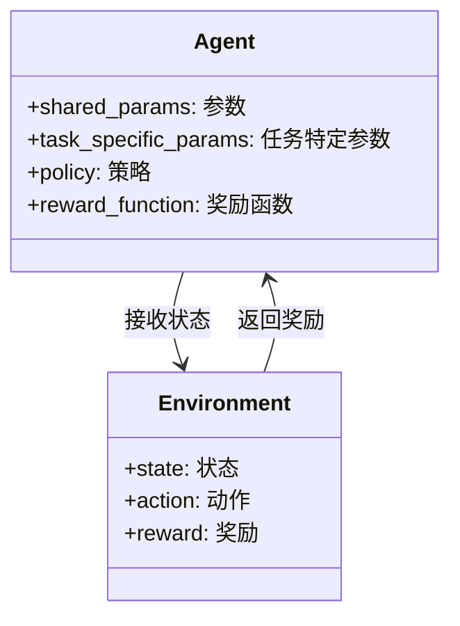

                 


# 多任务强化学习：构建具有广泛技能的AI Agent

> **关键词**：多任务强化学习、强化学习、AI代理、机器学习、算法设计

> **摘要**：多任务强化学习是一种先进的AI技术，通过同时处理多个任务，构建具备广泛技能的智能体。本文从背景、核心概念、算法原理、系统设计、项目实战等多个维度，全面解析多任务强化学习的技术本质和应用实践，帮助读者深入理解如何设计和实现具有广泛技能的AI代理。

---

## 第一部分: 多任务强化学习背景与核心概念

### 第1章: 多任务强化学习概述

#### 1.1 多任务强化学习的定义与背景
##### 1.1.1 强化学习的基本概念
强化学习（Reinforcement Learning, RL）是一种机器学习范式，通过智能体与环境的交互，学习策略以最大化累积奖励。其核心是通过试错机制，找到最优动作序列以实现目标。

##### 1.1.2 多任务强化学习的提出背景
单任务强化学习在处理单一任务时表现出色，但在面对多个相关任务时，效率低下且难以泛化。多任务强化学习（Multi-Task Reinforcement Learning, MTRL）旨在通过同时学习多个任务，提高智能体的通用性和效率。

##### 1.1.3 多任务强化学习的核心目标
通过共享任务之间的知识和经验，构建一个能够同时处理多个任务的通用智能体，提升学习效率和任务处理能力。

#### 1.2 多任务强化学习的问题背景
##### 1.2.1 单任务强化学习的局限性
- **样本效率低**：单任务学习需要大量样本才能收敛。
- **任务泛化能力弱**：难以处理与原任务相关的新型任务。
- **计算资源浪费**：每个任务都需要独立学习，资源消耗大。

##### 1.2.2 多任务强化学习的优势与应用场景
- **提升样本效率**：通过共享知识，减少所需样本数量。
- **增强泛化能力**：智能体能够处理多个相关任务。
- **降低计算成本**：多个任务共享学习过程，节省资源。

##### 1.2.3 多任务强化学习的挑战与机遇
- **挑战**：任务之间的关系复杂，如何平衡任务间的学习资源是关键。
- **机遇**：通过多任务学习，可以构建更通用、更智能的AI代理。

---

### 第2章: 多任务强化学习的核心概念

#### 2.1 多任务强化学习的核心概念
##### 2.1.1 任务之间的关系与依赖
任务之间的关系可以分为以下几种：
- **独立任务**：任务之间无直接关联。
- **相关任务**：任务之间共享某些特征或奖励函数。
- **层次化任务**：任务之间存在层次结构。

##### 2.1.2 共享参数与任务解耦
- **共享参数**：多个任务共享部分网络参数，以实现知识共享。
- **任务解耦**：通过参数解耦，平衡任务间的学习。

##### 2.1.3 多任务奖励函数的设计
多任务奖励函数需要同时考虑多个任务的奖励信号，通常采用加权和、分层设计等方式。

#### 2.2 多任务强化学习的核心概念对比
##### 2.2.1 任务共享参数的对比分析
| 方法 | 优点 | 缺点 |
|------|------|------|
| 全局共享 | 参数共享，提升泛化能力 | 易出现任务间竞争，影响收敛速度 |
| 层次化共享 | 适用于层次化任务 | 设计复杂，实现难度大 |

##### 2.2.2 任务解耦方法的优缺点
- **优点**：任务间学习相互独立，避免任务竞争。
- **缺点**：可能导致参数共享不足，学习效率降低。

##### 2.2.3 多任务奖励函数的设计原则
- **简洁性**：奖励函数应简单明了，避免过于复杂。
- **可区分性**：任务间的奖励应可区分，便于任务解耦。

#### 2.3 多任务强化学习的实体关系图


---

## 第三部分: 多任务强化学习的算法原理

### 第3章: 多任务强化学习的算法原理

#### 3.1 多任务强化学习的主流算法
##### 3.1.1 MTC（Multi-Task Curriculum）算法
- **算法流程**：通过逐步引入新任务，逐步增加任务难度。
- **代码示例**：
  ```python
  def MTC(agent, tasks, num_epochs):
      for epoch in range(num_epochs):
          for task in tasks:
              agent.train(task)
  ```

##### 3.1.2 DPT（Decomposition and Policy Transfer）算法
- **算法流程**：将任务分解为子任务，逐步转移策略。
- **代码示例**：
  ```python
  def DPT(agent, tasks, num_decompositions):
      for decomposition in range(num_decompositions):
          for task in tasks:
              agent.decompose_task(task)
              agent.transfer_policy(task)
  ```

##### 3.1.3 HRL（Hierarchical Reinforcement Learning）算法
- **算法流程**：通过层次化结构，分解任务为子任务。
- **代码示例**：
  ```python
  def HRL(agent, tasks, hierarchy_depth):
      for depth in range(hierarchy_depth):
          for task in tasks:
              agent.decompose_task(task, depth)
  ```

#### 3.2 多任务强化学习算法的流程图


---

## 第四部分: 多任务强化学习的系统分析与架构设计

### 第4章: 系统分析与架构设计

#### 4.1 系统功能设计
- **领域模型**：定义任务之间的关系和依赖。
- **架构图**：展示系统各个部分的协同工作。

#### 4.2 系统架构设计


---

## 第五部分: 多任务强化学习的项目实战

### 第5章: 项目实战

#### 5.1 环境安装与配置
- **安装依赖**：安装必要的库，如TensorFlow、Keras等。
- **配置环境**：设置训练参数，如学习率、批量大小等。

#### 5.2 核心代码实现
- **多任务强化学习的Python实现**：
  ```python
  import tensorflow as tf
  from tensorflow.keras import layers

  class MultiTaskAgent:
      def __init__(self, state_space, action_space, num_tasks):
          self.shared_net = self.build_shared_network(state_space)
          self.task_specific_net = [self.build_task_specific_network(action_space) for _ in range(num_tasks)]
      
      def build_shared_network(self, state_space):
          # 构建共享网络
          pass
      
      def build_task_specific_network(self, action_space):
          # 构建任务特定网络
          pass
  ```

---

## 第六部分: 最佳实践与小结

### 第6章: 最佳实践

#### 6.1 实践中的注意事项
- **任务相关性分析**：确保任务之间的相关性适中，避免任务竞争。
- **参数调节**：合理调节共享参数和任务特定参数的比例。

#### 6.2 小结
多任务强化学习通过共享知识和经验，显著提升了AI代理的通用性和效率。在实际应用中，需要结合具体场景，选择合适的算法和参数设置，以充分发挥多任务强化学习的优势。

---

## 作者

**作者：AI天才研究院/AI Genius Institute & 禅与计算机程序设计艺术 /Zen And The Art of Computer Programming**

---

希望这篇技术博客文章能满足您的需求！如果需要进一步调整或补充，请随时告诉我。

