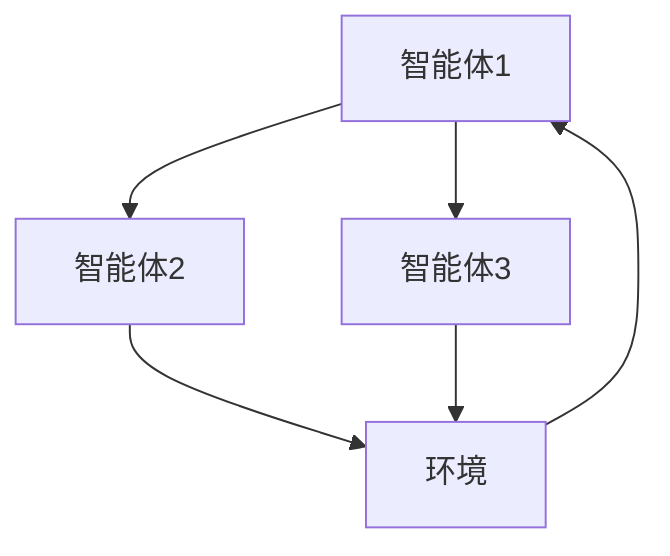
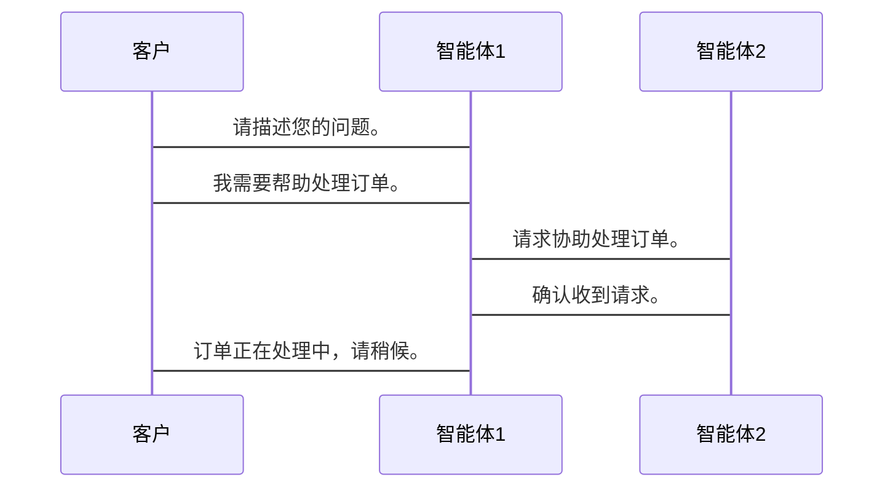

                 


好的，我将按照您的要求撰写一篇关于多智能体AI Agent的深度技术博客文章。让我们逐步分析并构建内容。

## 多智能体 AI Agent：LLM 驱动的协作与竞争系统

### 关键词：
多智能体系统、LLM、协作、竞争、人工智能、大语言模型

### 摘要：
多智能体系统通过多个智能体的协作与竞争，结合大语言模型（LLM）的强大能力，实现了复杂的任务处理。本文从背景介绍、核心概念、算法原理、系统架构到项目实战，全面解析多智能体AI Agent的设计与实现，探讨LLM在协作与竞争系统中的应用。

---

## 第一部分：多智能体 AI Agent 的背景与核心概念

### 第1章：多智能体系统概述

#### 1.1 多智能体系统的基本概念
多智能体系统（Multi-Agent System, MAS）是由多个智能体（Agent）组成的分布式系统，这些智能体能够感知环境、自主决策并协同完成任务。与传统AI不同，MAS强调智能体之间的交互与协作。

- **智能体的定义**：智能体是具有感知、决策和行动能力的实体，能够主动响应环境变化。
- **MAS的特点**：
  - 分布式：多个智能体独立运行。
  - 动态性：环境和智能体状态不断变化。
  - 协作性：智能体之间需要协调以完成共同目标。
  - 竞争性：智能体之间可能存在资源争夺或对抗。

#### 1.2 多智能体系统的协作与竞争机制
协作与竞争是多智能体系统的核心机制，决定了智能体之间的互动方式。

- **协作机制**：
  - 定义：智能体通过共享信息、分工合作完成任务。
  - 特点：目标一致、信息共享、协同决策。
  - 示例：任务分配、资源协调。

- **竞争机制**：
  - 定义：智能体在资源有限的情况下争夺优势。
  - 特点：目标冲突、信息隐藏、策略对抗。
  - 示例：拍卖系统、资源分配。

- **协作与竞争的平衡**：在实际应用中，智能体可能同时涉及协作和竞争，例如在团队游戏中，队员之间协作对抗对手。

#### 1.3 多智能体系统的应用场景
多智能体系统广泛应用于多个领域：

- **协作场景**：
  - 分工合作：例如物流系统中的货物分配。
  - 群智协同：例如交通调度系统。

- **竞争场景**：
  - 资源分配：例如云资源竞争。
  - 战略对抗：例如博弈对弈。

- **综合场景**：
  - 智能体需要在协作与竞争中动态调整策略。

### 第2章：LLM 驱动的多智能体系统

#### 2.1 LLM 的基本概念
大语言模型（LLM）是基于大规模数据训练的深度学习模型，能够理解和生成自然语言文本。

- **LLM的核心能力**：
  - 文本生成：生成连贯的文本。
  - 语义理解：理解上下文含义。
  - 知识问答：回答复杂问题。

- **LLM的优势**：
  - 强大的语言处理能力。
  - 可扩展性：适用于多种任务。

#### 2.2 LLM 在协作中的应用
在协作机制中，LLM可以作为智能体的“大脑”，负责生成决策、协调行动。

- **协作任务的实现流程**：
  1. 智能体感知环境，收集信息。
  2. LLM分析信息，生成协作策略。
  3. 智能体执行任务，实时反馈。
  4. 优化策略，持续改进。

- **LLM的协作能力**：
  - 多轮对话：智能体之间通过自然语言交互。
  - 任务分配：根据角色分配任务。

#### 2.3 LLM 在竞争中的应用
在竞争机制中，LLM可以帮助智能体制定对抗策略，防止恶意行为。

- **竞争任务的实现流程**：
  1. 智能体感知环境，识别竞争目标。
  2. LLM分析对手行为，制定竞争策略。
  3. 智能体执行策略，实时调整。

- **LLM的竞争能力**：
  - 策略生成：生成对抗策略。
  - 风险评估：评估竞争风险。

#### 2.4 LLM 的优势
- **灵活性**：适用于多种协作与竞争场景。
- **高效性**：通过语言模型快速生成决策。
- **可解释性**：模型输出可解释，便于分析。

### 第3章：多智能体系统的核心概念与联系

#### 3.1 多智能体系统的核心概念
- **协作机制**：智能体之间通过协作完成任务。
- **竞争机制**：智能体之间通过竞争争夺资源。
- **通信协议**：智能体之间交互的规则和格式。

#### 3.2 核心概念的属性对比
| 概念     | 协作机制         | 竞争机制         |
|----------|------------------|------------------|
| 目标     | 完成共同任务     | 获得竞争优势     |
| 策略     | 协同策略         | 对抗策略         |
| 信息共享 | 全部共享         | 部分隐藏         |
| 结果     | 高效完成任务     | 赢得资源或目标   |

#### 3.3 实体关系图
使用Mermaid绘制多智能体系统的ER图，展示实体之间的关系。

```mermaid
er
    %% 多智能体系统实体关系图
    actor 智能体1
    actor 智能体2
    actor 智能体3
    class 环境
    class 任务
    class 信息
    智能体1 --> 环境: 感知环境
    环境 --> 智能体1: 提供反馈
    智能体1 --> 信息: 发送信息
    信息 --> 智能体2: 接收信息
    智能体1 --> 任务: 执行任务
    任务 --> 智能体1: 任务完成
```

---

## 第二部分：算法原理与数学模型

### 第4章：算法原理与数学模型

#### 4.1 协作算法
协作算法通过智能体之间的协调完成任务，常用算法包括：

- **分布式协作算法**：
  - 智能体之间通过通信协议共享信息。
  - 通过协商分配任务。

- **基于LLM的协作算法**：
  - 使用LLM生成协作策略。
  - 实时调整协作计划。

#### 4.2 竞争算法
竞争算法通过对抗策略防止恶意行为，常用算法包括：

- **纳什均衡**：在博弈论中，纳什均衡是策略组合，使得每个玩家在给定其他玩家策略的情况下，不再改变自己的策略。

  $$ 纳什均衡条件：\forall i, u_i(s_i, s_{-i}) \geq u_i(a_i, s_{-i}) $$

- **对抗训练**：通过生成对抗网络（GAN）训练智能体的竞争策略。

#### 4.3 LLM 的数学模型
大语言模型通常基于Transformer架构，其数学模型包括：

- **自注意力机制**：
  $$ \text{Attention}(Q, K, V) = \text{softmax}(\frac{QK^T}{\sqrt{d}})V $$
  
- **前馈网络**：
  $$ f(x) = W_2\sigma(W_1x + b_1) + b_2 $$

---

## 第三部分：系统分析与架构设计

### 第5章：系统分析与架构设计

#### 5.1 问题场景介绍
以一个客服系统为例，设计一个多智能体系统，智能体之间协作处理客户咨询，同时竞争提升服务质量。

#### 5.2 系统功能设计
- **领域模型**：智能体负责客户咨询、订单处理、投诉处理。
- **通信协议**：智能体之间通过API交互。
- **任务分配**：根据负载动态分配任务。

#### 5.3 系统架构设计
使用Mermaid绘制系统架构图：



#### 5.4 系统接口设计
- **输入接口**：接收客户请求。
- **输出接口**：发送处理结果。

#### 5.5 系统交互设计
使用Mermaid绘制交互序列图：



---

## 第四部分：项目实战

### 第6章：项目实战

#### 6.1 环境安装
安装必要的库：

```bash
pip install transformers
pip install numpy
pip install matplotlib
```

#### 6.2 核心代码实现
以下是一个协作算法的实现示例：

```python
import torch
from transformers import AutoTokenizer, AutoModelForCausalLM

# 初始化模型
tokenizer = AutoTokenizer.from_pretrained('gpt2')
model = AutoModelForCausalLM.from_pretrained('gpt2')

# 协作请求
def collaboration_request(prompt):
    inputs = tokenizer.encode(prompt, return_tensors='pt')
    outputs = model.generate(inputs, max_length=50)
    return tokenizer.decode(outputs[0], skip_special_tokens=True)

# 竞争策略
def competition_strategy(opponent_action):
    # 分析对手行动，生成对抗策略
    prompt = f"对手采取了{opponent_action}，请生成对抗策略。"
    return collaboration_request(prompt)
```

#### 6.3 案例分析
在客服系统中，智能体1收到客户的订单问题请求，通过协作算法调用智能体2协助，最终完成订单处理。

---

## 第五部分：总结与展望

### 第7章：总结与展望

#### 7.1 本章总结
- 多智能体系统通过协作与竞争实现复杂任务。
- LLM在协作与竞争中的应用显著提升了系统能力。
- 通过算法优化和架构设计，可以进一步提升系统的效率。

#### 7.2 未来展望
- 更复杂场景下的协作与竞争。
- LLM与其他AI技术的结合，如强化学习。
- 更高效的通信协议和决策机制。

---

## 作者：AI天才研究院 & 禅与计算机程序设计艺术

---

感谢您的耐心阅读！希望这篇文章对您理解多智能体AI Agent有所帮助。

