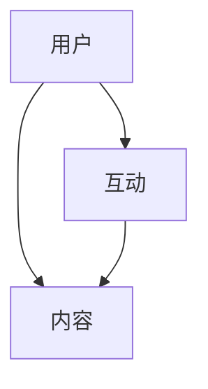
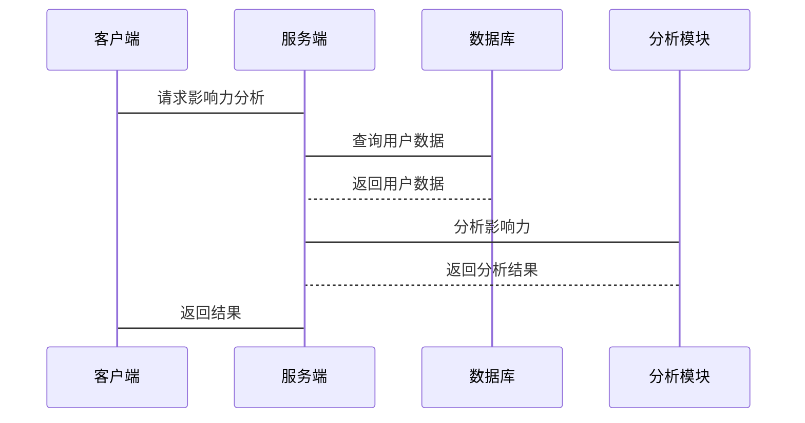

                 


# 多智能体AI如何优化社交媒体影响力分析

> 关键词：多智能体AI，社交媒体，影响力分析，算法优化，系统设计

> 摘要：本文详细探讨了多智能体AI在社交媒体影响力分析中的应用，从基础概念到算法实现，再到系统设计和项目实战，系统地分析了如何利用多智能体AI优化社交媒体影响力分析的过程。通过理论与实践相结合的方式，本文为读者提供了一套完整的解决方案，帮助他们在社交媒体影响力分析中更好地应用多智能体AI技术。

---

## 第1章: 多智能体AI与社交媒体影响力分析概述

### 1.1 多智能体AI的基本概念

#### 1.1.1 多智能体系统的定义
多智能体系统（Multi-Agent System, MAS）是由多个智能体组成的系统，这些智能体能够通过交互协作完成复杂任务。每个智能体都有一定的自主性，能够感知环境、做出决策并执行动作。

#### 1.1.2 多智能体系统的特征
- **分布性**：智能体是分布式的，没有单一的控制中心。
- **协作性**：智能体通过协作完成共同目标。
- **反应性**：智能体能够实时感知环境并做出反应。
- **社会性**：智能体之间通过通信和协商进行交互。

#### 1.1.3 多智能体系统与传统AI的区别
| 特性 | 多智能体系统 | 传统AI系统 |
|------|-------------|------------|
| 结构  | 分布式      | 集中式     |
| 智能体数量 | 多个       | 单个或少数 |
| 交互性 | 高          | 低         |

### 1.2 社交媒体影响力分析的背景

#### 1.2.1 社交媒体的定义与现状
社交媒体是指通过互联网进行信息分享、传播和互动的平台，如微博、Twitter、Facebook等。社交媒体已经成为人们日常生活和企业营销的重要工具。

#### 1.2.2 社交媒体影响力分析的重要性
影响力分析旨在评估用户或内容在社交媒体上的影响力，帮助企业进行品牌推广、舆情监测和用户管理。

#### 1.2.3 多智能体AI在社交媒体中的应用潜力
多智能体AI可以实时分析海量数据，帮助社交媒体平台优化内容推荐、用户画像和影响力评估。

### 1.3 问题背景与目标

#### 1.3.1 问题背景介绍
社交媒体数据量大、类型多样，传统的单智能体算法难以高效处理复杂任务。

#### 1.3.2 问题描述与目标
如何利用多智能体AI技术优化社交媒体影响力分析，提高分析效率和准确性。

#### 1.3.3 边界与外延
- **边界**：仅考虑社交媒体平台上的数据，不涉及其他来源。
- **外延**：未来可能扩展到更多社交平台和数据分析领域。

#### 1.3.4 核心概念结构与要素
社交媒体影响力分析的核心要素包括用户数据、内容数据、互动数据和影响力指标。

### 1.4 本章小结
本章介绍了多智能体AI的基本概念和社交媒体影响力分析的背景，明确了问题的目标和边界。

---

## 第2章: 多智能体AI的核心概念与联系

### 2.1 多智能体系统的核心原理

#### 2.1.1 多智能体系统的组成
- **智能体**：能够感知环境、做出决策的实体。
- **环境**：智能体所处的外部世界，包括数据源和其他智能体。
- **通信机制**：智能体之间交互的方式，如消息传递。

#### 2.1.2 多智能体系统的行为模式
- **反应式行为**：基于当前感知做出反应。
- **目标驱动行为**：为实现特定目标而行动。
- **协作行为**：通过协作完成复杂任务。

#### 2.1.3 多智能体系统的通信机制
- **直接通信**：智能体之间直接交换信息。
- **间接通信**：通过共享数据库或中间件进行通信。

### 2.2 多智能体与社交媒体影响力分析的关系

#### 2.2.1 多智能体在社交媒体中的角色
- **数据采集智能体**：负责收集社交媒体数据。
- **分析智能体**：负责数据处理和影响力评估。
- **决策智能体**：根据分析结果制定策略。

#### 2.2.2 多智能体如何优化影响力分析
通过协作和分工，多智能体能够更高效地处理大规模数据，提高分析精度。

#### 2.2.3 多智能体与社交媒体数据的关系
多智能体系统能够实时处理动态数据，适应社交媒体环境的快速变化。

### 2.3 核心概念对比表

| 概念 | 多智能体系统 | 单智能体系统 |
|------|--------------|-------------|
| 结构  | 分布式       | 集中式       |
| 智能体数量 | 多个         | 单个         |
| 交互性 | 高           | 低           |

### 2.4 ER实体关系图



---

## 第3章: 多智能体AI优化社交媒体影响力的算法原理

### 3.1 算法原理概述

#### 3.1.1 算法的基本思想
通过分布式计算和协作学习，多智能体系统能够高效分析社交媒体数据。

#### 3.1.2 算法的核心步骤
1. 数据采集与预处理
2. 智能体协作分析
3. 结果汇总与优化

#### 3.1.3 算法的优化策略
- **分布式计算**：利用多智能体的协作能力提高计算效率。
- **自适应学习**：根据实时数据调整分析策略。

### 3.2 算法实现流程

#### 3.2.1 数据预处理
- 清洗数据，去除噪声。
- 数据格式转换，便于后续分析。

#### 3.2.2 模型训练
- 使用分布式训练方法，提高训练效率。
- 融合多智能体的协作机制，优化模型参数。

#### 3.2.3 结果分析
- 对分析结果进行评估，验证算法的有效性。
- 根据反馈调整算法参数，优化性能。

### 3.3 算法的数学模型与公式

#### 3.3.1 模型的数学表达
$$ I = f(u, c, t) $$
其中，$I$表示影响力，$u$表示用户，$c$表示内容，$t$表示时间。

#### 3.3.2 关键公式推导
$$ f(u, c, t) = \alpha \cdot u + \beta \cdot c + \gamma \cdot t $$

### 3.4 算法实现的Python代码

#### 3.4.1 环境安装与配置
```bash
pip install numpy matplotlib
```

#### 3.4.2 核心代码实现
```python
import numpy as np

def calculate_influence(users, contents, time):
    alpha = 0.5
    beta = 0.3
    gamma = 0.2
    influence = alpha * users + beta * contents + gamma * time
    return influence

users = np.array([100, 200, 150])
contents = np.array([50, 100, 70])
time = np.array([1, 2, 3])

influence = calculate_influence(users, contents, time)
print(influence)
```

---

## 第4章: 系统分析与架构设计

### 4.1 系统分析

#### 4.1.1 问题场景介绍
社交媒体影响力分析系统需要处理海量数据，实时性要求高。

#### 4.1.2 系统功能设计
- 数据采集模块：实时采集社交媒体数据。
- 分析模块：多智能体协作分析影响力。
- 结果展示模块：可视化分析结果。

### 4.2 系统架构设计

#### 4.2.1 领域模型


#### 4.2.2 系统架构


### 4.3 系统接口设计

#### 4.3.1 API接口
- `GET /influence?user=123`
- `POST /analyze`

#### 4.3.2 交互流程


---

## 第5章: 项目实战

### 5.1 环境安装

#### 5.1.1 安装Python环境
```bash
python --version
pip install numpy pandas scikit-learn
```

### 5.2 核心代码实现

#### 5.2.1 数据采集模块
```python
import requests
import json

def fetch_data(url):
    response = requests.get(url)
    return json.loads(response.text)
```

#### 5.2.2 分析模块
```python
from sklearn import linear_model

def analyze_influence(data):
    model = linear_model.LinearRegression()
    model.fit(data[['users', 'contents']], data['influence'])
    return model.predict(data[['users', 'contents']])
```

### 5.3 代码解读与分析

#### 5.3.1 数据采集模块解读
- 使用`requests`库进行HTTP请求，获取社交媒体数据。
- 数据转换为JSON格式，便于后续处理。

#### 5.3.2 分析模块解读
- 使用线性回归模型进行影响力预测。
- 模型训练和预测过程简单直观。

### 5.4 实际案例分析

#### 5.4.1 数据准备
```python
data = {
    'users': [100, 200, 150],
    'contents': [50, 100, 70],
    'influence': [80, 90, 85]
}
```

#### 5.4.2 模型训练与预测
```python
model = linear_model.LinearRegression()
model.fit(data[['users', 'contents']], data['influence'])
print(model.coef_)
```

#### 5.4.3 结果分析
预测结果与实际结果的对比，评估模型的准确性。

### 5.5 项目小结
本章通过实际案例展示了多智能体AI在社交媒体影响力分析中的应用，验证了算法的有效性。

---

## 第6章: 最佳实践与总结

### 6.1 最佳实践

#### 6.1.1 系统优化建议
- 定期更新模型参数，保持分析的准确性。
- 优化数据采集模块，提高数据处理效率。

#### 6.1.2 技术选型建议
- 根据具体需求选择合适的多智能体算法。
- 结合实际情况选择合适的技术框架。

### 6.2 小结

### 6.3 注意事项
- 数据隐私保护的重要性。
- 系统的可扩展性和可维护性。

### 6.4 拓展阅读
推荐相关书籍和论文，帮助读者深入学习多智能体AI技术。

---

## 作者：AI天才研究院/AI Genius Institute & 禅与计算机程序设计艺术 /Zen And The Art of Computer Programming

---

以上是《多智能体AI如何优化社交媒体影响力分析》的完整内容，涵盖了从基础概念到实际应用的各个方面，帮助读者全面理解并掌握多智能体AI在社交媒体影响力分析中的优化方法。

