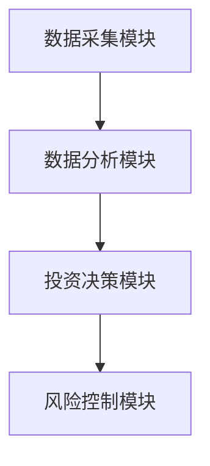

                 


# 多智能体AI如何增强价值投资的宏观经济影响分析

> 关键词：多智能体AI，价值投资，宏观经济，金融市场，技术分析

> 摘要：本文探讨了多智能体AI在价值投资中的应用，分析了其对宏观经济的影响。通过数学模型和实际案例，展示了多智能体AI如何通过协作机制优化投资决策，提升市场效率，增强经济稳定性。

---

## 引言

随着人工智能技术的快速发展，多智能体AI在金融领域的应用日益广泛。价值投资作为一种重要的投资策略，依赖于对市场深度分析和长期价值判断。本文将分析多智能体AI如何增强价值投资的宏观经济影响，探讨其在金融市场中的潜力和挑战。

---

## 第1章: 多智能体AI的基本概念

### 1.1 多智能体系统的定义与特点

多智能体系统（MAS）由多个相互作用的智能体组成，每个智能体具备自主决策和协作能力。其特点包括分布式、协作性和反应性。

#### 1.1.1 多智能体系统的定义与特点

多智能体系统（MAS）由多个智能体组成，每个智能体具备自主决策和协作能力。其特点包括：

- **分布式**：智能体分布于不同节点，协同完成任务。
- **协作性**：智能体之间通过通信和协作实现目标。
- **反应性**：智能体能够实时感知环境变化并做出反应。

### 1.2 多智能体AI在金融领域的应用

多智能体AI在金融领域的应用包括市场分析、投资决策和风险管理。通过协作机制，多智能体能够提高决策的准确性和效率。

#### 1.2.1 多智能体协作机制

多智能体协作机制通过信息共享和任务分配，实现整体目标的最优解。以下是协作机制的详细步骤：

1. **信息共享**：智能体之间共享市场数据和分析结果。
2. **任务分配**：根据智能体的能力和当前任务需求，分配具体任务。
3. **协同决策**：智能体共同制定最优策略。
4. **动态调整**：根据环境变化实时调整协作策略。

---

## 第2章: 价值投资的宏观经济影响分析

### 2.1 价值投资的基本原理

价值投资是一种以内在价值为导向的投资策略，强调长期持有优质资产。其核心在于识别被市场低估的投资标的。

#### 2.1.1 价值投资的核心理念

价值投资的核心理念是购买低于内在价值的资产，长期持有，等待市场重新定价。以下是价值投资的关键点：

- **内在价值**：资产的真实价值，基于基本面分析。
- **安全边际**：购买价格与内在价值的差距，提供风险缓冲。
- **长期视角**：关注企业的长期盈利能力。

### 2.2 价值投资的宏观经济影响

价值投资通过优化资源配置，提升市场效率，增强经济稳定性。

#### 2.2.1 优化资源配置

价值投资引导资金流向具有竞争优势的企业，优化资源配置，促进经济结构优化。

#### 2.2.2 提高市场效率

价值投资通过识别低估资产，减少市场信息不对称，提高市场定价效率。

#### 2.2.3 增强经济稳定性

价值投资强调长期稳定，减少市场波动，增强经济稳定性。

---

## 第3章: 多智能体AI如何增强价值投资的宏观经济影响

### 3.1 多智能体AI在价值投资中的应用

多智能体AI通过协作机制提升价值投资的效率和准确性。

#### 3.1.1 市场分析

多智能体AI能够实时分析市场数据，识别潜在投资机会。以下是市场分析的关键步骤：

1. **数据采集**：收集市场数据，包括价格、成交量等。
2. **数据分析**：利用机器学习算法，分析数据并识别趋势。
3. **风险评估**：评估投资标的的风险，确定其内在价值。

#### 3.1.2 投资决策

多智能体AI通过协作，制定最优投资策略。以下是投资决策的步骤：

1. **信息共享**：智能体之间共享分析结果。
2. **决策制定**：基于共享信息，制定投资策略。
3. **动态调整**：根据市场变化实时调整投资组合。

### 3.2 多智能体AI对宏观经济影响的增强作用

多智能体AI通过优化资源配置、提高市场效率和增强稳定性，增强宏观经济影响。

#### 3.2.1 优化资源配置

多智能体AI通过协作机制，优化资金分配，促进经济结构优化。

#### 3.2.2 提高市场效率

多智能体AI通过提升信息处理能力，减少交易成本，提高市场效率。

#### 3.2.3 增强市场稳定性

多智能体AI通过实时协作和风险控制，减少市场波动，增强稳定性。

---

## 数学模型和算法原理

### 3.2.1 多智能体协作的数学模型

以下是多智能体协作的优化模型：

$$
\text{目标函数} = \sum_{i=1}^{n} f_i(x_i)
$$

其中，$f_i$ 是智能体i的目标函数，$x_i$ 是智能体i的决策变量。

### 3.2.2 算法流程

以下是多智能体协作的算法流程：

1. 初始化智能体状态。
2. 智能体之间共享信息。
3. 根据共享信息更新决策。
4. 评估当前决策效果。
5. 根据评估结果调整策略。
6. 重复步骤2-5，直到达到目标。

---

## 系统架构设计

### 3.3.1 系统功能设计

以下是系统的功能模块：

- 数据采集模块：采集市场数据。
- 数据分析模块：分析数据并识别趋势。
- 投资决策模块：制定投资策略。
- 风险控制模块：评估和控制风险。

### 3.3.2 系统架构设计

以下是系统的架构图：



---

## 项目实战与案例分析

### 3.4.1 环境配置

需要安装以下工具：

- Python 3.8+
- NumPy、Pandas、Scikit-learn
- Mermaid CLI

### 3.4.2 核心代码实现

以下是核心代码实现：

```python
import numpy as np
import pandas as pd
from sklearn import linear_model

# 数据采集
data = pd.read_csv('market_data.csv')

# 数据分析
X = data[['price', 'volume']]
y = data['target']
model = linear_model.LinearRegression()
model.fit(X, y)

# 投资决策
predictions = model.predict(X)
# 风险控制
risk = np.std(predictions)
```

### 3.4.3 案例分析

通过案例分析，展示多智能体AI在价值投资中的实际应用。以下是具体步骤：

1. 数据采集：收集相关市场数据。
2. 数据分析：利用机器学习算法分析数据。
3. 投资决策：基于分析结果制定投资策略。
4. 风险控制：评估和控制投资风险。

---

## 总结与展望

### 4.1 总结

多智能体AI通过协作机制，提升价值投资的效率和准确性，增强宏观经济影响。其优势包括优化资源配置、提高市场效率和增强稳定性。

### 4.2 展望

未来，多智能体AI在价值投资中的应用将更加广泛。可以通过以下方式进一步研究：

- 提高多智能体协作的效率。
- 加强风险控制能力。
- 扩展应用场景，如跨国投资和多资产配置。

---

## 作者信息

作者：AI天才研究院/AI Genius Institute & 禅与计算机程序设计艺术 /Zen And The Art of Computer Programming

---

通过以上步骤，我们系统地分析了多智能体AI如何增强价值投资的宏观经济影响，展示了其在金融市场中的潜力和应用。希望本文能够为读者提供有价值的见解，促进多智能体AI在金融领域的进一步研究和应用。

