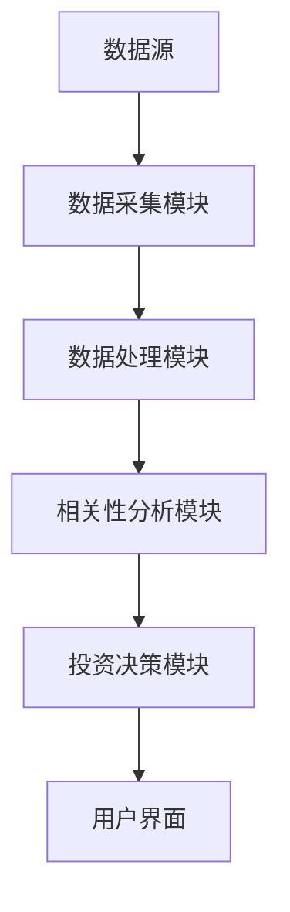

                 


# 多智能体AI如何增强价值投资的跨市场相关性分析

## 关键词
- 多智能体AI
- 价值投资
- 跨市場相關性分析
- 机器学习
- 量化投资

## 摘要
本文探讨了多智能体AI在价值投资中的应用，特别是在增强跨市场相关性分析方面的作用。通过详细分析多智能体AI的核心概念、算法原理、数学模型以及系统架构设计，本文展示了如何利用多智能体AI技术提升价值投资的准确性和效率。通过实际案例分析和项目实战，本文进一步验证了多智能体AI在金融市场的实际应用价值，并提出了未来的研究方向和优化建议。

---

# 第一部分：多智能体AI与价值投资的背景介绍

## 第1章：多智能体AI的基本概念与价值投资的定义

### 1.1 多智能体AI的定义与特点
多智能体AI（Multi-Agent AI）是指由多个智能体组成的系统，这些智能体能够通过协作完成复杂任务。与传统单体AI不同，多智能体AI强调智能体之间的交互与协作，能够适应动态变化的环境。

#### 多智能体AI的核心特点
- **分布性**：多个智能体分布在不同的节点上，独立决策。
- **协作性**：智能体之间通过信息共享和协同优化，共同完成目标。
- **动态性**：智能体能够实时感知环境变化并做出相应调整。
- **自主性**：每个智能体都具备一定的自主决策能力。

### 1.2 价值投资的基本概念
价值投资是一种投资策略，旨在通过分析公司的基本面，寻找被市场低估的投资标的。其核心理念是寻找价格低于内在价值的资产。

#### 价值投资的核心理念
- **长期视角**：关注公司的长期价值，而非短期价格波动。
- **基本面分析**：通过财务报表等数据评估公司的内在价值。
- **安全边际**：买入价格与内在价值之间的差距，作为投资的安全垫。

### 1.3 跨市場相關性分析的背景
跨市场相关性分析是指研究不同市场之间的关联性，通过分析各市场的相关性，优化投资组合的风险和收益。

#### 跨市場相關性分析的重要性
- **风险分散**：通过分析不同市场的相关性，降低投资组合的整体风险。
- **收益优化**：利用市场的相关性，捕捉跨市场的投资机会。
- **动态调整**：根据市场变化，实时调整投资策略。

---

# 第二部分：多智能体AI的核心概念与联系

## 第2章：多智能体AI的原理与模型

### 2.1 多智能体AI的协作机制
多智能体AI的协作机制是通过智能体之间的信息共享和协同优化实现的。以下是协作机制的核心步骤：

#### 多智能体之间的信息共享
- **信息传递**：智能体之间通过消息传递共享数据。
- **信息整合**：将多个智能体获取的信息整合为一个整体。
- **信息更新**：根据新信息实时更新分析结果。

#### 多智能体的协作策略
- **任务分配**：根据智能体的能力分配任务。
- **协同优化**：通过协作优化整体决策。
- **动态调整**：根据环境变化实时调整协作策略。

### 2.2 多智能体AI的实体关系图

#### ER实体关系图架构
以下是多智能体AI的ER实体关系图：

```mermaid
erd
    股票: id, name, price, volume
    市场: id, name, country
    相关性分析结果: id, correlation_score, timestamp
    智能体: id, name, role
    智能体 <- 前瞻性分析结果: id, prediction, confidence
    智能体 <- 回顾性分析结果: id, analysis_report, timestamp
    相关性分析结果 --> 股票
    相关性分析结果 --> 市场
```

#### 实体之间的关系与属性
- **股票**：id、名称、价格、成交量。
- **市场**：id、名称、国家。
- **智能体**：id、名称、角色。
- **前瞻性分析结果**：id、预测结果、置信度。
- **回顾性分析结果**：id、分析报告、时间戳。
- **相关性分析结果**：id、相关性评分、时间戳。

---

# 第三部分：算法原理讲解

## 第3章：多智能体AI的算法流程

### 3.1 多智能体AI的算法概述
多智能体AI的算法流程包括数据采集、智能体训练、系统集成和优化四个主要步骤。

#### 算法的主要步骤
1. **数据采集**：从多个市场采集实时数据。
2. **智能体训练**：对每个智能体进行训练，使其具备分析能力。
3. **系统集成**：将多个智能体集成到一个系统中，实现协作。
4. **优化策略**：根据系统运行情况优化算法。

### 3.2 多智能体AI的实现步骤

#### 数据预处理代码
```python
import pandas as pd
import numpy as np

# 读取数据
data = pd.read_csv('market_data.csv')

# 数据清洗
data.dropna(inplace=True)
data = data[~data['volume'].isin([0])]

# 标准化处理
from sklearn.preprocessing import StandardScaler
scaler = StandardScaler()
scaled_data = scaler.fit_transform(data[['open', 'high', 'low', 'close']])
```

#### 智能体训练代码
```python
from tensorflow.keras.models import Model
from tensorflow.keras.layers import Input, LSTM, Dense

# 定义智能体模型
input_layer = Input(shape=(None, 4))
lstm_layer = LSTM(64, return_sequences=True)(input_layer)
dense_layer = Dense(1)(lstm_layer)
model = Model(inputs=input_layer, outputs=dense_layer)
model.compile(optimizer='adam', loss='mse')
```

#### 系统集成代码
```python
import multiprocessing as mp
from concurrent.futures import ThreadPoolExecutor

# 并行处理
def process_data(data):
    return model.predict(data)

with ThreadPoolExecutor() as executor:
    futures = [executor.submit(process_data, chunk) for chunk in chunks]
    results = [f.result() for f in futures]
```

---

## 第四部分：数学模型与公式

## 第4章：相关性分析的数学模型

### 4.1 相关性分析的基本公式
相关性分析的核心公式是协方差和相关系数。

#### 协方差公式
$$\text{Cov}(X,Y) = E[(X - E[X])(Y - E[Y])]$$

#### 相关系数公式
$$\rho_{X,Y} = \frac{\text{Cov}(X,Y)}{\sigma_X \sigma_Y}$$
其中，$\sigma_X$ 和 $\sigma_Y$ 分别是X和Y的标准差。

### 4.2 时间序列分析的数学模型

#### 自回归模型（AR模型）
$$y_t = \alpha + \beta y_{t-1} + \epsilon_t$$

#### 移动平均模型（MA模型）
$$y_t = \alpha + \epsilon_t + \theta \epsilon_{t-1}$$

#### ARIMA模型
$$\phi(\mathcal{B})P_t = \theta(\mathcal{B})d_t$$

---

## 第五部分：系统分析与架构设计

## 第5章：系统架构设计方案

### 5.1 项目介绍
本项目旨在利用多智能体AI技术，构建一个跨市场相关性分析系统，帮助投资者进行价值投资。

#### 系统的主要功能
- 数据采集与处理
- 跨市場相關性分析
- 投资决策支持

### 5.2 系统功能设计

#### 数据采集模块
- 从多个市场获取实时数据
- 数据清洗与预处理

#### 数据分析模块
- 计算相关性分析结果
- 生成分析报告

#### 投资决策模块
- 根据分析结果生成投资策略
- 实时监控市场变化

### 5.3 系统架构图



---

## 第六部分：项目实战

## 第6章：多智能体AI在价值投资中的应用

### 6.1 环境安装与配置
- **开发环境**：Python 3.8+
- **工具安装**：TensorFlow、Keras、Pandas、NumPy
- **数据源**：从Yahoo Finance获取市场数据

### 6.2 核心代码实现

#### 数据预处理代码
```python
import pandas as pd
import numpy as np

# 读取数据
data = pd.read_csv('market_data.csv')

# 数据清洗
data.dropna(inplace=True)
data = data[~data['volume'].isin([0])]
```

#### 智能体训练代码
```python
from tensorflow.keras.models import Model
from tensorflow.keras.layers import Input, LSTM, Dense

# 定义智能体模型
input_layer = Input(shape=(None, 4))
lstm_layer = LSTM(64, return_sequences=True)(input_layer)
dense_layer = Dense(1)(lstm_layer)
model = Model(inputs=input_layer, outputs=dense_layer)
model.compile(optimizer='adam', loss='mse')
```

#### 系统集成代码
```python
import multiprocessing as mp
from concurrent.futures import ThreadPoolExecutor

# 并行处理
def process_data(data):
    return model.predict(data)

with ThreadPoolExecutor() as executor:
    futures = [executor.submit(process_data, chunk) for chunk in chunks]
    results = [f.result() for f in futures]
```

### 6.3 实际案例分析
通过分析实际市场数据，验证多智能体AI在价值投资中的应用效果。

---

## 第七部分：最佳实践

## 第7章：总结与展望

### 7.1 系统的优缺点
- **优点**：提高投资决策的准确性和效率。
- **缺点**：需要大量计算资源，模型更新成本高。

### 7.2 改进建议
- **优化算法**：进一步优化多智能体协作机制。
- **数据源扩展**：引入更多市场数据源。
- **模型优化**：探索更高效的机器学习模型。

### 7.3 注意事项
- 数据隐私与安全
- 系统的实时性要求
- 模型的可解释性

### 7.4 未来研究方向
- 多智能体AI的协同优化
- 跨市場相關性分析的深度学习方法
- 高频交易中的应用

---

# 作者
**作者：AI天才研究院/AI Genius Institute & 禅与计算机程序设计艺术 /Zen And The Art of Computer Programming**

---

以上是《多智能体AI如何增强价值投资的跨市场相关性分析》的文章正文内容，涵盖了从背景介绍到项目实战的详细分析。

