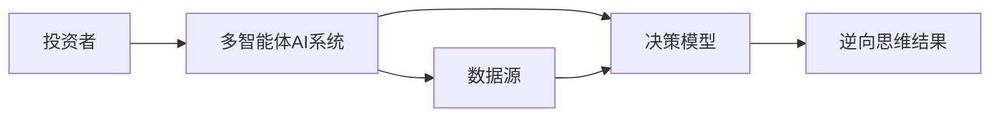
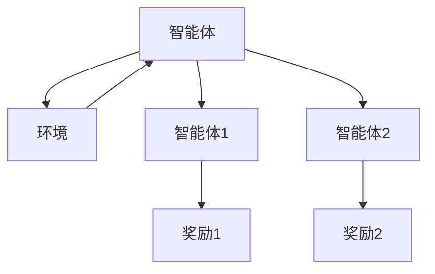
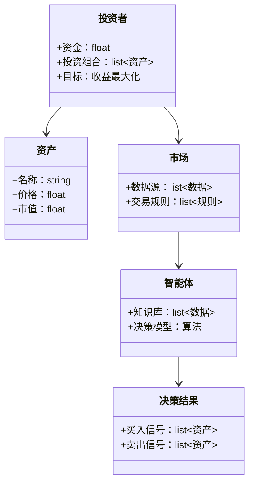
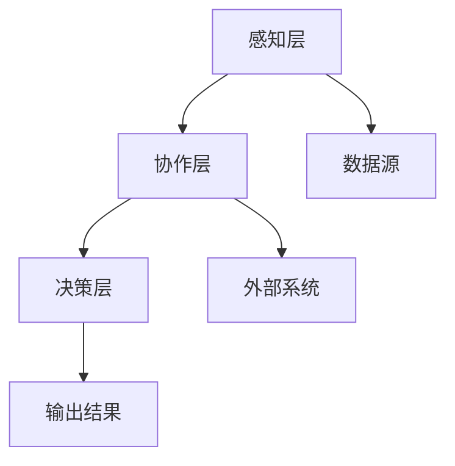
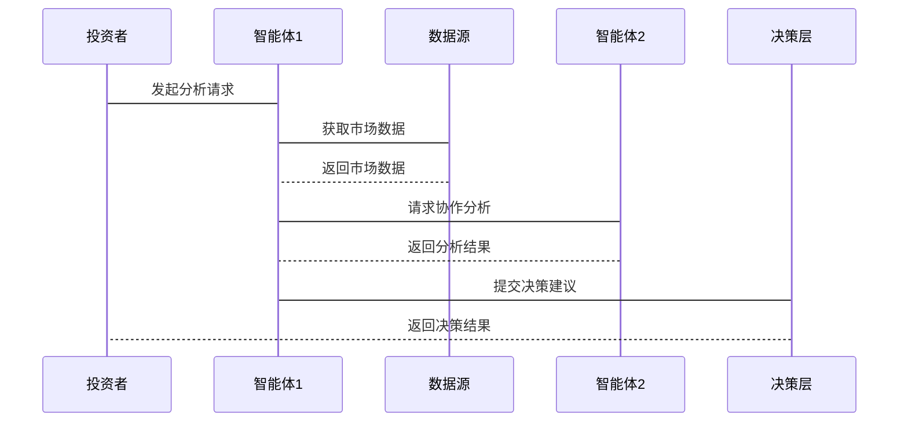

                 


# 多智能体AI如何增强价值投资者的逆向思维能力

---

## 关键词：多智能体AI，逆向思维，价值投资，强化学习，系统架构

---

## 摘要

在金融投资领域，逆向思维是一种重要的策略，即在市场低谷时寻找被低估的机会，而在市场高点时规避风险。多智能体AI（Multi-Agent AI）作为一种新兴的技术，能够通过多个智能体的协作和竞争，模拟市场的复杂性和不确定性，从而为价值投资者提供更深入的洞察和决策支持。本文将探讨多智能体AI如何增强价值投资者的逆向思维能力，从理论基础、算法原理、系统架构到实际应用，全面分析其潜力和实现路径。

---

# 第1章 多智能体AI与逆向思维的背景介绍

## 1.1 多智能体AI的基本概念

### 1.1.1 多智能体系统的定义

多智能体系统（Multi-Agent System, MAS）是由多个智能体（Agent）组成的分布式系统，这些智能体能够通过通信和协作完成复杂的任务。每个智能体都有自己的目标、知识和决策机制，能够在动态环境中自主行动。

### 1.1.2 多智能体系统的特征

- **自主性**：智能体能够自主决策。
- **反应性**：能够实时感知环境并做出反应。
- **协作性**：多个智能体之间可以协作完成任务。
- **分布式性**：系统中的智能体是分布式的，没有中心控制点。

### 1.1.3 多智能体系统在投资中的应用潜力

在金融投资中，多智能体系统可以模拟市场中的多方角色，如投资者、市场分析员、交易员等，帮助价值投资者更好地理解市场动态和潜在机会。

---

## 1.2 逆向思维在投资中的作用

### 1.2.1 逆向思维的定义

逆向思维是一种与传统思维方式相反的思考方式，即从反方向入手解决问题。在投资中，逆向思维意味着在市场下跌时寻找买入机会，而在市场上涨时寻找卖出机会。

### 1.2.2 逆向思维在投资中的优势

- **发现低估机会**：逆向思维能够帮助投资者发现被市场忽视的潜在机会。
- **降低风险**：通过逆向思维，投资者可以在市场波动中规避风险。
- **长期收益**：逆向思维策略通常注重长期价值，而非短期波动。

### 1.2.3 逆向思维与传统投资策略的对比

| 对比维度 | 逆向思维 | 传统投资策略 |
|----------|----------|--------------|
| 时间维度 | 长期关注 | 短期关注     |
| 决策依据 | 低估值、高风险 | 高估值、低风险 |
| 风险偏好 | 高风险承受 | 低风险承受   |

---

## 1.3 多智能体AI与逆向思维的结合

### 1.3.1 多智能体AI如何辅助逆向思维

多智能体AI可以通过模拟市场中的多方角色，帮助投资者发现市场中的低估机会。例如，一个智能体可以模拟市场中的买方，另一个智能体可以模拟市场中的卖方，通过它们的互动，投资者可以更好地理解市场的动态。

### 1.3.2 逆向思维在多智能体AI中的具体应用

- **市场模拟**：通过多智能体系统模拟市场中的多方互动，帮助投资者发现被低估的资产。
- **风险预警**：通过分析市场中的智能体行为，提前发现潜在风险。
- **策略优化**：通过多智能体系统的协作，优化投资者的逆向思维策略。

### 1.3.3 多智能体AI增强逆向思维的潜在价值

多智能体AI能够通过模拟市场的复杂性，帮助投资者更好地理解市场动态，发现潜在机会，从而增强逆向思维的效果。

---

## 1.4 本章小结

本章介绍了多智能体AI的基本概念及其在投资中的应用潜力，探讨了逆向思维在投资中的作用，并分析了多智能体AI如何增强逆向思维能力。通过这些分析，我们可以看到，多智能体AI在价值投资中的潜力巨大。

---

# 第2章 多智能体AI的核心概念与联系

## 2.1 多智能体AI的核心原理

### 2.1.1 多智能体系统的基本组成

- **智能体**：系统中的各个智能体，每个智能体都有自己的目标和决策机制。
- **环境**：智能体所处的环境，包括市场、数据等。
- **通信机制**：智能体之间进行信息交换的机制。
- **协作机制**：智能体之间协作完成任务的机制。

### 2.1.2 多智能体系统中的通信机制

智能体之间的通信可以通过多种方式实现，如直接通信和间接通信。直接通信是指智能体之间直接交换信息，而间接通信则是通过中间媒介进行信息传递。

### 2.1.3 多智能体系统中的协作与竞争

在多智能体系统中，智能体之间可以协作也可以竞争。协作有助于完成复杂任务，而竞争则有助于提高系统的多样性和鲁棒性。

---

## 2.2 逆向思维的数学模型

### 2.2.1 逆向思维的逻辑框架

逆向思维可以通过一个数学模型来描述，其中包含目标函数、约束条件和优化目标。例如，目标函数可以是最大化投资收益，约束条件可以是市场中的资产价格低于某个阈值。

### 2.2.2 逆向思维的数学表达

$$
\text{最大化 } R = \sum_{i=1}^{n} w_i \cdot p_i
$$

其中，\( R \) 表示收益，\( w_i \) 表示第 \( i \) 个资产的投资权重，\( p_i \) 表示第 \( i \) 个资产的价格。

### 2.2.3 逆向思维与多智能体AI的结合模型

通过多智能体系统模拟市场中的多方角色，每个智能体负责分析市场中的不同因素，最终通过协作得出逆向思维的结果。

---

## 2.3 多智能体AI与逆向思维的ER实体关系图



---

## 2.4 本章小结

本章详细介绍了多智能体AI的核心概念及其在逆向思维中的应用，通过数学模型和实体关系图，展示了多智能体AI与逆向思维之间的联系。

---

# 第3章 多智能体AI的算法原理

## 3.1 多智能体强化学习算法

### 3.1.1 多智能体强化学习的定义

多智能体强化学习是一种通过多个智能体在环境中协作和竞争，以达到共同目标的强化学习方法。

### 3.1.2 多智能体强化学习的算法流程



### 3.1.3 多智能体强化学习的数学模型

$$
Q(s, a) = \max_{a'} Q(s', a')
$$

其中，\( Q(s, a) \) 表示状态 \( s \) 下动作 \( a \) 的价值函数，\( a' \) 表示下一个动作。

---

## 3.2 多智能体系统中的分布式计算

### 3.2.1 分布式计算的基本概念

分布式计算是指将计算任务分配到多个计算节点上，通过协作完成任务。

### 3.2.2 分布式计算在多智能体系统中的应用

在多智能体系统中，每个智能体可以独立进行计算，然后通过通信机制将结果汇总。

### 3.2.3 分布式计算的优势

- **提高计算效率**：通过分布式计算，可以更快地完成任务。
- **增强系统的鲁棒性**：通过多个节点协作，可以提高系统的容错能力。

---

## 3.3 多智能体系统中的协作机制

### 3.3.1 协作机制的基本概念

协作机制是指智能体之间如何协作完成任务的规则。

### 3.3.2 协作机制的实现方式

- **基于规则的协作**：通过预定义的规则进行协作。
- **基于学习的协作**：通过机器学习算法实现协作。

### 3.3.3 协作机制的优势

- **提高系统的整体性能**：通过协作，可以更好地完成复杂任务。
- **增强系统的灵活性**：协作机制可以根据环境变化进行调整。

---

## 3.4 本章小结

本章详细介绍了多智能体AI的算法原理，包括强化学习算法、分布式计算和协作机制。这些算法为多智能体AI在逆向思维中的应用提供了理论基础。

---

# 第4章 多智能体AI系统的架构设计

## 4.1 问题场景介绍

在价值投资中，投资者需要分析大量的市场数据，发现被低估的资产。传统的单智能体系统难以处理市场的复杂性和不确定性，而多智能体系统可以更好地模拟市场中的多方角色。

---

## 4.2 系统功能设计

### 4.2.1 系统功能概述

- **数据采集**：从市场中采集实时数据。
- **智能体协作**：多个智能体协作分析数据。
- **逆向思维分析**：基于协作结果，得出逆向思维结论。

### 4.2.2 系统功能的领域模型



---

## 4.3 系统架构设计

### 4.3.1 系统架构概述

多智能体系统可以采用分层架构，包括感知层、协作层和决策层。

### 4.3.2 系统架构的详细设计



---

## 4.4 系统接口设计

### 4.4.1 系统接口概述

系统需要与数据源、外部系统和用户进行交互。

### 4.4.2 具体接口设计

- **数据接口**：与数据源进行数据交换。
- **协作接口**：与外部系统进行协作。
- **用户接口**：向用户提供决策结果。

---

## 4.5 系统交互设计

### 4.5.1 系统交互概述

系统需要与多个智能体进行交互，完成数据采集、分析和决策。

### 4.5.2 系统交互的详细流程



---

## 4.6 本章小结

本章详细介绍了多智能体AI系统的架构设计，包括系统功能、架构、接口和交互设计。这些设计为系统的实现提供了理论基础。

---

# 第5章 多智能体AI的项目实战

## 5.1 环境安装

### 5.1.1 系统环境要求

- **操作系统**：Linux/Windows/MacOS
- **编程语言**：Python 3.8+
- **框架与库**：TensorFlow、Keras、OpenAI Gym

### 5.1.2 安装依赖

```bash
pip install numpy
pip install gym
pip install matplotlib
pip install numpy
```

---

## 5.2 核心代码实现

### 5.2.1 智能体类的实现

```python
class Agent:
    def __init__(self, state_size, action_size):
        self.state_size = state_size
        self.action_size = action_size
        self.q_table = np.zeros((state_size, action_size))
```

### 5.2.2 多智能体协作的实现

```python
class MultiAgentSystem:
    def __init__(self, num_agents):
        self.agents = [Agent(state_size, action_size) for _ in range(num_agents)]
```

### 5.2.3 逆向思维分析的实现

```python
def reverse_thinking_analysis(agents, environment):
    for agent in agents:
        state = environment.get_state()
        action = agent.act(state)
        environment.step(action)
```

---

## 5.3 实际案例分析

### 5.3.1 案例背景

假设我们有一个包含10只股票的市场，投资者希望通过逆向思维发现被低估的股票。

### 5.3.2 案例分析过程

1. **数据采集**：从市场中获取每只股票的价格、成交量等数据。
2. **智能体协作**：多个智能体协作分析数据，寻找被低估的股票。
3. **逆向思维分析**：基于智能体的协作结果，得出逆向思维结论。

### 5.3.3 分析结果

通过多智能体系统的协作，发现某只股票的价格低于其内在价值，因此建议投资者买入该股票。

---

## 5.4 项目小结

本章通过实际案例分析，展示了多智能体AI在逆向思维中的应用。通过核心代码实现和案例分析，读者可以更好地理解多智能体AI的实现过程。

---

# 第6章 多智能体AI的高级主题

## 6.1 多智能体系统的优化

### 6.1.1 系统优化的目标

- **提高计算效率**：通过优化算法和架构，提高系统的计算效率。
- **增强系统的鲁棒性**：通过优化协作机制，增强系统的容错能力。

### 6.1.2 系统优化的实现

- **算法优化**：采用更高效的强化学习算法。
- **架构优化**：采用分布式架构，提高系统的扩展性。

---

## 6.2 多智能体系统中的自适应学习

### 6.2.1 自适应学习的定义

自适应学习是指系统能够根据环境的变化，自动调整学习策略。

### 6.2.2 自适应学习的实现

通过机器学习算法，系统能够根据市场变化自动调整投资策略。

---

## 6.3 多智能体系统中的边缘计算

### 6.3.1 边缘计算的基本概念

边缘计算是指将计算任务分配到靠近数据源的边缘设备上进行。

### 6.3.2 边缘计算在多智能体系统中的应用

通过边缘计算，可以提高系统的实时性和响应速度。

---

## 6.4 本章小结

本章探讨了多智能体AI的高级主题，包括系统的优化、自适应学习和边缘计算。这些内容为读者提供了更深入的理解和更广泛的应用场景。

---

# 第7章 总结与展望

## 7.1 总结

本文详细探讨了多智能体AI如何增强价值投资者的逆向思维能力。通过理论分析、算法实现和项目实战，展示了多智能体AI在逆向思维中的巨大潜力。

## 7.2 最佳实践

- **数据质量**：确保数据的准确性和完整性。
- **算法选择**：根据具体场景选择合适的算法。
- **系统优化**：通过优化算法和架构，提高系统的性能。

## 7.3 注意事项

- **数据隐私**：注意数据的隐私和安全问题。
- **系统稳定性**：确保系统的稳定性和可靠性。
- **风险管理**：合理管理投资风险，避免过度依赖技术。

## 7.4 未来研究方向

- **多智能体系统的可扩展性研究**。
- **自适应学习算法的优化**。
- **边缘计算在多智能体系统中的应用研究**。

---

## 作者：AI天才研究院 & 禅与计算机程序设计艺术

---

以上是《多智能体AI如何增强价值投资者的逆向思维能力》的完整目录和文章内容。希望这篇文章能为读者提供深入的理论和实践指导，帮助他们在价值投资中更好地应用多智能体AI技术。

