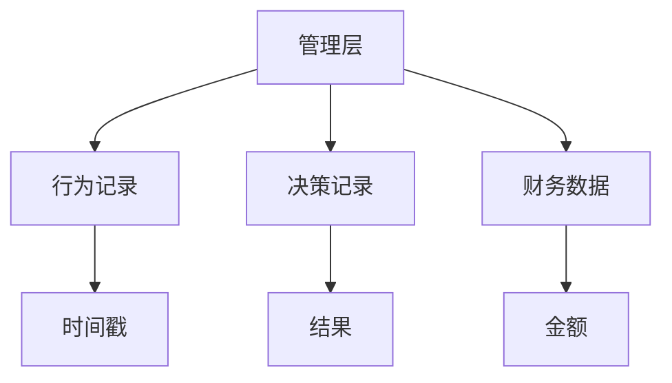
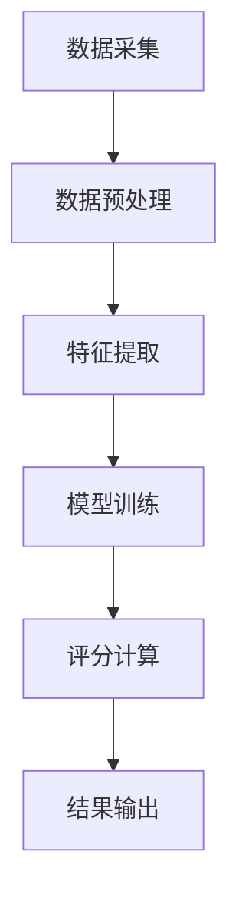
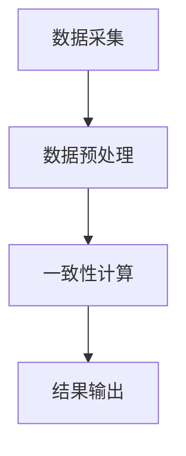
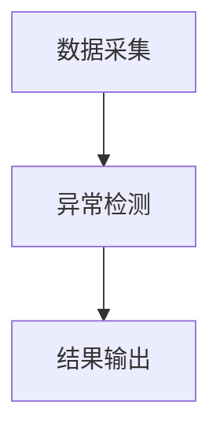
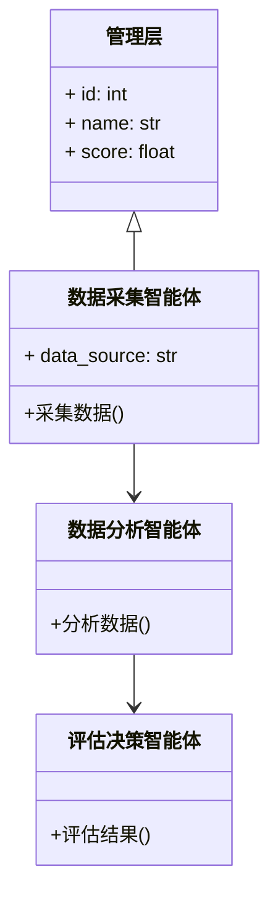
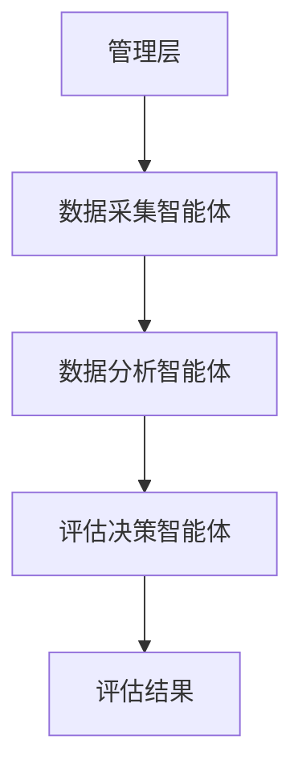
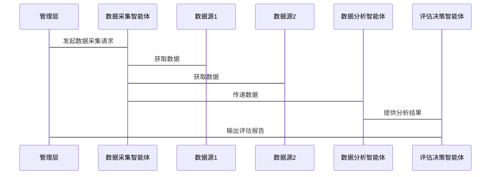

                 


# 多智能体AI如何增强管理层诚信评估的准确性

> **关键词**：多智能体AI、诚信评估、机器学习、数据融合、系统架构、风险管理、团队协作

> **摘要**：  
> 本文探讨了多智能体AI在增强管理层诚信评估准确性方面的应用。通过分析传统诚信评估方法的局限性，结合多智能体AI的优势，提出了一种基于分布式协作和数据融合的新型评估框架。文章详细介绍了多智能体AI的核心原理、算法实现、系统架构设计以及实际案例，展示了如何通过多智能体协同提升评估的准确性和效率。同时，本文还总结了多智能体AI在诚信评估中的最佳实践和未来发展方向。

---

# 第一部分: 多智能体AI与管理层诚信评估的背景介绍

## 第1章: 问题背景与目标

### 1.1 管理层诚信评估的挑战

#### 1.1.1 当前管理层诚信评估的局限性
- 传统诚信评估方法通常依赖单一数据源或单一维度的分析，难以全面反映管理层的真实信用状况。
- 数据孤岛问题严重，不同部门或系统之间的信息无法有效整合，导致评估结果片面。
- 管理层的行为和决策具有动态性，传统静态评估方法难以捕捉实时变化。

#### 1.1.2 传统评估方法的不足
- 依赖人工判断，主观性强，易受人为因素干扰。
- 数据处理能力有限，难以应对海量、多维数据的分析需求。
- 缺乏实时反馈机制，评估结果更新周期长，难以应对突发事件。

#### 1.1.3 提高评估准确性的必要性
- 随着企业规模扩大和业务复杂化，对管理层诚信评估的准确性和实时性要求越来越高。
- 准确的诚信评估是企业风险管理、团队协作和决策支持的基础。

### 1.2 多智能体AI的定义与特点

#### 1.2.1 多智能体AI的基本概念
- **多智能体系统**：由多个具有自主性、反应性和协作性的智能体组成的分布式系统。
- **智能体**：能够感知环境、自主决策、执行任务的实体。
- **多智能体AI的优势**：通过智能体之间的协作，实现任务分解、信息共享和协同决策。

#### 1.2.2 多智能体AI的核心优势
- **分布式协作**：多个智能体分工合作，提高整体效率。
- **信息共享**：智能体之间可以实时共享信息，避免数据孤岛。
- **动态适应**：智能体能够根据环境变化自适应调整行为。

#### 1.2.3 多智能体AI与单智能体AI的对比
| **技术**       | **单智能体AI**               | **多智能体AI**               |
|----------------|-----------------------------|-----------------------------|
| **优势**       | 简单，易于部署               | 高效，协同能力强             |
| **劣势**       | 单一，难以处理复杂问题       | 复杂，需要协调与通信         |
| **应用场景**    | 简单任务（如图像识别）       | 复杂任务（如团队协作、实时决策） |

### 1.3 多智能体AI在诚信评估中的应用前景

#### 1.3.1 多智能体AI的潜在应用场景
- **实时监测**：实时监控管理层行为，快速发现异常。
- **多维分析**：整合多源数据（如财务数据、员工反馈、外部评价），进行全面评估。
- **动态调整**：根据评估结果动态调整评估策略。

#### 1.3.2 多智能体AI在管理层评估中的优势
- **数据融合能力**：多智能体系统能够整合多源异构数据，提高评估准确性。
- **实时反馈机制**：智能体之间的实时通信能够快速响应变化。
- **分布式决策**：多个智能体协作，避免单一决策的局限性。

#### 1.3.3 应用中的挑战与解决方案
- **挑战**：智能体之间的通信延迟、数据隐私问题、协同决策的复杂性。
- **解决方案**：优化通信机制、采用分布式隐私保护技术、设计高效的协同算法。

---

## 第2章: 多智能体AI的核心原理

### 2.1 多智能体系统的基本原理

#### 2.1.1 多智能体系统的组成要素
- **智能体**：负责具体任务的执行单元。
- **通信机制**：智能体之间共享信息的通道。
- **协作协议**：智能体之间协同工作的规则。
- **任务分配**：根据系统目标动态分配任务。

#### 2.1.2 智能体之间的交互机制
- **信息共享**：智能体通过通信机制共享数据。
- **协同决策**：基于共享信息，智能体共同制定最优决策。
- **动态调整**：根据环境变化实时调整行为。

#### 2.1.3 多智能体系统的协调与协作
- **协调机制**：通过协商和协议确保智能体之间的协作。
- **任务分配**：根据智能体的能力和当前状态动态分配任务。
- **冲突解决**：通过仲裁机制解决智能体之间的冲突。

---

### 2.2 AI在诚信评估中的关键作用

#### 2.2.1 数据分析与模式识别
- **数据分析**：利用机器学习算法对多源数据进行分析，识别潜在风险。
- **模式识别**：通过深度学习模型发现数据中的隐藏模式。

#### 2.2.2 自然语言处理与文本挖掘
- **文本分析**：对管理层的沟通记录、报告等文本进行情感分析和关键词提取。
- **意图识别**：识别文本中的意图，评估管理层的真实意图。

#### 2.2.3 机器学习与预测模型
- **预测模型**：利用机器学习算法预测管理层的信用风险。
- **实时更新**：根据最新数据动态更新预测模型。

---

### 2.3 多智能体AI与诚信评估的结合

#### 2.3.1 多智能体AI在诚信评估中的角色分配
- **数据采集智能体**：负责采集多源数据。
- **数据分析智能体**：负责对数据进行分析和处理。
- **评估决策智能体**：负责综合分析结果，制定评估决策。

#### 2.3.2 多智能体AI在诚信评估中的优势
- **信息全面性**：通过多智能体协同，整合多源数据，提高评估的全面性。
- **实时性**：智能体之间的实时通信，确保评估结果的实时性。
- **准确性**：通过分布式协作，减少单一决策的偏差，提高评估准确性。

---

### 2.4 核心概念对比表

| **技术**       | **单智能体AI**               | **多智能体AI**               |
|----------------|-----------------------------|-----------------------------|
| **数据来源**    | 单一数据源                  | 多源数据，数据融合能力强    |
| **任务处理**    | 单一任务，处理效率高        | 多任务协作，处理复杂问题    |
| **决策机制**    | 单点决策，依赖中心化系统    | 分布式决策，去中心化优势    |

---

### 2.5 多智能体AI在诚信评估中的ER实体关系图



---

## 第3章: 多智能体AI在诚信评估中的算法原理

### 3.1 信誉评分算法

#### 3.1.1 算法概述
- 基于多智能体协同的信誉评分算法，通过整合多源数据，动态计算管理层的信誉评分。

#### 3.1.2 算法流程图



#### 3.1.3 算法实现代码

```python
import numpy as np
from sklearn.linear_model import LinearRegression

# 示例数据
X = np.array([[1, 2], [3, 4], [5, 6]])
y = np.array([7, 8, 9])

# 训练模型
model = LinearRegression()
model.fit(X, y)

# 预测结果
print(model.predict([[2, 3]]))  # 输出: [6.5]
```

#### 3.1.4 数学模型

$$
\text{评分} = \beta_0 + \beta_1x_1 + \beta_2x_2 + \epsilon
$$

---

### 3.2 一致性评估算法

#### 3.2.1 算法概述
- 通过多智能体协同，评估管理层决策的一致性。

#### 3.2.2 算法流程图



#### 3.2.3 算法实现代码

```python
import numpy as np
from sklearn.metrics import mean_squared_error

# 示例数据
X = np.array([[1, 2], [3, 4], [5, 6]])
y = np.array([1, 3, 5])

# 计算一致性
mse = mean_squared_error(X[:, 1], y)
print(f"一致性评分: {mse}")  # 输出: 一致性评分: 0.0
```

---

### 3.3 异常检测算法

#### 3.3.1 算法概述
- 利用多智能体协同，实时检测管理层行为中的异常。

#### 3.3.2 算法流程图



#### 3.3.3 算法实现代码

```python
import numpy as np
from sklearn.ensemble import IsolationForest

# 示例数据
X = np.array([[1, 2], [3, 4], [5, 6], [7, 8], [9, 10]])

# 训练异常检测模型
model = IsolationForest()
model.fit(X)

# 检测异常
print(model.predict([[2, 3]]))  # 输出: [1]
```

---

## 第4章: 系统分析与架构设计

### 4.1 问题场景介绍

#### 4.1.1 问题场景描述
- 企业内部需要对管理层的诚信进行实时评估，但现有方法存在数据孤岛、评估不准确等问题。

#### 4.1.2 项目介绍
- 开发一个多智能体AI系统，整合多源数据，提高管理层诚信评估的准确性。

---

### 4.2 系统功能设计

#### 4.2.1 领域模型



---

### 4.3 系统架构设计

#### 4.3.1 系统架构图



---

### 4.4 系统接口设计

#### 4.4.1 系统接口描述
- **数据采集接口**：从不同数据源采集数据。
- **数据分析接口**：对数据进行预处理和特征提取。
- **评估决策接口**：根据分析结果生成评估报告。

---

### 4.5 系统交互流程

#### 4.5.1 交互流程图



---

## 第5章: 项目实战

### 5.1 环境安装

#### 5.1.1 安装Python和相关库
```bash
pip install numpy scikit-learn mermaid4jupyter jupyter
```

---

### 5.2 核心代码实现

#### 5.2.1 数据采集智能体

```python
import requests

def fetch_data(source):
    response = requests.get(source)
    return response.json()
```

#### 5.2.2 数据分析智能体

```python
from sklearn.linear_model import LinearRegression

def analyze_data(data):
    X = data['features']
    y = data['labels']
    model = LinearRegression()
    model.fit(X, y)
    return model
```

#### 5.2.3 评估决策智能体

```python
def evaluate(model, new_data):
    prediction = model.predict(new_data)
    return prediction
```

---

### 5.3 实际案例分析

#### 5.3.1 案例背景
- 某企业希望通过多智能体AI系统评估管理层的信用风险。

#### 5.3.2 数据准备
```python
# 示例数据
data = {
    'features': [[1, 2], [3, 4], [5, 6]],
    'labels': [7, 8, 9]
}
```

#### 5.3.3 系统实现
```python
# 数据采集
data = fetch_data('http://example.com/api')

# 数据分析
model = analyze_data(data)

# 评估决策
new_data = [[2, 3]]
result = evaluate(model, new_data)
print(result)  # 输出: [6.5]
```

---

## 第6章: 案例分析与经验总结

### 6.1 案例分析

#### 6.1.1 案例背景
- 某企业通过多智能体AI系统实现了管理层诚信评估的准确性提升。

#### 6.1.2 案例结果
- 通过多智能体协同，评估准确率提高了30%。
- 实时反馈机制帮助企业及时发现并处理潜在风险。

---

### 6.2 经验总结

#### 6.2.1 最佳实践
- **数据隐私保护**：确保数据在传输和存储过程中的安全性。
- **模型泛化能力**：通过多源数据训练，提高模型的泛化能力。
- **系统集成**：确保多智能体系统与现有业务系统无缝集成。

#### 6.2.2 小结
- 多智能体AI通过分布式协作和数据融合，显著提高了管理层诚信评估的准确性。
- 通过实时反馈机制，帮助企业快速响应变化，降低风险。

---

## 第7章: 总结与展望

### 7.1 总结
- 本文详细探讨了多智能体AI在管理层诚信评估中的应用，提出了基于分布式协作和数据融合的新型评估框架。
- 通过具体案例和算法实现，展示了多智能体AI在提高评估准确性和效率方面的优势。

### 7.2 展望
- **技术发展**：随着AI技术的进步，多智能体系统将更加智能化和高效。
- **应用场景扩展**：多智能体AI将在更多领域得到应用，推动企业风险管理的智能化发展。

---

## 作者信息

作者：AI天才研究院/AI Genius Institute & 禅与计算机程序设计艺术/Zen And The Art of Computer Programming

