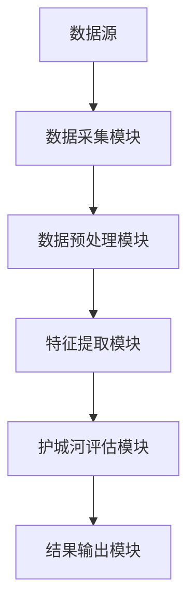
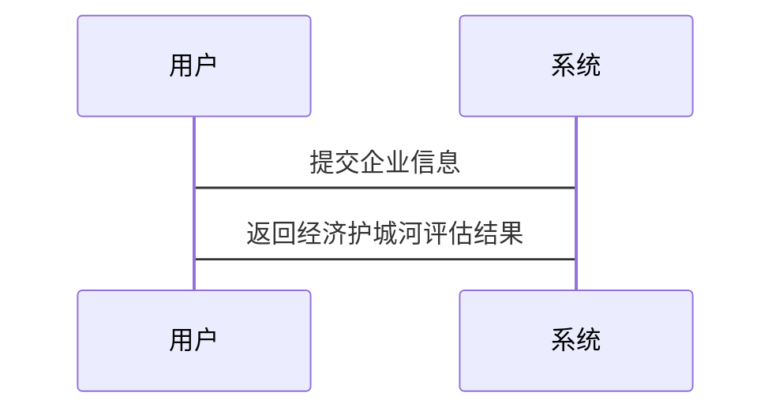

                 


```markdown
# 多智能体AI如何改进巴菲特的经济护城河评估方法

> 关键词：多智能体AI、经济护城河、巴菲特投资理念、强化学习、博弈论模型

> 摘要：本文详细探讨了多智能体AI技术如何改进传统的巴菲特经济护城河评估方法。通过分析多智能体AI的核心概念、算法原理和系统架构，本文展示了如何利用多智能体协同学习和博弈论模型来提升经济护城河评估的准确性和效率。文章内容涵盖从理论到实践的全过程，包括环境配置、核心代码实现和实际案例分析，为读者提供了一个全面的技术视角。

---

## 第一部分: 多智能体AI与经济护城河评估的背景与基础

### 第1章: 巴菲特的经济护城河理论概述

#### 1.1 经济护城河的定义与核心要素
经济护城河是指企业拥有的竞争优势，使其能够在长期的竞争中保持较高的利润率和市场份额。这些竞争优势可以是技术优势、品牌影响力、成本优势、网络效应等。经济护城河的核心要素包括：
- **技术优势**：企业拥有独特的技术或专利，使其产品或服务具有差异化。
- **品牌影响力**：强大的品牌形象能够吸引更多的消费者，增强客户忠诚度。
- **成本优势**：企业通过规模效应或技术创新，能够以更低的成本生产产品或服务。
- **网络效应**：产品或服务的使用价值随着用户数量的增加而增加，形成正反馈循环。

#### 1.2 巴菲特投资理念与护城河分析
巴菲特的投资理念强调长期价值投资，而经济护城河是其评估企业长期竞争优势的核心指标。巴菲特认为，拥有强大经济护城河的企业能够在行业中长期保持领先地位，从而为股东创造持续的超额收益。然而，传统的经济护城河评估方法存在以下问题：
- **主观性**：传统评估方法依赖于分析师的主观判断，缺乏客观量化标准。
- **动态性**：市场竞争环境不断变化，传统的静态评估方法难以捕捉动态变化。
- **复杂性**：经济护城河的构成要素复杂，传统方法难以全面评估。

### 第2章: 多智能体AI的基本概念与技术特点

#### 2.1 多智能体AI的定义与特点
多智能体AI是指由多个相互作用的智能体组成的系统，这些智能体通过协同合作或竞争，共同完成特定任务。多智能体AI的核心特点包括：
- **分布式智能**：每个智能体都具有一定的决策能力，能够独立行动。
- **协同合作**：智能体之间通过通信和协作，共同完成复杂任务。
- **动态适应**：系统能够根据环境变化动态调整智能体的行为策略。

#### 2.2 多智能体AI的优势与应用场景
多智能体AI在经济护城河评估中的优势主要体现在以下几个方面：
- **数据处理能力**：多智能体AI能够处理海量数据，提取复杂的特征，提升评估的准确性。
- **动态适应能力**：多智能体AI能够实时分析市场变化，快速调整评估策略。
- **分布式决策**：多智能体AI通过分布式决策，能够更全面地评估企业的竞争优势。

---

## 第二部分: 多智能体AI在经济护城河评估中的核心算法

### 第3章: 多智能体协同学习算法

#### 3.1 多智能体协同学习的基本原理
多智能体协同学习是指多个智能体通过协作学习，共同优化任务目标。其基本原理包括以下步骤：
1. **初始化**：设置智能体的初始状态和参数。
2. **信息交互**：智能体之间通过通信交换信息，共享知识。
3. **策略更新**：基于交互信息，智能体更新自身的策略。
4. **任务执行**：智能体根据更新后的策略，执行具体任务。
5. **反馈学习**：根据任务执行结果，智能体调整策略，进入下一个循环。

#### 3.2 基于强化学习的多智能体协同
强化学习是一种通过试错机制优化决策的算法。在多智能体协同中，每个智能体通过与环境和其他智能体的交互，学习最优策略。以下是强化学习的基本流程：
1. **状态感知**：智能体感知当前环境状态。
2. **动作选择**：基于当前状态，智能体选择一个动作。
3. **环境反馈**：环境对智能体的动作做出反馈，包括奖励或惩罚。
4. **策略更新**：智能体根据反馈调整策略，优化未来决策。

### 第4章: 多智能体博弈论模型

#### 4.1 多智能体博弈论的基本概念
博弈论是研究多个决策主体在竞争环境下的策略选择和行为的理论。在多智能体博弈论中，每个智能体都是一个决策主体，具有独立的目标和策略。博弈论的核心要素包括：
- **参与人**：博弈中的决策主体。
- **策略**：参与人采取的行动方案。
- **支付**：参与人从博弈中获得的收益或损失。
- **信息**：参与人掌握的关于博弈环境和其他参与人信息。

#### 4.2 多智能体博弈论模型的构建
多智能体博弈论模型的构建需要考虑以下步骤：
1. **问题建模**：明确博弈的目标、参与人、策略空间和支付函数。
2. **均衡分析**：寻找博弈的均衡点，分析参与人的最优策略。
3. **模型求解**：通过数学方法求解博弈模型，得到最优策略。

---

## 第三部分: 多智能体AI的系统分析与架构设计

### 第5章: 经济护城河评估系统的场景与需求分析

#### 5.1 经济护城河评估系统的场景描述
经济护城河评估系统是一个基于多智能体AI的企业竞争优势评估平台。系统通过分析企业的技术、品牌、成本和网络效应等多维度数据，评估企业的经济护城河强度。系统的主要功能包括：
- **数据采集**：从企业公开数据、市场报告等多来源采集数据。
- **特征提取**：通过多智能体协同学习，提取企业的核心竞争优势。
- **护城河评估**：基于博弈论模型，评估企业的经济护城河强度。

#### 5.2 多智能体AI在系统中的应用需求
多智能体AI在经济护城河评估系统中的应用需求包括：
- **实时数据分析**：系统需要实时处理大量数据，快速响应市场变化。
- **多维度评估**：系统需要从多个维度评估企业的竞争优势。
- **动态调整策略**：系统需要根据市场变化动态调整评估策略。

### 第6章: 多智能体AI系统的架构设计

#### 6.1 系统功能模块划分
经济护城河评估系统主要包括以下功能模块：
- **数据采集模块**：负责采集企业公开数据、市场报告等。
- **特征提取模块**：通过多智能体协同学习，提取企业的核心竞争优势。
- **护城河评估模块**：基于博弈论模型，评估企业的经济护城河强度。

#### 6.2 系统架构设计
以下是经济护城河评估系统的架构图：



#### 6.3 系统交互设计
以下是系统交互序列图：



---

## 第四部分: 项目实战与总结

### 第7章: 项目实战

#### 7.1 环境配置
以下是项目环境配置示例：

```python
# 安装依赖
pip install numpy
pip install gym
pip install matplotlib
```

#### 7.2 核心代码实现
以下是多智能体协同学习的Python代码示例：

```python
import numpy as np

class MultiAgent:
    def __init__(self, num_agents):
        self.num_agents = num_agents
        self.states = np.zeros(num_agents)
        self.actions = np.zeros(num_agents)
    
    def step(self, rewards):
        self.states += self.actions * rewards
        self.actions = np.random.random(self.num_agents)
    
    def get_states(self):
        return self.states

# 初始化系统
multi_agent = MultiAgent(5)

# 系统运行
for _ in range(10):
    rewards = np.random.random(5)
    multi_agent.step(rewards)
    print("Current states:", multi_agent.get_states())
```

#### 7.3 案例分析
以下是经济护城河评估的实际案例分析：

假设我们评估一家零售企业的经济护城河。通过多智能体协同学习，系统能够从企业的技术、品牌、成本和网络效应等多个维度提取特征，并基于博弈论模型评估其经济护城河强度。最终，系统能够给出量化评估结果，帮助企业更好地制定投资策略。

### 第8章: 总结与展望

#### 8.1 总结
本文详细探讨了多智能体AI如何改进巴菲特的经济护城河评估方法。通过分析多智能体AI的核心概念、算法原理和系统架构，本文展示了如何利用多智能体协同学习和博弈论模型来提升经济护城河评估的准确性和效率。

#### 8.2 最佳实践 tips
- 在实际应用中，建议结合具体业务需求，调整多智能体AI的参数设置。
- 系统运行时，需要定期更新数据和模型，确保评估结果的实时性和准确性。
- 对于复杂场景，可以考虑引入更多的智能体，进一步提升系统的评估能力。

#### 8.3 注意事项
- 多智能体AI系统的实现需要强大的计算能力和数据支持。
- 在实际应用中，需要根据具体业务需求，选择合适的算法和模型。

#### 8.4 拓展阅读
建议读者进一步阅读以下内容：
- 多智能体强化学习的经典论文。
- 经济护城河评估的最新研究成果。
- 多智能体博弈论的经典著作。

---

作者：AI天才研究院/AI Genius Institute & 禅与计算机程序设计艺术 /Zen And The Art of Computer Programming
```

