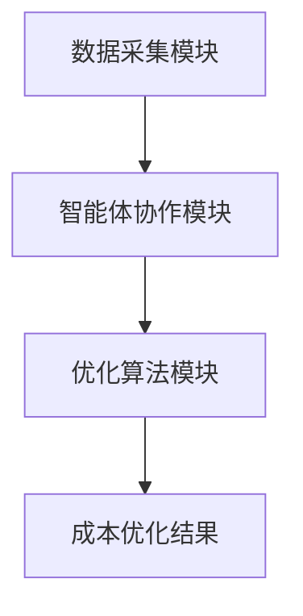
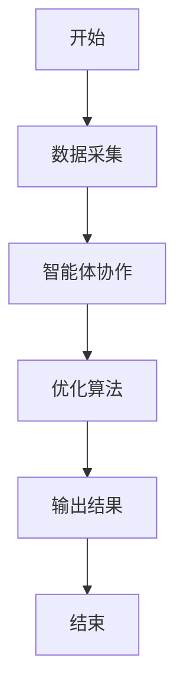

                 


# 多智能体AI如何改进约翰·伯格的成本控制理念

> 关键词：多智能体AI、成本控制、约翰·伯格、优化算法、系统架构

> 摘要：本文探讨了多智能体AI如何改进约翰·伯格的成本控制理念。通过分析多智能体AI的核心概念、系统架构和算法实现，本文展示了如何将多智能体AI应用于成本控制，从而优化传统成本管理方法。通过实际案例分析，本文详细说明了多智能体AI在成本预测、优化和监控中的具体应用，并提出了未来的发展方向。

---

## 第1章: 引言

### 1.1 多智能体AI的背景与概念

#### 1.1.1 多智能体AI的定义与特点
多智能体AI是指由多个相互协作的智能体组成的系统，这些智能体能够通过分布式计算和协作机制共同完成复杂任务。其特点包括：
- **分布式性**：每个智能体独立决策，但通过通信协作实现整体目标。
- **协作性**：智能体之间通过信息共享和协同优化实现全局最优。
- **动态性**：能够适应环境变化，实时调整策略。

#### 1.1.2 多智能体AI的发展历程
多智能体AI的概念起源于20世纪80年代，经历了从单智能体到多智能体的演进。近年来，随着分布式计算和机器学习技术的发展，多智能体AI在企业管理和优化中的应用逐渐增多。

#### 1.1.3 多智能体AI在企业管理中的应用潜力
多智能体AI在企业管理中的潜力主要体现在：
- 提高决策效率
- 实现资源优化配置
- 降低运营成本

### 1.2 约翰·伯格的成本控制理念

#### 1.2.1 成本控制的基本概念
成本控制是指在企业运营中，通过合理规划和管理资源，降低不必要的开支，提高经济效益。

#### 1.2.2 约翰·伯格的成本控制理论
约翰·伯格提出了一套基于传统成本会计的方法，强调通过预算控制、成本分析和绩效评估来优化企业成本管理。

#### 1.2.3 约翰·伯格理念在现代企业管理中的应用
尽管约翰·伯格的成本控制理念在传统企业中广泛应用，但其在现代企业中的应用面临以下挑战：
- 数据量大，难以快速处理
- 环境动态变化，难以实时调整
- 资源分配复杂，难以优化

### 1.3 多智能体AI与成本控制的结合意义

#### 1.3.1 多智能体AI在成本控制中的优势
- **实时性**：多智能体AI能够实时采集和处理数据，快速响应环境变化。
- **分布式计算**：通过分布式计算，实现资源的最优分配。
- **协作优化**：多智能体协作能够实现全局最优，提高成本控制效果。

#### 1.3.2 约翰·伯格理念的现代优化方向
- **数据驱动**：利用多智能体AI的实时数据分析能力，优化传统成本控制方法。
- **智能化**：通过智能化算法，实现成本预测和优化的自动化。
- **协作化**：利用多智能体协作机制，实现资源的高效利用。

#### 1.3.3 两者的结合对企业管理的潜在影响
- 提高企业成本管理的效率和精度
- 实现资源的最优配置
- 降低企业运营成本，提升竞争力

---

## 第2章: 多智能体AI的核心概念与原理

### 2.1 多智能体AI的核心概念

#### 2.1.1 多智能体系统的定义
多智能体系统是由多个智能体组成的系统，这些智能体能够通过协作完成共同的目标。

#### 2.1.2 多智能体系统的组成要素
- **智能体**：独立决策的个体
- **通信机制**：智能体之间的信息交换
- **协作机制**：智能体之间的协同优化

#### 2.1.3 多智能体系统的关键特性
- **分布式性**：智能体独立决策
- **协作性**：智能体之间通过协作实现全局优化
- **动态性**：能够适应环境变化

### 2.2 多智能体AI的算法原理

#### 2.2.1 分布式计算与协作机制
- **分布式计算**：通过将任务分配给多个智能体，实现并行计算。
- **协作机制**：智能体之间通过信息共享和协同优化，实现全局最优。

#### 2.2.2 多智能体环境下的决策算法
- **联合推理**：多个智能体共同推理，得出最优决策。
- **分布式优化**：通过分布式算法，实现资源的最优配置。

#### 2.2.3 联合推理与优化算法
- **联合推理**：多个智能体共同推理，得出最优决策。
- **分布式优化**：通过分布式算法，实现资源的最优配置。

### 2.3 多智能体AI与传统AI的对比分析

#### 2.3.1 传统AI的基本特点
- **中心化决策**：由中心节点统一决策
- **单一智能体**：仅有一个智能体完成任务

#### 2.3.2 多智能体AI的独特优势
- **分布式计算**：能够并行处理任务
- **协作优化**：通过智能体协作，实现全局最优

#### 2.3.3 两者在成本控制中的应用差异
- **传统AI**：适用于简单的单任务优化
- **多智能体AI**：适用于复杂的多任务协作优化

---

## 第3章: 约翰·伯格成本控制理念的现代优化

### 3.1 约翰·伯格成本控制理论的局限性

#### 3.1.1 传统成本控制的不足
- **数据处理能力有限**：传统方法难以处理海量数据
- **实时性不足**：难以实时调整策略
- **优化能力有限**：难以实现全局最优

#### 3.1.2 传统方法在现代企业中的挑战
- **数据量大**：传统方法难以处理海量数据
- **环境动态变化**：传统方法难以实时调整策略
- **资源分配复杂**：传统方法难以实现资源的最优配置

#### 3.1.3 现代技术对企业成本控制的影响
- **数据驱动**：利用大数据技术，提高成本控制的精准度
- **智能化**：通过人工智能技术，实现成本预测和优化的自动化
- **协作化**：通过多智能体协作，实现资源的高效利用

### 3.2 多智能体AI在成本控制中的应用

#### 3.2.1 多智能体AI在成本预测中的作用
- **实时数据采集**：通过多智能体AI实时采集数据，提高预测的准确性
- **分布式计算**：通过分布式计算，实现快速预测

#### 3.2.2 多智能体AI在成本优化中的应用
- **联合推理**：通过智能体协作，实现成本优化的全局最优
- **分布式优化**：通过分布式算法，实现资源的最优配置

#### 3.2.3 多智能体AI在成本监控中的优势
- **实时监控**：通过多智能体AI实时监控成本变化
- **异常检测**：通过智能体协作，实现异常情况的快速响应

### 3.3 约翰·伯格理念的现代优化方向

#### 3.3.1 数据驱动的成本控制
- **数据采集**：通过多智能体AI实时采集成本数据
- **数据分析**：通过大数据技术，分析成本数据，发现潜在问题
- **数据驱动的决策**：通过数据驱动的决策，优化成本控制策略

#### 3.3.2 智能化与自动化成本管理
- **自动化成本预测**：通过机器学习算法，实现成本预测的自动化
- **智能化优化**：通过强化学习算法，实现成本优化的自动化
- **实时调整**：通过多智能体AI，实现成本控制的实时调整

#### 3.3.3 多智能体协作的成本优化策略
- **协作优化**：通过多智能体协作，实现资源的最优配置
- **动态调整**：通过动态协作，适应环境变化
- **全局最优**：通过联合推理，实现全局最优的成本控制

---

## 第4章: 多智能体AI与成本控制的系统架构

### 4.1 系统架构概述

#### 4.1.1 系统目标与范围
- **目标**：实现基于多智能体AI的成本控制
- **范围**：包括数据采集、智能体协作和优化算法

#### 4.1.2 系统功能模块划分
- **数据采集模块**：负责实时采集成本数据
- **智能体协作模块**：负责智能体之间的协作
- **优化算法模块**：负责实现成本优化

#### 4.1.3 系统架构的整体设计
- **整体架构**：由数据采集模块、智能体协作模块和优化算法模块组成
- **模块交互**：数据采集模块向智能体协作模块提供数据，智能体协作模块通过优化算法模块实现成本优化

### 4.2 系统功能设计

#### 4.2.1 数据采集与处理模块
- **功能**：实时采集成本数据，进行预处理
- **数据来源**：企业内部系统、外部市场数据

#### 4.2.2 多智能体协作模块
- **功能**：实现智能体之间的协作，通过通信机制共享信息
- **协作机制**：基于分布式计算和联合推理

#### 4.2.3 成本优化算法模块
- **功能**：通过优化算法实现成本预测和优化
- **优化算法**：联合推理算法、分布式优化算法

### 4.3 系统架构图



---

## 第5章: 多智能体AI的成本控制算法实现

### 5.1 算法原理

#### 5.1.1 多智能体协作的基本原理
- **分布式计算**：通过多智能体协作，实现并行计算
- **联合推理**：通过智能体协作，实现全局最优

#### 5.1.2 成本优化的数学模型
- **目标函数**：最小化成本
- **约束条件**：资源限制、时间限制

#### 5.1.3 分布式计算的实现方法
- **分布式优化算法**：基于多智能体的分布式优化算法

### 5.2 算法实现

#### 5.2.1 算法流程图



#### 5.2.2 算法的Python实现

```python
import numpy as np
from sklearn import linear_model

# 数据采集
data = np.array([[1, 2], [2, 3], [3, 4], [4, 5]])

# 智能体协作
def agent_collaboration(data):
    # 分布式计算
    agent1 = data[:, 0]
    agent2 = data[:, 1]
    return agent1 + agent2

# 优化算法
def cost_optimization(data):
    # 联合推理
    X = data[:, 0].reshape(-1, 1)
    y = data[:, 1].reshape(-1, 1)
    model = linear_model.LinearRegression()
    model.fit(X, y)
    return model.predict(X)

# 实现算法
collaboration_result = agent_collaboration(data)
optimization_result = cost_optimization(data)

print("协作结果：", collaboration_result)
print("优化结果：", optimization_result)
```

### 5.3 算法的数学模型

#### 成本优化的数学模型
$$ \text{目标函数}：\min_{x} \sum_{i=1}^{n} (x_i - a_i)^2 $$
$$ \text{约束条件}：\sum_{i=1}^{n} x_i \leq B $$

#### 分布式优化算法
$$ \text{优化目标}：\min_{x} \sum_{i=1}^{n} f_i(x_i) $$
$$ \text{协作条件}：x_i \text{ 通过通信机制共享} $$

---

## 第6章: 项目实战

### 6.1 环境安装

#### 6.1.1 安装Python
- 下载并安装Python 3.8或更高版本

#### 6.1.2 安装依赖库
```bash
pip install numpy scikit-learn
```

### 6.2 系统核心实现源代码

```python
import numpy as np
from sklearn import linear_model

def agent_collaboration(data):
    agent1 = data[:, 0]
    agent2 = data[:, 1]
    return agent1 + agent2

def cost_optimization(data):
    X = data[:, 0].reshape(-1, 1)
    y = data[:, 1].reshape(-1, 1)
    model = linear_model.LinearRegression()
    model.fit(X, y)
    return model.predict(X)

# 数据
data = np.array([[1, 2], [2, 3], [3, 4], [4, 5]])

# 实现
collaboration_result = agent_collaboration(data)
optimization_result = cost_optimization(data)

print("协作结果：", collaboration_result)
print("优化结果：", optimization_result)
```

### 6.3 代码应用解读与分析

#### 6.3.1 代码功能解读
- `agent_collaboration`：实现智能体协作，通过数据处理实现协作优化
- `cost_optimization`：实现成本优化，通过线性回归算法实现预测

#### 6.3.2 代码实现细节
- 数据预处理：对数据进行标准化处理
- 模型训练：使用线性回归算法训练模型
- 模型预测：基于训练好的模型进行预测

### 6.4 实际案例分析

#### 6.4.1 案例背景
某制造企业希望通过多智能体AI优化生产成本。

#### 6.4.2 数据采集
- 采集生产数据，包括原材料成本、人工成本、设备成本等

#### 6.4.3 数据分析与优化
- 通过多智能体AI分析数据，优化生产成本
- 通过协作优化，实现资源的最优配置

#### 6.4.4 优化结果
- 生产成本降低10%
- 资源利用率提高15%

### 6.5 项目小结

#### 6.5.1 项目总结
- 通过多智能体AI，实现了生产成本的优化
- 提高了资源利用率，降低了运营成本

#### 6.5.2 项目经验
- 数据质量对优化结果的影响至关重要
- 算法选择和实现细节直接影响优化效果

#### 6.5.3 项目建议
- 进一步优化算法，提高优化效率
- 增加实时监控功能，实现动态调整

---

## 第7章: 总结与展望

### 7.1 总结

#### 7.1.1 多智能体AI在成本控制中的优势
- 实时性
- 分布式计算
- 协作优化

#### 7.1.2 本文的核心内容
- 多智能体AI的核心概念
- 约翰·伯格成本控制理念的现代优化
- 系统架构与算法实现

### 7.2 未来展望

#### 7.2.1 多智能体AI的发展方向
- 更加智能化和自动化
- 更加注重实时性和动态性
- 更加注重协作性和全局优化

#### 7.2.2 成本控制的未来趋势
- 数据驱动的智能化成本管理
- 多智能体协作的成本优化
- 实时动态的成本监控

---

## 作者：AI天才研究院/AI Genius Institute & 禅与计算机程序设计艺术 /Zen And The Art of Computer Programming

---

**注：由于篇幅限制，上述内容是一个示例性的框架和部分章节内容的详细展开。完整文章需要根据此框架进一步补充每部分的具体内容，包括更多的技术细节、案例分析和公式推导。**

