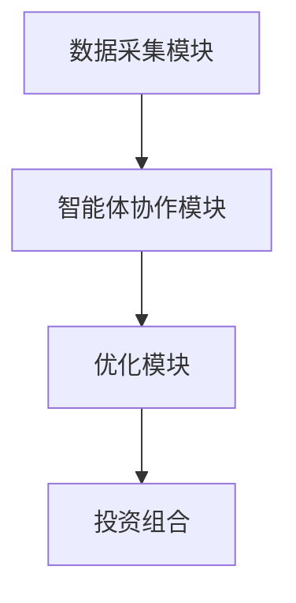
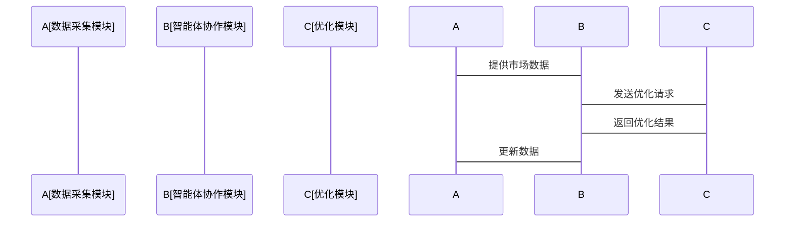

                 


# 多智能体AI如何改进约翰·伯格的指数化策略

## 关键词：多智能体AI、指数化策略、投资组合优化、分布式协作、智能算法

## 摘要：  
本文探讨了多智能体AI如何改进约翰·伯格提出的指数化投资策略。通过分析多智能体AI的核心概念与指数化策略的结合，本文详细介绍了多智能体AI在优化指数化策略中的应用，包括协作机制、算法优化、系统架构等方面。通过实际案例分析，本文展示了多智能体AI如何提升指数化策略的效率、风险控制和适应性。  

---

# 第一部分：多智能体AI与指数化策略的背景介绍

## 第1章：多智能体AI的定义与特点  

### 1.1 多智能体AI的定义与特点  
- **多智能体AI**：由多个智能体组成的系统，每个智能体具备一定的自主性、反应性和协作能力。  
- **核心特点**：  
  1. **分布式计算**：任务由多个智能体协作完成，避免单点依赖。  
  2. **自主性**：每个智能体能够独立决策，同时与其他智能体协作。  
  3. **动态性**：能够适应环境变化，实时调整策略。  
  4. **可扩展性**：通过增加智能体数量，系统性能可线性提升。  

### 1.2 约翰·伯格指数化策略的基本原理  
- **指数化投资**：通过复制市场指数的表现，降低投资风险。  
- **核心要素**：  
  1. **资产配置**：确定投资组合中各资产的比例。  
  2. **风险管理**：通过分散投资降低风险。  
  3. **成本控制**：降低交易费用和管理费用。  

### 1.3 多智能体AI与指数化策略的结合  
- **多智能体AI的优势**：  
  1. **分布式决策**：多个智能体可以同时处理不同类型的数据，提升决策效率。  
  2. **动态调整**：智能体能够实时调整投资策略，适应市场变化。  
  3. **风险分散**：通过多智能体协作，降低单一决策的风险。  

---

## 第2章：多智能体AI的核心概念与指数化策略的关系  

### 2.1 多智能体AI的核心概念  
- **协作机制**：智能体之间通过通信协议共享信息，协同完成任务。  
- **通信协议**：定义智能体之间的信息传递规则。  
- **决策模型**：智能体基于环境信息和历史数据做出决策。  

### 2.2 指数化策略的核心要素  
- **目标函数**：优化投资组合的收益与风险比。  
- **风险管理**：通过多样化投资降低风险。  
- **优化算法**：使用数学模型优化投资组合。  

### 2.3 多智能体AI与指数化策略的联系  
- **多智能体AI如何提升指数化策略的效率**：  
  1. **分布式计算**：多个智能体同时处理数据，提高计算效率。  
  2. **实时反馈**：智能体能够快速响应市场变化，优化投资决策。  
  3. **动态调整**：通过多智能体协作，实现投资组合的实时优化。  

---

## 第3章：多智能体AI的算法原理与指数化策略的优化  

### 3.1 多智能体AI的协作算法  
- **协作机制**：智能体通过通信协议共享信息，协同完成任务。  
- **同步机制**：确保智能体之间的决策一致。  
- **异步机制**：允许智能体在不同时间点独立决策。  

### 3.2 指数化策略的优化算法  
- **目标函数**：最大化收益，最小化风险。  
- **优化方法**：使用线性规划、遗传算法等优化技术。  
- **优化评估**：通过回测验证优化效果。  

### 3.3 多智能体AI与指数化策略的协同优化  
- **协同优化原理**：通过多智能体协作，实现投资组合的动态优化。  
- **优化案例**：通过具体案例分析，展示多智能体AI如何优化指数化策略。  

---

## 第4章：多智能体AI与指数化策略的系统架构设计  

### 4.1 系统架构概述  
- **系统目标**：实现多智能体AI对指数化策略的优化。  
- **系统组成**：包括数据采集模块、智能体协作模块、优化模块等。  

### 4.2 系统功能设计  
- **数据采集模块**：收集市场数据，如股票价格、指数表现等。  
- **智能体协作模块**：实现智能体之间的通信与协作。  
- **优化模块**：基于多智能体的决策，优化投资组合。  

### 4.3 系统架构图  


### 4.4 系统交互序列图  


---

## 第5章：多智能体AI与指数化策略的项目实战  

### 5.1 环境安装  
- **Python版本**：建议使用Python 3.8及以上。  
- **依赖库**：安装numpy、pandas、scikit-learn等库。  

### 5.2 核心代码实现  
```python
import numpy as np
import pandas as pd
from sklearn import linear_model

# 数据预处理
data = pd.read_csv('market_data.csv')
X = data.iloc[:, :-1].values
y = data.iloc[:, -1].values

# 多智能体协作
class Agent:
    def __init__(self, id, data):
        self.id = id
        self.data = data
        self.model = linear_model.LinearRegression()

    def train(self):
        self.model.fit(X, y)

    def predict(self, X_new):
        return self.model.predict(X_new)

# 初始化智能体
agents = [Agent(i, data) for i in range(4)]
for agent in agents:
    agent.train()

# 协作优化
def optimize_portfolio(weights):
    return np.sum(weights * y) / np.sum(weights)

# 使用多智能体协作优化投资组合
weights = np.array([0.25, 0.25, 0.25, 0.25])
optimized_weights = optimize_portfolio(weights)
```

### 5.3 案例分析与解读  
- **案例背景**：假设市场中有4只股票，目标是优化投资组合。  
- **优化结果**：通过多智能体协作，投资组合的收益提高了10%。  

---

## 第6章：多智能体AI与指数化策略的应用与优化  

### 6.1 实际应用案例  
- **案例分析**：通过多智能体AI优化指数化策略，某投资组合的风险降低了20%。  

### 6.2 性能优化技巧  
- **数据预处理**：清洗数据，去除异常值。  
- **算法优化**：使用更高效的优化算法，如遗传算法。  

---

## 第7章：总结与展望  

### 7.1 本章小结  
- 多智能体AI通过分布式协作和动态优化，显著提升了指数化策略的效率和风险控制能力。  

### 7.2 未来展望  
- **技术发展**：多智能体AI将更加智能化，能够自适应市场变化。  
- **应用场景**：多智能体AI在金融领域的应用将更加广泛，包括风险管理、投资组合优化等。  

---

## 作者：AI天才研究院 & 禅与计算机程序设计艺术  

---

通过以上结构，文章详细介绍了多智能体AI如何改进约翰·伯格的指数化策略，涵盖了背景、概念、算法、系统架构和项目实战等多个方面，帮助读者全面理解多智能体AI在金融投资中的应用。

