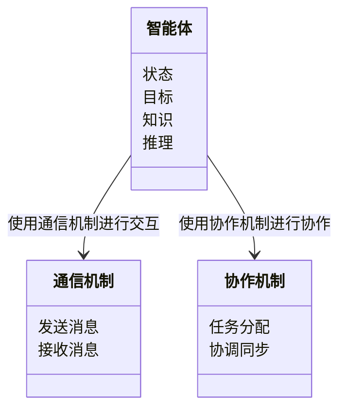
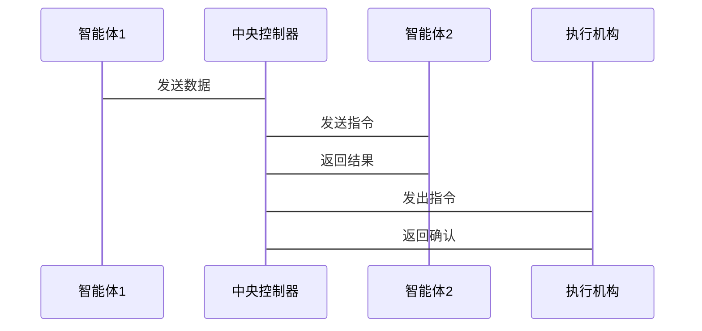

                 


---

# 多智能体AI系统在价值投资中的风险管理应用

## 关键词：多智能体AI系统，风险管理，价值投资，分布式计算，一致性算法，金融建模

## 摘要：本文探讨了多智能体AI系统在价值投资中的风险管理应用，分析了多智能体系统的核心原理、算法实现、系统架构设计以及在风险管理中的具体应用。文章详细介绍了多智能体系统如何通过分布式计算、一致性算法和协作机制来优化风险管理过程，并通过实际案例展示了多智能体AI系统在价值投资中的优势和潜力。

---

## 第一章: 多智能体AI系统与风险管理概述

### 1.1 多智能体AI系统的定义与特点

#### 1.1.1 多智能体系统的定义
多智能体系统（Multi-Agent System, MAS）是由多个智能体（Agent）组成的分布式系统，这些智能体能够通过协作完成复杂的任务。每个智能体都是一个独立的实体，具备感知环境、自主决策和行动的能力。

#### 1.1.2 多智能体系统的核心特点
- **分布性**：智能体独立运行，通过通信协作完成任务。
- **自主性**：智能体能够自主决策，无需外部干预。
- **反应性**：智能体能够实时感知环境并做出反应。
- **协作性**：多个智能体通过协作实现整体目标。

#### 1.1.3 多智能体系统与传统AI的区别
传统AI通常依赖中心化计算，而多智能体系统通过分布式计算实现了更高的灵活性和容错性。此外，多智能体系统能够处理动态环境中的复杂问题，而传统AI在单任务处理上更高效。

### 1.2 风险管理在价值投资中的重要性

#### 1.2.1 风险管理的基本概念
风险管理是指识别、评估和应对投资中的潜在风险，以降低损失并实现投资目标。

#### 1.2.2 价值投资中的风险管理需求
价值投资者注重长期收益，但市场波动和不确定性要求投资者具备有效的风险管理能力，以应对潜在损失。

#### 1.2.3 风险管理与投资收益的关系
有效的风险管理能够减少投资损失，提高投资组合的稳定性，从而实现更可持续的收益。

### 1.3 多智能体AI系统在风险管理中的应用前景

#### 1.3.1 多智能体系统的优势
- **分布式计算**：提高系统的容错性和鲁棒性。
- **协作能力**：智能体之间的协作能够更全面地捕捉市场信息。
- **实时反应**：智能体能够快速响应市场变化。

#### 1.3.2 多智能体系统在金融领域的潜力
- **实时监控**：多智能体系统能够实时监控市场动态，及时发现潜在风险。
- **多维度分析**：多个智能体可以从不同角度分析市场，提供全面的风险评估。

#### 1.3.3 价值投资中的风险管理挑战与机遇
价值投资需要长期视角，但市场波动和信息不全增加了风险管理的难度。多智能体系统通过协作和分布式计算，为价值投资者提供了更强大的风险管理工具。

---

## 第二章: 多智能体AI系统的核心原理

### 2.1 多智能体系统的基本架构

#### 2.1.1 多智能体系统的组成
- **智能体**：独立的决策单元，具备感知、决策和行动能力。
- **通信机制**：智能体之间通过通信机制交换信息。
- **协作机制**：智能体通过协作机制实现共同目标。

#### 2.1.2 多智能体系统的通信机制
智能体之间通过消息传递进行通信，消息内容包括数据和指令。

#### 2.1.3 多智能体系统的协作机制
协作机制包括任务分配、协调和冲突解决，确保智能体高效协作。

### 2.2 多智能体系统中的智能体行为模型

#### 2.2.1 智能体的定义与属性
智能体具备状态、目标、知识和推理能力，能够根据环境信息做出决策。

#### 2.2.2 智能体的行为决策模型
决策模型包括感知、推理、计划和行动四个步骤，确保智能体能够自主决策。

#### 2.2.3 智能体的协作策略
协作策略包括任务分配、信息共享和协调同步，确保智能体之间的高效协作。

### 2.3 多智能体系统中的算法原理

#### 2.3.1 分布式计算的基本原理
分布式计算通过将任务分解到多个节点上并行处理，提高计算效率和容错性。

#### 2.3.2 多智能体系统中的共识机制
共识机制确保多个智能体之间达成一致，例如通过一致性算法实现数据同步。

#### 2.3.3 多智能体系统中的博弈论模型
博弈论模型用于分析智能体之间的互动，帮助制定最优决策策略。

---

## 第三章: 多智能体AI系统在风险管理中的应用

### 3.1 风险管理的多智能体模型构建

#### 3.1.1 风险管理的核心要素
风险管理包括风险识别、评估、应对和监控四个步骤。

#### 3.1.2 多智能体模型的设计原则
多智能体模型应具备实时性、分布式计算和协作能力，确保全面的风险评估。

#### 3.1.3 多智能体模型的实现步骤
- **需求分析**：明确风险管理的目标和范围。
- **智能体设计**：设计智能体的行为模型和协作机制。
- **算法实现**：选择适合的分布式算法和共识机制。
- **系统集成**：将智能体集成到整体系统中。

### 3.2 多智能体系统在市场风险中的应用

#### 3.2.1 市场风险的定义与特征
市场风险是指由于市场波动导致投资组合价值下降的风险。

#### 3.2.2 多智能体系统在市场风险中的应用场景
- **实时监控**：智能体实时监控市场动态，及时发现潜在风险。
- **多维度分析**：多个智能体从不同角度分析市场，提供全面的风险评估。

#### 3.2.3 多智能体系统在市场风险中的优势
- **高实时性**：智能体能够快速响应市场变化。
- **全面性**：多个智能体提供多维度的风险分析。

### 3.3 多智能体系统在信用风险中的应用

#### 3.3.1 信用风险的定义与特征
信用风险是指借款人无法偿还债务的风险。

#### 3.3.2 多智能体系统在信用风险中的应用场景
- **信用评分**：智能体评估借款人的信用状况。
- **风险预警**：智能体实时监控借款人的信用变化，及时发出预警。

#### 3.3.3 多智能体系统在信用风险中的优势
- **高准确性**：多个智能体协作评估信用风险，提高评估准确性。
- **快速响应**：智能体能够快速识别潜在风险。

### 3.4 多智能体系统在操作风险中的应用

#### 3.4.1 操作风险的定义与特征
操作风险是指由于内部操作失误或外部事件导致的风险。

#### 3.4.2 多智能体系统在操作风险中的应用场景
- **操作监控**：智能体实时监控操作流程，发现潜在风险。
- **风险应对**：智能体制定应对策略，降低操作风险。

#### 3.4.3 多智能体系统在操作风险中的优势
- **高容错性**：分布式计算提高了系统的容错性。
- **快速恢复**：智能体能够快速恢复操作流程，减少损失。

---

## 第四章: 多智能体AI系统的算法实现

### 4.1 多智能体系统中的算法选择

#### 4.1.1 常见的多智能体算法
- **一致性算法**：用于确保多个智能体之间的数据一致性。
- **共识机制**：用于实现智能体之间的共识。
- **分布式计算算法**：用于实现任务的分布式处理。

#### 4.1.2 算法选择的依据
- **系统的复杂性**：选择适合系统规模的算法。
- **实时性要求**：选择能够满足实时性的算法。
- **计算资源**：考虑计算资源的限制。

#### 4.1.3 算法实现的步骤
- **需求分析**：明确算法的目标和范围。
- **算法设计**：设计算法的基本流程和逻辑。
- **算法实现**：将算法转化为代码实现。
- **测试与优化**：测试算法的性能并进行优化。

### 4.2 多智能体系统中的分布式计算

#### 4.2.1 分布式计算的基本原理
分布式计算通过将任务分解到多个节点上并行处理，提高计算效率和容错性。

#### 4.2.2 分布式计算在多智能体系统中的应用
- **任务分配**：智能体根据任务需求分配计算资源。
- **数据同步**：智能体之间通过一致性算法实现数据同步。

#### 4.2.3 分布式计算的实现步骤
- **任务分解**：将任务分解为多个子任务。
- **任务分配**：将子任务分配到不同的节点上。
- **任务执行**：节点执行分配的任务并返回结果。
- **结果合并**：将节点返回的结果合并成最终结果。

### 4.3 多智能体系统中的共识机制

#### 4.3.1 共识机制的基本原理
共识机制通过智能体之间的协商，实现数据的一致性。

#### 4.3.2 共识机制在多智能体系统中的应用
- **数据一致性**：确保智能体之间数据的一致性。
- **决策一致性**：智能体之间达成一致的决策。

#### 4.3.3 共识机制的实现步骤
- **初始化**：智能体初始化数据。
- **协商**：智能体通过通信机制协商达成一致。
- **确认**：智能体确认协商结果并更新数据。

### 4.4 多智能体系统中的博弈论模型

#### 4.4.1 博弈论模型的基本原理
博弈论模型通过分析智能体之间的互动，制定最优决策策略。

#### 4.4.2 博弈论模型在多智能体系统中的应用
- **策略制定**：智能体通过博弈论模型制定最优策略。
- **冲突解决**：智能体通过博弈论模型解决冲突。

#### 4.4.3 博弈论模型的实现步骤
- **问题建模**：将问题建模为博弈论问题。
- **策略分析**：分析智能体的策略。
- **决策制定**：制定最优决策策略。

---

## 第五章: 多智能体AI系统的系统架构设计

### 5.1 系统需求分析

#### 5.1.1 问题背景
价值投资中的风险管理需要多智能体系统支持实时监控、多维度分析和快速响应。

#### 5.1.2 功能需求
- **实时监控**：实时监控市场动态。
- **风险评估**：评估投资组合的风险。
- **风险应对**：制定风险应对策略。

### 5.2 系统功能设计

#### 5.2.1 领域模型
- **智能体**：独立的决策单元，具备感知、决策和行动能力。
- **通信机制**：智能体之间通过通信机制交换信息。
- **协作机制**：智能体通过协作机制实现共同目标。

#### 5.2.2 领域模型的 Mermaid 类图


#### 5.2.3 系统架构设计的 Mermaid 架构图


### 5.3 系统接口设计

#### 5.3.1 系统接口的设计原则
- **简洁性**：接口设计简洁明了，便于集成和维护。
- **可扩展性**：接口设计具备可扩展性，便于后续功能扩展。

#### 5.3.2 系统接口的具体实现
- **API 接口**：提供 RESTful API 接口，供其他系统调用。
- **消息队列**：使用消息队列实现异步通信。

### 5.4 系统交互设计

#### 5.4.1 系统交互的 Mermaid 序列图


---

## 第六章: 多智能体AI系统的项目实战

### 6.1 项目环境搭建

#### 6.1.1 系统需求
- **硬件需求**：需要多台服务器或高性能计算机。
- **软件需求**：需要安装 Python、分布式计算框架（如 Apache Spark）和通信框架（如 ZeroMQ）。

#### 6.1.2 环境搭建步骤
1. **安装 Python**：安装 Python 3.8 或更高版本。
2. **安装依赖库**：安装必要的依赖库，如 `pandas`、`numpy`、`scikit-learn`。
3. **安装分布式计算框架**：安装 Apache Spark 或其他分布式计算框架。
4. **安装通信框架**：安装 ZeroMQ 或其他通信框架。

### 6.2 系统核心实现

#### 6.2.1 核心代码实现
以下是实现多智能体系统的 Python 代码示例：

```python
import zmq
import json

class Agent:
    def __init__(self, agent_id):
        self.agent_id = agent_id
        self.context = zmq.Context()
        self.socket = self.context.socket(zmq.REQ)
        self.socket.connect("tcp://localhost:5555")

    def send_request(self, message):
        self.socket.send_json(json.dumps({"id": self.agent_id, "message": message}))
        return self.socket.recv_json()

    def receive_response(self):
        return self.socket.recv_json()

# 创建多个智能体实例
agents = [Agent(i) for i in range(4)]

# 智能体发送请求
for agent in agents:
    response = agent.send_request(f"Agent {agent.agent_id} reporting in.")
    print(f"Agent {agent.agent_id} received: {response}")

# 智能体接收响应
for agent in agents:
    response = agent.receive_response()
    print(f"Agent {agent.agent_id} response: {response}")
```

#### 6.2.2 代码应用解读与分析
- **代码功能**：该代码实现了多个智能体通过 ZeroMQ 进行通信，每个智能体发送请求并接收响应。
- **代码实现步骤**：
  1. **定义 Agent 类**：创建 Agent 类，初始化智能体 ID 和通信 socket。
  2. **发送请求**：智能体通过 socket 发送请求消息。
  3. **接收响应**：智能体通过 socket 接收响应消息。

### 6.3 实际案例分析

#### 6.3.1 案例背景
假设我们有一个价值投资组合，包含多个股票和基金，需要实时监控市场风险。

#### 6.3.2 案例分析
- **智能体分配**：每个智能体负责监控不同的资产。
- **数据收集**：智能体实时收集市场数据。
- **风险评估**：智能体通过协作机制评估整体风险。
- **风险应对**：智能体制定风险应对策略。

#### 6.3.3 案例总结
通过多智能体系统的协作，我们能够实时监控市场动态，及时发现潜在风险，并制定有效的风险应对策略，从而降低投资组合的损失。

### 6.4 项目小结

---

## 第七章: 最佳实践与总结

### 7.1 最佳实践 tips

#### 7.1.1 系统设计
- **模块化设计**：系统设计应具备模块化，便于后续扩展和维护。
- **容错性设计**：设计具备容错性的系统，确保系统在部分节点故障时仍能正常运行。

#### 7.1.2 算法优化
- **算法选择**：选择适合系统需求的算法，确保算法的高效性和准确性。
- **算法优化**：通过优化算法提高系统的性能和效率。

#### 7.1.3 系统测试
- **单元测试**：对系统中的各个模块进行单元测试，确保模块功能正常。
- **集成测试**：对系统整体进行集成测试，确保系统各模块协作良好。
- **压力测试**：对系统进行压力测试，确保系统在高负载下仍能正常运行。

### 7.2 本章小结

#### 7.2.1 核心内容回顾
- **多智能体系统**：通过协作和分布式计算实现复杂的任务。
- **风险管理**：通过多智能体系统的协作，实现全面的风险管理。
- **算法实现**：通过一致性算法和共识机制实现数据的一致性和决策的一致性。
- **系统架构设计**：通过模块化设计和容错性设计，确保系统的稳定性和可靠性。
- **项目实战**：通过实际案例分析，展示多智能体系统在风险管理中的实际应用。

#### 7.2.2 注意事项
- **系统安全性**：多智能体系统需要具备较高的安全性，防止恶意攻击和数据泄露。
- **系统维护**：系统需要定期维护和更新，确保系统的稳定性和先进性。
- **算法选择**：算法选择需要综合考虑系统的实际需求和计算资源的限制。

### 7.3 拓展阅读

#### 7.3.1 推荐书籍
- 《分布式系统：概念与设计》
- 《多智能体系统：原理与应用》

#### 7.3.2 推荐论文
- "Multi-Agent Systems for Risk Management in Financial Markets"（金融市场的多智能体系统在风险管理中的应用）
- "Distributed Computing and Consensus Algorithms in Multi-Agent Systems"（分布式计算和一致性算法在多智能体系统中的应用）

---

## 作者：AI天才研究院/AI Genius Institute & 禅与计算机程序设计艺术/Zen And The Art of Computer Programming

---

