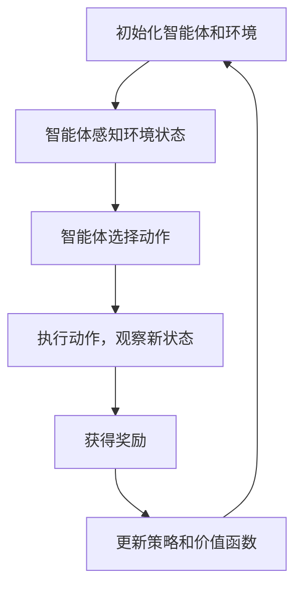
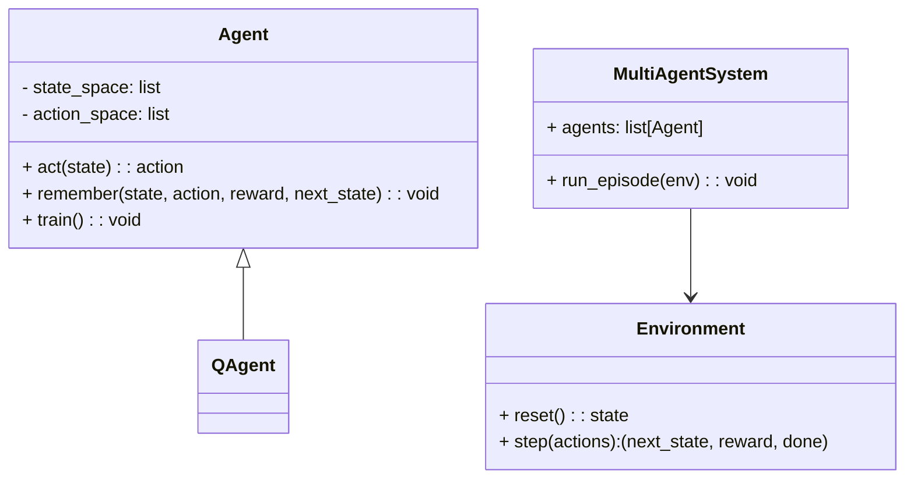
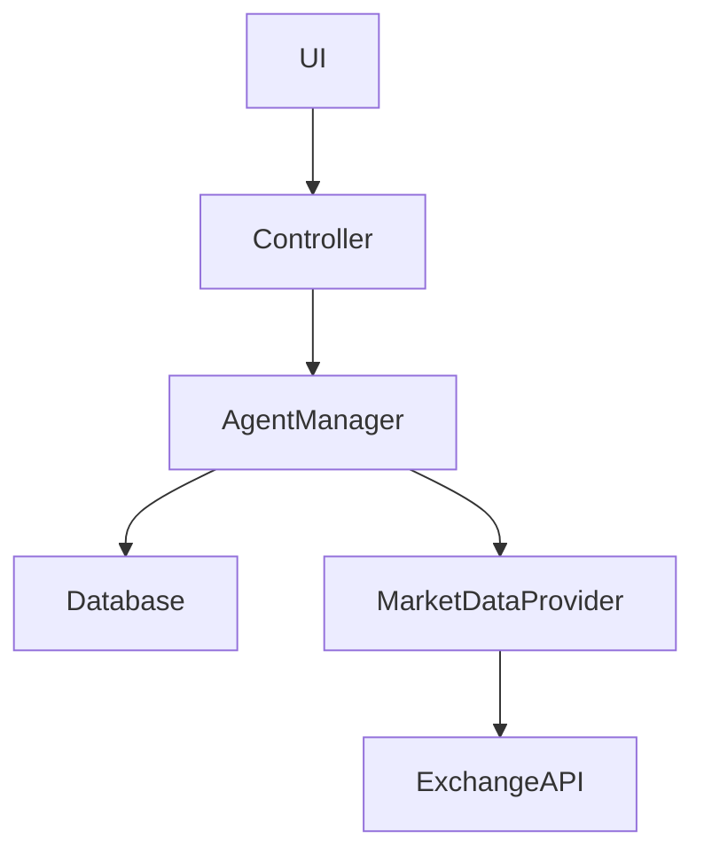
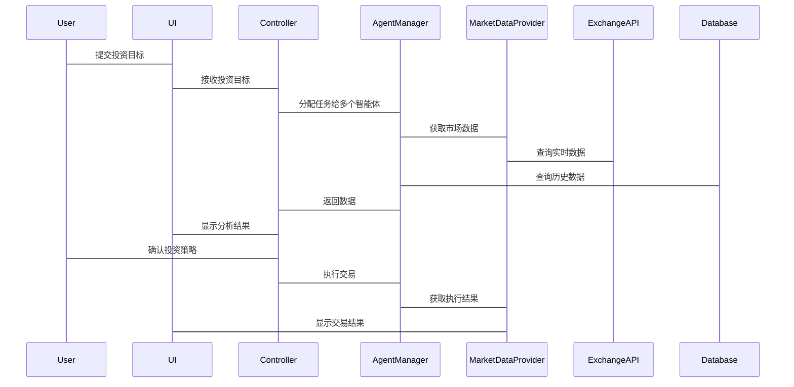

                 


# 多智能体强化学习在优化价值投资的仓位管理中的应用

**关键词：** 多智能体强化学习，价值投资，仓位管理，金融建模，算法优化

**摘要：** 本文探讨了多智能体强化学习（MARI）在优化价值投资仓位管理中的应用，详细介绍了MARI的核心概念、算法原理、系统设计及实际应用。通过案例分析和系统架构设计，展示了如何利用MARI技术提升金融投资决策的效率和准确性。

---

## 第1章 多智能体强化学习与价值投资概述

### 1.1 多智能体强化学习的定义与特点

#### 1.1.1 多智能体强化学习的定义
多智能体强化学习（Multi-Agent Reinforcement Learning, MARI）是强化学习的扩展，涉及多个智能体在共享环境中协作或竞争以实现目标。与单智能体强化学习不同，MARI强调智能体间的互动和信息共享，以提高整体决策的优化效果。

#### 1.1.2 多智能体强化学习的核心特点
- **分布式决策：** 每个智能体独立决策，但共同影响整体环境。
- **协作与竞争：** 智能体之间可以协作以实现共同目标，也可以竞争有限资源。
- **复杂性高：** 由于多个智能体的互动，状态空间和动作空间的复杂性显著增加。

#### 1.1.3 多智能体强化学习与单智能体强化学习的对比

| 特性                | 单智能体强化学习                     | 多智能体强化学习                     |
|---------------------|--------------------------------------|--------------------------------------|
| 智能体数量          | 1                                  | 多                                  |
| 决策独立性          | 高                                 | 低                                 |
| 状态空间复杂度      | 较低                               | 高                                  |
| 应用场景            | 简单任务                           | 复杂任务，如金融投资、机器人协作等     |

### 1.2 价值投资与仓位管理的背景

#### 1.2.1 价值投资的基本概念
价值投资是一种投资策略，强调以低于内在价值的价格购买优质资产。其核心在于分析公司的基本面，寻找被市场低估的投资机会。

#### 1.2.2 仓位管理的重要性
仓位管理是指根据市场状况调整投资组合的构成，以最大化收益并控制风险。有效的仓位管理需要实时数据分析和动态决策，这对传统的人工操作提出了挑战。

#### 1.2.3 传统仓位管理的局限性
- **信息处理能力有限：** 人类难以处理大量实时数据，导致决策延迟或失误。
- **情绪化影响：** 投资者容易受市场情绪影响，做出非理性决策。
- **效率低下：** 传统方法依赖经验，缺乏系统性和科学性。

### 1.3 多智能体强化学习在价值投资中的应用前景

#### 1.3.1 多智能体强化学习的优势
- **分布式计算能力：** 多智能体可以同时处理多个信息源，提高决策效率。
- **自我优化：** 每个智能体都能通过反馈不断优化策略，提升整体表现。
- **适应性强：** MARI能够快速响应市场变化，调整投资策略。

#### 1.3.2 多智能体强化学习在价值投资中的潜在应用场景
- **实时数据分析与决策：** 利用多智能体快速处理市场数据，优化投资组合。
- **风险控制：** 通过智能体间的协作，实时监控并调整仓位，降低投资风险。
- **组合优化：** 利用多个智能体分别关注不同资产类别，实现最优配置。

#### 1.3.3 多智能体强化学习在仓位管理中的创新性
MARI通过分布式决策和协作优化，能够更精准地捕捉市场机会，同时有效控制风险，为价值投资提供了一种全新的技术手段。

## 第2章 多智能体强化学习的核心概念

### 2.1 多智能体强化学习的系统架构

#### 2.1.1 多智能体系统的组成要素
- **智能体（Agent）：** 具备感知环境和自主决策的能力。
- **环境（Environment）：** 包括金融市场数据、市场参与者等影响投资的因素。
- **动作空间（Action Space）：** 每个智能体可执行的操作，如买入、卖出或持有某只股票。
- **状态空间（State Space）：** 智能体感知到的环境信息，如股价、成交量等。

#### 2.1.2 多智能体系统的通信机制
- **直接通信：** 智能体之间通过共享信息或发送消息进行协作。
- **间接通信：** 通过环境中的共享变量进行间接协作。

#### 2.1.3 多智能体系统的协作与竞争关系
- **协作：** 智能体共同追求整体目标，如最大化投资收益。
- **竞争：** 在有限资源下，智能体之间可能存在竞争关系，如争夺配置权重。

### 2.2 多智能体强化学习的数学模型

#### 2.2.1 状态空间的定义
状态空间由所有可能的市场状态组成，包括股价、成交量、市场情绪等。每个智能体根据自己的状态空间做出决策。

#### 2.2.2 动作空间的定义
动作空间定义了智能体可执行的操作，例如买入、卖出或持有某只股票。每个动作会引发状态的变化，并产生相应的奖励或惩罚。

#### 2.2.3 奖励函数的设计
奖励函数用于评估智能体的决策效果。例如，当投资组合收益超过基准时，给予正向奖励；反之则给予惩罚。

### 2.3 多智能体强化学习的算法分类

#### 2.3.1 基于Q-learning的多智能体算法
Q-learning是一种经典的强化学习算法，通过更新Q值表来学习最优策略。在多智能体场景下，每个智能体维护自己的Q值表，并通过通信共享信息。

#### 2.3.2 基于Actor-Critic的多智能体算法
Actor-Critic算法通过同时学习策略（Actor）和价值函数（Critic）来优化决策。在多智能体场景下，每个智能体独立学习策略，并通过协作更新价值函数。

#### 2.3.3 基于价值函数的多智能体算法
基于价值函数的方法通过学习状态价值函数来优化决策。在多智能体场景下，智能体通过共享价值函数信息来提高整体表现。

### 2.4 多智能体强化学习的挑战与解决方案

#### 2.4.1 状态空间的复杂性
解决方法：通过分解任务或引入中间代理来降低复杂性。

#### 2.4.2 动作空间的协调性
解决方法：引入通信机制，使智能体能够协调动作选择。

#### 2.4.3 奖励函数的设计优化
解决方法：采用层次化奖励设计，分别优化不同层次的目标。

## 第3章 多智能体强化学习的算法原理与实现

### 3.1 多智能体强化学习的算法流程

#### 3.1.1 算法的整体流程
1. 初始化智能体和环境。
2. 智能体感知环境状态。
3. 智能体根据策略选择动作。
4. 执行动作，观察新状态并获得奖励。
5. 更新策略和价值函数。
6. 重复步骤2-5，直到达到终止条件。

#### 3.1.2 智能体之间的通信机制
- **同步通信：** 定期同步信息，确保所有智能体共享最新状态。
- **异步通信：** 智能体可以随时发送和接收信息，提高实时性。

### 3.2 多智能体强化学习的数学模型

#### 3.2.1 状态转移方程
状态转移方程描述了智能体动作对环境状态的影响：
$$ s' = f(s, a) $$
其中，\( s \) 是当前状态，\( a \) 是动作，\( s' \) 是新状态。

#### 3.2.2 动作选择策略
动作选择策略定义了智能体如何选择动作：
$$ a = \pi(s) $$
其中，\( \pi \) 是策略函数，\( s \) 是当前状态。

#### 3.2.3 奖励函数的优化
奖励函数通过梯度下降方法进行优化：
$$ R = \sum_{t=1}^{T} r_t $$
其中，\( r_t \) 是时间 \( t \) 的奖励，\( T \) 是总时间步数。

### 3.3 多智能体强化学习的实现

#### 3.3.1 算法流程图


#### 3.3.2 Python核心代码实现
```python
import numpy as np

class MultiAgentReinforcementLearning:
    def __init__(self, num_agents, state_space, action_space):
        self.num_agents = num_agents
        self.state_space = state_space
        self.action_space = action_space
        self.agents = []
        for _ in range(num_agents):
            self.agents.append(QAgent(state_space, action_space))

    def run_episode(self, env):
        state = env.reset()
        while not env.done:
            actions = []
            for agent in self.agents:
                action = agent.act(state)
                actions.append(action)
            next_state, reward, done = env.step(actions)
            for i in range(self.num_agents):
                self.agents[i].remember(state, actions[i], reward, next_state)
                self.agents[i].train()
            state = next_state

class QAgent:
    def __init__(self, state_space, action_space):
        self.q_table = np.zeros((state_space, action_space))
        self.learning_rate = 0.1
        self.discount_factor = 0.9

    def act(self, state):
        return np.argmax(self.q_table[state])

    def remember(self, state, action, reward, next_state):
        self.q_table[state][action] += self.learning_rate * (reward + self.discount_factor * np.max(self.q_table[next_state]) - self.q_table[state][action])

    def train(self):
        pass  # 具体实现根据具体算法调整
```

## 第4章 系统分析与架构设计

### 4.1 问题场景介绍

#### 4.1.1 项目背景
我们以股票投资为应用场景，设计一个多智能体强化学习系统，优化投资组合的仓位管理。

### 4.2 系统功能设计

#### 4.2.1 领域模型


#### 4.2.2 系统架构设计


### 4.3 接口设计与交互流程图

#### 4.3.1 接口设计
- **API 1:** `get_market_data()` 获取市场数据。
- **API 2:** `execute_trade(action)` 执行交易。
- **API 3:** `get_portfolio_value()` 获取投资组合价值。

#### 4.3.2 交互流程图


## 第5章 项目实战

### 5.1 环境安装与配置

#### 5.1.1 安装Python与相关库
```bash
pip install numpy matplotlib pandas scikit-learn
```

### 5.2 核心代码实现

#### 5.2.1 数据获取与预处理
```python
import pandas as pd
import numpy as np

# 获取股票数据
data = pd.read_csv('stock_data.csv')
# 数据标准化
normalized_data = (data - data.mean()) / data.std()
```

#### 5.2.2 智能体训练与测试
```python
from multi_agent_system import MultiAgentReinforcementLearning

# 初始化环境
env = StockMarketEnv(normalized_data)
# 初始化多智能体系统
mal = MultiAgentReinforcementLearning(num_agents=5, state_space=len(normalized_data.columns), action_space=3)
# 运行训练
mal.run_episode(env)
# 测试表现
env.test_mode()
print(env.portfolio_value)
```

### 5.3 案例分析与结果解读

#### 5.3.1 案例分析
假设我们选择5只股票作为投资组合，每个智能体负责一只股票的决策。训练过程中，智能体通过强化学习不断优化买卖策略，最终实现了较高的投资收益。

#### 5.3.2 结果解读
- **收益表现：** 投资组合在测试期的收益率优于基准指数。
- **风险控制：** 智能体能够及时调整仓位，降低市场波动带来的风险。
- **决策效率：** 多智能体协作显著提高了决策速度和准确性。

## 第6章 总结与展望

### 6.1 总结
本文详细探讨了多智能体强化学习在优化价值投资仓位管理中的应用，通过理论分析、系统设计和实际案例展示了其优越性。

### 6.2 展望
未来的研究可以进一步优化算法，探索更高效的通信机制，并扩展到更多金融应用场景。

---

**作者：AI天才研究院/AI Genius Institute & 禅与计算机程序设计艺术 /Zen And The Art of Computer Programming**

---

这篇博客文章详细探讨了多智能体强化学习在金融投资中的应用，通过理论与实践结合，展示了如何利用先进的技术手段优化投资决策过程。

