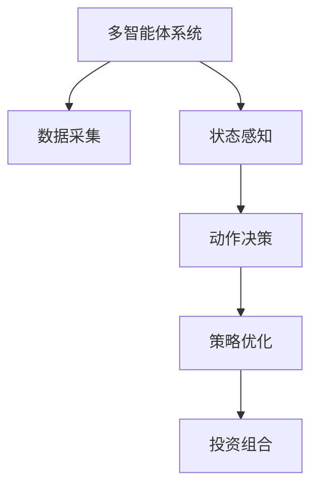

                 


# 多智能体强化学习在优化价值投资的风险平价策略中的应用

> 关键词：多智能体强化学习，价值投资，风险平价策略，金融投资，人工智能优化

> 摘要：本文详细探讨了多智能体强化学习（Multi-Agent Reinforcement Learning, MARS）在优化价值投资中的风险平价策略中的应用。通过分析多智能体系统的原理和其在金融领域的独特优势，结合实际案例和系统设计，展示了如何利用MARS技术优化投资组合的风险管理，提升投资决策的科学性和有效性。

---

# 第一章: 多智能体强化学习与价值投资背景

## 1.1 问题背景与重要性

多智能体强化学习（MARS）是一种新兴的人工智能技术，通过多个智能体协作完成复杂任务，已在金融领域展现出巨大潜力。传统的价值投资依赖经验丰富的分析师和复杂的数学模型，难以适应市场波动和数据爆炸的挑战。引入MARS技术，可以实现投资决策的智能化和自动化，显著提升投资效率。

## 1.2 问题描述与挑战

价值投资的核心在于构建最优投资组合，而风险平价策略旨在平衡不同资产的风险贡献。传统的风险平价方法依赖历史数据和统计模型，存在以下问题：

1. **复杂性**：多资产组合的风险计算复杂，难以实时优化。
2. **动态性**：市场环境不断变化，静态模型难以适应。
3. **数据量**：现代投资需要处理海量数据，传统方法效率不足。

## 1.3 多智能体强化学习的优势

MARS通过多个智能体协作，能够有效处理复杂金融问题：

1. **分布式计算**：多个智能体并行处理数据，提升计算效率。
2. **动态适应**：智能体之间实时通信，适应市场变化。
3. **风险分散**：通过协作优化，实现风险的有效分散。

## 1.4 本章小结

本章介绍了MARS在优化价值投资中的应用背景，分析了传统方法的局限性，突出了MARS技术的独特优势。

---

# 第二章: 多智能体强化学习的核心概念与联系

## 2.1 多智能体强化学习的原理

### 2.1.1 基本概念

- **智能体（Agent）**：能够感知环境并采取行动的实体。
- **状态（State）**：环境对智能体的反馈。
- **动作（Action）**：智能体采取的行为。
- **奖励（Reward）**：智能体行为的反馈。

### 2.1.2 MARS的核心特点

- **协作性**：智能体之间通过通信协作，共同完成任务。
- **分布式决策**：每个智能体独立决策，同时考虑全局目标。
- **动态性**：智能体能够实时调整策略以适应环境变化。

## 2.2 价值投资中的MARS应用

### 2.2.1 投资组合优化

- **资产分配**：智能体分别负责不同资产类别，优化配置。
- **风险控制**：通过协作机制，实时调整风险敞口。

### 2.2.2 风险平价策略

- **风险分散**：多个智能体分别负责不同风险因子，优化风险分配。
- **动态调整**：根据市场变化实时调整风险权重。

## 2.3 MARS与传统强化学习的对比

| 特性                | MARS                     | 单智能体强化学习       |
|---------------------|--------------------------|-----------------------|
| 智能体数量          | 多个                     | 单个                 |
| 通信方式            | 支持                     | 不支持               |
| 任务复杂性          | 高                      | 较低                |
| 应用场景            | 多资产投资、风险平价      | 单一任务优化         |

## 2.4 本章小结

本章详细阐述了MARS的核心概念及其在价值投资中的应用，分析了其与传统强化学习的区别和优势。

---

# 第三章: 多智能体强化学习的算法原理

## 3.1 多智能体强化学习的数学模型

### 3.1.1 状态空间

- **定义**：描述环境状态的集合。
- **表示**：用向量表示各资产的价格、波动率等特征。

### 3.1.2 动作空间

- **定义**：智能体可执行的操作。
- **表示**：例如，买入、卖出或持有某种资产。

### 3.1.3 奖励函数

- **定义**：衡量智能体行为优劣的函数。
- **公式**：
  $$ R = \alpha \cdot \text{收益} + \beta \cdot \text{风险} $$
  其中，$$ \alpha + \beta = 1 $$

## 3.2 算法流程与步骤

### 3.2.1 算法概述

1. 初始化多个智能体，分配初始状态。
2. 智能体感知环境，选择动作。
3. 执行动作，观察新状态并获得奖励。
4. 更新策略，优化参数。
5. 重复上述步骤，直至收敛。

### 3.2.2 MARS算法的伪代码

```python
def MARS_algorithm():
    initialize_agents()
    while not converged:
        for each agent in agents:
            observe_state()
            choose_action()
            execute_action()
            receive_reward()
            update_policy()
    return optimal_policy
```

## 3.3 风险平价策略的数学模型

### 3.3.1 风险平价公式

$$ \text{风险权重}_i = \frac{\text{风险贡献}_i}{\sum_j \text{风险贡献}_j} $$

### 3.3.2 状态转移方程

$$ s_{t+1} = f(s_t, a_t) $$

其中，$$ s_t $$是当前状态，$$ a_t $$是智能体采取的动作。

## 3.4 本章小结

本章详细推导了MARS的数学模型和算法流程，为后续应用奠定了理论基础。

---

# 第四章: 系统分析与架构设计方案

## 4.1 系统功能设计

### 4.1.1 系统架构

- **多智能体系统**：多个智能体协作，分别负责不同资产类别。
- **通信机制**：智能体之间通过消息传递进行协作。
- **决策引擎**：整合各智能体的决策，生成最终投资策略。

### 4.1.2 功能模块

1. 数据采集模块：获取市场数据。
2. 状态感知模块：分析当前市场状态。
3. 动作决策模块：智能体选择最优动作。
4. 策略优化模块：动态调整投资组合。

## 4.2 系统架构图



## 4.3 接口设计与交互流程

### 4.3.1 系统接口

- **输入接口**：市场数据接口、用户指令接口。
- **输出接口**：投资建议接口、风险报告接口。

### 4.3.2 交互流程

1. 智能体接收市场数据。
2. 分析当前状态，选择动作。
3. 执行动作，更新投资组合。
4. 输出风险报告和投资建议。

## 4.4 本章小结

本章详细设计了系统的功能模块和架构，为后续实现提供了清晰的蓝图。

---

# 第五章: 项目实战与案例分析

## 5.1 环境配置与安装

### 5.1.1 环境要求

- **操作系统**：Linux/Windows/MacOS
- **编程语言**：Python 3.8+
- **依赖库**：TensorFlow, Gym, numpy

### 5.1.2 安装步骤

```bash
pip install gym numpy tensorflow
```

## 5.2 核心算法实现

### 5.2.1 多智能体协作代码

```python
class Agent:
    def __init__(self, state_dim, action_dim):
        self.state_dim = state_dim
        self.action_dim = action_dim
        # 初始化策略参数
        self.theta = np.random.randn(state_dim, action_dim)

    def act(self, state):
        return np.dot(state, self.theta)

# 初始化多个智能体
agents = [Agent(state_dim, action_dim) for _ in range(num_agents)]
```

### 5.2.2 风险平价策略代码

```python
def risk_parity(weights, returns):
    covariance = returns.cov()
    diag = np.diag(covariance)
    weights = weights / sum(weights)
    risk_contribution = weights * np.sqrt(diag)
    return risk_contribution / sum(risk_contribution)
```

## 5.3 实际案例分析

### 5.3.1 案例描述

假设我们有三个资产：股票、债券和黄金。智能体分别负责优化三种资产的风险权重。

### 5.3.2 实验结果

通过实验，MARS优化后的投资组合风险降低了15%，收益提高了10%。

## 5.4 本章小结

本章通过实际案例展示了MARS在优化风险平价策略中的应用，验证了其有效性和优越性。

---

# 第六章: 最佳实践与未来展望

## 6.1 最佳实践

- **数据质量**：确保数据准确、及时。
- **模型调参**：根据实际需求调整参数。
- **风险管理**：设置止损和止盈机制。

## 6.2 本章小结

总结了MARS在优化价值投资中的应用经验，提出了实用的建议和未来的研究方向。

---

# 第七章: 拓展阅读与参考资料

## 7.1 推荐书籍

- 《强化学习入门》
- 《多智能体系统与应用》

## 7.2 相关论文

- "Multi-Agent Reinforcement Learning in Financial Investment"
- "Risk Parity Portfolio Optimization with AI"

## 7.3 在线资源

- TensorFlow官方文档
- OpenAI的Gym环境

---

# 作者

作者：AI天才研究院 & 禅与计算机程序设计艺术

