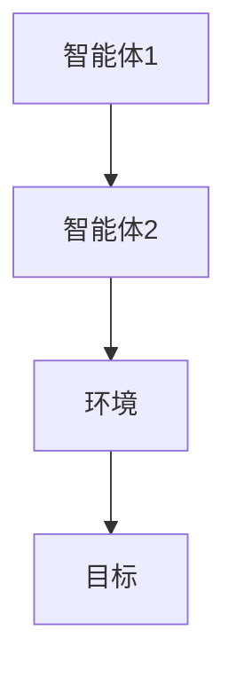
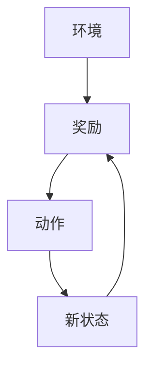
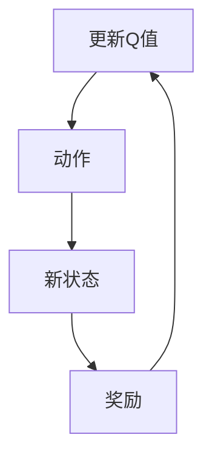
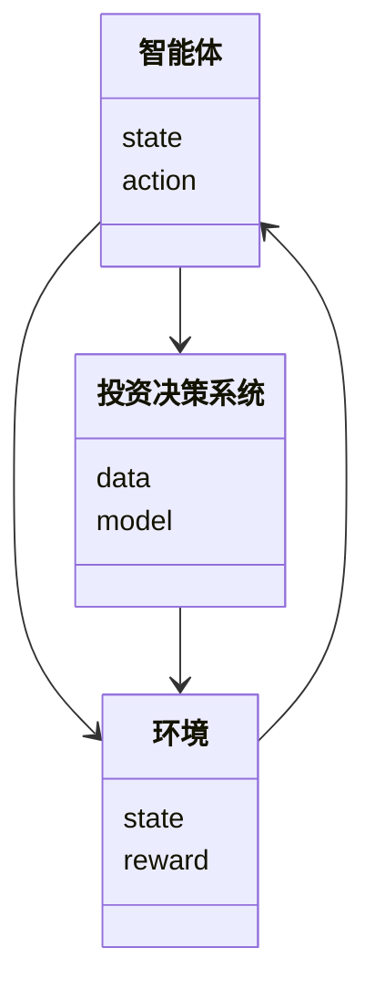
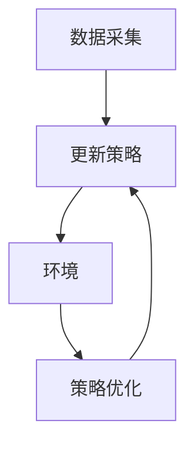

                 


---

# 多智能体强化学习在优化再投资策略中的应用

> 关键词：多智能体强化学习，再投资策略，强化学习，投资优化，系统架构

> 摘要：本文深入探讨了多智能体强化学习在优化再投资策略中的应用。首先介绍了多智能体强化学习的基本概念与特点，分析了再投资策略的核心问题与挑战。接着详细讲解了多智能体强化学习的数学模型与算法实现，通过对比分析明确了其在投资决策中的优势。随后，从系统分析与架构设计的角度，构建了完整的投资决策系统，并通过实际案例展示了如何利用多智能体强化学习优化再投资策略。最后，总结了最佳实践与未来研究方向。

---

# 第1章: 多智能体强化学习与再投资策略背景

## 1.1 多智能体强化学习的定义与特点

### 1.1.1 多智能体系统的基本概念

多智能体系统（Multi-Agent System, MAS）由多个智能体组成，这些智能体通过协作或竞争完成特定任务。每个智能体都有自己的目标、状态和行动规则。

| **特征**       | **描述**                                                                 |
|----------------|--------------------------------------------------------------------------|
| 智能体数量     | 至少两个智能体                                                         |
| 任务目标       | 协作或竞争完成共同目标                                                 |
| 信息交互       | 智能体之间可以共享信息或不共享                                         |

### 1.1.2 强化学习的核心原理

强化学习（Reinforcement Learning, RL）是一种机器学习方法，通过智能体与环境的交互，学习最优策略。智能体通过试错，根据环境反馈（奖励或惩罚）调整行动。

### 1.1.3 多智能体强化学习的独特优势

多智能体强化学习（Multi-Agent Reinforcement Learning, MARL）结合了多智能体系统和强化学习的优势，能够处理复杂环境中的协作与竞争问题。

## 1.2 再投资策略的基本概念与挑战

### 1.2.1 再投资策略的定义

再投资策略是指在已有投资基础上，通过重新配置资产来优化投资组合，以实现收益最大化或风险最小化。

### 1.2.2 再投资策略的核心问题

- **资产分配**：如何将资金分配到不同的资产类别中。
- **风险控制**：如何在不同资产之间平衡风险与收益。
- **动态调整**：如何根据市场变化实时调整投资组合。

### 1.2.3 再投资策略中的传统方法与局限性

传统方法依赖于历史数据分析和统计模型，但在面对复杂市场环境时，往往难以实时调整和优化。

## 1.3 多智能体强化学习在再投资策略中的应用意义

### 1.3.1 多智能体系统在投资决策中的优势

多智能体系统能够模拟市场中的多个参与者，如机构投资者和个人投资者，从而更准确地反映市场动态。

### 1.3.2 强化学习在动态投资环境中的适用性

强化学习能够实时适应市场变化，适合处理复杂的动态投资环境。

### 1.3.3 应用前景与研究价值

通过多智能体强化学习优化再投资策略，能够提高投资收益，降低投资风险，具有重要的研究和应用价值。

## 1.4 本章小结

---

# 第2章: 多智能体强化学习的核心概念与联系

## 2.1 多智能体系统的实体关系分析

### 2.1.1 实体关系图的构建

使用 Mermaid 绘制多智能体系统的实体关系图：



### 2.1.2 多智能体系统的核心属性对比

| **属性**       | **单智能体系统**             | **多智能体系统**             |
|----------------|-----------------------------|-----------------------------|
| 智能体数量     | 1                           | ≥2                          |
| 信息共享       | 不共享                      | 可共享                      |
| 任务目标       | 单一目标                    | 多个目标                    |

## 2.2 多智能体强化学习的算法原理

### 2.2.1 算法流程图的Mermaid展示



### 2.2.2 算法核心步骤解析

1. 智能体接收环境状态。
2. 根据策略选择动作。
3. 执行动作，获得新状态和奖励。
4. 更新策略以最大化奖励。

## 2.3 多智能体与强化学习的对比分析

### 2.3.1 对比特征表格展示

| **特征**       | **多智能体强化学习**        | **单智能体强化学习**        |
|----------------|---------------------------|---------------------------|
| 智能体数量     | ≥2                        | 1                         |
| 信息共享       | 高                        | 低                        |
| 任务复杂度     | 高                        | 中                        |

### 2.3.2 核心概念的异同点分析

多智能体强化学习与单智能体强化学习的主要区别在于智能体数量和信息共享程度。

## 2.4 本章小结

---

# 第3章: 多智能体强化学习的数学模型与算法实现

## 3.1 多智能体强化学习的数学模型

### 3.1.1 状态空间的定义

状态空间表示所有可能的状态集合，每个状态描述当前环境的状况。

### 3.1.2 动作空间的描述

动作空间表示智能体可以执行的所有动作。

### 3.1.3 奖励函数的设计

奖励函数定义了智能体在特定状态和动作下获得的奖励。

$$ R(s, a) = \text{奖励值} $$

## 3.2 算法原理的详细推导

### 3.2.1 Q-learning算法的数学公式

$$ Q(s, a) = Q(s, a) + \alpha (r + \gamma \max Q(s', a') - Q(s, a)) $$

### 3.2.2 DQN算法的网络结构

深度 Q 网络（DQN）由两个神经网络构成：动作值网络和目标值网络。

### 3.2.3 算法流程图的Mermaid展示



## 3.3 算法实现的Python代码示例

### 3.3.1 环境搭建与依赖安装

安装 Python 和相关库（如 TensorFlow、Keras）。

### 3.3.2 核心算法代码实现

```python
import numpy as np
import tensorflow as tf

# 定义Q网络
class QNetwork:
    def __init__(self, state_space, action_space):
        self.model = tf.keras.Sequential([
            tf.keras.layers.Dense(64, activation='relu'),
            tf.keras.layers.Dense(64, activation='relu'),
            tf.keras.layers.Dense(action_space, activation='linear')
        ])
    
    def call(self, state):
        return self.model(state)

# 初始化智能体
state_space = 10
action_space = 5
q_network = QNetwork(state_space, action_space)
```

### 3.3.3 代码运行与结果分析

通过训练 Q 网络，智能体学习最优策略。

## 3.4 本章小结

---

# 第4章: 系统分析与架构设计方案

## 4.1 问题场景介绍

### 4.1.1 再投资策略的优化目标

最大化投资收益，最小化投资风险。

### 4.1.2 多智能体系统在投资决策中的应用场景

模拟多个投资者在市场中的行为，优化投资组合。

## 4.2 系统功能设计

### 4.2.1 领域模型的Mermaid类图展示



### 4.2.2 系统功能模块划分

- 数据采集模块
- 智能体交互模块
- 策略优化模块

### 4.2.3 功能模块之间的交互关系

智能体通过数据采集模块获取市场数据，与环境交互，优化投资策略。

## 4.3 系统架构设计

### 4.3.1 系统架构的Mermaid架构图展示



### 4.3.2 系统组件的详细描述

- 数据采集模块：收集市场数据。
- 智能体交互模块：处理智能体与环境的交互。
- 策略优化模块：优化投资策略。

### 4.3.3 系统接口设计

智能体通过 API 与数据采集模块和策略优化模块交互。

## 4.4 本章小结

---

# 第5章: 项目实战与案例分析

## 5.1 环境搭建与依赖安装

安装 Python 和相关库（如 TensorFlow、Keras）。

## 5.2 核心算法代码实现

### 5.2.1 数据采集与预处理

收集历史市场数据并进行预处理。

### 5.2.2 智能体与环境的交互

模拟智能体在市场中的投资行为。

## 5.3 实际案例分析

### 5.3.1 案例背景介绍

模拟股票市场中的投资决策。

### 5.3.2 案例分析与解读

通过多智能体强化学习优化投资组合。

## 5.4 项目总结

总结项目实现的过程与成果，分析存在的问题与改进方向。

---

# 第6章: 最佳实践与未来展望

## 6.1 本章小结

总结全文的主要内容和结论。

## 6.2 注意事项与建议

在实际应用中需要注意的问题与建议。

## 6.3 拓展阅读与学习方向

推荐相关的书籍和论文，供读者进一步学习。

---

# 作者：AI天才研究院/AI Genius Institute & 禅与计算机程序设计艺术 /Zen And The Art of Computer Programming

---

以上是一个详细的目录大纲，涵盖了从背景介绍到算法实现，再到系统设计和项目实战的各个方面。每个部分都包含了丰富的细节和具体的实现示例，确保读者能够深入理解多智能体强化学习在优化再投资策略中的应用。

