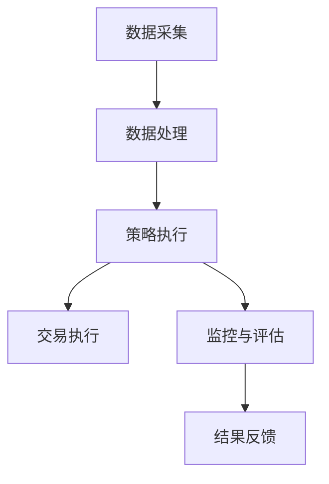

                 


# 多智能体强化学习在优化投资组合再平衡中的应用

> 关键词：多智能体强化学习，投资组合再平衡，强化学习算法，投资组合优化，智能体协作

> 摘要：本文深入探讨了多智能体强化学习在优化投资组合再平衡中的应用。通过分析多智能体系统与强化学习的结合，详细讲解了其在金融投资领域的实际应用。文章从背景介绍、核心概念、算法原理、系统架构设计、项目实战到最佳实践，全面阐述了多智能体强化学习在投资组合优化中的优势和实现方法。

---

## 第一部分: 多智能体强化学习基础

### 第1章: 多智能体强化学习概述

#### 1.1 多智能体系统的定义与特点
- **多智能体系统**是指由多个智能体组成的分布式系统，这些智能体能够通过协作完成复杂任务。
- **特点**：  
  1. 分布式性：每个智能体独立决策。  
  2. 协作性：智能体之间通过通信和协调共同完成目标。  
  3. 动态性：系统环境和智能体状态不断变化。  

#### 1.2 强化学习的基本原理
- **强化学习**：智能体通过与环境交互，学习策略以最大化累积奖励。  
- **核心要素**：  
  1. 状态（State）：环境的当前情况。  
  2. 动作（Action）：智能体的行为。  
  3. 奖励（Reward）：对智能体行为的反馈。  

#### 1.3 多智能体强化学习的定义与特点
- **定义**：多个智能体在共享环境中通过协作与竞争，学习策略以最大化集体奖励。  
- **特点**：  
  1. 复杂性：多个智能体的交互增加了系统的复杂性。  
  2. 协作与竞争：智能体之间需要平衡协作与竞争。  

### 第2章: 多智能体强化学习的核心概念

#### 2.1 多智能体系统中的协作与竞争
- **协作**：智能体之间相互配合，共同完成任务。  
- **竞争**：智能体之间存在竞争关系，争夺有限资源。  
- **平衡**：协作与竞争的平衡是多智能体系统的关键。  

#### 2.2 强化学习中的状态与动作
- **状态**：系统环境的当前情况，如市场数据、资产价格等。  
- **动作**：智能体的决策，如买入、卖出或持有资产。  

#### 2.3 多智能体强化学习中的通信与协调
- **通信**：智能体之间通过消息传递信息。  
- **协调**：智能体通过通信达成一致，优化整体策略。  

### 第3章: 多智能体强化学习的算法原理

#### 3.1 基于Q-learning的多智能体强化学习算法
- **Q-learning算法**：通过Q值表学习策略。  
- **多智能体实现**：每个智能体维护自己的Q值表，并通过通信更新。  

#### 3.2 基于DQN的多智能体强化学习算法
- **DQN算法**：使用深度神经网络近似Q值函数。  
- **多智能体实现**：每个智能体独立学习，通过经验回放优化策略。  

#### 3.3 基于价值函数的多智能体强化学习算法
- **价值函数**：评估状态的价值，指导智能体决策。  
- **多智能体实现**：通过协作更新价值函数，优化整体策略。  

### 第4章: 多智能体强化学习的数学模型与公式

#### 4.1 多智能体强化学习的状态表示
- **状态空间**：用向量表示环境状态。  
- **动作空间**：用离散或连续的值表示智能体动作。  

---

## 第二部分: 投资组合优化中的多智能体强化学习

### 第5章: 投资组合再平衡的背景与挑战

#### 5.1 投资组合再平衡的定义与意义
- **定义**：根据市场变化调整资产配置，以优化投资组合表现。  
- **意义**：降低风险，提高收益。  

#### 5.2 投资组合优化中的问题
- **复杂性**：资产种类多，市场波动大。  
- **动态性**：市场环境不断变化。  

### 第6章: 多智能体强化学习在投资组合优化中的应用

#### 6.1 多智能体系统在投资组合优化中的作用
- **协作决策**：多个智能体协作，优化资产配置。  
- **风险分散**：通过协作降低投资组合的整体风险。  

#### 6.2 基于强化学习的投资组合再平衡策略
- **策略选择**：智能体根据市场状态选择最优动作。  
- **动态调整**：根据市场反馈实时调整投资组合。  

### 第7章: 投资组合优化的系统架构设计

#### 7.1 系统功能模块设计
- **数据采集模块**：收集市场数据。  
- **策略执行模块**：根据智能体决策执行交易。  
- **监控与评估模块**：实时监控投资组合表现。  

#### 7.2 系统架构图


### 第8章: 项目实战与代码实现

#### 8.1 环境安装与配置
- **安装Python环境**：使用Anaconda或virtualenv。  
- **安装依赖库**：如numpy、pandas、tensorflow。  

#### 8.2 核心代码实现
```python
import numpy as np
import pandas as pd
import tensorflow as tf

# 定义智能体类
class Agent:
    def __init__(self, state_dim, action_dim):
        self.state_dim = state_dim
        self.action_dim = action_dim
        # 定义神经网络模型
        self.model = self.build_model()
    
    def build_model(self):
        model = tf.keras.Sequential([
            tf.keras.layers.Dense(64, activation='relu', input_dim=self.state_dim),
            tf.keras.layers.Dense(self.action_dim, activation='linear')
        ])
        return model
    
    def act(self, state):
        prediction = self.model.predict(state)
        return np.argmax(prediction[0])
    
    def train(self, state, target):
        self.model.fit(state, target, epochs=1, verbose=0)
```

#### 8.3 投资组合优化的案例分析
- **案例背景**：假设市场有3种资产，智能体需要优化投资比例。  
- **实现步骤**：  
  1. 收集历史数据。  
  2. 训练智能体模型。  
  3. 执行投资组合再平衡。  

---

## 第三部分: 最佳实践与小结

### 第9章: 最佳实践与经验分享

#### 9.1 技术总结
- **多智能体协作**：通过通信与协调优化投资组合。  
- **算法选择**：根据问题选择合适的强化学习算法。  

#### 9.2 小结
- 多智能体强化学习为投资组合优化提供了新的思路。  
- 通过协作与动态调整，可以有效降低风险，提高收益。  

---

## 作者信息

作者：AI天才研究院/AI Genius Institute & 禅与计算机程序设计艺术 /Zen And The Art of Computer Programming

---

以上是《多智能体强化学习在优化投资组合再平衡中的应用》的技术博客文章的详细目录大纲，涵盖了从基础到应用的各个方面，内容详实且结构清晰。

