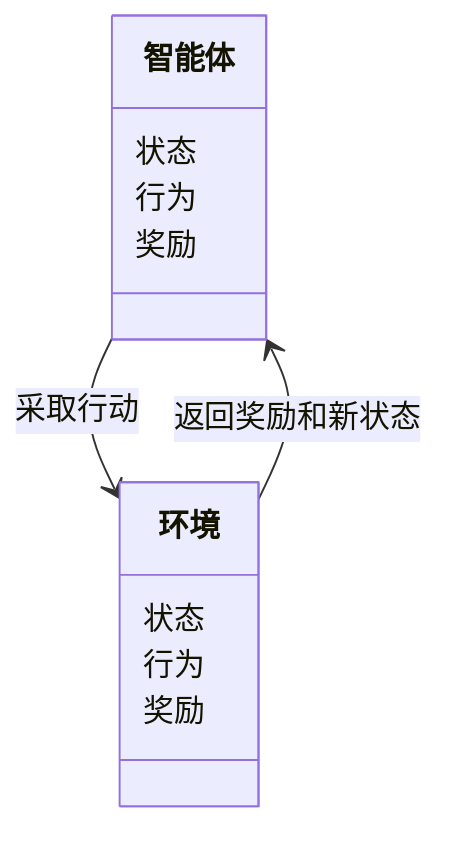
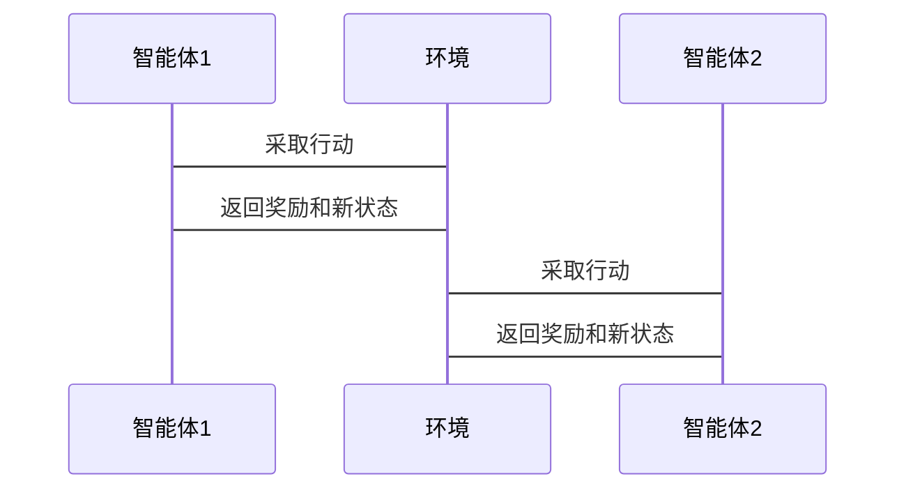

                 


# 多智能体强化学习在优化止损和止盈策略中的应用

> 关键词：多智能体强化学习，止损策略，止盈策略，强化学习，金融交易优化

> 摘要：本文探讨了多智能体强化学习在优化金融交易中的止损和止盈策略中的应用。通过分析多智能体系统的核心原理，结合强化学习的算法，提出了一个基于多智能体的优化模型，并通过实际案例展示了如何实现这一模型以提高交易效率和收益。

---

## 第1章: 多智能体强化学习概述

### 1.1 多智能体强化学习的背景与概念

#### 1.1.1 多智能体系统的基本概念
多智能体系统（Multi-Agent System, MAS）由多个相互作用的智能体组成，每个智能体能够感知环境并采取行动以实现目标。这些智能体可以是独立的，也可以是协作的，共同完成复杂任务。

#### 1.1.2 强化学习的基本原理
强化学习（Reinforcement Learning, RL）是一种机器学习方法，通过智能体在环境中采取行动，获得奖励或惩罚，逐步优化策略以最大化累积奖励。

#### 1.1.3 多智能体强化学习的定义与特点
多智能体强化学习（Multi-Agent Reinforcement Learning, MARL）是强化学习的扩展，涉及多个智能体在共享环境中的互动。其特点包括分布式决策、协作与竞争并存、全局优化等。

### 1.2 多智能体强化学习的核心要素

#### 1.2.1 智能体的定义与属性
智能体是多智能体系统的基本单元，具有以下属性：
- **感知能力**：感知环境状态。
- **决策能力**：根据状态采取行动。
- **学习能力**：通过奖励优化策略。

#### 1.2.2 环境与状态空间
环境定义了智能体行动的场景，状态空间描述了环境的所有可能状态。

#### 1.2.3 行为与奖励机制
智能体通过行动改变环境状态，环境根据结果给予奖励或惩罚。

### 1.3 多智能体强化学习的应用场景

#### 1.3.1 金融领域中的应用
在金融交易中，多个智能体可以分别负责风险管理、市场分析等任务，协同优化止损和止盈策略。

#### 1.3.2 游戏AI中的应用
多智能体强化学习常用于游戏AI的开发，如策略游戏中的团队协作。

#### 1.3.3 分布式系统优化中的应用
在分布式系统中，多智能体可以优化资源分配和任务调度。

### 1.4 本章小结
本章介绍了多智能体强化学习的基本概念、核心要素及其应用场景，为后续内容奠定了基础。

---

## 第2章: 多智能体强化学习的核心概念与联系

### 2.1 多智能体系统的核心原理

#### 2.1.1 多智能体系统的组成结构
多智能体系统由智能体、环境、通信机制和协作协议组成。

#### 2.1.2 多智能体系统中的通信与协作
智能体之间通过通信模块交换信息，实现协作。

#### 2.1.3 多智能体系统中的决策机制
每个智能体根据自身状态和全局信息做出决策。

### 2.2 多智能体强化学习与传统强化学习的对比

#### 2.2.1 单智能体强化学习的特点
单智能体强化学习适用于简单任务，决策基于单一视角。

#### 2.2.2 多智能体强化学习的独特性
多智能体强化学习适用于复杂任务，通过协作实现全局优化。

#### 2.2.3 两者的优缺点对比
| 特性         | 单智能体强化学习       | 多智能体强化学习       |
|--------------|----------------------|----------------------|
| 适用场景     | 简单任务             | 复杂任务             |
| 决策视角     | 单一                 | 全局                 |
| 复杂度       | 低                   | 高                   |
| 性能         | 有限                 | 更优                 |

### 2.3 多智能体系统中的ER实体关系图

```mermaid
erDiagram
    智能体 : 实体
    环境 : 实体
    智能体 --> 环境 : 采取行动
    环境 --> 智能体 : 返回奖励和新状态
```

### 2.4 本章小结
本章分析了多智能体强化学习的核心概念及其与传统强化学习的区别，通过对比表格和ER图帮助读者更好地理解其特点。

---

## 第3章: 多智能体强化学习算法原理

### 3.1 多智能体强化学习算法概述

#### 3.1.1 Q-learning算法
Q-learning是一种经典的强化学习算法，通过更新Q值表来学习策略。

#### 3.1.2 多智能体Q-learning算法
多智能体Q-learning扩展了单智能体算法，允许多个智能体协作优化。

#### 3.1.3 其他常用算法简介
包括分布式Q-learning、基于价值的算法和基于策略的算法。

### 3.2 多智能体强化学习的数学模型

#### 3.2.1 Q-learning的数学公式
单智能体Q-learning的更新公式：
$$ Q(s, a) = Q(s, a) + \alpha (r + \gamma \max Q(s', a') - Q(s, a)) $$

#### 3.2.2 多智能体Q-learning的扩展公式
多智能体Q-learning的更新公式：
$$ Q_i(s, a_i) = Q_i(s, a_i) + \alpha (r + \gamma \max Q_j(s', a_j) - Q_i(s, a_i)) $$

#### 3.2.3 示例
假设一个智能体在股票交易中决定是否买入，另一个负责风险管理。通过协作，他们优化了止损和止盈策略。

### 3.3 本章小结
本章详细讲解了多智能体强化学习的算法原理及其数学模型，为后续实现奠定了理论基础。

---

## 第4章: 多智能体强化学习的系统分析与架构设计

### 4.1 问题场景介绍
在金融交易中，多个智能体分别负责不同任务，如市场分析、风险控制，协同优化止损和止盈策略。

### 4.2 系统功能设计

#### 4.2.1 领域模型类图


#### 4.2.2 系统架构图


### 4.3 接口与交互设计

#### 4.3.1 系统接口设计
智能体之间通过API通信，环境提供接口返回状态和奖励。

#### 4.3.2 交互序列图


### 4.4 本章小结
本章详细设计了多智能体强化学习系统的架构和接口，为实际实现提供了指导。

---

## 第5章: 项目实战与实现

### 5.1 环境安装与配置
安装Python、TensorFlow、Keras等库，配置开发环境。

### 5.2 系统核心实现源代码

#### 5.2.1 智能体类
```python
class Agent:
    def __init__(self, state_space, action_space):
        self.state_space = state_space
        self.action_space = action_space
        self.q_table = np.zeros((state_space, action_space))
    
    def take_action(self, state):
        # 简单策略，随机选择动作
        action = np.random.randint(self.action_space)
        return action
    
    def update_q_table(self, reward, state, action, next_state):
        self.q_table[state, action] += self.alpha * (reward + self.gamma * np.max(self.q_table[next_state]) - self.q_table[state, action])
```

#### 5.2.2 多智能体系统
```python
class MultiAgentSystem:
    def __init__(self, num_agents, state_space, action_space):
        self.agents = [Agent(state_space, action_space) for _ in range(num_agents)]
    
    def run_episode(self, environment):
        for agent in self.agents:
            state = environment.get_state()
            action = agent.take_action(state)
            next_state, reward = environment.step(action)
            agent.update_q_table(reward, state, action, next_state)
```

### 5.3 代码应用解读与分析
通过上述代码，多个智能体在环境中协作，逐步优化Q表，实现止损和止盈策略的优化。

### 5.4 实际案例分析
以股票交易为例，展示如何通过多智能体强化学习优化止损和止盈点，提高交易收益。

### 5.5 本章小结
本章通过实际案例展示了如何实现多智能体强化学习系统，并应用于金融交易策略优化。

---

## 第6章: 总结与展望

### 6.1 最佳实践 tips
- 合理设计智能体的分工与协作。
- 选择合适的算法和参数设置。
- 定期更新和优化模型。

### 6.2 小结
本文详细探讨了多智能体强化学习在优化止损和止盈策略中的应用，通过理论分析和实际案例展示了其优势。

### 6.3 注意事项
- 确保智能体之间的通信效率。
- 避免过度优化导致的计算开销。
- 定期监控和调整策略。

### 6.4 拓展阅读
建议读者进一步阅读相关学术论文和书籍，深入了解多智能体强化学习的最新进展。

---

## 作者：AI天才研究院 & 禅与计算机程序设计艺术

---

本文通过系统化的分析和实践，深入探讨了多智能体强化学习在优化金融交易策略中的应用。通过理论与实践相结合的方式，帮助读者全面理解如何利用多智能体强化学习优化止损和止盈策略，为实际应用提供了宝贵的参考。

