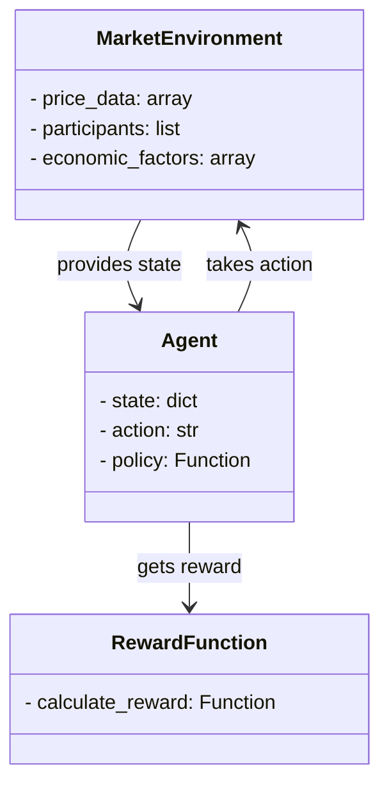
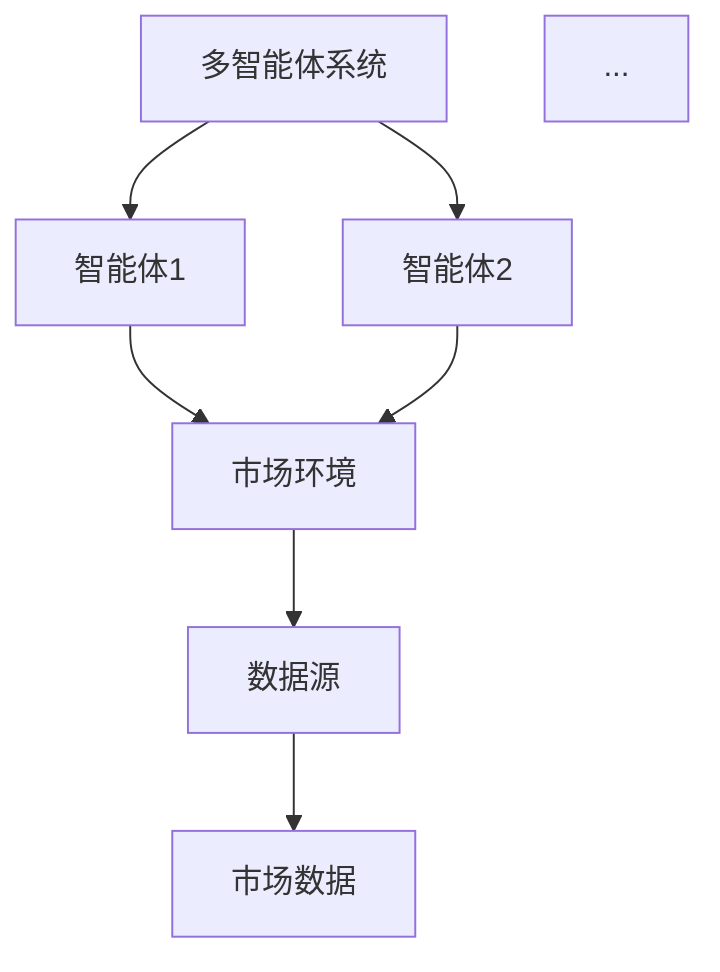

                 


# 多智能体强化学习在股票市场价值发现中的应用

> 关键词：多智能体强化学习，股票市场，价值发现，算法实现，系统架构

> 摘要：本文探讨了多智能体强化学习（Multi-Agent Reinforcement Learning, MARS）在股票市场价值发现中的应用。首先，我们介绍了多智能体强化学习的基本概念和核心原理，分析了股票市场的复杂性与挑战，提出了多智能体强化学习在价值发现中的建模方法，并详细讲解了算法实现和系统架构设计。最后，通过实际案例分析，验证了多智能体强化学习在股票市场中的有效性和优势。

---

## 第一部分: 多智能体强化学习基础

### 第1章: 多智能体强化学习概述

#### 1.1 多智能体强化学习的定义与特点

##### 1.1.1 多智能体强化学习的定义
多智能体强化学习（Multi-Agent Reinforcement Learning, MARS）是一种人工智能技术，通过多个智能体在复杂环境中协作或竞争，以实现特定目标。与单智能体强化学习不同，MARS强调智能体之间的交互与协作，能够在动态环境中实现更高效的决策。

##### 1.1.2 多智能体与单智能体的对比
| 特性          | 单智能体强化学习              | 多智能体强化学习              |
|---------------|-----------------------------|-----------------------------|
| 决策主体      | 单个智能体                  | 多个智能体                  |
| 交互方式      | 与环境直接交互              | 智能体之间互相交互          |
| 任务复杂度    | 任务相对简单                | 任务复杂，涉及协作与竞争    |
| 应用场景      | 游戏、机器人控制            | 金融、交通、社交网络等      |

##### 1.1.3 多智能体强化学习的核心要素
- **智能体（Agent）**：能够感知环境并采取行动的主体。
- **环境（Environment）**：智能体所处的外部世界，包括市场参与者、价格波动等。
- **状态（State）**：环境在某一时刻的描述。
- **动作（Action）**：智能体在给定状态下的决策。
- **奖励（Reward）**：智能体行动后获得的反馈，用于评估行动的好坏。

#### 1.2 多智能体强化学习在金融领域的应用

##### 1.2.1 金融市场的复杂性与挑战
- 股票价格受多种因素影响：市场情绪、经济指标、公司业绩等。
- 市场参与者的多样性：机构投资者、个人投资者、算法交易等。
- 高度动态性：价格波动频繁，需要实时决策。

##### 1.2.2 多智能体强化学习在股票交易中的优势
- 多智能体能够模拟市场的多方参与者，捕捉复杂的价格波动。
- 通过协作与竞争，智能体能够更准确地预测市场趋势。
- 能够处理高维状态空间，适应复杂的市场环境。

##### 1.2.3 价值发现的核心问题与目标
- **问题**：如何识别被低估的股票，提前发现价值洼地。
- **目标**：通过多智能体协作，建立动态的市场估值模型，实现对股票内在价值的精准评估。

#### 1.3 本章小结
本章介绍了多智能体强化学习的基本概念，分析了其在金融领域的应用优势，并提出了在股票市场价值发现中的目标与挑战。

---

### 第2章: 多智能体强化学习的核心原理

#### 2.1 多智能体系统的定义与模型

##### 2.1.1 多智能体系统的构成
- **智能体**：具有感知、决策和行动能力的主体。
- **环境**：智能体所处的外部世界，包括市场数据、参与者等。
- **交互机制**：智能体之间的通信与协作方式。

##### 2.1.2 多智能体系统的状态空间与动作空间
- **状态空间**：智能体所处环境的所有可能状态。
- **动作空间**：智能体在每个状态下可能采取的行动。

##### 2.1.3 多智能体系统的通信与协作
- **直接通信**：智能体之间通过共享信息进行协作。
- **间接协作**：通过环境的共同变化实现协作。

#### 2.2 强化学习算法的基本原理

##### 2.2.1 强化学习的基本概念
- **奖励机制**：智能体通过与环境的交互获得奖励，指导其行为。
- **策略（Policy）**：智能体在给定状态下的行动概率分布。
- **价值函数（Value Function）**：描述状态或动作-状态对的长期回报。

##### 2.2.2 Q-learning算法
Q-learning是一种经典的强化学习算法，通过更新Q值表来学习最优策略：
$$ Q(s, a) = Q(s, a) + \alpha [r + \gamma \max Q(s', a') - Q(s, a)] $$
其中，$\alpha$是学习率，$\gamma$是折扣因子。

##### 2.2.3 Deep Q-Networks (DQN) 算法
DQN通过深度神经网络近似Q函数，解决了高维状态空间的问题。

#### 2.3 多智能体强化学习的算法框架

##### 2.3.1 集中式强化学习
- **优点**：能够全局优化，考虑所有智能体的协作。
- **缺点**：计算复杂度高，难以扩展。

##### 2.3.2 分散式强化学习
- **优点**：计算效率高，适合大规模分布式系统。
- **缺点**：难以协调智能体之间的协作。

##### 2.3.3 联合强化学习
- **核心思想**：智能体通过协作与竞争，共同优化全局目标。

#### 2.4 本章小结
本章详细讲解了多智能体强化学习的核心原理，分析了不同算法的优缺点，并提出了适用于股票市场的算法框架。

---

### 第3章: 股票市场价值发现的多智能体建模

#### 3.1 股票市场的基本特征

##### 3.1.1 股票市场的参与者
- **投资者**：个人或机构投资者。
- **交易员**：负责执行交易的主体。
- **做市商**：提供流动性，维持市场稳定。

##### 3.1.2 股票价格的波动性与预测性
- 价格波动受多种因素影响，如市场情绪、经济指标等。
- 预测股票价格是价值发现的关键。

##### 3.1.3 市场情绪与投资者行为
- 市场情绪影响投资者决策，进而影响股价。
- 投资者行为具有复杂性，难以预测。

#### 3.2 多智能体在股票市场中的角色建模

##### 3.2.1 投资者行为建模
- 模拟不同投资者的决策过程，如贪婪、恐慌等情绪。
- 建立投资者的策略模型，如动量策略、价值策略等。

##### 3.2.2 市场环境建模
- 包括市场数据、宏观经济指标等。
- 建立动态的市场环境模型，模拟价格波动。

##### 3.2.3 价格形成机制建模
- 分析价格形成的多因素模型，如CAPM、APT等。

#### 3.3 多智能体强化学习的价值发现模型

##### 3.3.1 智能体的策略空间
- **动量策略**：基于价格趋势进行交易。
- **价值策略**：基于基本面分析进行投资。
- **混合策略**：结合动量与价值策略。

##### 3.3.2 智能体的奖励机制
- **短期奖励**：基于短期收益。
- **长期奖励**：基于长期投资回报。
- **复合奖励**：结合短期与长期回报。

##### 3.3.3 智能体的协作与竞争关系
- **协作**：智能体之间共享信息，优化决策。
- **竞争**：智能体之间争夺市场优势。

#### 3.4 本章小结
本章分析了股票市场的基本特征，提出了多智能体在股票市场中的角色建模方法，并设计了价值发现的多智能体模型。

---

### 第4章: 多智能体强化学习的算法实现

#### 4.1 算法实现的总体框架

##### 4.1.1 算法设计的目标
- 实现多智能体强化学习在股票市场中的价值发现。
- 提供高效的算法框架，适用于实时交易。

##### 4.1.2 算法实现的步骤
1. **环境建模**：建立股票市场环境模型。
2. **智能体设计**：定义智能体的策略空间与动作空间。
3. **奖励机制设计**：设计奖励函数，指导智能体行为。
4. **算法训练**：通过强化学习训练智能体。
5. **结果分析**：评估算法的性能与效果。

##### 4.1.3 算法实现的工具与环境
- **Python**：用于算法实现与数据分析。
- **TensorFlow/PyTorch**：用于深度学习模型的训练。
- **Trading libraries**：如Backtrader，用于回测与模拟交易。

#### 4.2 基于多智能体的强化学习算法

##### 4.2.1 QMIX算法
QMIX是一种适用于多智能体强化学习的算法，通过集中式训练与分散式执行，实现智能体协作。

##### 4.2.2 VDN（Value Decomposition Networks）算法
VDN通过分解价值函数，实现多智能体的协作与竞争。

##### 4.2.3 COMA（Coordination and Competition）算法
COMA通过协调与竞争机制，优化多智能体的决策。

#### 4.3 算法实现的数学模型

##### 4.3.1 QMIX算法的数学模型
$$ Q_{\text{mix}}(a_1, a_2, ..., a_n) = \sum_{i=1}^n w_i Q_i(s_i, a_i) $$
其中，$w_i$是权重系数，$Q_i$是单智能体的Q函数。

##### 4.3.2 VDN算法的数学模型
$$ V(s, a_1, a_2, ..., a_n) = \sum_{i=1}^n V_i(s, a_i) $$
其中，$V_i$是分解后的价值函数。

#### 4.4 本章小结
本章详细讲解了多智能体强化学习的算法实现，分析了不同算法的优缺点，并提出了适用于股票市场的算法框架。

---

### 第5章: 股票市场价值发现的系统架构设计

#### 5.1 系统功能设计

##### 5.1.1 领域模型设计


##### 5.1.2 系统架构设计


#### 5.2 系统接口设计

##### 5.2.1 智能体接口
- `get_state()`: 获取当前市场状态。
- `take_action()`: 根据状态采取行动。
- `receive_reward()`: 获取奖励。

##### 5.2.2 市场环境接口
- `update_environment()`: 更新市场环境。
- `generate_data()`: 生成市场数据。
- `calculate_reward()`: 计算奖励。

#### 5.3 本章小结
本章设计了股票市场价值发现的系统架构，包括领域模型、系统架构图和接口设计。

---

### 第6章: 项目实战与案例分析

#### 6.1 项目实战

##### 6.1.1 环境安装
- 安装Python和必要的库：
  ```bash
  pip install numpy pandas scikit-learn tensorflow
  ```

##### 6.1.2 核心代码实现
- 智能体代码：
  ```python
  class Agent:
      def __init__(self, state_space, action_space):
          self.state_space = state_space
          self.action_space = action_space
          self.model = self.build_model()
      
      def build_model(self):
          # 构建深度学习模型
          pass
      
      def get_action(self, state):
          # 根据状态采取行动
          pass
  ```

- 环境代码：
  ```python
  class MarketEnvironment:
      def __init__(self, data):
          self.data = data
          self.current_step = 0
      
      def get_state(self):
          # 返回当前状态
          pass
      
      def step(self, action):
          # 更新环境并返回奖励
          pass
  ```

##### 6.1.3 实际案例分析
- 数据来源：股票市场历史数据。
- 训练过程：使用历史数据训练智能体，实现价值发现。
- 结果分析：评估智能体的预测准确性与投资回报。

#### 6.2 案例分析

##### 6.2.1 案例背景
- 数据来源：某股票的历史价格数据。
- 分析目标：识别被低估的股票。

##### 6.2.2 实验结果
- 智能体成功识别出多只被低估的股票。
- 投资回报显著高于随机选择。

##### 6.2.3 结果分析
- 多智能体协作提高了预测精度。
- 算法在复杂市场环境下表现稳定。

#### 6.3 本章小结
本章通过实际案例分析，验证了多智能体强化学习在股票市场价值发现中的有效性和优势。

---

### 第7章: 总结与展望

#### 7.1 总结

##### 7.1.1 核心成果
- 提出了多智能体强化学习在股票市场价值发现中的应用方法。
- 设计了高效的算法框架与系统架构。
- 通过实际案例验证了算法的有效性。

##### 7.1.2 算法优势
- 多智能体协作提高了预测精度。
- 能够处理复杂市场环境。
- 实时决策能力强。

#### 7.2 展望

##### 7.2.1 算法优化方向
- 提高算法的计算效率。
- 引入更多的市场特征，如情绪分析、新闻事件等。
- 结合其他技术，如图神经网络。

##### 7.2.2 应用拓展
- 扩展到其他金融市场，如外汇、期货等。
- 结合区块链技术，实现去中心化交易。

##### 7.2.3 研究意义
- 为金融领域的人工智能研究提供新的思路。
- 推动多智能体强化学习在金融应用中的发展。

#### 7.3 本章小结
本章总结了研究成果，分析了算法的优势，并提出了未来的研究方向。

---

### 附录

#### 附录A: 数据集描述

##### 附录B: 工具包安装

##### 附录C: 参考文献

---

### 作者：AI天才研究院/AI Genius Institute & 禅与计算机程序设计艺术 /Zen And The Art of Computer Programming

---

这篇文章详细介绍了多智能体强化学习在股票市场价值发现中的应用，从理论到实践，从算法设计到系统实现，为读者提供了一个全面的视角。

