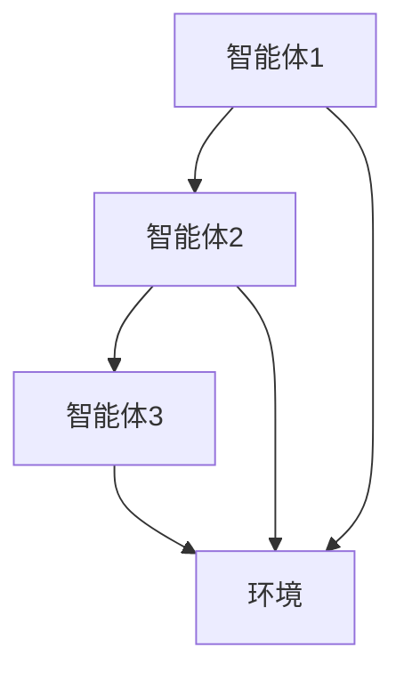
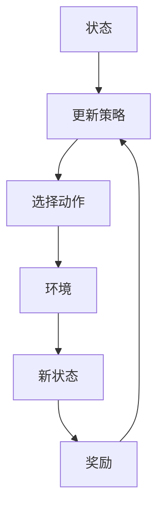
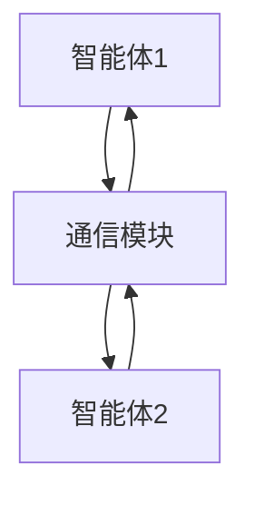
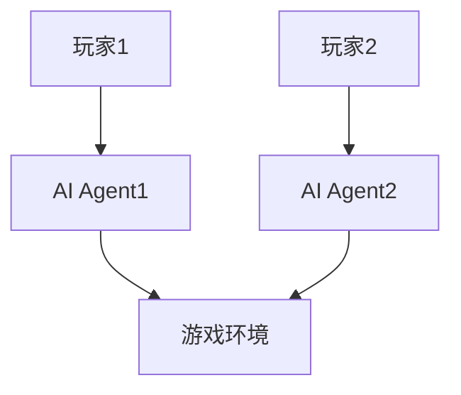
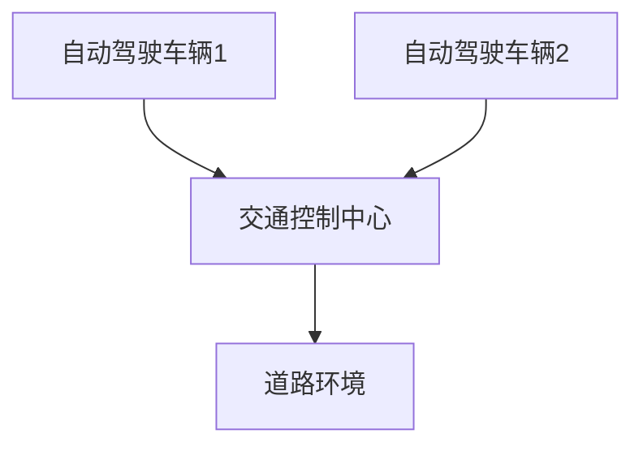
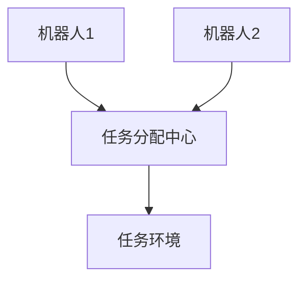
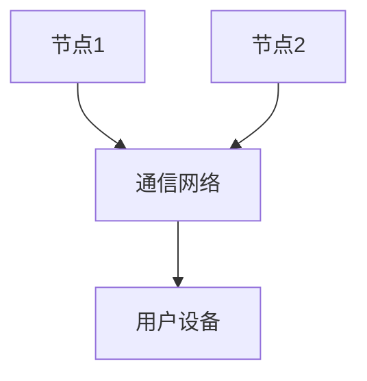

                 

---

# 多智能体强化学习：复杂环境下的AI Agent协作

## 关键词：多智能体强化学习、AI Agent协作、分布式智能系统、强化学习算法、复杂环境建模

## 摘要

多智能体强化学习（Multi-Agent Reinforcement Learning, MARL）是人工智能领域的重要研究方向，旨在研究多个智能体在复杂环境中的协作与竞争问题。本文系统地介绍了多智能体强化学习的核心概念、算法原理、系统架构以及实际应用。首先，从背景与问题背景出发，阐述了多智能体强化学习的基本概念和特点。接着，深入分析了多智能体系统中的协作机制、决策模型和价值函数。然后，重点介绍了几种主流的多智能体强化学习算法，如MAPO、MADDPG和VAN，并通过数学公式和Mermaid图表详细解释了它们的工作原理。随后，从系统分析与架构设计的角度，探讨了问题场景分析、系统功能设计、架构设计以及接口设计。最后，通过项目实战和案例分析，展示了多智能体强化学习在游戏AI、智能交通系统等领域的实际应用，并总结了当前研究的挑战和未来发展方向。本文内容详实，理论与实践相结合，为读者提供了一套全面理解多智能体强化学习的体系。

---

# 第1章: 多智能体强化学习概述

## 1.1 多智能体强化学习的背景与问题背景

### 1.1.1 多智能体系统的基本概念

多智能体系统（Multi-Agent System, MAS）是由多个智能体（Agent）组成的分布式系统，这些智能体能够感知环境、自主决策并进行协作。智能体可以是软件程序、机器人或其他具有自主决策能力的实体。多智能体系统的优点在于能够利用多个智能体的协作来完成单个智能体无法完成的任务。

#### 图1.1 多智能体系统的概念框架（Mermaid图）

### 1.1.2 强化学习的基本原理

强化学习（Reinforcement Learning, RL）是一种通过试错机制让智能体学习如何在环境中采取行动以最大化累积奖励的算法。智能体通过与环境的交互，不断调整策略以提高奖励。强化学习的核心是智能体与环境之间的交互，以及策略的更新过程。

#### 图1.2 强化学习的基本流程（Mermaid图）

### 1.1.3 多智能体强化学习的定义与特点

多智能体强化学习（MARL）是强化学习的扩展，涉及多个智能体在共享或竞争的环境中协作完成任务。与单智能体强化学习相比，MARL具有以下特点：

1. **多个智能体**：多个智能体共同参与任务，可能协作也可能竞争。
2. **复杂环境**：环境更加复杂，智能体之间需要协调行动。
3. **分布式决策**：每个智能体独立决策，但需要考虑其他智能体的动作。
4. **协作与竞争**：智能体之间可以协作完成任务，也可能存在竞争关系。

#### 表1.1 多智能体强化学习的特点对比

| 特性                | 单智能体强化学习            | 多智能体强化学习            |
|---------------------|---------------------------|---------------------------|
| 智能体数量          | 1                         | 多                         |
| 决策独立性          | 完全独立                   | 部分独立或完全独立         |
| 环境复杂性          | 较低                      | 较高                      |
| 协作性              | 无                         | 有                         |

### 1.1.4 多智能体强化学习的应用场景

多智能体强化学习在多个领域有广泛的应用，包括：

1. **游戏AI**：如多人在线游戏中的团队协作。
2. **智能交通系统**：多个自动驾驶车辆的协作与调度。
3. **分布式机器人协作**：多机器人协同完成任务。
4. **网络与通信系统**：网络中的节点协作优化通信效率。

---

## 1.2 多智能体强化学习的核心问题

### 1.2.1 多智能体系统的协作问题

在多智能体系统中，智能体需要通过协作来实现全局目标。协作问题主要体现在以下几个方面：

1. **通信与协调**：智能体之间需要共享信息或协调行动。
2. **同步与一致性**：多个智能体的决策需要同步，避免冲突。
3. **任务分配**：智能体之间需要合理分配任务，发挥各自的优势。

#### 图1.3 多智能体协作的通信机制（Mermaid图）

### 1.2.2 多智能体强化学习中的探索与利用问题

多智能体强化学习中的探索与利用问题比单智能体更为复杂。由于多个智能体的决策相互影响，探索策略需要考虑其他智能体的行为，这增加了问题的难度。

### 1.2.3 复杂环境下的决策优化问题

在复杂环境下，多智能体强化学习需要优化所有智能体的联合决策，以实现全局最优。这涉及到多个智能体的策略优化和协调问题。

---

## 1.3 多智能体强化学习的应用场景

### 1.3.1 游戏AI

多智能体强化学习在游戏AI中的应用非常广泛。例如，在多人在线游戏中，多个AI角色需要协作完成任务，如团队战斗、资源采集等。

#### 图1.4 多智能体协作在游戏AI中的应用（Mermaid图）

### 1.3.2 智能交通系统

在智能交通系统中，多个自动驾驶车辆需要协作完成交通调度，避免碰撞，提高交通效率。

#### 图1.5 多智能体协作在智能交通系统中的应用（Mermaid图）

### 1.3.3 分布式机器人协作

在分布式机器人协作中，多个机器人需要协作完成任务，如物流配送、救援任务等。

#### 图1.6 多智能体协作在分布式机器人协作中的应用（Mermaid图）

### 1.3.4 网络与通信系统

在网络与通信系统中，多个节点需要协作优化通信效率，如数据路由、网络流量控制等。

#### 图1.7 多智能体协作在通信系统中的应用（Mermaid图）

---

## 1.4 本章小结

本章主要介绍了多智能体强化学习的基本概念、核心问题以及应用场景。通过对比单智能体强化学习和多智能体强化学习，明确了多智能体强化学习的特点和优势。同时，通过实际案例分析，展示了多智能体强化学习在游戏AI、智能交通系统、分布式机器人协作和网络与通信系统中的广泛应用。

---

接下来，我将继续完成后续章节的内容，包括第二章的核心概念和第三章的算法原理。如果您对后续内容有任何特定要求或需要调整，请随时告知！

