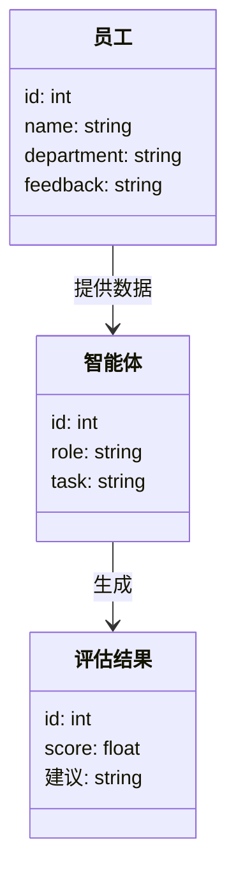
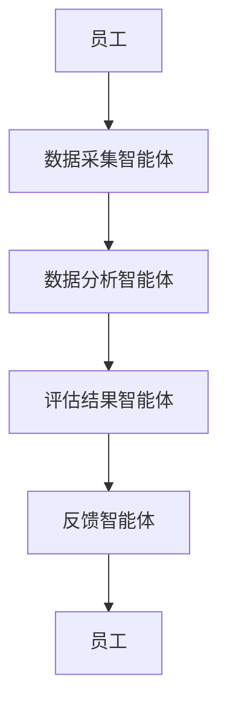
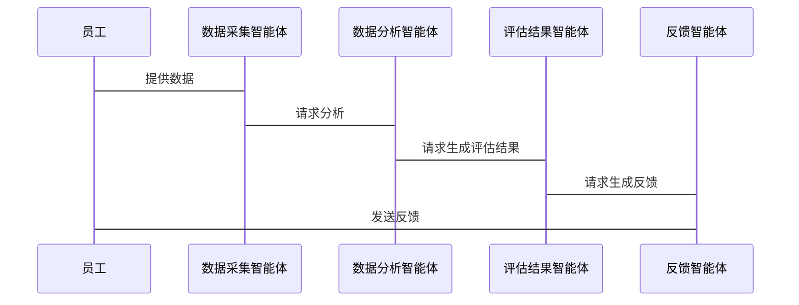

                 


# 多智能体系统在公司员工满意度评估中的应用

## 关键词：多智能体系统，员工满意度，分布式计算，机器学习，数据隐私

## 摘要：  
随着企业规模的不断扩大和员工需求的日益多样化，传统的员工满意度评估方法已逐渐暴露出效率低下、数据孤岛和隐私泄露等问题。多智能体系统（Multi-Agent System, MAS）作为一种分布式、协作式的计算范式，能够有效解决这些问题。本文将详细探讨多智能体系统在员工满意度评估中的应用，从理论基础到实际应用，从算法实现到系统架构，全面分析其优势、挑战和解决方案。通过本文的分析，读者将能够理解多智能体系统如何在员工满意度评估中发挥重要作用，为企业的管理优化和员工幸福感提升提供新的思路。

---

# 第1章 多智能体系统与员工满意度评估的背景介绍

## 1.1 多智能体系统的基本概念

### 1.1.1 多智能体系统的定义与特点
多智能体系统（Multi-Agent System, MAS）是由多个智能体（Agent）组成的分布式计算系统，每个智能体都是具有感知、决策和执行能力的独立实体。MAS的特点包括：
- **分布式性**：智能体分布在网络中，每个智能体仅负责部分任务。
- **协作性**：智能体之间通过通信和协作完成共同目标。
- **自主性**：智能体能够自主决策，无需外部干预。
- **动态性**：系统能够适应环境变化，实时调整策略。

### 1.1.2 多智能体系统的核心要素与组成
多智能体系统由以下几个核心要素组成：
- **智能体**：具有感知、决策和行动能力的独立实体。
- **通信机制**：智能体之间交换信息的通道和协议。
- **协作机制**：智能体之间协同工作的规则和策略。
- **任务分配**：将整体任务分解为多个子任务，并分配给不同的智能体。

### 1.1.3 多智能体系统与传统单智能体系统的区别
| 特性 | 多智能体系统 | 单智能体系统 |
|------|--------------|---------------|
| **计算模式** | 分布式计算 | 集中式计算 |
| **协作性** | 强协作 | 无协作 |
| **扩展性** | 易扩展 | 难扩展 |
| **容错性** | 高 | 低 |

## 1.2 员工满意度评估的定义与重要性

### 1.2.1 员工满意度的定义
员工满意度是员工对其工作环境、薪酬、福利、职业发展等方面的综合感知和评价。它反映了员工对工作的满意程度，是企业优化管理、提高员工幸福感的重要指标。

### 1.2.2 员工满意度评估的意义
员工满意度评估的意义主要体现在以下几个方面：
1. **提升员工幸福感**：通过评估发现问题并及时改进，提升员工的工作满意度和幸福感。
2. **降低员工流失率**：高满意度的员工更可能留在企业，降低招聘和培训成本。
3. **优化企业绩效**：员工满意度高的团队通常表现出更高的工作效率和创造力。
4. **促进企业可持续发展**：员工满意度是企业软实力的重要组成部分，直接影响企业的长期发展。

### 1.2.3 员工满意度评估的常见方法
常见的员工满意度评估方法包括：
1. **问卷调查**：通过标准化问卷收集员工反馈。
2. **一对一访谈**：深入了解员工的个体需求和问题。
3. **数据分析**：基于员工行为数据（如出勤率、绩效数据）进行评估。
4. **第三方评估**：引入专业机构进行评估和分析。

## 1.3 多智能体系统在员工满意度评估中的应用背景

### 1.3.1 传统员工满意度评估的局限性
传统员工满意度评估方法存在以下问题：
1. **效率低下**：问卷调查和访谈需要大量人工投入，耗时耗力。
2. **数据孤岛**：各部门数据分散，难以整合和分析。
3. **隐私泄露风险**：员工数据可能在传输和存储过程中被泄露。
4. **反馈滞后**：传统评估方式通常需要较长时间才能得出结果，难以及时响应员工需求。

### 1.3.2 多智能体系统的优势与适用场景
多智能体系统在员工满意度评估中的优势包括：
1. **分布式计算**：多个智能体可以同时处理不同类型的数据，提高评估效率。
2. **实时反馈**：智能体能够实时采集和分析数据，提供即时反馈。
3. **数据隐私保护**：通过加密和访问控制，确保员工数据的安全性。
4. **动态调整**：智能体能够根据环境变化自动调整评估策略，适应企业需求。

### 1.3.3 多智能体系统在员工满意度评估中的价值
多智能体系统能够通过以下方式提升员工满意度评估的效率和准确性：
1. **自动化数据采集**：智能体可以自动采集员工的工作数据，减少人工干预。
2. **智能分析与推荐**：基于多智能体协作，系统能够提供个性化的员工反馈和改进建议。
3. **跨部门协作**：智能体可以在不同部门之间协作，整合数据，提供全局视角的评估结果。

## 1.4 本章小结
本章介绍了多智能体系统的基本概念、员工满意度评估的定义与重要性，以及多智能体系统在员工满意度评估中的应用背景。通过对比分析，我们看到多智能体系统能够有效解决传统评估方法的局限性，为企业提供更高效、更智能的员工满意度评估方案。

---

# 第2章 多智能体系统的核心原理

## 2.1 多智能体系统的通信机制

### 2.1.1 智能体间通信的定义与特点
智能体间通信是指智能体之间通过某种协议交换信息的过程。其特点包括：
- **实时性**：通信能够实时进行，确保信息的及时性。
- **可靠性**：通信过程中信息不能丢失或损坏。
- **安全性**：通信必须保证数据的机密性和完整性。

### 2.1.2 通信协议的选择与设计
选择合适的通信协议是实现智能体间通信的关键。常见的通信协议包括：
1. **HTTP/HTTPS**：适用于基于Web的通信。
2. **WebSocket**：适用于实时双向通信。
3. **DDS（数据分布服务）**：适用于分布式实时系统。

### 2.1.3 通信中的数据处理与安全性
为了确保通信过程中的数据安全，通常采用以下措施：
1. **数据加密**：使用AES、RSA等加密算法对数据进行加密。
2. **身份认证**：通过OAuth、JWT等机制进行身份认证。
3. **访问控制**：限制智能体的访问权限，确保只有授权智能体能够进行通信。

## 2.2 多智能体系统的协作机制

### 2.2.1 协作的基本原理
协作机制是指多个智能体为了完成共同目标而协同工作的规则和策略。其基本原理包括：
1. **任务分配**：将整体任务分解为多个子任务，并分配给不同的智能体。
2. **协商与决策**：智能体之间通过协商确定各自的职责和行动方案。
3. **协作执行**：智能体按照协商的结果执行任务，并实时同步进展。

### 2.2.2 协作中的任务分配与资源分配
任务分配是协作机制中的关键步骤。常见的任务分配算法包括：
1. **基于角色的分配**：根据智能体的角色和能力分配任务。
2. **基于负载均衡的分配**：根据智能体的负载情况动态分配任务。
3. **基于优先级的分配**：根据任务的优先级进行分配。

### 2.2.3 协作中的冲突解决与协调
在协作过程中，智能体之间可能会出现冲突，例如任务分配不均、资源竞争等。解决冲突的方法包括：
1. **协商与谈判**：智能体通过协商解决冲突。
2. **仲裁机制**：引入仲裁智能体来协调冲突。
3. **优先级调整**：通过调整任务优先级来解决冲突。

## 2.3 多智能体系统的决策机制

### 2.3.1 分布式决策的基本概念
分布式决策是指多个智能体在没有中央控制的情况下，通过协作完成决策的过程。其特点包括：
- **去中心化**：没有单一的决策中心。
- **自主性**：每个智能体能够自主决策。
- **动态性**：决策过程能够根据环境变化实时调整。

### 2.3.2 基于协商的决策过程
基于协商的决策过程包括以下几个步骤：
1. **问题提出**：确定需要解决的问题。
2. **协商阶段**：智能体之间通过通信协商解决方案。
3. **决策制定**：根据协商结果制定最终决策。
4. **执行与反馈**：智能体执行决策并反馈执行结果。

### 2.3.3 基于规则的决策方法
基于规则的决策方法是指通过预定义的规则来指导智能体的决策过程。其优点是简单易懂，但灵活性较低。常见的规则包括：
1. **条件判断规则**：如果满足某个条件，则执行相应的操作。
2. **优先级规则**：根据任务的优先级进行决策。
3. **约束规则**：根据环境中的约束条件进行决策。

## 2.4 本章小结
本章详细介绍了多智能体系统的通信机制、协作机制和决策机制。通信机制确保了智能体之间的信息交换，协作机制保证了任务的高效完成，决策机制实现了智能体的自主决策。这些机制共同构成了多智能体系统的核心原理。

---

# 第3章 多智能体系统在员工满意度评估中的算法原理

## 3.1 多智能体系统算法的数学模型与公式

### 3.1.1 分布式计算的数学模型
分布式计算的数学模型可以表示为：
$$
f(x) = \sum_{i=1}^{n} f_i(x_i)
$$
其中，$f_i(x_i)$表示第$i$个智能体的任务函数，$x_i$表示该智能体的输入数据。

### 3.1.2 分布式计算的公式推导
假设我们有$n$个智能体，每个智能体的任务函数为$f_i(x_i)$，则整体任务函数$f(x)$可以表示为：
$$
f(x) = f_1(x_1) + f_2(x_2) + \cdots + f_n(x_n)
$$
通过将任务分解为多个子任务，并分别由不同的智能体完成，可以实现高效计算。

### 3.1.3 协商算法的数学模型
协商算法的数学模型可以表示为：
$$
\text{协商结果} = \arg\max_{x} \sum_{i=1}^{n} u_i(x)
$$
其中，$u_i(x)$表示第$i$个智能体对决策$x$的效用函数。

---

## 3.2 多智能体系统在员工满意度评估中的算法实现

### 3.2.1 分布式计算的算法实现
以下是一个简单的分布式计算的Python代码示例：

```python
import multiprocessing

def compute_task(x):
    return x * x

if __name__ == "__main__":
    with multiprocessing.Pool() as pool:
        results = pool.map(compute_task, range(10))
        print(results)
```

### 3.2.2 协商算法的Python代码实现
以下是一个基于协商的决策算法的Python代码示例：

```python
class Agent:
    def __init__(self, id):
        self.id = id
        self.preference = None

    def set_preference(self, preference):
        self.preference = preference

    def get_preference(self):
        return self.preference

def协商算法(agents, target):
    for agent in agents:
        if agent.get_preference() != target:
            return False
    return True

# 示例用法
agent1 = Agent(1)
agent2 = Agent(2)
agent3 = Agent(3)

agent1.set_preference("A")
agent2.set_preference("A")
agent3.set_preference("A")

print(协商算法([agent1, agent2, agent3], "A"))  # 输出：True
```

### 3.2.3 任务分配算法的数学模型
任务分配算法的数学模型可以表示为：
$$
\text{任务分配结果} = \arg\min_{x} \sum_{i=1}^{n} c_i(x)
$$
其中，$c_i(x)$表示第$i$个智能体对任务分配结果$x$的代价函数。

---

## 3.3 本章小结
本章详细介绍了多智能体系统在员工满意度评估中的算法原理，包括分布式计算的数学模型、协商算法的实现以及任务分配算法的数学模型。通过这些算法，我们可以实现高效的员工满意度评估。

---

# 第4章 多智能体系统在员工满意度评估中的系统分析与架构设计

## 4.1 系统分析

### 4.1.1 项目背景
本项目旨在通过多智能体系统实现高效的员工满意度评估，解决传统评估方法的效率低下、数据孤岛和隐私泄露等问题。

### 4.1.2 领域模型
以下是一个员工满意度评估的领域模型：



### 4.1.3 系统架构图
以下是一个多智能体系统在员工满意度评估中的系统架构图：



## 4.2 系统架构设计

### 4.2.1 系统功能设计
系统功能设计包括以下模块：
1. **数据采集模块**：负责采集员工的数据，如反馈、绩效数据等。
2. **数据分析模块**：对采集的数据进行分析，生成评估结果。
3. **反馈模块**：根据评估结果生成改进建议，并反馈给员工和管理者。

### 4.2.2 系统接口设计
系统接口设计包括以下接口：
1. **数据采集接口**：用于智能体采集员工数据。
2. **数据分析接口**：用于智能体分析数据并生成评估结果。
3. **反馈接口**：用于智能体生成反馈并发送给员工。

### 4.2.3 系统交互流程
以下是一个系统交互流程图：



## 4.3 本章小结
本章通过系统分析和架构设计，展示了多智能体系统在员工满意度评估中的具体实现。系统功能设计和架构图的绘制为后续的开发和优化提供了指导。

---

# 第5章 多智能体系统在员工满意度评估中的项目实战

## 5.1 环境安装与配置

### 5.1.1 安装Python
需要安装Python 3.8及以上版本，可以通过以下命令安装：
```bash
sudo apt-get install python3.8
```

### 5.1.2 安装多智能体框架
可以选择使用`multiagent`框架，安装命令如下：
```bash
pip install multiagent
```

## 5.2 核心代码实现

### 5.2.1 数据采集智能体的实现
以下是一个数据采集智能体的Python代码示例：

```python
class DataCollector:
    def __init__(self, agent_id):
        self.agent_id = agent_id
        self.data = {}

    def collect_data(self, employees):
        for employee in employees:
            self.data[employee.id] = {
                'name': employee.name,
                'department': employee.department,
                'feedback': employee.feedback
            }
        return self.data
```

### 5.2.2 数据分析智能体的实现
以下是一个数据分析智能体的Python代码示例：

```python
class DataAnalyzer:
    def __init__(self, agent_id):
        self.agent_id = agent_id
        self.data = {}

    def analyze_data(self, data):
        scores = {}
        for employee_id, info in data.items():
            score = self.calculate_score(info)
            scores[employee_id] = score
        return scores

    def calculate_score(self, info):
        # 示例计算方法
        return 0.8 * info['feedback_score'] + 0.2 * info['department_score']
```

### 5.2.3 评估结果智能体的实现
以下是一个评估结果智能体的Python代码示例：

```python
class Assessor:
    def __init__(self, agent_id):
        self.agent_id = agent_id
        self.scores = {}

    def generate_recommendations(self, scores):
        recommendations = {}
        for employee_id, score in scores.items():
            if score < 0.7:
                recommendations[employee_id] = '需要改进'
            elif 0.7 <= score < 0.9:
                recommendations[employee_id] = '良好'
            else:
                recommendations[employee_id] = '优秀'
        return recommendations
```

## 5.3 代码应用解读与分析

### 5.3.1 数据采集智能体的解读
数据采集智能体负责从员工中采集数据，包括员工的基本信息和反馈信息。通过`collect_data`方法，可以将员工数据存储在`self.data`中，供后续分析使用。

### 5.3.2 数据分析智能体的解读
数据分析智能体负责对采集到的数据进行分析，生成员工的满意度评分。`analyze_data`方法调用`calculate_score`方法，根据反馈分数和部门分数计算员工的总评分。

### 5.3.3 评估结果智能体的解读
评估结果智能体根据员工的评分生成改进建议。评分低于0.7的员工需要改进，评分在0.7到0.9之间的员工表现良好，评分高于0.9的员工表现优秀。

## 5.4 实际案例分析与详细讲解
以下是一个实际案例的详细讲解：
1. **数据采集**：数据采集智能体从员工中采集数据。
2. **数据分析**：数据分析智能体对数据进行分析，生成员工的评分。
3. **评估结果**：评估结果智能体根据评分生成改进建议，并反馈给员工。

## 5.5 本章小结
本章通过实际案例的分析和代码实现，展示了多智能体系统在员工满意度评估中的具体应用。通过项目的实战，读者可以更好地理解多智能体系统的优势和实现过程。

---

# 第6章 多智能体系统在员工满意度评估中的最佳实践

## 6.1 小结
通过本文的分析，我们看到多智能体系统在员工满意度评估中的应用具有重要意义。它能够通过分布式计算和智能协作，提高评估效率，保护数据隐私，为企业的管理优化和员工幸福感提升提供新的思路。

## 6.2 注意事项
在实际应用中，需要注意以下几点：
1. **数据隐私保护**：确保员工数据的安全性和隐私性。
2. **智能体协作效率**：优化智能体之间的协作机制，提高评估效率。
3. **系统可扩展性**：确保系统能够适应企业的扩展需求。

## 6.3 拓展阅读
推荐以下书籍和资源，供读者进一步学习：
1. 《Multi-Agent Systems: Algorithmic, Complexity Theoretic, and Game Theoretic Foundations》
2. 《Multi-Agent Machine Learning: A Knowledge-Based Approach》
3. 《Distributed Computing and Networking》

---

# 作者：AI天才研究院/AI Genius Institute & 禅与计算机程序设计艺术 /Zen And The Art of Computer Programming

---

以上是《多智能体系统在公司员工满意度评估中的应用》的技术博客文章的完整目录大纲和文章内容，希望对您有所帮助！

