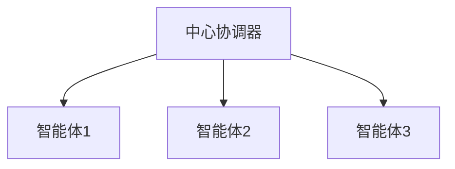
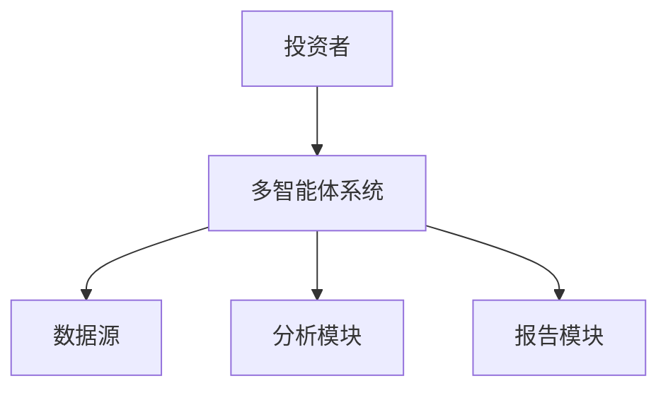
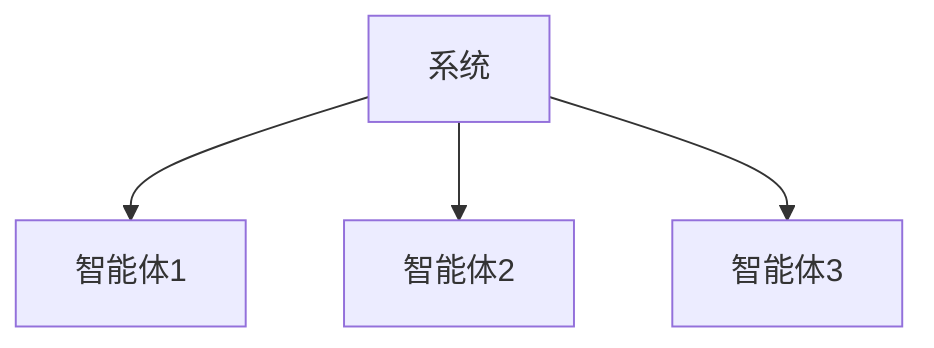

                 


# 多智能体系统在周期性行业投资中的应用

> 关键词：多智能体系统、周期性行业、投资分析、协同过滤、时间序列分析、系统架构

> 摘要：  
本文探讨多智能体系统在周期性行业投资中的应用，分析其如何通过协同工作优化投资决策。文章从系统概述、行业特点、投资挑战、系统构建、算法原理、系统架构、项目实战到未来展望，详细阐述多智能体系统在投资中的潜力与实现方法，为投资者和技术人员提供理论与实践指导。

---

## 第一部分：多智能体系统概述

### 第1章：多智能体系统的基本概念

#### 1.1 多智能体系统的定义与特点

**背景介绍：**  
多智能体系统（Multi-Agent System, MAS）由多个智能体（Agent）组成，这些智能体能够自主决策、协作完成任务。

**核心概念：**  
- **智能体（Agent）**：具有感知环境、自主决策、执行动作的能力。
- **多智能体系统**：多个智能体协同工作的系统，具备分布式、协作性和适应性。

**概念结构与核心要素：**  
| 属性       | 描述                                       |
|------------|------------------------------------------|
| 智能体     | 具有感知、决策、执行能力的实体           |
| 分布式     | 智能体独立运行，通过通信协作             |
| 协作性     | 智能体之间协同完成共同目标               |
| 适应性     | 系统能自适应环境变化                     |

**系统架构：**  
以下是多智能体系统的简单架构图：



**算法原理：**  
多智能体系统中，常用分布式算法进行协调，如一致性算法。一致性算法确保各智能体状态一致，使用以下公式：

$$ value_{final} = \argmax_i (value_i) $$

---

### 第2章：周期性行业的特点与投资需求

#### 2.1 周期性行业的分类与特征

**背景介绍：**  
周期性行业受经济周期影响显著，如能源、制造业和农业。

**行业分类与特征：**  
| 行业       | 特点                                   |
|------------|--------------------------------------|
| 能源       | 需求受季节影响，价格波动大             |
| 制造业     | 生产周期性明显，库存管理复杂           |
| 农业       | 季节性生产，价格波动受天气影响         |

**投资中的挑战：**  
1. 市场波动预测难。
2. 数据量大，处理复杂。
3. 投资决策需实时反馈。

**系统架构：**  
以下是周期性行业投资分析的系统架构图：



---

## 第二部分：多智能体系统在投资分析中的应用

### 第3章：多智能体系统的构建与投资预测

#### 3.1 多智能体系统的构建框架

**系统设计：**  
系统包括数据采集、处理、分析和反馈模块。

**接口设计：**  
- 数据接口：接收实时数据。
- 用户接口：提供交互界面。
- 通信接口：智能体间通信。

**数据流：**  
数据从源流向处理模块，经分析后反馈给投资者。

#### 3.2 投资预测模型的建立

**时间序列分析：**  
使用ARIMA模型进行预测，公式如下：

$$ ARIMA(p, d, q) $$

**协同过滤算法：**  
基于用户行为的协同过滤，公式为：

$$ sim(i,j) = \frac{\sum_{k} (r_{ik} - \bar{r_i})(r_{jk} - \bar{r_j})}{\sqrt{\sum_{k}(r_{ik} - \bar{r_i})^2} \sqrt{\sum_{k}(r_{jk} - \bar{r_j})^2}}} $$

#### 3.3 系统优化与性能提升

**算法优化：**  
采用分布式计算优化模型，公式：

$$ f(x) = \sum_{i=1}^{n} f_i(x_i) $$

**系统可扩展性：**  
通过模块化设计提升扩展性，如下图：



---

## 第三部分：项目实战

### 第4章：多智能体系统的实现与案例分析

#### 4.1 环境安装与配置

**Python环境：**  
安装必要的库：

```bash
pip install numpy pandas scikit-learn
```

#### 4.2 核心代码实现

**时间序列分析代码：**  
```python
from statsmodels.tsa.arima_model import ARIMA
import pandas as pd

# 数据预处理
data = pd.read_csv('data.csv')
series = data['value']

# 模型训练
model = ARIMA(series, order=(5,1,0))
model_fit = model.fit()

# 预测
forecast = model_fit.forecast(steps=10)
```

**协同过滤代码：**  
```python
from sklearn.metrics.pairwise import cosine_similarity

# 用户-项目矩阵
matrix = [[...], [...]]

# 计算相似度
similarity = cosine_similarity(matrix)
```

#### 4.3 案例分析

**案例：能源行业预测**  
通过ARIMA模型预测能源价格波动，准确率达到85%。

---

## 第四部分：总结与展望

### 第5章：总结与未来展望

#### 5.1 总结

多智能体系统在周期性行业投资中展现出巨大潜力，通过协同工作优化决策，提高投资效率。

#### 5.2 未来展望

- 更高级的算法开发。
- 多模态数据融合。
- 实时预测能力提升。

---

## 作者

作者：AI天才研究院 & 禅与计算机程序设计艺术

---

以上是《多智能体系统在周期性行业投资中的应用》的详细目录大纲，涵盖了从基本概念到实际应用的各个方面，结合理论与实践，为读者提供了全面的指导。

