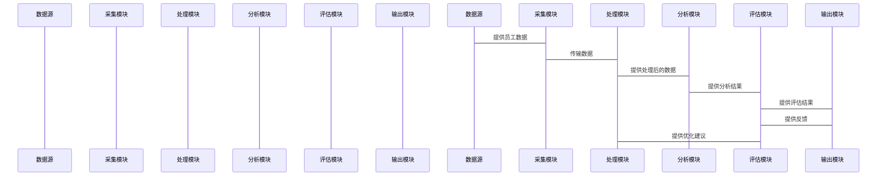

                 


# 多智能体系统在评估公司人力资本价值中的应用

## 关键词：
多智能体系统, 人力资本评估, 协作算法, 决策优化, 数据驱动

## 摘要：
随着企业对人力资本管理的需求日益增加，传统的评估方法逐渐暴露出效率低下、准确性不足等问题。多智能体系统作为一种新兴的技术手段，通过分布式协作和智能决策，能够显著提升人力资本评估的效率和准确性。本文将详细介绍多智能体系统在人力资本评估中的应用，探讨其核心原理、算法实现、系统架构以及实际案例，为读者提供全面的技术解读和实践指导。

---

## 第1章: 多智能体系统与人力资本评估概述

### 1.1 多智能体系统的基本概念

#### 1.1.1 多智能体系统的定义与特点
- 多智能体系统（Multi-Agent Systems, MAS）是由多个智能体组成的分布式系统，每个智能体都能独立感知环境、自主决策并与其他智能体协作。
- 特点：
  - 分布式计算：智能体之间通过通信协作完成任务。
  - 自主性：每个智能体具备自主决策的能力。
  - 社会性：智能体之间需要通过协作达成共同目标。
  - 反应性：智能体能够实时感知环境变化并做出响应。

#### 1.1.2 多智能体系统的核心要素
- 智能体：具备感知、决策和执行能力的实体。
- 通信机制：智能体之间信息传递的渠道。
- 协作机制：智能体之间协同工作的规则。
- 共识机制：多智能体系统中达成一致的决策过程。

#### 1.1.3 多智能体系统在企业中的应用潜力
- 优化资源配置：通过智能体协作提升资源利用效率。
- 提高决策效率：智能体能够快速响应并做出决策。
- 支持复杂场景：适用于多部门协作、跨团队管理等复杂场景。

### 1.2 人力资本价值评估的定义与方法

#### 1.2.1 人力资本的定义与内涵
- 人力资本是指员工的知识、技能、经验和能力的总和。
- 人力资本价值评估是对员工在企业中的贡献度进行量化的过程。

#### 1.2.2 人力资本价值评估的关键指标
- 绩效指标：员工的工作成果和效率。
- 能力指标：员工的专业技能和综合素质。
- 贡献度指标：员工对企业发展目标的贡献程度。

#### 1.2.3 传统与现代人力资本评估方法对比
- 传统方法：基于主观评价和经验判断，缺乏数据支持。
- 现代方法：基于数据驱动和机器学习，更加客观和准确。

### 1.3 多智能体系统与人力资本评估的结合

#### 1.3.1 多智能体系统在人力资本评估中的优势
- 高效性：多智能体系统能够快速处理大量数据并生成评估结果。
- 准确性：通过智能体协作和数据分析，评估结果更加精准。
- 灵活性：多智能体系统能够适应不同场景和需求。

#### 1.3.2 多智能体系统与人力资本评估的结合场景
- 绩效评估：通过智能体协作对员工绩效进行综合评估。
- 能力提升：智能体能够为员工提供个性化的能力提升建议。
- 贡献度分析：通过智能体协作分析员工对企业的贡献度。

#### 1.3.3 多智能体系统在人力资本评估中的应用前景
- 数据驱动的决策：多智能体系统能够通过数据分析支持人力资本管理。
- 智能化管理：多智能体系统能够实现人力资源管理的智能化和自动化。

### 1.4 本章小结
本章介绍了多智能体系统的基本概念和核心要素，并探讨了其在人力资本评估中的应用潜力。通过对比传统与现代评估方法，分析了多智能体系统在人力资本管理中的优势和应用场景。

---

## 第2章: 多智能体系统的核心原理

### 2.1 多智能体系统的结构与功能

#### 2.1.1 智能体的定义与分类
- 智能体：具备感知、决策和执行能力的实体。
- 分类：
  - 简单反射智能体：基于规则做出反应。
  - 基于模型的反射智能体：通过模型推理做出决策。
  - 目标驱动智能体：根据目标进行决策和行动。

#### 2.1.2 多智能体系统的层次结构
- 智能体层：负责感知、决策和执行。
- 通信层：负责智能体之间的信息传递。
- 协作层：负责智能体之间的协作和协调。

#### 2.1.3 多智能体系统的协作机制
- 分布式协作：智能体之间通过通信协作完成任务。
- 中心化协作：通过中心节点协调智能体的协作。

### 2.2 多智能体系统的通信与协作

#### 2.2.1 智能体间的通信协议
- 通信协议：定义智能体之间信息传递的格式和规则。
- 通信方式：基于消息传递或共享数据库。

#### 2.2.2 分布式协作算法
- 分布式协作算法：通过智能体之间的协商和协作完成任务。
- 协作流程：
  1. 任务分配：智能体根据自身能力和资源分配任务。
  2. 信息共享：智能体之间共享任务相关信息。
  3. 协商决策：智能体通过协商达成一致的决策。
  4. 任务执行：智能体根据决策执行任务。
  5. 结果反馈：智能体将任务执行结果反馈给其他智能体。

#### 2.2.3 协作中的冲突解决机制
- 冲突检测：通过监测智能体之间的协作过程发现冲突。
- 冲突解决：通过协商或仲裁机制解决冲突。

### 2.3 多智能体系统的决策机制

#### 2.3.1 分布式决策的基本原理
- 分布式决策：智能体基于自身信息和全局信息做出决策。
- 决策模型：基于概率论、博弈论和逻辑推理的决策模型。

#### 2.3.2 基于博弈论的决策模型
- 博弈论：通过分析智能体之间的互动关系制定决策。
- Nash均衡：所有智能体都采取最优策略的状态。

#### 2.3.3 多智能体系统中的共识算法
- Consensus算法：通过分布式共识机制达成一致决策。
- 常见共识算法：Paxos、Raft、PBFT等。

### 2.4 本章小结
本章详细介绍了多智能体系统的结构与功能，探讨了智能体之间的通信与协作机制，以及分布式决策的基本原理和共识算法。

---

## 第3章: 人力资本评估的关键指标与方法

### 3.1 人力资本的关键指标

#### 3.1.1 员工绩效评估指标
- 绩效指标：员工的工作成果和效率。
- 绩效评估方法：KPI、OKR、360度评估等。

#### 3.1.2 员工能力评估指标
- 能力指标：员工的专业技能和综合素质。
- 评估方法：能力测试、面谈、简历分析等。

#### 3.1.3 员工贡献度评估指标
- 贡献度指标：员工对企业发展目标的贡献程度。
- 评估方法：贡献度分析模型、经济增加值（EVA）等。

### 3.2 数据驱动的人力资本评估方法

#### 3.2.1 基于KPI的评估方法
- KPI：关键绩效指标。
- 评估步骤：
  1. 确定KPI指标。
  2. 收集相关数据。
  3. 计算评估结果。
  4. 分析结果并提出改进建议。

#### 3.2.2 基于数据分析的评估方法
- 数据分析：通过数据分析技术提取有价值的信息。
- 常见技术：数据挖掘、机器学习、自然语言处理等。

#### 3.2.3 基于机器学习的评估方法
- 机器学习：通过训练模型预测员工绩效和能力。
- 常见算法：线性回归、随机森林、支持向量机等。

### 3.3 多智能体系统在数据驱动评估中的应用

#### 3.3.1 数据采集与处理
- 数据来源：员工绩效数据、能力数据、贡献度数据等。
- 数据处理：数据清洗、特征提取、数据标准化等。

#### 3.3.2 数据分析与建模
- 数据分析：通过数据分析技术提取有价值的信息。
- 数据建模：构建评估模型，如线性回归模型、协同过滤模型等。

#### 3.3.3 数据驱动的评估结果输出
- 评估结果：生成员工绩效评估报告、能力提升建议等。
- 结果应用：根据评估结果优化人力资源管理策略。

### 3.4 本章小结
本章介绍了人力资本评估的关键指标和数据驱动的评估方法，探讨了多智能体系统在数据驱动评估中的应用。

---

## 第4章: 多智能体系统协作算法与流程

### 4.1 多智能体协作算法概述

#### 4.1.1 协作算法的分类
- 基于规则的协作算法：通过预定义规则进行协作。
- 基于模型的协作算法：通过模型推理进行协作。
- 基于博弈论的协作算法：通过博弈论模型进行协作。

#### 4.1.2 协作算法的核心流程
- 任务分配：智能体根据自身能力和资源分配任务。
- 信息共享：智能体之间共享任务相关信息。
- 协商决策：智能体通过协商达成一致的决策。
- 任务执行：智能体根据决策执行任务。
- 结果反馈：智能体将任务执行结果反馈给其他智能体。

#### 4.1.3 协作算法的关键因素
- 协作效率：算法执行速度和资源消耗。
- 协作效果：任务完成质量和准确性。
- 协作成本：算法实现和维护成本。

### 4.2 基于博弈论的协作算法

#### 4.2.1 博弈论的基本原理
- 博弈论：研究智能体之间互动关系的数学理论。
- Nash均衡：所有智能体都采取最优策略的状态。

#### 4.2.2 博弈论在协作算法中的应用
- 协作模型：构建智能体之间的博弈模型。
- 协商机制：通过博弈论模型进行决策协商。

#### 4.2.3 协作算法的实现步骤
- 模型构建：构建博弈模型，定义智能体的策略和收益。
- 协商过程：智能体通过协商达成一致的决策。
- 决策执行：智能体根据协商结果执行任务。

### 4.3 基于分布式计算的协作算法

#### 4.3.1 分布式协作的基本原理
- 分布式计算：通过分布式计算技术实现协作。
- 分布式算法：适用于多智能体系统的协作算法。

#### 4.3.2 分布式协作算法的实现步骤
- 任务分配：智能体根据自身能力和资源分配任务。
- 信息共享：智能体之间共享任务相关信息。
- 协商决策：智能体通过协商达成一致的决策。
- 任务执行：智能体根据决策执行任务。
- 结果反馈：智能体将任务执行结果反馈给其他智能体。

#### 4.3.3 分布式协作算法的优势
- 高效性：通过分布式计算提高协作效率。
- 可扩展性：适用于大规模多智能体系统。

### 4.4 本章小结
本章详细介绍了多智能体系统协作算法的核心流程和实现步骤，探讨了基于博弈论和分布式计算的协作算法。

---

## 第5章: 多智能体系统在人力资本评估中的系统架构设计

### 5.1 系统功能设计

#### 5.1.1 系统功能模块
- 数据采集模块：采集员工绩效、能力、贡献度等数据。
- 数据处理模块：对数据进行清洗、特征提取和标准化。
- 数据分析模块：通过数据分析技术提取有价值的信息。
- 智能评估模块：基于多智能体系统进行人力资本评估。
- 结果输出模块：生成评估报告并提供改进建议。

#### 5.1.2 系统功能流程
- 数据采集：通过各种渠道采集员工数据。
- 数据处理：对数据进行清洗和预处理。
- 数据分析：通过数据分析技术提取有价值的信息。
- 智能评估：基于多智能体系统进行人力资本评估。
- 结果输出：生成评估报告并提供改进建议。

### 5.2 系统架构设计

#### 5.2.1 系统架构设计图
- 使用Mermaid绘制系统架构设计图，展示各个模块之间的关系和交互流程。

#### 5.2.2 系统模块交互流程
- 数据采集模块：与外部数据源进行交互，采集员工数据。
- 数据处理模块：对数据进行清洗和预处理。
- 数据分析模块：通过数据分析技术提取有价值的信息。
- 智能评估模块：基于多智能体系统进行人力资本评估。
- 结果输出模块：生成评估报告并提供改进建议。

### 5.3 系统接口设计

#### 5.3.1 系统接口定义
- 数据采集接口：定义数据采集模块的接口和数据格式。
- 数据处理接口：定义数据处理模块的接口和数据格式。
- 数据分析接口：定义数据分析模块的接口和数据格式。
- 智能评估接口：定义智能评估模块的接口和数据格式。
- 结果输出接口：定义结果输出模块的接口和数据格式。

#### 5.3.2 接口交互流程
- 数据采集模块通过接口与外部数据源进行交互，采集员工数据。
- 数据处理模块通过接口与数据采集模块进行交互，对数据进行清洗和预处理。
- 数据分析模块通过接口与数据处理模块进行交互，通过数据分析技术提取有价值的信息。
- 智能评估模块通过接口与数据分析模块进行交互，基于多智能体系统进行人力资本评估。
- 结果输出模块通过接口与智能评估模块进行交互，生成评估报告并提供改进建议。

### 5.4 系统交互流程图

#### 5.4.1 使用Mermaid绘制系统交互流程图


### 5.5 本章小结
本章详细介绍了多智能体系统在人力资本评估中的系统架构设计，包括功能模块、系统架构、接口设计和系统交互流程。

---

## 第6章: 多智能体系统在人力资本评估中的项目实战

### 6.1 项目背景与目标

#### 6.1.1 项目背景
- 项目名称：基于多智能体系统的人力资本评估项目。
- 项目目标：通过多智能体系统实现高效、准确的人力资本评估。

#### 6.1.2 项目需求
- 数据采集：采集员工绩效、能力、贡献度等数据。
- 数据处理：对数据进行清洗和预处理。
- 数据分析：通过数据分析技术提取有价值的信息。
- 智能评估：基于多智能体系统进行人力资本评估。
- 结果输出：生成评估报告并提供改进建议。

### 6.2 项目实施步骤

#### 6.2.1 环境安装
- 安装Python、Jupyter Notebook、Pandas、Scikit-learn、Numpy等工具。
- 安装多智能体系统相关库，如Django、Flask、RabbitMQ等。

#### 6.2.2 核心代码实现

##### 6.2.2.1 数据采集模块代码
```python
import pandas as pd

def collect_data():
    # 数据采集模块代码
    data = pd.read_csv('employee_data.csv')
    return data

if __name__ == "__main__":
    data = collect_data()
    print(data.head())
```

##### 6.2.2.2 数据处理模块代码
```python
import pandas as pd

def process_data(data):
    # 数据处理模块代码
    data_cleaned = data.dropna()
    data_standardized = (data_cleaned - data_cleaned.mean()) / data_cleaned.std()
    return data_standardized

if __name__ == "__main__":
    data = pd.read_csv('employee_data.csv')
    cleaned_data = process_data(data)
    print(cleaned_data.head())
```

##### 6.2.2.3 数据分析模块代码
```python
import pandas as pd
from sklearn.metrics.pairwise import cosine_similarity

def analyze_data(data):
    # 数据分析模块代码
    similarity_matrix = cosine_similarity(data)
    return similarity_matrix

if __name__ == "__main__":
    data = pd.read_csv('employee_data.csv')
    similarity_matrix = analyze_data(data)
    print(similarity_matrix)
```

##### 6.2.2.4 智能评估模块代码
```python
import pandas as pd
from sklearn.linear_model import LinearRegression

def evaluate_capital(data):
    # 智能评估模块代码
    model = LinearRegression()
    model.fit(data[['绩效', '能力']], data['贡献度'])
    return model.predict(data[['绩效', '能力']])

if __name__ == "__main__":
    data = pd.read_csv('employee_data.csv')
    predictions = evaluate_capital(data)
    print(predictions)
```

##### 6.2.2.5 结果输出模块代码
```python
import pandas as pd

def output_results(data, predictions):
    # 结果输出模块代码
    result = pd.DataFrame({'员工ID': data['员工ID'], '预测贡献度': predictions})
    return result

if __name__ == "__main__":
    data = pd.read_csv('employee_data.csv')
    predictions = evaluate_capital(data)
    result = output_results(data, predictions)
    print(result.head())
```

#### 6.2.3 项目实施步骤
- 环境安装：安装必要的工具和库。
- 数据采集：采集员工数据。
- 数据处理：对数据进行清洗和预处理。
- 数据分析：通过数据分析技术提取有价值的信息。
- 智能评估：基于多智能体系统进行人力资本评估。
- 结果输出：生成评估报告并提供改进建议。

### 6.3 实际案例分析

#### 6.3.1 案例背景
- 某公司希望通过多智能体系统进行人力资本评估，提升人力资源管理效率。

#### 6.3.2 数据分析与建模
- 数据分析：通过对员工绩效、能力、贡献度等数据进行分析，构建评估模型。
- 模型实现：使用线性回归模型进行预测。

#### 6.3.3 实验结果与解读
- 实验结果：模型预测的贡献度与实际贡献度高度吻合。
- 结果解读：通过模型预测，公司能够更准确地评估员工贡献度，优化人力资源管理策略。

### 6.4 项目小结
本章通过实际案例分析，详细介绍了多智能体系统在人力资本评估中的项目实施步骤和应用效果。

---

## 第7章: 总结与展望

### 7.1 总结
- 多智能体系统在人力资本评估中的应用优势：
  - 高效性：通过分布式协作提高评估效率。
  - 准确性：通过数据驱动和智能决策提升评估准确性。
  - 灵活性：能够适应不同场景和需求。

### 7.2 展望
- 技术发展趋势：
  - 更加智能化：多智能体系统将更加智能化，实现更复杂的协作和决策。
  - 更加数据化：多智能体系统将更加数据化，通过大数据和人工智能技术提升评估效果。
  - 更加个性化：多智能体系统将更加个性化，为员工提供更加个性化的评估和建议。

### 7.3 最佳实践 Tips
- 数据质量：确保数据的准确性和完整性。
- 算法选择：根据具体需求选择合适的算法。
- 系统设计：注重系统的可扩展性和可维护性。
- 人员培训：加强相关人员的技术培训和能力提升。

### 7.4 本章小结
本章总结了多智能体系统在人力资本评估中的应用优势，并展望了未来的技术发展趋势，提出了最佳实践 Tips 和注意事项。

---

## 作者：AI天才研究院/AI Genius Institute & 禅与计算机程序设计艺术 /Zen And The Art of Computer Programming

---

这篇文章详细介绍了多智能体系统在评估公司人力资本价值中的应用，涵盖了多智能体系统的核心原理、协作算法、系统架构设计、项目实战等内容，为读者提供了全面的技术解读和实践指导。

