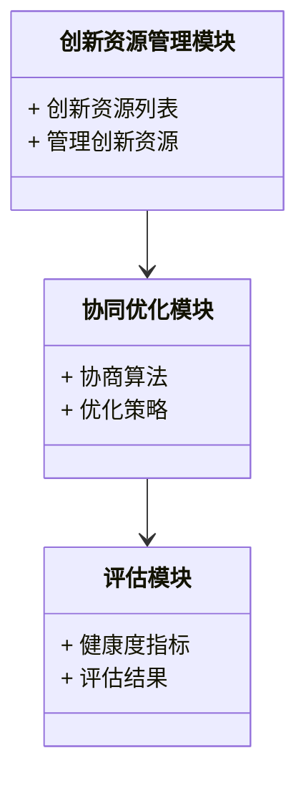
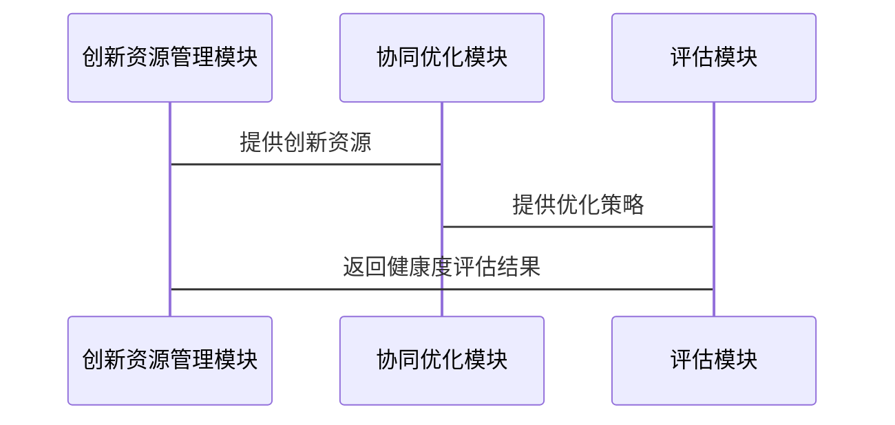

                 


# 多智能体系统在评估公司创新生态系统健康度中的应用

## 关键词
多智能体系统, 创新生态系统, 健康度评估, 系统架构, 算法原理, 项目实战

## 摘要
本文详细探讨了多智能体系统（MAS）在评估公司创新生态系统健康度中的应用。首先，我们介绍了创新生态系统及其健康度评估的重要性，接着分析了MAS的基本理论和协同机制。然后，我们提出了一个基于MAS的创新生态系统健康度评估模型，并详细讲解了该模型的实现算法。通过实际案例分析，展示了如何将MAS应用于实际项目中，最后总结了MAS在创新生态系统健康度评估中的优势及未来研究方向。

---

# 第一部分：多智能体系统与创新生态系统健康度评估背景

## 第1章：多智能体系统概述

### 1.1 多智能体系统的基本概念
#### 1.1.1 多智能体系统的定义
多智能体系统（Multi-Agent Systems, MAS）是由多个智能体（Agent）组成的分布式系统，这些智能体能够通过协作完成复杂任务。

#### 1.1.2 多智能体系统的特征
- **自主性**：每个智能体能够独立决策。
- **反应性**：能够感知环境并做出实时反应。
- **协同性**：多个智能体之间能够协同工作。

#### 1.1.3 多智能体系统的分类
- **基于任务的MAS**：根据任务需求动态分配智能体。
- **基于角色的MAS**：智能体根据角色分工协作。

### 1.2 创新生态系统及其健康度评估的重要性
#### 1.2.1 创新生态系统的定义
创新生态系统是指由企业内部的创新团队、外部合作伙伴、技术平台等组成的复杂系统。

#### 1.2.2 创新生态系统健康度的内涵
健康度评估包括创新资源的合理分配、团队协作效率、创新成果的产出等多个维度。

#### 1.2.3 评估创新生态系统健康度的意义
通过评估健康度，企业可以识别问题并优化创新过程，提升整体创新能力。

## 第2章：多智能体系统在企业中的应用背景

### 2.1 企业创新生态系统中的挑战
#### 2.1.1 创新资源分配的复杂性
资源分配不均可能导致某些团队效率低下。

#### 2.1.2 创新过程中的协同问题
团队间协作困难会影响创新速度。

#### 2.1.3 创新生态系统动态变化的特性
外部环境变化可能导致创新策略调整。

### 2.2 多智能体系统在企业创新管理中的优势
#### 2.2.1 多智能体系统的分布式计算能力
能够处理复杂的任务分配和资源调度。

#### 2.2.2 多智能体系统的自适应能力
智能体能够根据环境变化自动调整策略。

#### 2.2.3 多智能体系统的协同优化能力
通过协同优化，提升整体创新效率。

---

# 第二部分：多智能体系统的理论基础

## 第3章：多智能体系统的理论框架

### 3.1 多智能体系统的基本理论
#### 3.1.1 代理与环境的交互
智能体通过感知环境并采取行动。

#### 3.1.2 多智能体系统的体系结构
- **反应式架构**：基于当前感知做出反应。
- **认知式架构**：具有推理和规划能力。

#### 3.1.3 多智能体系统的通信机制
智能体之间通过消息传递进行通信。

### 3.2 多智能体系统的协同与协调
#### 3.2.1 协同的基本概念
多个智能体协作完成任务。

#### 3.2.2 协调机制的分类
- **同步机制**：确保智能体动作一致。
- **冲突解决机制**：解决资源竞争问题。

#### 3.2.3 协同与协调的实现方法
- **协商算法**：智能体之间通过协商分配任务。
- **共识算法**：通过共识机制达成一致。

## 第4章：创新生态系统健康度评估的 MAS 模型

### 4.1 模型的设计思路
基于MAS的健康度评估模型，包括数据采集、预处理、评估指标计算等步骤。

### 4.2 创新生态系统健康度评估的关键指标
- 创新资源利用率
- 团队协作效率
- 创新成果产出率

### 4.3 数据采集与预处理
使用MAS中的智能体进行数据采集，并对数据进行清洗和标准化处理。

---

# 第三部分：算法原理

## 第5章：算法原理讲解

### 5.1 分布式计算算法
#### 5.1.1 分布式计算的基本原理
通过智能体间的协同完成计算任务。

#### 5.1.2 分布式计算的实现步骤
1. 任务分解
2. 任务分配
3. 任务执行
4. 结果汇总

#### 5.1.3 分布式计算的优化方法
使用负载均衡算法提升计算效率。

### 5.2 协商算法
#### 5.2.1 协商算法的基本原理
智能体之间通过协商分配任务。

#### 5.2.2 协商算法的实现步骤
1. 初始化协商
2. 信息交换
3. 达成一致

#### 5.2.3 协商算法的优化方法
引入优先级机制，提高协商效率。

### 5.3 共识算法
#### 5.3.1 共识算法的基本原理
通过共识机制达成一致。

#### 5.3.2 共识算法的实现步骤
1. 提议者提出建议
2. 传播建议
3. 达成共识

---

# 第四部分：系统架构与设计

## 第6章：系统架构设计

### 6.1 问题场景介绍
企业创新生态系统中存在资源分配不均、协同效率低等问题。

### 6.2 系统功能设计
#### 6.2.1 领域模型设计
使用Mermaid类图展示系统模块之间的关系。



### 6.3 系统架构设计
#### 6.3.1 系统架构图
使用Mermaid架构图展示系统整体架构。

```mermaid
archiecture
    节点 创新资源管理模块
    节点 协同优化模块
    节点 评估模块
    边 创新资源管理模块 --> 协同优化模块
    边 协同优化模块 --> 评估模块
```

### 6.4 接口设计与交互
#### 6.4.1 系统接口设计
定义智能体之间的通信接口。

#### 6.4.2 系统交互设计
使用Mermaid序列图展示系统交互流程。



---

# 第五部分：项目实战

## 第7章：项目实战

### 7.1 环境安装
安装必要的依赖库，如Python的`multiagent`库。

### 7.2 核心代码实现
实现创新资源管理模块、协同优化模块和评估模块。

#### 7.2.1 创新资源管理模块代码
```python
class ResourceModule:
    def __init__(self):
        self.resources = []

    def manage_resources(self, agents):
        for agent in agents:
            if agent.request_resource():
                self.allocate_resource(agent)
```

#### 7.2.2 协同优化模块代码
```python
class CollaborationModule:
    def __init__(self):
        self.agents = []

    def negotiate_task(self, task):
        for agent in self.agents:
            if agent.accept_task(task):
                agent.execute_task(task)
                return True
        return False
```

#### 7.2.3 评估模块代码
```python
class HealthAssessmentModule:
    def __init__(self):
        self.health_metrics = {}

    def assess_health(self, agents):
        for agent in agents:
            self.health_metrics[agent] = self.calculate_metrics(agent)
        return self.health_metrics
```

### 7.3 代码应用解读与分析
解释每个模块的功能及其在系统中的作用。

### 7.4 案例分析与详细讲解
通过具体案例展示MAS在创新生态系统健康度评估中的应用。

### 7.5 项目小结
总结项目实现过程中的经验与教训。

---

# 第六部分：总结与展望

## 第8章：总结与展望

### 8.1 最佳实践 tips
- 定期更新评估模型，适应变化。
- 优化智能体间的通信机制，提高效率。

### 8.2 小结
多智能体系统在评估创新生态系统健康度中具有显著优势。

### 8.3 注意事项
- 确保数据的准确性和及时性。
- 处理好智能体间的协同与竞争关系。

### 8.4 未来研究方向
- 研究更高效的协商算法。
- 探索MAS在其他领域的应用。

---

作者：AI天才研究院/AI Genius Institute & 禅与计算机程序设计艺术 /Zen And The Art of Computer Programming

