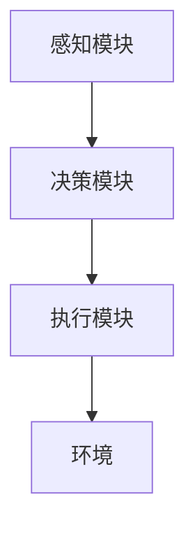
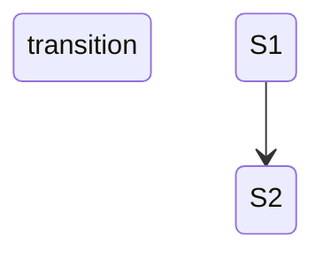
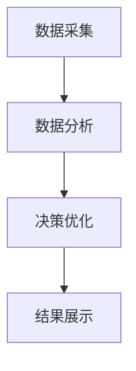

                 


# 多智能体系统在评估公司可持续发展能力中的应用

> **关键词**：多智能体系统（MAS）、可持续发展评估、企业风险管理、智能体协作、系统架构设计

> **摘要**：  
多智能体系统（Multi-Agent System，MAS）作为一种分布式人工智能技术，近年来在企业可持续发展评估中展现出巨大潜力。本文从多智能体系统的定义、核心概念、数学模型、系统架构设计、项目实战与案例分析等方面展开，深入探讨了多智能体系统在企业可持续发展能力评估中的应用。文章结合实际案例，详细分析了多智能体系统在企业风险管理、资源配置优化、环境与社会影响评估中的具体应用，提出了系统设计的关键要素和实现方案，为企业的可持续发展评估提供了新的技术思路。

---

# 第1章 多智能体系统（MAS）概述

## 1.1 多智能体系统的定义与特点

### 1.1.1 多智能体系统的定义  
多智能体系统（Multi-Agent System，MAS）是由多个智能体（Agent）组成的分布式系统，这些智能体通过协作完成特定任务或目标。智能体是指能够感知环境、自主决策、主动行动的实体，可以是软件程序、机器人或其他智能设备。MAS的核心在于智能体之间的协作与通信，以实现系统整体的最优目标。

### 1.1.2 多智能体系统的核心特点  
1. **分布式性**：智能体独立运行，分布在网络的各个节点上，不依赖中心化的控制机构。  
2. **自主性**：每个智能体都有自己的决策能力，能够自主选择行动方案。  
3. **协作性**：智能体之间通过通信与协作，共同完成复杂的任务。  
4. **反应性**：智能体能够实时感知环境变化并做出反应。  
5. **动态性**：系统环境和智能体状态可能动态变化，要求系统具有良好的适应性。

### 1.1.3 多智能体系统与传统单智能体系统的区别  
| 特性 | 单智能体系统 | 多智能体系统 |
|------|--------------|--------------|
| 决策中心化 | 是          | 否          |
| 系统复杂性 | 较低        | 较高        |
| 扩展性   | 有限        | 较强        |
| 灵活性   | 较低        | 较高        |

---

## 1.2 多智能体系统在企业中的应用背景

### 1.2.1 企业可持续发展能力评估的复杂性  
企业可持续发展能力评估需要考虑经济、环境和社会三个维度的目标，涉及内部资源配置、外部环境变化、政策法规等多个因素。传统的评估方法往往依赖人工分析，存在效率低、主观性强、难以实时更新等问题。

### 1.2.2 多智能体系统在企业决策中的优势  
1. **分布式计算能力**：MAS能够处理复杂的分布式问题，适合企业多部门协作的场景。  
2. **实时性**：智能体能够实时感知环境变化，快速做出反应，提高决策效率。  
3. **灵活性**：MAS能够根据企业实际需求动态调整智能体的行为，适应复杂的环境变化。  

### 1.2.3 多智能体系统与企业可持续发展的契合点  
企业可持续发展能力评估需要多维度、多部门的协作，MAS通过智能体之间的协作，能够实现跨部门的数据共享、信息协同和决策优化，为企业的可持续发展提供技术支持。

---

## 1.3 本章小结  
本章从多智能体系统的定义、特点、与传统系统的区别入手，分析了MAS在企业可持续发展评估中的应用背景和优势，为后续章节的深入探讨奠定了基础。

---

# 第2章 多智能体系统的核心概念

## 2.1 多智能体系统的组成要素

### 2.1.1 智能体的定义与分类  
智能体是MAS的核心单元，能够感知环境、自主决策、执行动作。根据智能体的智能水平，可以分为简单反应型智能体、基于模型的反应型智能体、目标驱动型智能体和效用驱动型智能体。

### 2.1.2 智能体之间的交互关系  
智能体之间的交互关系可以分为竞争关系和合作关系。在企业可持续发展评估中，通常采用协作关系，例如不同部门的智能体协作完成数据收集、分析和决策。

### 2.1.3 环境与任务的定义  
环境是智能体所处的外部条件，任务是智能体需要完成的具体目标。在企业可持续发展评估中，环境包括市场环境、政策环境、技术环境等，任务包括数据采集、风险评估、决策优化等。

---

## 2.2 多智能体系统的通信机制

### 2.2.1 通信协议的定义  
通信协议是智能体之间进行信息传递的规则，包括消息格式、通信频率、数据加密等。在企业可持续发展评估中，智能体需要通过通信协议共享数据，例如财务部门智能体与环保部门智能体共享资源使用数据。

### 2.2.2 通信模型的分类  
通信模型可以分为同步通信和异步通信。同步通信要求智能体之间实时交互，适用于需要快速响应的场景；异步通信允许智能体在不同时间点进行数据交换，适用于数据量较大的场景。

### 2.2.3 通信效率与系统性能的关系  
通信效率直接影响系统的整体性能。通信效率越高，系统的响应速度越快，决策越准确。因此，在设计通信机制时，需要优化通信协议和数据传输方式，减少通信延迟和数据冗余。

---

## 2.3 多智能体系统的协作机制

### 2.3.1 协作协议的定义  
协作协议是智能体之间为完成共同任务而约定的规则，包括任务分配、角色分工、责任划分等。

### 2.3.2 协作策略的分类  
协作策略可以分为基于规则的协作策略和基于效用的协作策略。基于规则的策略依赖预定义的规则，适用于任务明确的场景；基于效用的策略通过计算各智能体的贡献度进行动态调整，适用于任务复杂的场景。

### 2.3.3 协作过程中的冲突解决  
在协作过程中，智能体之间可能会因为资源分配、任务优先级等问题产生冲突。冲突解决机制需要通过协商、仲裁等方式，确保系统的稳定运行。

---

## 2.4 本章小结  
本章详细介绍了多智能体系统的核心概念，包括智能体、环境、通信机制和协作机制。这些概念为后续章节的系统设计和实现奠定了理论基础。

---

# 第3章 多智能体系统的数学模型与算法

## 3.1 多智能体系统的状态表示

### 3.1.1 状态空间的定义  
状态空间是智能体可能处于的所有状态的集合，每个状态可以用一组变量描述。例如，在企业可持续发展评估中，一个智能体的状态可以包括资源使用情况、环境影响指标、社会影响指标等。

### 3.1.2 状态表示的维度分析  
状态的维度直接影响系统的复杂性。维度越高，系统的计算复杂度越大，因此需要在准确性和计算效率之间找到平衡。

### 3.1.3 状态转移的数学表达  
状态转移可以通过马尔可夫链模型描述，即智能体在某一状态下的转移概率取决于当前状态和历史状态。公式表示为：
$$ P(s_{t+1} | s_t) $$
其中，$s_t$ 表示当前状态，$s_{t+1}$ 表示下一状态，$P$ 表示转移概率。

---

## 3.2 多智能体系统的决策模型

### 3.2.1 决策规则的定义  
决策规则是智能体根据当前状态和目标选择最优动作的规则。例如，智能体可以通过Q-learning算法进行强化学习，优化决策策略。

### 3.2.2 决策树的构建与分析  
决策树是一种常用的决策模型，通过树状结构表示所有可能的决策路径。在企业可持续发展评估中，决策树可以用于风险评估和决策优化。

### 3.2.3 决策过程的数学优化  
决策过程可以通过数学优化模型描述，例如线性规划、非线性规划等。以线性规划为例，目标函数和约束条件可以表示为：
$$ \text{最大化/最小化} \quad c^T x $$
$$ \text{满足} \quad A x \leq b $$
其中，$c$ 是目标函数的系数向量，$x$ 是决策变量向量，$A$ 和 $b$ 是约束条件的系数矩阵和常数向量。

---

## 3.3 多智能体系统的通信模型

### 3.3.1 信息传递的数学表达  
信息传递可以通过图论模型描述，例如使用图论中的边权重表示智能体之间的通信效率。公式表示为：
$$ w_{ij} = \text{通信效率}(i,j) $$
其中，$w_{ij}$ 表示智能体 $i$ 和 $j$ 之间的通信效率。

### 3.3.2 信息压缩与编码的优化  
为了提高通信效率，可以对信息进行压缩和编码。例如，使用哈夫曼编码对数据进行压缩，减少传输数据量。

### 3.3.3 信息冗余的处理方法  
为了避免信息冗余，可以采用差分编码、前缀编码等方法，确保信息传输的准确性和高效性。

---

## 3.4 本章小结  
本章从数学角度分析了多智能体系统的状态表示、决策模型和通信模型，为后续章节的系统设计提供了理论支持。

---

# 第4章 多智能体系统的架构设计与实现

## 4.1 系统总体架构

### 4.1.1 系统模块划分  
多智能体系统的总体架构可以分为感知模块、决策模块和执行模块。感知模块负责采集环境数据，决策模块负责制定决策，执行模块负责执行决策。

### 4.1.2 模块之间的交互关系  
模块之间的交互关系可以用Mermaid图表示，例如：



### 4.1.3 系统的可扩展性设计  
为了提高系统的可扩展性，可以采用模块化设计，每个模块独立实现功能，便于后续扩展和维护。

---

## 4.2 智能体的实现

### 4.2.1 智能体的初始化与配置  
智能体的初始化包括设置智能体的初始状态、目标和通信参数。例如，初始化一个智能体的目标为“优化企业资源利用率”。

### 4.2.2 智能体的行为规划  
智能体的行为规划可以通过状态机模型表示，例如：



### 4.2.3 智能体的自适应能力  
为了提高智能体的自适应能力，可以采用强化学习算法，通过与环境的交互不断优化智能体的决策策略。

---

## 4.3 通信与协作机制的实现

### 4.3.1 通信协议的实现  
通信协议的实现可以通过消息队列中间件（例如RabbitMQ）完成，确保智能体之间的高效通信。

### 4.3.2 协作策略的实现  
协作策略的实现可以通过分布式算法（例如一致性算法）完成，确保智能体之间的协作一致。

### 4.3.3 冲突解决机制的实现  
冲突解决机制的实现可以通过仲裁机制完成，例如通过智能体之间的协商确定最优解决方案。

---

## 4.4 本章小结  
本章详细介绍了多智能体系统的架构设计与实现，包括系统模块划分、智能体实现和通信协作机制的实现，为后续章节的项目实战奠定了基础。

---

# 第5章 项目实战与案例分析

## 5.1 项目背景与目标

### 5.1.1 项目需求分析  
本项目旨在利用多智能体系统对企业可持续发展能力进行评估，包括经济、环境和社会三个维度的目标。

### 5.1.2 项目目标  
通过多智能体系统的实现，优化企业的资源配置，降低环境影响，提高社会价值。

---

## 5.2 系统功能设计

### 5.2.1 系统功能模块  
系统功能模块包括数据采集模块、数据分析模块、决策优化模块和结果展示模块。

### 5.2.2 系统功能流程  
系统功能流程可以用Mermaid图表示，例如：



---

## 5.3 项目实现

### 5.3.1 环境安装  
项目需要安装以下环境：Python 3.8及以上版本，NumPy、Pandas、Scikit-learn等Python库。

### 5.3.2 核心算法实现  
以下是核心算法的实现代码：

```python
import numpy as np
from sklearn import linear_model

# 初始化智能体
class Agent:
    def __init__(self, target):
        self.target = target
        self.state = np.random.randn(10, 1)  # 示例状态

    def decide(self):
        # 使用线性回归模型进行决策
        model = linear_model.LinearRegression()
        model.fit(self.state, self.target)
        return model.predict(self.state)

# 初始化系统
agents = [Agent(target) for target in targets]
```

### 5.3.3 代码解读与分析  
上述代码实现了智能体的初始化和决策过程，使用线性回归模型进行决策优化。每个智能体根据自身的状态和目标进行决策，系统通过多个智能体的协作完成整体任务。

### 5.3.4 实际案例分析  
以某制造企业的可持续发展评估为例，智能体通过协作完成数据采集、分析和决策优化，帮助企业实现资源的高效利用和环境影响的最小化。

---

## 5.4 项目小结  
本章通过实际案例分析，详细介绍了多智能体系统的项目实现过程，包括环境安装、算法实现和案例分析，验证了多智能体系统在企业可持续发展评估中的有效性。

---

# 第6章 最佳实践与总结

## 6.1 最佳实践

### 6.1.1 系统设计中的注意事项  
1. **模块化设计**：确保系统模块独立，便于扩展和维护。  
2. **通信效率优化**：通过优化通信协议和数据压缩算法提高系统性能。  
3. **冲突解决机制**：设计合理的仲裁机制，确保系统稳定运行。  

### 6.1.2 实际应用中的注意事项  
1. **数据隐私保护**：确保智能体之间的数据传输符合隐私保护要求。  
2. **系统可扩展性**：预留接口，便于后续功能扩展。  
3. **性能监控与优化**：定期监控系统性能，及时优化系统配置。  

---

## 6.2 小结与展望

### 6.2.1 小结  
本文从理论到实践，详细探讨了多智能体系统在企业可持续发展评估中的应用，提出了系统的数学模型、架构设计和实现方案，并通过实际案例验证了系统的有效性。

### 6.2.2 展望  
未来的研究方向包括：  
1. **强化学习在MAS中的应用**：通过强化学习优化智能体的决策策略。  
2. **多智能体系统的实时性优化**：通过分布式计算和边缘计算提高系统的实时性。  
3. **多智能体系统的安全性研究**：通过加密算法和访问控制机制提高系统的安全性。  

---

# 作者：AI天才研究院/AI Genius Institute & 禅与计算机程序设计艺术 /Zen And The Art of Computer Programming

