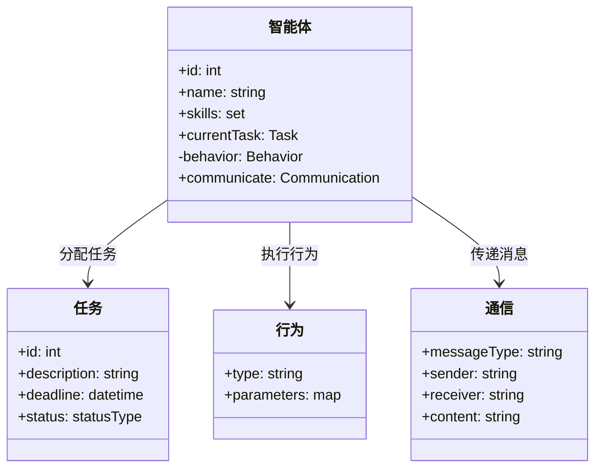
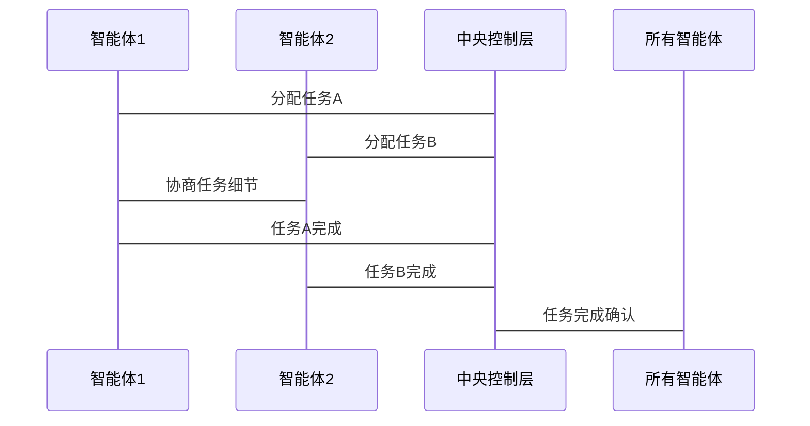

                 


# 多智能体系统在评估公司技术壁垒中的应用

> 关键词：多智能体系统，技术壁垒，分布式计算，协同学习，系统架构，算法原理

> 摘要：本文深入探讨了多智能体系统在评估公司技术壁垒中的应用，分析了其核心概念、算法原理、系统架构，并通过实际案例展示了其在项目中的应用。文章结构清晰，内容详实，结合理论与实践，为读者提供了全面的理解和应用指南。

---

## 第1章：多智能体系统概述

### 1.1 多智能体系统的基本概念

#### 1.1.1 智能体的定义与特征
智能体（Agent）是指能够感知环境并采取行动以实现目标的实体。其主要特征包括自主性、反应性、目标导向和社会能力。

#### 1.1.2 多智能体系统的定义
多智能体系统（MAS）是由多个智能体组成的分布式系统，这些智能体通过协作完成复杂的任务。MAS的特点包括分布式性、协作性、反应性和动态性。

#### 1.1.3 多智能体系统的分类与应用场景
多智能体系统可以分为基于规则的系统、基于模型的系统和基于学习的系统。应用场景包括机器人协作、交通控制、分布式计算和金融科技等。

### 1.2 技术壁垒的定义与评估方法

#### 1.2.1 技术壁垒的定义
技术壁垒是指企业在技术开发和应用中形成的竞争优势，通常表现为技术专利、专有技术和复杂的技术架构。

#### 1.2.2 技术壁垒的分类
技术壁垒可以分为技术复杂性壁垒、专利壁垒和组织壁垒。

#### 1.2.3 技术壁垒评估的重要性
技术壁垒评估有助于企业识别核心竞争力，优化资源配置，并制定有效的竞争策略。

---

## 第2章：多智能体系统与技术壁垒的关系

### 2.1 多智能体系统在技术壁垒评估中的优势

- 高效性：多智能体系统能够快速分析大量数据，提高评估效率。
- 协作性：多个智能体协同工作，提供全面的技术分析。
- 动态适应性：能够实时适应技术和市场的变化。

### 2.2 多智能体系统与传统评估方法的对比

| 特性         | 多智能体系统            | 传统评估方法        |
|--------------|------------------------|--------------------|
| 分布式计算   | 是                     | 否                 |
| 协作性       | 高                     | 低                 |
| 实时性       | 高                     | 低                 |
| 精准性       | 高                     | 中                 |

### 2.3 多智能体系统在技术壁垒评估中的应用案例

#### 案例1：专利分析
通过多智能体系统分析专利数据，识别技术壁垒的关键领域。

#### 案例2：技术架构评估
利用多智能体系统评估企业技术架构的复杂性和潜在风险。

---

## 第3章：多智能体系统的原理

### 3.1 智能体的通信与协作机制

#### 3.1.1 通信协议
智能体之间的通信需要遵循特定的协议，如FIPA（仿生物智能体协议）。

#### 3.1.2 协作机制
通过协商和协作，智能体共同完成任务。

### 3.2 分布式计算与协调算法

#### 3.2.1 分布式计算
多智能体系统中的计算任务分布在多个节点上，通过协同完成。

#### 3.2.2 协调算法
使用分布式算法如Dijkstra算法进行路径规划和任务分配。

### 3.3 多智能体系统中的决策模型

#### 3.3.1 决策树
通过决策树进行决策，如C4.5算法。

#### 3.3.2 贝叶斯网络
基于概率的决策模型，用于复杂环境下的决策。

---

## 第4章：技术壁垒评估的核心要素

### 4.1 技术壁垒的量化指标

- 技术复杂性
- 专利数量
- 市场占有率

### 4.2 技术壁垒的动态变化分析

- 技术趋势分析
- 市场需求变化
- 竞争对手分析

### 4.3 技术壁垒评估的多维度分析

- 技术能力评估
- 组织能力评估
- 市场能力评估

---

## 第5章：多智能体系统的算法原理

### 5.1 分布式计算算法

#### 5.1.1 分布式计算流程
1. 分解任务
2. 分配任务
3. 执行任务
4. 整合结果

#### 5.1.2 协同学习算法
- 联合推理算法
- 分布式机器学习

### 5.2 数学模型与公式

#### 5.2.1 分布式计算模型
$$ C = \sum_{i=1}^{n} C_i $$

其中，$C$ 是总计算成本，$C_i$ 是每个智能体的计算成本。

#### 5.2.2 协同学习模型
$$ P = \prod_{i=1}^{n} p_i $$

其中，$P$ 是整体概率，$p_i$ 是每个智能体的成功概率。

---

## 第6章：系统架构与设计

### 6.1 系统架构设计

#### 6.1.1 系统整体架构
- 智能体层
- 控制层
- 数据层

#### 6.1.2 领域模型设计（Mermaid类图）



#### 6.1.3 系统接口设计

| 接口名称       | 描述               |
|----------------|--------------------|
| 分配任务接口     | 分配任务给智能体     |
| 获取任务接口     | 获取可用任务列表     |
| 通信接口       | 智能体之间通信       |
| 报告结果接口     | 智能体报告任务完成情况 |

### 6.2 系统交互流程（Mermaid序列图）



---

## 第7章：项目实战

### 7.1 环境安装

```bash
pip install multi-agent-systems
npm install express
```

### 7.2 核心实现源代码

```python
class Agent:
    def __init__(self, id):
        self.id = id
        self.tasks = []
    
    def allocate_task(self, task):
        self.tasks.append(task)
    
    def complete_task(self):
        self.tasks.pop()
        return f"Task completed by Agent {self.id}"
```

### 7.3 案例分析

#### 案例：评估公司技术壁垒

1. **数据收集**：收集公司专利、技术文档和市场数据。
2. **任务分配**：智能体分配任务进行分析。
3. **协同分析**：智能体协作完成复杂分析。
4. **结果整合**：整合分析结果，生成评估报告。

---

## 第8章：总结与最佳实践

### 8.1 总结

多智能体系统通过分布式计算和协作学习，能够高效评估公司技术壁垒，为企业制定战略提供支持。

### 8.2 最佳实践 tips

- **模块化设计**：确保系统模块化，便于扩展和维护。
- **数据质量**：保证数据的准确性和完整性。
- **安全性**：加强系统安全性，防止数据泄露。

### 8.3 注意事项

- 系统复杂性：多智能体系统可能较复杂，需谨慎设计。
- 数据隐私：确保数据处理符合隐私保护法规。

### 8.4 拓展阅读

- 《Multi-Agent Systems: Complexity, Control, and Decision-Making》
- 《Distributed Computing and Its Applications》

---

作者：AI天才研究院 & 禅与计算机程序设计艺术

